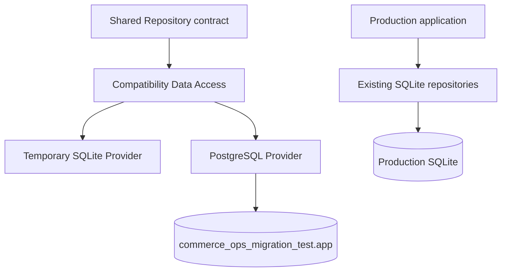

# Database Provider Compatibility Report (F4)

Date: 2026-07-20
Status: PASS
Production provider: SQLite (unchanged)
PostgreSQL target used by F4: `commerce_ops_migration_test.app` only

## Safety boundary

- The production application still opens `SqliteProvider` through `lib/data/data-access.mjs`.
- `DATABASE_PROVIDER` remains `sqlite`; PostgreSQL is not selected by application startup.
- F4 did not connect to or migrate the PostgreSQL `commerce_ops` database.
- F4 did not modify the production SQLite schema or business rows.
- SQLite contract operations ran in a disposable operating-system temporary database.
- PostgreSQL contract operations used reserved F4 fixture IDs and removed every inserted row.
- PostgreSQL migration-test row count was 636 before and after the contract.



## Compatibility framework

F4 adds an asynchronous, database-neutral Repository layer for compatibility verification. Business-facing contract code receives named repositories and does not import `node:sqlite`, `pg`, or a database dialect. The Repository implementation receives a provider, a trusted schema inventory, and an executor. All values are parameterized; table and column names come only from the inspected migration schema allowlist.

Two explicit test configurations are exercised by `npm run postgres:f4:check`:

- `DATABASE_PROVIDER=sqlite`
- `DATABASE_PROVIDER=postgres`

The same `runRepositoryCompatibilityContract` logic is executed for both providers and its normalized result is compared with strict deep equality. Future modules can be added to the named repository map and the same contract pattern without duplicating provider-specific tests.

## Verified modules

| Module | Tables covered | Verification |
|---|---|---|
| Mabang accounts | `mabang_account_profiles`, `mabang_filter_option_cache` | insert, query, update, boolean, timestamp, NULL, FK |
| Scheduled tasks | `scheduled_export_tasks`, `scheduler_leases` | insert, query, update, task status, JSON, boolean, nullable next run |
| Execution records | `scheduled_export_runs`, `scheduled_export_run_events` | insert, query, update, date, timestamp, integer, JSON |
| Export files | `export_files` | insert, query, UUID links, bigint file size, JSON metadata, NULL expiry |
| File lifecycle | `file_lifecycle_scans`, `file_lifecycle_items`, `file_lifecycle_protected_files` | JSON, booleans, UUID relations, timestamps |
| Managed files | `managed_files`, `file_quarantine_records` | insert, query, bigint, JSON, UUID relations, NULL deletion state |
| Audit | `operation_audit_events` | insert, query, delete, transaction commit and rollback, JSON and NULL |
| Configuration | `dingtalk_robot_configs` | insert, query, booleans, JSON and NULL |

There is no database-backed user or role table in the current Commerce Ops schema. Current access control is environment-token based, so no nonexistent permission rows were invented for F4. PostgreSQL database-role boundaries were already verified in F1.

## Operations and errors

The shared contract passed these operations on both providers:

- parameterized query
- insert
- update
- delete
- transaction commit
- transaction rollback
- duplicate-key rejection normalized to `UNIQUE_CONSTRAINT`
- invalid foreign-key rejection normalized to `FOREIGN_KEY_CONSTRAINT`

The generic Repository also normalizes not-null and check-constraint driver errors to stable codes for future contract cases. Original driver errors remain attached as internal causes and are not exposed as test output.

## SQLite and PostgreSQL differences

| Concern | SQLite representation | PostgreSQL representation | F4 boundary result |
|---|---|---|---|
| Parameters | `?` | `$1...$n` | Provider supplies placeholders |
| Boolean | integer `0/1` | native `boolean` | normalized to JavaScript boolean |
| JSON | JSON text | `jsonb` | stable object/array output |
| Timestamp | UTC ISO text | `timestamptz` / JavaScript Date | UTC ISO string output |
| Date | ISO date text | native `date` | `YYYY-MM-DD` string output |
| UUID | text | native `uuid` | validated lowercase string |
| Big integer | SQLite integer | PostgreSQL `bigint` string | decimal string at Repository boundary |
| NULL | SQLite NULL | PostgreSQL NULL | JavaScript `null` preserved |
| Constraint errors | message-based SQLite errors | SQLSTATE codes | stable Repository error codes |
| Transactions | one synchronous connection | pooled async client | same async callback contract |

## Resolved issues

1. Repository SQL no longer needs to choose placeholder syntax.
2. Returned JSON is independent of text versus `jsonb` storage.
3. Boolean values no longer leak SQLite integer representation.
4. Timestamps are normalized to UTC ISO strings.
5. PostgreSQL `bigint` values cannot silently lose JavaScript precision because the boundary returns decimal strings.
6. UUID casing and validation are consistent.
7. NULL values are preserved rather than converted to empty strings or false values.
8. Constraint failures have stable cross-provider error codes.
9. Transactional repositories use the same checked-out PostgreSQL client and the same SQLite transaction.
10. F4 fixtures are deterministic, isolated, and cleaned after both success and failure paths.

## Remaining risks

1. Existing production repositories are synchronous and SQLite-specific. F4 proves the new async Repository contract, but it does not convert or switch the current business services.
2. Existing production services expect synchronous repository return values. A formal PostgreSQL runtime requires a controlled async service/API adaptation before cutover.
3. PostgreSQL collation and case-sensitive ordering were not asserted because current compatibility operations use stable primary-key and equality queries.
4. Identity sequence behavior is covered by F3 migration reset logic, while F4 uses explicit reserved IDs and does not advance production-like sequences.
5. The application role intentionally cannot connect to `commerce_ops_migration_test`; F4 writes use the non-superuser `commerce_migrator` test role. Formal runtime tests must use `commerce_app` against a dedicated staging database with equivalent schema.
6. No database-backed user permission model exists. If one is introduced, it must be added to the shared Repository contract.
7. F4 verifies persistence compatibility, not Mabang collection, DeepSeek prompts, advertising parsing, or file-byte behavior; those remain covered by the existing regression suite.

## Formal migration considerations

- Keep SQLite as the sole production provider until all business services have async Repository adapters and their endpoint contracts pass against a staging PostgreSQL database.
- Do not use `commerce_migrator` as the application runtime role.
- Re-run F3 immediately before a formal cutover using a write-frozen SQLite snapshot.
- Re-run this F4 contract after every schema migration and whenever a new persistence module is added.
- Add explicit collation/order tests for business queries that depend on text sorting.
- Preserve UTC storage and business-timezone calculations at service boundaries.
- Continue to keep physical Excel and advertising files outside PostgreSQL; only metadata belongs in database tables.
- Verify default privileges for newly created tables and sequences before switching the runtime application role.

## Verification commands

```text
npm test
npm run postgres:f4:check
npm run build
npm run doctor
npm run postgres:f1:protect -- verify
```

F4 establishes a reusable compatibility test layer. It does not make PostgreSQL the production provider and does not authorize a production database switch.
