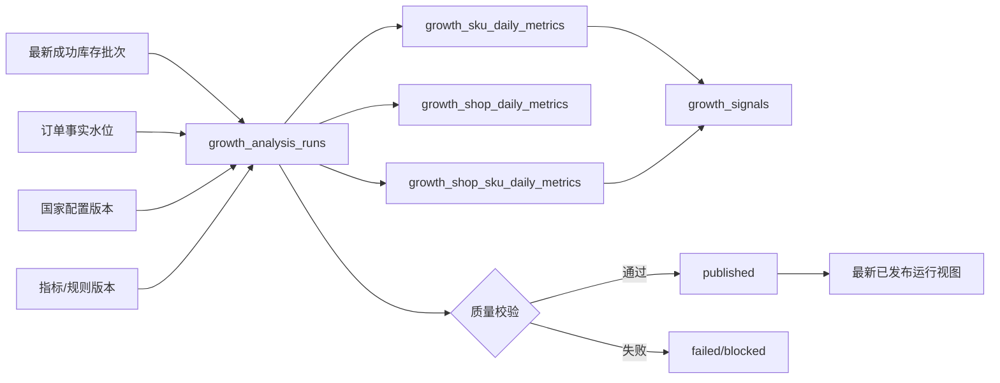

# COM-GROWTH-RADAR-V2-1 数据层设计

> 状态：设计稿，等待人工确认后进入实现  
> 日期：2026-07-25（Asia/Shanghai）  
> 分支：`master`  
> 设计基线：`GRV2-METRICS-1.0.1`  
> 国家映射决策：版本化配置表  
> 本节点只更新设计文档，不修改代码、数据库、迁移、页面或正式数据。

> `GRV2-METRICS-1.2.0` 后继说明：本文保留 V2-1 历史设计。正式后继合同已将库存风险冻结为“国家 + 仓库 + SKU”粒度；国家层只能聚合仓库风险数量和库存总量，不得计算或展示国家级可售天数。019 候选 migration 中的 `growth_sku_warehouse_daily_metrics` 是该口径的权威投影。

## 1. 目标

V2-1 只建设 Growth Radar 的可重放分析投影层，使系统能够：

1. 读取最新成功的马帮库存批次和截至指定水位的订单事实；
2. 使用已确认的指标版本和国家配置版本计算日指标；
3. 在独立分析运行中生成 SKU、店铺和信号数据；
4. 校验完成后一次性发布；
5. 页面默认读取最新已发布运行；
6. 新一轮分析失败时继续展示上一轮成功数据，并显式提示数据时间。

V2-1 不实现：

- Growth Radar V2 页面；
- API 页面编排；
- AI 评分或 AI 经营判断；
- 自动上架、补货、调拨、清仓、调价或广告操作；
- 在线 Listing 覆盖推断；
- 人工重点跟进工作流；
- 修改现有订单、库存和产品事实表；
- 正式数据迁移。

## 2. 架构



核心边界：

- 订单和库存是事实层，V2 表是可重建投影。
- 一个分析运行固定引用一个库存批次、订单水位、指标版本和国家配置版本。
- 运行状态不是 `published` 时，页面不可读取其指标。
- 已发布指标行不可原地重算或覆盖；规则变化产生新运行。

## 3. 继续复用的事实表

V2-1 不复制以下数据：

- `growth_source_batches`
- `growth_inventory_raw_rows`
- `growth_inventory_snapshots`
- `growth_order_headers`
- `growth_order_lines`
- `growth_order_inventory_links`
- `growth_sku_warehouse_sales_metrics`
- `growth_shops`
- `growth_shop_source_mappings`
- `growth_data_quality_issues`
- `growth_mapping_issues`
- `product_identity_mappings`

店铺国家继续由 `growth_shops.country_code` 和 `growth_shop_source_mappings.country_code` 管理。V2-1 不新增第二份店铺国家事实。

## 4. V2-1 新增对象

| 对象 | 职责 | V2-1 |
|---|---|---:|
| `growth_country_mapping_sets` | 国家配置版本头 | 必须 |
| `growth_warehouse_country_mappings` | 仓库到国家的配置项 | 必须 |
| `growth_rule_sets` | 指标和规则版本 | 必须 |
| `growth_analysis_runs` | 一次可重放、可发布的分析 | 必须 |
| `growth_sku_daily_metrics` | 公司全盘及国家级 SKU 指标 | 必须 |
| `growth_shop_daily_metrics` | 店铺级覆盖和汇总指标 | 必须 |
| `growth_shop_sku_daily_metrics` | 店铺 SKU 销量和候选证据 | 必须 |
| `growth_signals` | 确定性机会、亮点和风险 | 必须 |
| `growth_focus_items/events` | 人工重点跟进工作流 | 延后至 V2-7 |

不预占迁移编号。实现前必须先审计稳定 Git 基线和当前最高迁移。

## 5. 国家配置表

### 5.1 `growth_country_mapping_sets`

用途：把一组仓库国家配置作为不可变版本提供给分析运行。

| 字段 | 类型语义 | 约束 |
|---|---|---|
| `id` | UUID 文本 | 主键 |
| `version` | 配置版本 | 唯一、不可变 |
| `status` | `draft/active/retired` | 受控枚举 |
| `description` | 变更说明 | 必填 |
| `content_sha256` | 排序后配置内容哈希 | 唯一 |
| `created_by/created_at` | 创建审计 | 必填 |
| `activated_by/activated_at` | 启用审计 | active 时必填 |
| `retired_by/retired_at` | 停用审计 | retired 时必填 |

约束：

- 同一时点只能有一个 `active` 配置版本。
- 已被分析运行引用的版本不能修改或删除。
- 修改映射必须复制为新 `draft` 版本，校验后再激活。
- 激活与旧版本停用必须在同一事务内完成。

### 5.2 `growth_warehouse_country_mappings`

用途：保存一个配置版本内的仓库国家映射。

| 字段 | 类型语义 | 约束 |
|---|---|---|
| `id` | UUID 文本 | 主键 |
| `mapping_set_id` | 配置版本 | 外键、RESTRICT |
| `source_system` | `mabang_inventory` | 第一版固定 |
| `source_warehouse_name` | 仓库原值 | 必填、保留证据 |
| `normalized_warehouse_name` | 标准化仓库名 | 必填 |
| `country_code` | 受控国家代码 | 必填，不允许 `ZZ` |
| `country_name` | 展示名称 | 必填 |
| `mapping_status` | `confirmed/excluded` | 受控枚举 |
| `exclusion_reason` | 排除原因 | excluded 时必填 |
| `evidence_json` | 确认依据 | 白名单 JSON |
| `confirmed_by/confirmed_at` | 人工确认 | 必填 |
| `created_at` | 创建时间 | 必填 |

唯一约束：

```text
mapping_set_id
+ source_system
+ normalized_warehouse_name
```

配置规则：

- 仓库名称只能生成候选，不能自动成为 confirmed 映射。
- 一个配置版本内同一仓库只能对应一个国家或明确排除。
- 未配置、冲突和 `excluded` 仓库可以进入公司全盘指标，但不能进入国家或店铺跨源指标。
- 分析运行保存 `country_mapping_set_id` 和配置哈希，历史结果不随新配置变化。

## 6. 规则版本

### 6.1 `growth_rule_sets`

| 字段 | 类型语义 | 约束 |
|---|---|---|
| `id` | UUID 文本 | 主键 |
| `version` | `GRV2-METRICS-1.0.1` 等 | 唯一 |
| `status` | `draft/active/retired` | 受控枚举 |
| `metrics_contract_version` | 指标合同版本 | 必填 |
| `parameters_json` | 阈值、窗口和比较组 | 白名单 JSON |
| `content_sha256` | 规范化内容哈希 | 唯一 |
| `effective_from/effective_to` | 生效区间 | 时间合法 |
| `created_by/created_at` | 创建审计 | 必填 |
| `activated_by/activated_at` | 启用审计 | active 时必填 |

首个规则版本必须逐项表达：

- 有效订单状态“已发货”；
- 7/28/42 天窗口；
- 新品 90 天；
- 滞销 60/90/180 天；
- 缺货 14/7/0 天；
- 来源高表现 P80；
- 店铺低相对销量 P20；
- 比较组最小样本数。

规则参数不能散落在服务代码中。

## 7. 分析运行

### 7.1 `growth_analysis_runs`

| 字段 | 类型语义 | 约束 |
|---|---|---|
| `id` | UUID 文本 | 主键 |
| `analysis_date` | 业务日期 | 必填 |
| `inventory_batch_id` | 库存来源批次 | 外键、RESTRICT |
| `order_watermark_at` | 订单截止水位 | 必填 |
| `rule_set_id` | 规则版本 | 外键、RESTRICT |
| `country_mapping_set_id` | 国家配置版本 | 外键、RESTRICT |
| `shop_scope_fingerprint` | 店铺范围哈希 | 必填 |
| `input_fingerprint` | 全部输入组合哈希 | 唯一 |
| `status` | 生命周期 | 受控枚举 |
| `quality_status` | `confirmed/degraded/blocked` | 必填 |
| `quality_summary_json` | 质量摘要 | 白名单 JSON |
| `global_sku_count` | 全盘 SKU 数 | 非负 |
| `country_sku_count` | 国家 SKU 指标行数 | 非负 |
| `shop_count` | 已确认店铺数 | 非负 |
| `shop_sku_count` | 店铺 SKU 指标行数 | 非负 |
| `signal_count` | 信号数 | 非负 |
| `started_at/validated_at/published_at/finished_at` | 生命周期 | 状态匹配 |
| `error_code/error_summary` | 安全错误 | 不保存堆栈和敏感数据 |
| `created_by/created_at` | 审计 | 必填 |

状态机：

```text
pending
-> running
-> validating
-> published

pending/running/validating
-> failed

pending
-> cancelled
```

发布条件：

- 输入批次和水位仍存在；
- 规则与国家配置版本有效；
- 指标行数与来源对账通过；
- 主键、外键和唯一性通过；
- 无 `blocked` 级质量问题；
- 所有指标行属于同一分析运行；
- 发布状态与最后一批指标写入在同一事务中提交。

相同 `input_fingerprint` 的重复触发直接返回已有运行，不重复计算。

## 8. SKU 日指标

### 8.1 `growth_sku_daily_metrics`

粒度：

```text
analysis_run_id
+ scope_type
+ scope_key
+ normalized_source_sku
```

`scope_type`：

- `global`：`scope_key = GLOBAL`
- `country`：`scope_key = confirmed country_code`

显式 `scope_type/scope_key` 用于避免 `NULL country_code` 在 SQLite 和 PostgreSQL 唯一约束中的差异。

核心字段：

- 身份：`id`、`analysis_run_id`、`analysis_date`、`scope_type`、`scope_key`、`country_code`
- 商品：`normalized_source_sku`、`source_sku`、`product_name`、`product_status`
- 类目：`category_l1`、`category_l2`
- 产品映射：`mapped_product_id`、`mapping_status`
- 库存：`warehouse_count`、`available_quantity`、`in_transit_quantity`
- 来源销量：`source_visible_sales_7d/28d/42d`、`source_predicted_daily_sales_country_sku`
- 供给汇总：`warehouse_supply_summary_json`、仓库风险数量字段
- 排名：`assortment_percentile`、`assortment_status`、`inventory_percentile`
- 新品：`is_new`、`new_age_days`
- 质量：`availability_status`、`quality_status`、`reason_code`
- 证据：`metrics_version`、`evidence_json`、`calculated_at`

兼容字段 `source_days_of_supply`、`computed_days_of_supply`、`days_of_supply_status` 仅用于旧 `1.1.0` 运行时回归。`GRV2-METRICS-1.2.0` 数据必须满足：

- `computed_days_of_supply IS NULL`
- `days_of_supply_status = warehouse_aggregate_only`
- 供给风险从仓库级投影聚合，不能从国家库存和销量重新计算

唯一约束：

```text
analysis_run_id
+ scope_type
+ scope_key
+ normalized_source_sku
```

主要索引：

- `(analysis_run_id, scope_type, scope_key, category_l2, assortment_percentile DESC)`
- `(analysis_run_id, scope_type, scope_key, supply_risk_warehouse_count DESC)`
- `(analysis_run_id, product_status)`
- `(mapped_product_id, analysis_date DESC)`

### 8.2 `growth_sku_warehouse_daily_metrics`

用途：保存仓库来源给出的库存、销量和可售天数事实，并在仓库粒度计算缺货、供给和滞销风险。

粒度：

```text
analysis_run_id
+ country_code
+ normalized_warehouse_name
+ normalized_source_sku
```

核心字段：

- 仓库：`source_warehouse_name`、`normalized_warehouse_name`、`country_code`
- 商品：`normalized_source_sku`、`source_sku`、`mapped_product_id`
- 来源事实：`source_current_sellable_days`、`available_quantity`、`in_transit_quantity`
- 来源销量：`source_predicted_daily_sales`、`source_sales_7d/28d/42d`
- 规则结果：`supply_status`、`slow_moving_status`
- 证据：`metrics_version`、`evidence_json`、`quality_status`

国家层视图只允许汇总仓库数量、风险仓库数量和库存总量，不输出国家级可售天数。

## 9. 店铺指标

### 9.1 `growth_shop_daily_metrics`

用途：保存店铺级汇总和两个不同分母的覆盖率，禁止页面平均百分比。

粒度：

```text
analysis_run_id + internal_shop_id
```

核心字段：

- 店铺：`internal_shop_id`、`platform`、`owner_user_id`、`country_code`
- 销量：`own_sales_quantity_7d/28d`、`valid_order_count_7d/28d`
- 可售覆盖：`eligible_saleable_sku_count`、`sold_eligible_sku_count_28d`、`saleable_coverage_rate_28d`
- 高表现覆盖：`eligible_high_performance_sku_count`、`sold_high_performance_sku_count_28d`、`high_performance_coverage_rate_28d`
- 信号汇总：亮点、增长跟进、新品、滞销和缺货数量
- 质量：`availability_status`、`quality_status`、`reason_code`
- 证据：`metrics_version`、`country_mapping_set_id`、`calculated_at`

分母为 0 或国家未确认时覆盖率为 `NULL`，不保存 0%。

### 9.2 `growth_shop_sku_daily_metrics`

用途：保存店铺 SKU 事实、亮点款和增长跟进候选的计算证据。

粒度：

```text
analysis_run_id + internal_shop_id + normalized_source_sku
```

核心字段：

- 店铺和国家快照；
- SKU、产品映射和类目；
- 自店实际销量 7/28 天、有效订单数和最近销售时间；
- 来源可见销量 7/28/42 天；
- `shop_to_source_visible_ratio_28d` 及其分位；
- `eligible_saleable`、`eligible_high_performance`；
- `is_key_performer`、`is_growth_focus_candidate`；
- 当前可用库存和高表现分位；
- 数据质量、指标版本和证据。

稀疏写入规则：

只为以下任一条件成立的店铺 SKU 建行：

- 近 28 天存在有效已发货销售；
- 属于该店确认范围内的来源高表现 SKU；
- 命中需要展示的确定性信号。

禁止为每个店铺和所有 SKU 生成完整笛卡尔积。以当前约 10,327 个唯一 SKU 和 107 个来源店铺估算，完整矩阵每天会超过 110 万行，不适合作为 SQLite 第一版默认策略。

## 10. 确定性信号

### 10.1 `growth_signals`

| 字段组 | 字段 |
|---|---|
| 身份 | `id`、`analysis_run_id`、`dedupe_key` |
| 规则 | `signal_type`、`rule_code`、`rule_version` |
| 对象 | `subject_type`、`country_code`、`normalized_source_sku`、`internal_shop_id` |
| 结果 | `severity`、`reason_code`、`recommended_action_code` |
| 质量 | `availability_status`、`quality_status` |
| 证据 | `evidence_json`、`detected_at` |

唯一约束：

```text
analysis_run_id + dedupe_key
```

第一版信号：

- `SOURCE_HIGH_PERFORMANCE`
- `SOURCE_HIGH_SHOP_NO_SALE_28D`
- `NEW_PRODUCT_OPPORTUNITY`
- `SLOW_MOVING_RISK`
- `LOW_STOCK_RISK`
- `OUT_OF_STOCK_WITH_DEMAND`
- `STORE_KEY_PERFORMER`
- `STORE_GROWTH_FOCUS_SKU`
- `DISCONTINUED_WITH_STOCK`
- `METRIC_DATA_BLOCKED`

信号是每日可重建结果，不保存人工处理状态。人工跟进表延后至 V2-7。

## 11. 每日刷新与默认最新数据

触发条件：

- 新库存批次成功入库；或
- 订单同步水位前进；或
- 每日定时分析触发；或
- 规则/国家配置版本切换后人工重算。

输入选择：

1. 选择最新 `applied` 且质量可用的库存批次；
2. 冻结 `order_watermark_at`；
3. 选择当前 active 规则版本；
4. 选择当前 active 国家配置版本；
5. 计算 `input_fingerprint`；
6. 已有同指纹运行则复用，没有才创建。

页面默认运行：

```text
status = published
ORDER BY analysis_date DESC, published_at DESC
LIMIT 1
```

失败策略：

- 新运行失败或 blocked 时不替换最新已发布运行；
- 页面继续显示上一成功运行；
- 页面必须同时显示库存快照时间、订单水位和“最新刷新失败/数据已陈旧”提示；
- 不允许页面直接混读不同分析运行的指标。

## 12. 一致性与并发

- 同一 `input_fingerprint` 只允许一个运行。
- 同一运行只允许一个计算租约持有者。
- 指标按运行 ID 追加写入，不更新上一运行。
- 写入使用短事务分段；最终验证和发布使用单独事务。
- 失败运行保留安全摘要，指标草稿可以按运行 ID 清理，但不得清理已发布运行。
- Scheduler、人工重算和服务重启都必须通过同一幂等入口。
- 正式事实表只读；分析层不得反写订单、库存、店铺或产品事实。

## 13. SQLite 与 PostgreSQL

共同要求：

- 主键使用应用生成 UUID 文本；
- 时间统一保存带时区的 ISO 8601 文本/时间戳语义；
- 布尔值通过 Provider 适配；
- 核心筛选字段使用类型化列；
- JSON 只保存参数和证据，不作为核心关联键；
- 不依赖 SQLite 隐式类型转换；
- 百分比、数量和销量使用明确 NUMERIC 语义；
- `NULL` 不转换为 0。

SQLite 第一版保护：

- 分析安排在低峰；
- 避免店铺 SKU 全量笛卡尔积；
- 为运行、范围、类目和风险字段建立复合索引；
- 发布后执行行数、外键和完整性检查；
- 数据量达到容量门槛后再评估 PostgreSQL，不提前引入新基础设施。

## 14. 查询视图

V2-1 设计以下只读视图：

- `growth_latest_published_run_v`
- `growth_latest_sku_metrics_v`
- `growth_latest_shop_metrics_v`
- `growth_latest_shop_sku_metrics_v`
- `growth_latest_signals_v`

所有视图先解析唯一最新已发布运行，再关联对应指标。不得分别对每张指标表独立选择“最新日期”。

## 15. 实现拆分

### V2-1A：配置与运行合同

- 国家配置版本和仓库映射；
- 规则版本；
- 分析运行；
- 枚举、约束和索引；
- 空库与升级迁移测试。

### V2-1B：指标投影合同

- SKU 日指标；
- 店铺汇总指标；
- 稀疏店铺 SKU 指标；
- 外键、唯一性和 Provider 测试。

### V2-1C：信号与最新视图

- 确定性信号表；
- 最新已发布运行视图；
- 运行失败不替换最新成功版本；
- SQLite/PostgreSQL 查询一致性测试。

V2-1 完成后才进入 V2-2 指标引擎。V2-1 本身不实现计算规则。

## 16. 验收标准

设计进入实现前必须确认：

1. 国家配置采用“版本头 + 仓库映射项”，店铺国家不重复建表；
2. `GRV2-METRICS-1.0.1` 作为首个规则版本；
3. 公司全盘与国家指标使用显式 `scope_type/scope_key`；
4. 店铺覆盖率保存原始分子、分母和结果；
5. 店铺 SKU 使用稀疏投影，不生成全矩阵；
6. 页面只读取同一个最新已发布运行；
7. 新运行失败时保留上一成功运行；
8. 人工重点跟进工作流延后至 V2-7；
9. 不修改现有事实表语义；
10. 实现前重新确认稳定 Git 基线和下一可用迁移编号。

本设计确认前，不创建迁移、不修改 Repository、不写指标引擎。
