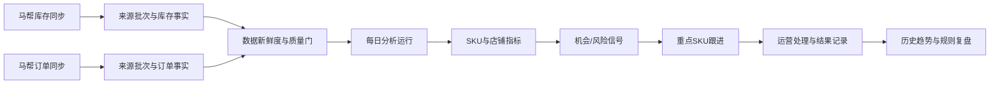
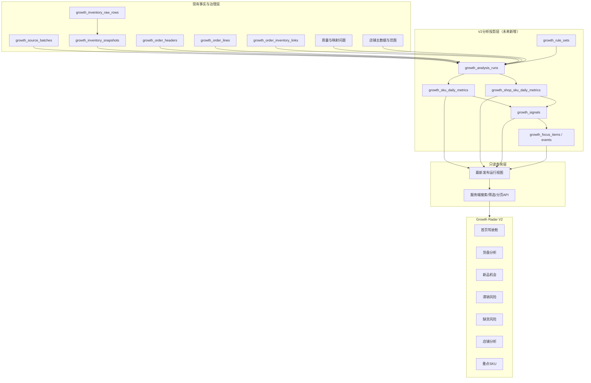
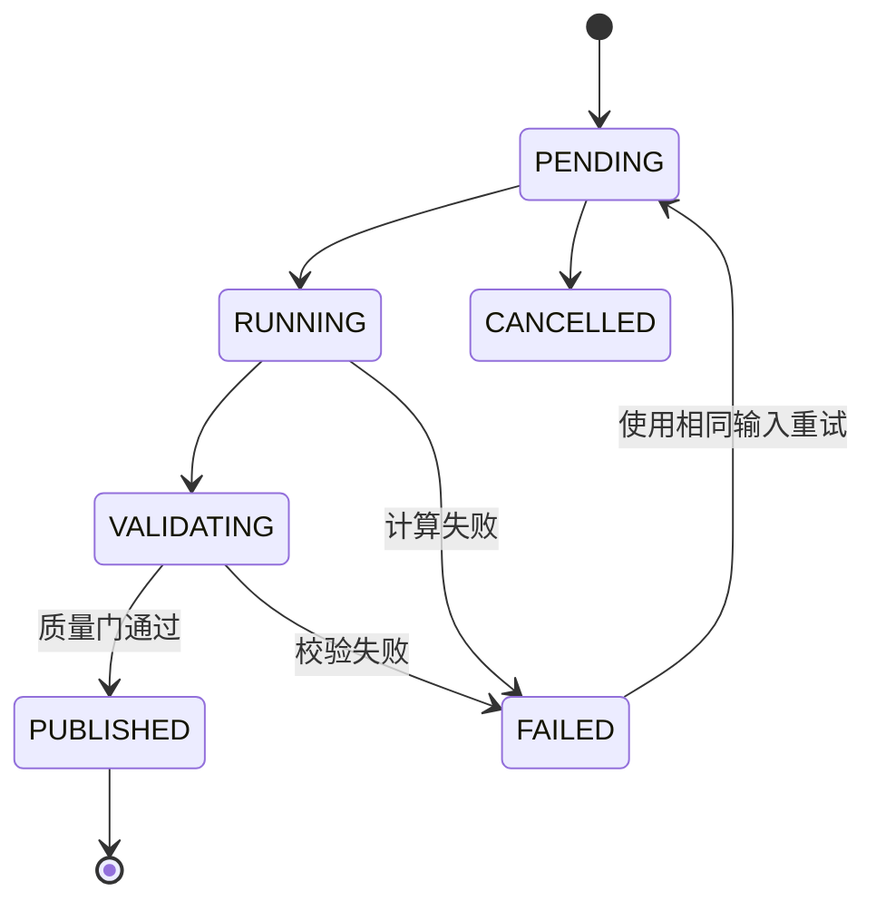

# COM-GROWTH-RADAR-V2 设计报告

> 状态：设计冻结候选稿，等待业务确认  
> 日期：2026-07-25（Asia/Shanghai）  
> 审计分支：`master`  
> 审计 HEAD：`a8327c524764f89eda8127e32b4aa48e38c3fac6`  
> 本阶段范围：只评估现有数据并设计 Growth Radar V2；不修改代码、数据库、迁移、页面和正式业务数据。

## 1. 执行结论

Growth Radar A2 已经形成可复用的数据事实层：

- 马帮库存数据已经按来源批次、原始行、SKU + 仓库快照落库。
- 马帮订单已经按订单头、订单行、店铺和 SKU 形成可查询事实。
- 订单与库存已经具有来源批次、数据质量、映射问题和来源语义。
- 当前结构可以直接支持“最新库存、自店实际销售、滞销风险、缺货风险、历史销售覆盖”。

V2 不需要再创建第二套订单表或库存表。未来需要增加的是独立的分析投影层：

1. 每日分析运行；
2. SKU 日指标；
3. 店铺 × SKU 日指标；
4. 确定性机会/风险信号；
5. 重点 SKU 跟进任务；
6. 版本化规则参数。

当前有三个必须固化的证据边界：

1. `source_visible_sales` 是马帮库存来源页面的可见销量，尚不能自动改名为“公司实际销量”。
2. 历史订单只能证明某店铺曾经销售过 SKU，不能证明该 SKU 当前在线。
3. `product_identity_mappings` 当前没有正式映射数据，Growth Radar 的来源 SKU 暂时不能全部稳定关联到产品中心产品 ID。

因此，V2 首期可以输出：

- 来源可见热销 SKU；
- 自店实际销量；
- 来源需求高但自店销量低；
- 新品动销机会；
- 滞销与缺货风险；
- 店铺近期未观察到销售的高需求 SKU；
- 每日重点 SKU 跟进列表。

V2 首期不能输出：

- 未经确认的“公司真实总销量”；
- “该店没有上架此商品”；
- “店铺 SKU 覆盖率”；
- 未经映射确认的产品中心完整资料；
- 退款后净销量、净利润或 GMV。

## 2. 当前状态确认

### 2.1 Git 状态

- 当前分支：`master`
- 当前 HEAD：`a8327c524764f89eda8127e32b4aa48e38c3fac6`
- 最新提交：`fix: retain Mabang batch limit audit metadata`
- 工作树：不干净，存在本任务开始前已经存在的已修改和未跟踪文件。
- 本设计不清理、不暂存、不提交、不覆盖这些既有修改。

现有工作树中包含马帮图片、Growth Radar、调度器、前端和测试等在途修改，以及未跟踪的后续迁移文件。本报告不把这些在途文件解释为 V2 已实现能力。

### 2.2 正式 SQLite 只读状态

只读检查结果：

- `integrity_check = ok`
- `foreign_key_check = 0`
- 当前正式数据库最高迁移：`018_mabang_image_collection_performance.sql`

Growth Radar 主要数据规模：

| 表 | 当前行数 | 语义 |
|---|---:|---|
| `growth_source_batches` | 4 | 已应用的订单/库存来源批次 |
| `growth_inventory_raw_rows` | 21,466 | 库存来源证据行 |
| `growth_inventory_snapshots` | 21,460 | SKU + 仓库库存快照 |
| `growth_order_headers` | 2,043 | 标准订单头 |
| `growth_order_lines` | 2,726 | 标准订单行 |
| `growth_order_raw_rows` | 3,290 | 订单来源证据行 |
| `growth_order_inventory_links` | 5,452 | 订单 SKU + 仓库与库存粒度关联 |
| `growth_sku_warehouse_sales_metrics` | 21,460 | SKU + 仓库来源销量/自店销量指标 |
| `growth_shops` | 107 | 内部店铺主数据 |
| `growth_shop_source_mappings` | 107 | 马帮店铺到内部店铺映射 |
| `growth_shop_sku_observations` | 564 | 历史销售观察 |
| `growth_shop_sku_coverage_snapshots` | 0 | 当前在线覆盖尚无权威数据 |
| `product_identity_mappings` | 0 | 来源 SKU 到产品中心身份映射尚未建立 |
| `growth_data_quality_issues` | 690 | 数据质量问题 |
| `growth_mapping_issues` | 653 | 店铺/SKU 映射问题 |

最近一次库存来源批次：

- 批次行数：20,026
- 采集时间：2026-07-25 01:20:00 UTC
- 应用时间：2026-07-25 01:23:27 UTC

最近一次订单来源批次：

- 批次行数：631
- 采集时间：2026-07-25 01:18:08 UTC
- 应用时间：2026-07-25 01:18:14 UTC

当前只有 4 个来源批次，已足够验证“最新数据展示”，但不足以证明长期趋势稳定性。趋势页应在累计至少 14 个有效日快照后开放短期趋势，在至少 60 个有效日快照后开放中期趋势。

## 3. 产品目标与边界

### 3.1 核心用户

- 类目负责人：判断公司货盘结构、机会和库存风险。
- 店长：判断自己店铺的销售不足和每日重点 SKU。
- 运营负责人：比较店铺表现、分配跟进任务。
- 数据管理员：确认来源新鲜度、口径、映射和质量问题。

### 3.2 V2 产品目标

将已有马帮订单与库存事实转化为一个可解释、可追溯、可每日刷新、可形成运营动作的确定性工作台。

核心闭环：



### 3.3 非目标

- 不使用 AI 决定指标、阈值、机会、优先级或运营动作。
- 不自动上架、补货、调价、投放广告或删除商品。
- 不把来源预测值当作实际销量。
- 不把历史销售观察当作当前在线状态。
- 不在缺少权威金额口径时计算 GMV、净利润或退款后销售额。
- 不在 V2 设计阶段引入 Redis、Elasticsearch、MinIO 或新任务队列。
- 不修改产品中心、马帮采集和 Listing 的现有业务语义。

## 4. 当前数据是否足够

### 4.1 已经足够的能力

| 分析能力 | 现有数据 | 结论 |
|---|---|---|
| 最新库存 | SKU、仓库、可用、在途、可售天数 | 足够 |
| 自店实际销量 | 店铺、平台、店长、SKU、数量、订单状态、付款时间 | 足够 |
| SKU + 仓库分析 | 库存快照和订单库存关联 | 足够 |
| 滞销风险 | 库存、来源可见销量、预测日销、可售天数 | 有条件足够 |
| 缺货风险 | 可用库存、在途、销量、可售天数 | 有条件足够 |
| 店铺历史销售观察 | 店铺 + SKU 历史有效订单 | 足够 |
| 数据质量门 | 批次范围、映射、问题和确认状态 | 足够 |
| 每日最新展示 | 来源批次和采集时间 | 足够 |

### 4.2 仍不充足的能力

| 分析能力 | 缺口 | V2 处理 |
|---|---|---|
| 公司实际总销量 | 当前只有 `source_visible_sales`，来源范围未完全确认 | 保留来源标签；口径确认前不称公司实际销量 |
| 自店销量占公司比例 | 分母语义未确认 | 仅在公司销量范围确认后启用 |
| 店铺当前 SKU 覆盖 | `growth_shop_sku_coverage_snapshots` 为 0 | 显示“当前覆盖未知”，只输出近期未观察到销售 |
| 产品中心完整关联 | `product_identity_mappings` 为 0 | 来源 SKU 可分析，产品详情关联需后续映射 |
| 长期趋势 | 当前来源批次历史较短 | 每日累积分析快照，不回填伪历史 |
| 退款后净销量 | 退款字段口径未冻结 | 不计算 |
| GMV/利润 | 订单行金额与成本口径不完整 | 不计算 |

### 4.3 销量口径冻结

V2 必须同时保留三种不同销量语义：

| 语义 | 来源 | 含义 | 是否可用于正式结论 |
|---|---|---|---|
| `own_sales` | 有效马帮订单行 | 自有已确认店铺的实际商品数量 | 是 |
| `source_visible_sales` | 马帮库存来源 | 来源页面展示的 7/28/42 天销量 | 是，但必须带来源标签 |
| `company_sales` | 尚无权威来源 | 公司全范围实际销量 | 当前不可用 |

在 `company_sales` 未确认前：

- 页面使用“来源可见销量”；
- 机会文案使用“来源需求高、自店销售低”；
- 不展示“自店占公司销量 X%”；
- 不将空值显示为 0。

如果业务确认库存来源覆盖公司全部账号、全部店铺、全部仓库，且跨仓重复规则得到确认，可以把该来源标记为 `company_scope_confirmed`。这仍应保留原始语义和确认记录，不能直接改写历史字段名称。

## 5. 推荐架构



架构原则：

1. 现有订单、库存、来源和问题表继续作为事实与证据，不被 V2 重写。
2. 分析运行和结果采用追加式日快照，页面只读最新已发布运行。
3. 指标使用类型化列，JSON 只保存规则参数和证据明细，不做核心筛选字段。
4. 信号检测与人工跟进分离：规则可以每天重算，人工处理状态不会被重算覆盖。
5. SQLite 继续可运行，DDL 和查询保持 PostgreSQL 兼容。

## 6. 数据模型设计

V2-1 的实施级数据合同以 `docs/design/COM-GROWTH-RADAR-V2-1-DATA-LAYER-DESIGN.md` 为准。该合同补充了版本化国家配置、店铺汇总指标和稀疏店铺 SKU 投影，并将人工跟进表延后至 V2-7；本节保留产品级总体模型。

### 6.1 继续使用的现有表

不新增重复的原始数据表：

- `growth_source_batches`
- `growth_inventory_raw_rows`
- `growth_inventory_snapshots`
- `growth_order_headers`
- `growth_order_lines`
- `growth_order_inventory_links`
- `growth_sku_warehouse_sales_metrics`
- `growth_shops`
- `growth_shop_source_mappings`
- `growth_shop_sku_observations`
- `growth_shop_sku_coverage_snapshots`
- `growth_data_quality_issues`
- `growth_mapping_issues`
- `product_identity_mappings`

### 6.2 `growth_rule_sets`

用途：保存可审计、可复现的规则版本和阈值，不把业务阈值散落在代码中。

建议字段：

| 字段 | 说明 |
|---|---|
| `id` | UUID 主键 |
| `version` | 唯一版本，例如 `growth_v2_2026_01` |
| `status` | `draft/active/retired` |
| `scope_json` | 国家、类目、仓库或店铺适用范围 |
| `parameters_json` | 阈值与权重 |
| `description` | 版本说明 |
| `effective_from/to` | 生效区间 |
| `created_by/created_at` | 审计字段 |
| `activated_by/activated_at` | 启用审计 |

约束：

- 同一时点、同一作用范围只能有一个有效版本。
- 已用于发布分析运行的规则版本不可覆盖，只能新建版本。

### 6.3 `growth_analysis_runs`

用途：定义一次可重放、可发布的每日分析。

建议字段：

| 字段 | 说明 |
|---|---|
| `id` | UUID 主键 |
| `analysis_date` | 业务日期 |
| `inventory_batch_id` | 最新确认库存批次 |
| `order_watermark_at` | 订单事实截止时间 |
| `rule_set_id/version` | 固定规则版本 |
| `scope_fingerprint` | 店铺、国家、仓库范围哈希 |
| `input_fingerprint` | 输入批次、截止时间、规则版本组合哈希 |
| `status` | `pending/running/validating/published/failed/cancelled` |
| `quality_status` | `confirmed/degraded/blocked` |
| `quality_summary_json` | 缺失、过期、映射和范围摘要 |
| `started_at/finished_at/published_at` | 生命周期时间 |
| `error_code/error_summary` | 安全错误摘要 |
| `created_by/created_at` | 审计字段 |

唯一约束：

`inventory_batch_id + order_watermark_at + rule_set_id + scope_fingerprint`

这使重复触发直接复用已有结果，不会产生重复分析。

### 6.4 `growth_sku_daily_metrics`

用途：按业务日期、国家、SKU 汇总公司货盘视角指标。

粒度：

`analysis_run + country + normalized_sku`

核心字段：

- 产品身份：`country_code`、`normalized_sku`、`mapped_product_id`、`mapping_status`
- 分类：一级目录、二级目录、中文名称、商品状态
- 库存：仓库数、可用、可售、在途、实物库存
- 来源销量：7/28/42 天可见销量和语义状态
- 自店销量：7/28 天实际商品数量、订单数、店铺数
- 供给：来源可售天数、系统计算可售天数、所用日销口径
- 新品：来源新品状态、产品首次观察时间、生命周期状态
- 质量：范围确认、数据新鲜度、映射状态、冲突数量
- 排名：类目需求分位数、库存分位数、动销分位数
- 审计：来源批次、计算时间、规则版本

索引：

- `(analysis_run_id, country_code, normalized_sku)` 唯一
- `(analysis_run_id, category_l1, source_visible_sales_28d DESC)`
- `(analysis_run_id, days_of_supply_computed)`
- `(analysis_run_id, product_status)`
- `(mapped_product_id, analysis_date DESC)`

### 6.5 `growth_shop_sku_daily_metrics`

用途：按店铺、SKU 形成自有店铺经营指标。

粒度：

`analysis_run + internal_shop_id + country + normalized_sku`

核心字段：

- 店铺、平台、负责人、国家
- SKU、映射产品、分类
- 自店实际销量 7/28 天
- 自店有效订单数、最近销售时间
- `historical_observed`
- `current_online_status = online/offline/unknown`
- 来源可见需求 7/28/42 天
- 自店销量占比，当前允许为空
- 与同类店铺中位数/分位数的确定性比较
- 数据质量和来源批次

索引：

- `(analysis_run_id, internal_shop_id, normalized_sku)` 唯一
- `(analysis_run_id, owner_user_id, own_sales_28d DESC)`
- `(analysis_run_id, internal_shop_id, last_sale_at)`
- `(analysis_run_id, current_online_status)`

### 6.6 `growth_signals`

用途：保存每次分析运行检测到的确定性机会和风险。

建议字段：

- `id`
- `analysis_run_id`
- `signal_type`
- `subject_type = sku/shop/shop_sku`
- `country_code`
- `normalized_sku`
- `internal_shop_id`
- `severity = info/warning/high/critical`
- `priority_score`
- `rule_code/rule_version`
- `reason_code`
- `recommended_action_code`
- `evidence_json`
- `quality_status`
- `dedupe_key`
- `detected_at`

信号类型首期冻结为：

- `SOURCE_HOT_OWN_LOW`
- `NEW_PRODUCT_OPPORTUNITY`
- `SLOW_MOVING_RISK`
- `LOW_STOCK_RISK`
- `OUT_OF_STOCK_WITH_DEMAND`
- `SHOP_NO_RECENT_SALE`
- `DATA_QUALITY_BLOCKED`

唯一约束：

`analysis_run_id + dedupe_key`

### 6.7 `growth_focus_items`

用途：保存运营人员真正要处理的重点 SKU；不与每日重算信号混在一起。

建议字段：

- `id`
- `focus_key`
- `current_signal_id`
- `country_code`
- `normalized_sku`
- `internal_shop_id`
- `owner_user_id`
- `status = todo/in_progress/monitoring/resolved/ignored`
- `priority`
- `action_code`
- `due_at`
- `resolution_code`
- `note`
- `first_detected_at`
- `last_detected_at`
- `resolved_at`
- `created_at/updated_at`

同一业务对象和信号类型只保留一个活动跟进项。每日仍命中时更新 `last_detected_at` 和最新证据，不重置人工状态。

### 6.8 `growth_focus_item_events`

用途：记录分配、开始处理、观察、解决、忽略和重新打开历史。

不使用 HTTP 审计日志替代业务事件；HTTP 审计仍记录谁调用了什么接口，业务事件记录跟进状态为什么变化。

### 6.9 查询视图

未来建议提供：

- `growth_latest_published_run_v`
- `growth_latest_sku_metrics_v`
- `growth_latest_shop_sku_metrics_v`
- `growth_latest_signals_v`
- `growth_open_focus_items_v`

页面只查询已发布运行。新分析在计算或验证期间不污染当前页面。

## 7. 多仓库聚合规则

同一国家 + SKU 可以存在多个仓库。聚合必须按字段语义处理：

| 字段 | 聚合规则 |
|---|---|
| 可用库存、在途量、实物库存 | 按唯一仓库快照求和 |
| 仓库数量 | 唯一标准化仓库计数 |
| 来源可见销量 7/28/42 | 不默认跨仓求和 |
| 来源预测日销量 | 不默认跨仓求和 |
| 当前可售天数 | 不跨仓直接平均 |

来源销量的确定规则：

1. 如果业务确认来源销量是“仓库级”，按唯一仓库求和。
2. 如果业务确认来源销量是“SKU 全局值，只是在每个仓库行重复”，相同值只取一次。
3. 如果同一 SKU 多仓值不一致且来源粒度未确认，标记 `sales_grain_conflict`，正式公司需求指标为空。

系统计算可售天数：

```text
computed_days_of_supply =
  total_available_quantity / effective_daily_sales
```

`effective_daily_sales` 的来源优先级必须写入指标：

1. 权威公司实际 28 天销量 / 28；
2. 已确认粒度的来源可见 28 天销量 / 28；
3. 来源预测日销量，仅作为预测口径；
4. 都不可用时结果为空。

来源提供的 `当前可售天数` 与系统计算值分别保留，不能互相覆盖。

## 8. 数据质量门

每条指标和信号必须带 `quality_status`：

- `confirmed`：来源范围、粒度、映射和新鲜度均满足。
- `degraded`：可以展示，但必须标注代理口径或映射不完整。
- `blocked`：不得生成业务机会/风险结论，只显示数据问题。

阻断条件：

- 最新库存批次未应用或超出新鲜度上限；
- SKU 或仓库为空；
- 同一 SKU + 仓库 + 快照重复且无法确定有效行；
- 来源销量粒度冲突；
- 订单状态无法归类；
- 店铺范围未确认却尝试计算自店指标；
- 映射冲突会导致同一来源 SKU 指向多个产品；
- 分母为 0 或缺失却尝试计算占比。

降级条件：

- 产品中心映射缺失，但来源 SKU 本身可唯一分析；
- 公司销量不可用，只能使用来源可见销量；
- 当前在线覆盖不可用，只能使用历史销售观察；
- 来源预测日销可用，但实际销量不可用。

## 9. 指标体系与确定性规则

所有阈值通过 `growth_rule_sets` 配置。以下数值仅是待业务确认的候选默认值，不在设计阶段生效。

### 9.1 公共基础指标

| 指标 | 输入 | 计算 |
|---|---|---|
| 最新有效 SKU 数 | 最新确认库存快照 | 唯一 `country + SKU` |
| 可用库存 | 最新库存快照 | 多仓唯一快照求和 |
| 在途库存 | 最新库存快照 | 多仓唯一快照求和 |
| 自店实际销量 7/28 天 | 有效订单行 | 按付款时间和有效状态求和数量 |
| 来源可见销量 7/28/42 天 | 库存来源字段 | 按已确认粒度去重或聚合 |
| 有销售店铺数 | 有效订单行 | 窗口内唯一确认店铺数 |
| 最近销售时间 | 有效订单行 | `MAX(paid_at)` |
| 系统可售天数 | 库存 + 有效日销 | 可用库存 / 有效日销 |
| 数据新鲜度 | 批次采集时间 | 当前时间 - 数据水位 |

有效订单只包含冻结状态映射中的有效销售状态；取消、作废和未知状态不进入实际销量。

### 9.2 A. 热销与自店不足

目标：找出来源需求强，但自己负责店铺销售不足的 SKU。

输入：

- 来源可见销量或未来权威公司销量；
- 类目；
- 自店实际销量；
- 可用库存；
- 店铺负责人范围；
- 数据质量状态。

候选规则：

```text
source_hot =
  demand_28d >= max(category_percentile_80, configured_minimum)

own_low =
  own_sales_28d <= configured_own_low_quantity

opportunity =
  source_hot
  AND own_low
  AND available_quantity > 0
  AND quality_status != blocked
```

如果公司实际销量已确认，可增加：

```text
own_share = own_sales_28d / company_sales_28d
own_share <= configured_low_share
```

输出：

- 来源需求分位数；
- 自店销量；
- 自店与来源差距；
- 当前库存；
- 命中规则；
- 建议动作：`review_store_promotion`。

口径未确认时，页面必须写“来源需求高、自店销售低”，不能写“公司爆款我店占比低”。

### 9.3 B. 新品机会

新品身份只接受：

1. 产品中心生命周期 `NEW`；
2. 来源商品状态已确认映射为新品；
3. 首次观察时间在配置天数内。

不根据商品名称、SKU 前缀或 AI 猜测新品。

候选规则：

```text
is_new =
  lifecycle = NEW
  OR first_seen_days <= new_product_days

new_opportunity =
  is_new
  AND available_quantity >= new_min_stock
  AND source_visible_sales_7d >= new_min_sales
  AND shops_with_sales_28d <= new_max_shop_sales_coverage
  AND quality_status != blocked
```

其中 `shops_with_sales_28d` 表示有销售店铺数，不是当前上架店铺数。

输出：

- 新品年龄/来源状态；
- 库存和在途；
- 7/28 天来源需求；
- 有销售店铺数；
- 自店销量；
- 建议动作：`review_new_product_promotion`。

### 9.4 C. 滞销风险

候选规则：

```text
slow_moving =
  available_quantity >= slow_min_stock
  AND effective_sales_28d <= slow_max_sales
  AND computed_days_of_supply >= slow_days_threshold
```

严重程度候选：

- `warning`：可售天数 >= 60；
- `high`：可售天数 >= 90；
- `critical`：可售天数 >= 180 且库存超过类目高库存分位。

实际阈值应按一级/二级类目覆盖。家具、家纺、竹制品不能共用一套绝对库存阈值。

输出：

- 可用库存、在途；
- 28 天需求；
- 系统可售天数；
- 最近销售时间；
- 库存分位数；
- 建议动作：`review_clearance_or_transfer`。

### 9.5 D. 缺货风险

候选规则：

```text
low_stock =
  effective_daily_sales >= demand_floor
  AND computed_days_of_supply <= low_stock_days

out_of_stock_with_demand =
  available_quantity <= 0
  AND effective_sales_7d > 0
```

候选默认分级：

- `warning`：可售天数 8-14 天；
- `high`：可售天数 1-7 天；
- `critical`：无可用库存且近 7 天有需求。

在途量只作为缓解证据，不直接从缺货风险中扣除。是否把在途计入可供天数必须由补货业务确认到货可靠性。

输出：

- 可用、在途；
- 7/28 天销量；
- 日销口径；
- 可售天数；
- 建议动作：`review_replenishment`。

### 9.6 E. 店铺分析

单店指标：

- 窗口内销售 SKU 数；
- 商品数量；
- 有效订单数；
- 最近销售时间；
- 一级/二级类目分布；
- 来源热销 SKU 中该店近 28 天未观察到销售的数量；
- 新品有销售数量；
- 缺货和滞销关联 SKU 数；
- 数据新鲜度和店铺确认状态。

首期缺口信号：

```text
shop_no_recent_sale =
  source_hot
  AND shop_sales_28d = 0
  AND shop_scope_confirmed
```

该信号只表示“近 28 天未观察到销售”，不表示“未上架”。

待 `growth_shop_sku_coverage_snapshots` 有权威数据后，才能增加：

```text
listing_gap =
  source_hot
  AND current_online_status = offline
```

### 9.7 F. 重点 SKU 跟进

重点 SKU 来自规则信号，不由 AI 生成。

排序分数：

```text
priority_score =
  severity_score
  + demand_percentile_score
  + inventory_urgency_score
  + persistence_score
```

候选权重：

- 严重程度：0-40；
- 需求分位：0-25；
- 库存紧急度：0-25；
- 连续命中天数：0-10。

每一项都保存原始值、归一规则和得分。相同输入与规则版本必须得到相同分数。

重点列表字段：

- SKU、商品名称、类目；
- 店铺/负责人；
- 信号类型和严重程度；
- 关键证据；
- 建议动作；
- 首次/最近命中；
- 当前负责人；
- 状态和截止时间；
- 最近处理记录。

## 10. 页面结构

Growth Radar V2 保留现有数据治理能力，同时增加经营分析工作区。

### 10.1 全局控制区

所有页面共用：

- 分析日期；
- 负责人范围；
- 店铺；
- 平台；
- 国家；
- 仓库；
- 一级/二级类目；
- 商品状态；
- 数据质量状态。

页面顶部固定显示：

- 库存快照时间；
- 订单数据截止时间；
- 当前规则版本；
- 数据质量状态；
- 当前是否为最新已发布运行。

### 10.2 首页驾驶舱

展示：

- 最新有效 SKU 数；
- 可用库存和在途；
- 来源可见销量与自店实际销量；
- 热销自店不足 SKU；
- 新品机会；
- 滞销风险；
- 缺货风险；
- 今日待处理重点 SKU；
- 数据新鲜度和阻断问题。

主要动作：

- 进入对应风险清单；
- 领取/分配重点 SKU；
- 查看数据口径和来源批次。

首屏优先展示行动队列，不做装饰性大图或无动作价值的图表。

### 10.3 货盘分析

服务端表格字段：

- SKU、中文名称、商品状态；
- 一级/二级目录；
- 仓库数；
- 可用、在途；
- 来源可见销量 7/28/42 天；
- 自店实际销量 7/28 天；
- 有销售店铺数；
- 系统可售天数；
- 需求/库存分位；
- 当前信号。

支持搜索、筛选、排序、分页、列配置和导出。

动作：

- 查看 SKU 证据抽屉；
- 加入重点跟进；
- 查看店铺分布；
- 跳转产品中心（仅映射成功时）。

### 10.4 新品机会

展示：

- 新品身份来源；
- 首次观察时间；
- 库存和在途；
- 7/28 天需求；
- 有销售店铺数；
- 自店销售；
- 命中规则和缺失证据。

动作：

- 加入重点跟进；
- 分配店长评估；
- 标记观察或忽略并填写原因。

### 10.5 滞销风险

展示：

- 库存、在途；
- 28 天销量；
- 可售天数；
- 最近销售；
- 库存分位；
- 连续命中天数。

动作：

- 清仓评估；
- 调拨评估；
- 暂停补货评估；
- 记录处理结果。

系统只创建评估动作，不自动改库存、价格或广告。

### 10.6 缺货风险

展示：

- 7/28 天销量；
- 可用、在途；
- 日销口径；
- 可售天数；
- 严重程度；
- 最近快照时间。

动作：

- 补货评估；
- 调拨评估；
- 降低推广评估；
- 进入观察。

### 10.7 店铺分析

先展示店铺摘要，再展示异常，不建立巨大卡片墙。

店铺摘要：

- 平台、国家、负责人；
- 近 7/28 天商品数量；
- 有销售 SKU 数；
- 类目结构；
- 来源热销但本店无近期销售 SKU；
- 新品销售；
- 风险 SKU 数。

店铺详情：

- 销售 SKU 表；
- 未观察到销售的来源热销 SKU；
- 新品机会；
- 缺货和滞销关联；
- 数据语义说明。

当前在线覆盖不可用时，页面明确显示“未接入在线 Listing 快照”。

### 10.8 重点 SKU

这是店长每日工作入口。

视图：

- 我的待处理；
- 今日新增；
- 处理中；
- 观察中；
- 已逾期；
- 已解决/已忽略。

动作：

- 领取；
- 分配；
- 开始处理；
- 进入观察；
- 解决；
- 忽略并填写原因；
- 查看规则证据和历史。

### 10.9 SKU 证据抽屉

每个分析页面共用一个快速详情抽屉：

- SKU、名称、分类和状态；
- 多仓库存明细；
- 来源可见销量；
- 自店订单趋势；
- 店铺销售分布；
- 命中规则和公式；
- 数据来源批次；
- 质量问题；
- 产品中心映射状态；
- 跟进记录。

## 11. 数据刷新机制

### 11.1 触发条件

每日马帮订单和库存同步成功并应用后，分析协调器检查：

1. 最新库存批次已确认并应用；
2. 订单事实水位已更新；
3. 店铺范围有效；
4. 数据质量没有阻断问题；
5. 当前规则版本已激活。

### 11.2 发布流程



执行步骤：

1. 生成 `input_fingerprint`。
2. 获取分析运行唯一锁。
3. 创建 `running` 运行。
4. 计算 SKU 与店铺指标。
5. 生成规则信号。
6. 校验行数、空值、重复键、质量状态和来源水位。
7. 在事务内将运行标记为 `published`。
8. 页面自动读取最新 `published` 运行。

失败时：

- 保留上一份已发布运行；
- 页面显示“最新刷新失败”和错误时间；
- 不展示半批结果；
- 使用相同输入重试不会重复写入。

### 11.3 最新数据与历史趋势

- 页面默认：最新已发布运行。
- 历史趋势：按 `analysis_date + run_id` 查询日快照。
- 同一天多次同步：只把最后一个通过质量门的运行设为最新。
- 不删除旧运行，不回填不存在的历史。
- 趋势断档明确显示，不使用插值伪造。

### 11.4 时间与新鲜度

业务日默认采用 `Asia/Shanghai`，来源时间保留 UTC。

候选新鲜度配置：

- 正常：库存和订单水位不超过 26 小时；
- 过期提醒：26-48 小时；
- 阻断新结论：超过 48 小时。

具体阈值由业务确认并进入规则版本。

## 12. API 规划

未来只读 API：

- `GET /api/growth-radar/v2/status`
- `GET /api/growth-radar/v2/summary`
- `GET /api/growth-radar/v2/supply`
- `GET /api/growth-radar/v2/opportunities/new`
- `GET /api/growth-radar/v2/risks/slow-moving`
- `GET /api/growth-radar/v2/risks/low-stock`
- `GET /api/growth-radar/v2/shops`
- `GET /api/growth-radar/v2/shops/:id`
- `GET /api/growth-radar/v2/skus/:country/:sku`
- `GET /api/growth-radar/v2/runs`

跟进 API：

- `GET /api/growth-radar/v2/focus-items`
- `POST /api/growth-radar/v2/focus-items`
- `PATCH /api/growth-radar/v2/focus-items/:id`
- `GET /api/growth-radar/v2/focus-items/:id/events`

查询要求：

- 服务端分页；
- 白名单排序；
- 参数化筛选；
- 页面大小限制；
- 所有结果返回 `analysisRunId`、数据水位、规则版本和质量状态；
- 空值与 0 保持区分；
- 负责人筛选必须来自服务端可信身份和店铺范围，不信任客户端随意传入 owner。

## 13. 权限与审计

建议权限：

- `growth_radar.v2.view`
- `growth_radar.v2.export`
- `growth_radar.v2.refresh`
- `growth_radar.v2.rule_manage`
- `growth_radar.v2.focus_assign`
- `growth_radar.v2.focus_update`

审计事件：

- `growth_radar.analysis.started`
- `growth_radar.analysis.published`
- `growth_radar.analysis.failed`
- `growth_radar.rule.activated`
- `growth_radar.focus.created`
- `growth_radar.focus.assigned`
- `growth_radar.focus.status_changed`
- `growth_radar.focus.resolved`
- `growth_radar.focus.ignored`

审计不记录订单原始行、客户信息、Token、Cookie、账号密码或完整请求体。

## 14. 性能设计

当前数据量可以继续使用 SQLite，但查询必须避免页面实时扫描全部原始订单和库存表。

策略：

1. 每日离线物化 SKU 和店铺指标；
2. 页面只查询已发布指标表；
3. 所有列表使用服务端分页；
4. 常用筛选建立组合索引；
5. 导出使用同一筛选查询，不在浏览器拼装全量数据；
6. 详情趋势按单 SKU、有限日期范围查询；
7. 分析运行批量写入，避免逐行事务；
8. PostgreSQL 切换后沿用相同 Repository/Provider 边界。

50 店铺规模的主要增长表将是：

- `growth_order_lines`
- `growth_inventory_snapshots`
- `growth_shop_sku_daily_metrics`
- `growth_signals`
- `growth_focus_item_events`

指标日快照建议按日期和分析运行建立索引；达到千万级行数后再评估 PostgreSQL 分区，不在 V2 首期提前引入复杂基础设施。

## 15. 开发拆分路线

### V2-0：口径与规则冻结

内容：

- 确认来源可见销量的覆盖范围和多仓粒度；
- 冻结有效订单状态；
- 冻结新品身份来源；
- 冻结负责人范围；
- 确认类目阈值和新鲜度阈值。

验收：

- 每个指标有正式字段、语义、空值、时间窗口和示例；
- 不存在“公司销量”“当前在线”等未确认字段误用。

### V2-1：分析数据模型

内容：

- 新增版本化国家配置、规则、分析运行、SKU 指标、店铺汇总指标、稀疏店铺 SKU 指标和信号；
- 建立 Repository 接口和查询视图；
- SQLite/PostgreSQL 双 Provider 迁移测试。
- 人工跟进和事件表延后至 V2-7，不在 V2-1 提前实现。

验收：

- 迁移可从当前最高迁移升级；
- 空库初始化和升级均通过；
- 不修改现有事实表语义；
- 可以独立回滚代码，数据回滚通过备份恢复。

### V2-2：确定性指标引擎

内容：

- 多仓聚合；
- 订单窗口聚合；
- 热销、新品、滞销、缺货和店铺无近期销售规则；
- 质量门和规则证据；
- 固定 fixture 重放测试。

验收：

- 相同输入和规则版本输出哈希一致；
- 缺失值不被当作 0；
- 来源预测不进入实际销量；
- 当前在线未知时不生成 Listing 缺口。

### V2-3：每日刷新与发布

内容：

- 来源批次完成后的分析触发；
- 输入指纹、唯一锁、失败恢复；
- 计算、验证、发布事务；
- 历史运行和新鲜度。

验收：

- 重复触发幂等；
- 服务重启可恢复；
- 失败不替换上一份已发布结果；
- 不产生半批指标。

### V2-4：后台 API

内容：

- 驾驶舱、货盘、机会、风险、店铺、SKU 详情和历史运行 API；
- 服务端分页、筛选、排序和导出；
- 权限、审计和敏感字段白名单。

验收：

- 大列表没有全量内存加载；
- 每个结果带来源水位、规则版本和质量状态；
- 未授权请求被拒绝。

### V2-5：首页驾驶舱与货盘分析

内容：

- 新鲜度和口径提示；
- 行动摘要；
- 货盘服务端表格；
- SKU 证据抽屉。

验收：

- 页面只显示真实可用数据；
- 代理口径标识清晰；
- 宽表、筛选和分页在桌面与移动端可用。

### V2-6：机会与风险页面

内容：

- 新品机会；
- 滞销风险；
- 缺货风险；
- 规则解释与批量加入重点跟进。

验收：

- 页面结果可由保存的规则证据逐项复算；
- 不自动执行补货、清仓或推广动作。

### V2-7：店铺分析与重点 SKU

内容：

- 店铺摘要和详情；
- 无近期销售的来源热销 SKU；
- 重点 SKU 分配、处理、观察、解决和忽略；
- 业务事件历史。

验收：

- 当前在线未知不会显示为未上架；
- 每条人工状态变化留痕；
- 每日重算不覆盖人工处理状态。

### V2-8：历史趋势与生产验收

内容：

- 14/60 天趋势门；
- 性能基准；
- 备份恢复；
- SQLite/PostgreSQL 兼容；
- 安全、权限、审计和 UI 回归。

验收：

- 全量测试、Build、Doctor、数据库完整性通过；
- 生产数据备份和回滚演练通过；
- 数据趋势不插值、不伪造；
- 50 店铺预估负载达标。

## 16. 测试策略

### 16.1 数据规则测试

- 多仓库存正确求和；
- 重复仓库快照不重复累计；
- 多仓来源销量相同时只按确认粒度处理；
- 多仓来源销量冲突时阻断公司需求指标；
- 取消/作废订单不进入实际销量；
- 未知订单状态不静默进入；
- 缺失值保持 `null`；
- 分母为 0 时占比为不可用；
- 来源预测不被标记为实际；
- 当前在线未知不生成未上架结论。

### 16.2 指标测试

- 热销自店不足；
- 新品机会；
- 滞销风险；
- 低库存和有需求缺货；
- 店铺无近期销售；
- 类目阈值覆盖；
- 质量门；
- 规则版本重放。

### 16.3 刷新测试

- 同输入幂等；
- 并发触发只有一个运行；
- 计算失败整体回滚；
- 验证失败不发布；
- 上一发布版本继续可读；
- 服务重启后恢复；
- 同日新批次生成新运行。

### 16.4 API 与权限测试

- 搜索、筛选、排序和分页；
- 非法排序字段拒绝；
- 店铺负责人范围；
- 跟进状态流转；
- 审计脱敏；
- 无 Token/错误权限拒绝。

### 16.5 性能测试

基准数据至少模拟：

- 50 家店铺；
- 20,000-50,000 SKU；
- 90 天订单；
- 每日库存快照；
- 100 万级店铺 SKU 日指标。

验收目标需要在 V2-0 冻结，建议：

- 驾驶舱 P95 < 1 秒；
- 分页列表 P95 < 1.5 秒；
- SKU 详情 P95 < 1 秒；
- 每日指标任务在业务低峰可接受窗口内完成。

## 17. 风险与缓解

| 风险 | 影响 | 缓解 |
|---|---|---|
| 来源可见销量不等于公司销量 | 机会结论误导 | 保留语义标签，确认范围前不算公司占比 |
| 多仓销量重复 | 热销和可售天数膨胀 | 冻结粒度，冲突时阻断而非猜测 |
| 当前在线数据缺失 | 把没出单误判为没上架 | 使用三态 `online/offline/unknown` |
| 产品映射为空 | 无法跳转产品中心 | 来源 SKU 仍可分析，映射状态显式展示 |
| 历史批次少 | 趋势波动或伪趋势 | 只从真实日快照开始累积 |
| 阈值一刀切 | 家具与家纺误判 | 支持类目/国家范围覆盖 |
| 每日重算覆盖人工工作 | 跟进丢失 | 信号和跟进任务分表 |
| 页面实时扫事实表 | 性能下降 | 使用每日物化指标和索引 |
| SQLite 并发写 | 分析与采集互相阻塞 | 低峰调度、短事务、唯一锁；后续可迁 PostgreSQL |
| 负责人身份不可信 | 越权查看 | 使用服务端可信身份和店铺范围 |

## 18. 编码前口径确认

截至 2026-07-25，以下事项已经通过 `GRV2-METRICS-1.0.1` 整体确认，不再阻断 V2-1 数据层设计：

1. 马帮库存中的 7/28/42 天销量是否覆盖公司全部店铺。
2. 同一 SKU 多仓行中的销量是仓库级，还是 SKU 全局重复值。
3. 哪些订单状态计入自店实际销量。
4. 新品以产品中心 `NEW`、马帮商品状态还是首次观察时间为主。
5. 店长负责范围以 `growth_shops.owner_user_id` 还是其他组织表为准。
6. 家具、厨卫晾、大件实木、竹制品、家纺各自的滞销和缺货阈值。
7. 新鲜度超过多少小时后只提醒，超过多少小时后阻断新信号。
8. “店铺缺少产品”是否等待权威在线 Listing 快照后再启用。

国家映射确认采用版本化配置表维护。详细冻结公式、空值、质量状态和国家边界以 `docs/design/COM-GROWTH-RADAR-V2-METRICS.md` 为准。

当前允许进入 V2-1 数据层设计；在 V2-1 设计评审完成、Git 稳定基线确认和迁移编号审计完成前，仍不创建 V2 数据迁移或实现代码。

## 19. 最终建议

推荐按以下顺序推进：

```text
先冻结数据语义和类目阈值
→ 建每日分析投影
→ 做确定性指标和质量门
→ 做发布与历史快照
→ 做只读API
→ 做驾驶舱和风险清单
→ 最后做店铺分析与重点SKU工作流
```

V2 的第一价值不是生成更多图表，而是让运营每天得到一份可信、可解释、能直接处理的 SKU 清单。现有事实层已经足够开始这条路线，但公司销量和当前在线覆盖必须继续保持诚实的“不可用/代理口径”，直到权威数据接入。
