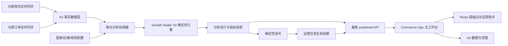
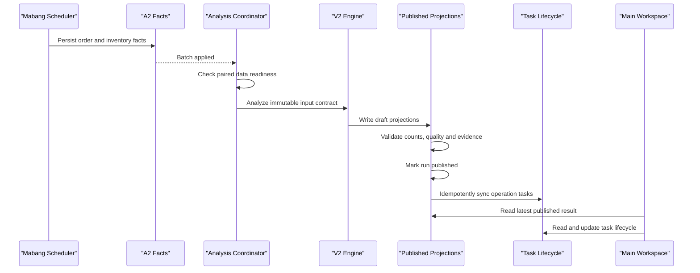

# COM-GROWTH-RADAR-V2.2 Mainline Integration Plan

> 文档标识：`COM-GROWTH-RADAR-V2.2-MAINLINE-INTEGRATION-PLAN`
>
> 指标合同：`GRV2-METRICS-1.2.0`
>
> 任务合同：`GRV2-TASKS-2.2.0`
>
> 日期：2026-07-27
>
> 状态：主线集成设计候选；未授权修改代码、迁移或正式数据库

## 0. 执行结论

Growth Radar V2.2 应以 **React island** 方式融入现有 Commerce Ops 主工作台：

```text
Commerce Ops 主壳
├── 认证、主导航、全局状态与审计
└── 超级店长运营助手
    ├── React V2.2 运营工作区
    └── A2 数据与范围工作区
```

集成原则：

1. 不迁移整个 Commerce Ops 前端。
2. 不使用 iframe，不建立第二套认证。
3. 主壳保留唯一一级导航；React 不再显示独立应用侧边栏。
4. React 通过主壳注入的 `authorizedFetch` 访问同源 V2 API。
5. A2 继续承担事实导入、范围、映射与质量治理，不被 V2.2 替代。
6. `store_intelligence` 和 `product_intelligence` 是逻辑读模型，不新增同义物理表。
7. 019/020/021 必须先在正式库复制件演练，再作为独立发布节点顺序应用。
8. 页面集成、迁移、首次分析、任务写入和每日自动分析分别启用。
9. 新运行失败时继续展示上一成功发布结果。
10. 第一阶段仍为确定性运营助手，不使用 AI 评分或自动经营动作。

## 1. 当前系统证据

### 1.1 代码与入口

- 主工作台是 `public/index.html`、`public/app.js` 驱动的原生单页壳。
- 主导航已经存在 `growth-radar` 页面标识。
- `public/growth-radar-workspace.mjs` 当前组合：
  - 原生 V2 分析页；
  - A2 数据与范围页。
- 新 V2.2 位于 `frontend/growth-radar-v2`，已完成独立 React 验证。
- V2 API 已由 `server.mjs` 注册到 `/api/growth-radar/v2/*`。
- 当前 React API 客户端直接使用全局 `fetch`，尚未复用主壳 `authorizedFetch`。
- 当前 React App 带独立侧边栏和全屏壳，直接嵌入会形成重复导航。

### 1.2 正式数据库只读状态

正式库当前：

- 最高迁移：`018_mabang_image_collection_performance.sql`
- `integrity_check=ok`
- 外键异常：`0`
- 019/020/021 的分析与任务表尚不存在

事实层：

| 对象 | 当前只读结果 |
| --- | ---: |
| `growth_source_batches` | 4 |
| `growth_order_headers` | 2,043 |
| `growth_order_lines` | 2,726 |
| `growth_inventory_snapshots` | 21,460 |
| `growth_sku_warehouse_sales_metrics` | 21,460 |
| 最新库存批次行数 | 20,026 |
| 最新库存批次唯一 SKU | 10,327 |
| 最新库存批次仓库数 | 27 |
| 活跃店铺 | 107 |
| 已确认店铺 | 0 |
| 已配置店长的店铺 | 0 |

历史门槛：

- 订单支付时间约覆盖 2026-07-15 至 2026-07-25；
- 库存目前只有 2 个快照时间；
- 当前数据不足以支持稳定的 28/42 天趋势结论；
- 国家映射和店铺责任配置完成前，国家、店铺和店长横向比较必须 fail-closed。

因此，主线 UI 可以先集成，但不能因为页面可见就宣称正式分析已可运营。

## 2. 总体集成架构



职责边界：

| 层 | 职责 | 禁止 |
| --- | --- | --- |
| 马帮同步 | 获取订单和库存并持久化 | 直接生成运营建议 |
| A2 事实层 | 保存来源、标准事实、映射和质量证据 | 反向写分析结论 |
| V2 分析层 | 依据冻结规则生成指标和信号 | 修改订单、库存、产品事实 |
| 任务层 | 保存店长处理状态与事件 | 自动执行经营动作 |
| API | 只服务最新成功发布结果和任务状态 | 读取未发布草稿作为正式结果 |
| 主工作台 | 导航、认证、挂载和统一状态 | 复制分析逻辑到浏览器 |

## 3. 主线前端集成方案

### 3.1 一级导航

保留现有 `data-page="growth-radar"`，只调整用户可见名称：

```text
超级店长运营助手
```

不新增第二个 Growth Radar 一级入口。

可在以后增加只读任务徽标：

- 只统计当前用户的活动 P0/P1 任务；
- 徽标请求失败不阻止主导航；
- 未发布分析或任务表未启用时不显示虚假 `0`。

### 3.2 工作区模式

`growth-radar` 页面内部保留两个明确模式：

1. **运营助手**
   - React V2.2；
   - 默认打开今日作战台；
   - 面向店长日常工作。
2. **数据与配置**
   - 复用 A2 页面；
   - 负责数据批次、质量、店铺范围及映射治理；
   - 不在 React 页面中复制 A2 的导入和质量管理。

现有原生 V2 分析页不再作为默认分析页面。它只保留一个发布周期的受控回退开关，确认 React 主线稳定后删除，避免两套分析 UI 长期并存。

### 3.3 React 挂载边界

新增稳定的嵌入入口，职责示意：

```text
mountGrowthRadarV2({
  element,
  authorizedFetch,
  initialRoute,
  onNavigate,
  onStatus,
  currentActor
})

unmountGrowthRadarV2()
```

主壳负责：

- 创建挂载容器；
- 注入认证请求函数；
- 同步路由；
- 展示全局错误；
- 页面离开时调用 `root.unmount()`；
- 取消仍在进行的请求。

React 负责：

- 页面内视图；
- 图表和任务交互；
- 加载、空态、不可用态；
- 任务抽屉和证据下钻；
- 不读写主壳认证令牌。

当前 `src/main.tsx` 继续用于独立开发和视觉验收；新增嵌入入口用于主线，不让两者共享隐式全局状态。

### 3.4 认证与请求

主线集成必须改为请求适配器注入，禁止 React 继续直接调用全局 `fetch`。

原因：

- 主壳 `authorizedFetch` 负责 Bearer 凭证；
- 401 时需要清除会话并锁定主应用；
- 审计需要沿用现有 request ID 和访问策略；
- iframe 或独立 sessionStorage 会形成第二套认证状态。

请求规则：

```text
React API client
-> host authorizedFetch
-> same-origin /api/growth-radar/v2/*
-> existing access policy and audit
```

开发模式可以注入普通 `fetch`，生产模式必须由主壳注入。

### 3.5 路由设计

现有应用没有服务端页面路由，因此采用主壳控制的 hash 深链：

| 路由 | 页面 |
| --- | --- |
| `#/growth-radar/today` | 今日作战台 |
| `#/growth-radar/stores` | 我的店铺战场 |
| `#/growth-radar/gaps` | 店铺缺口诊断 |
| `#/growth-radar/map` | 货盘机会地图 |
| `#/growth-radar/products` | 产品雷达 |
| `#/growth-radar/comparison` | 来源预测表现 vs 我方承接 |
| `#/growth-radar/tasks` | 全部运营任务 |
| `#/growth-radar/configuration` | 国家、店铺和规则配置 |
| `#/growth-radar/data` | A2 数据与范围 |

兼容规则：

- `#/growth-radar` 重定向到 `today`；
- 未识别子路由回到 `today`；
- 浏览器前进/后退必须更新 React 活动视图；
- SKU 和店铺详情使用查询参数或子路由，不生成第二个顶级页面；
- 未授权路由返回模块内无权限状态，不绕过主壳认证。

### 3.6 页面导航

嵌入主工作台后不显示 React 独立侧边栏，避免双侧边栏。

React 工作区内部使用紧凑视图标签和溢出菜单：

```text
今日作战台 | 店铺 | 缺口 | 机会地图 | 产品 | 对比 | 任务 | 配置
```

移动端使用同一视图模型的下拉菜单，不复制另一套路由状态。

### 3.7 样式隔离

推荐使用 Shadow DOM 挂载 React island：

- Ant Design 样式通过 `StyleProvider` 写入 shadow root；
- `ConfigProvider` 使用专属 `prefixCls`；
- Drawer、Modal、Select 等 portal 使用挂载根作为 popup container；
- React 设计 token 显式继承主壳字体和语义颜色；
- 删除对主文档生效的全局 reset；
- Tailwind 只扫描 `frontend/growth-radar-v2/src`。

这可以避免 Ant Design、Tailwind 和现有 `public/styles.css` 相互污染。

若 Shadow DOM 验证出现不可接受的无障碍或 portal 问题，备选方案为 `.grv2-app` 全量前缀隔离；不允许直接加载全局 Ant reset。

### 3.8 构建与静态资产

使用 Vite production manifest 集成，不硬编码 hash 文件名：

```text
frontend/growth-radar-v2
-> Vite build
-> public/assets/growth-radar-v2/
   ├── .vite/manifest.json
   └── hashed assets
-> host loader reads manifest entry
-> dynamic import embedded entry
```

要求：

- 根项目 `build` 必须包含 React check 和 build；
- 构建产物与后端版本同批发布；
- 禁止 CDN；
- 入口和 CSS 从 manifest 解析；
- 失败时显示模块不可用，不回退到过期分析结果；
- 后续对当前约 1.75 MB 的主 chunk 做视图和 ECharts 按需拆分。

### 3.9 与现有模块关系

| 模块 | 集成关系 |
| --- | --- |
| 马帮数据 | 上游订单/库存来源；不从 V2 页面复制采集逻辑 |
| A2 Growth Radar | 事实、范围、映射与质量底座；在同一工作区作为“数据与配置” |
| 产品中心 | SKU 身份与产品事实来源；V2 只读，不修改产品 |
| COM-015 | 无依赖，不读取或修改图片业务 |
| Listing | 第一阶段无联动；任务建议不得自动上架 |
| 操作记录 | 继续接收分析、配置和任务操作审计 |

## 4. 数据库设计

### 4.1 事实数据层

不新增重复的“库存快照表”或“订单快照表”，复用 A2：

| 业务事实 | 现有物理表 |
| --- | --- |
| 来源批次 | `growth_source_batches` |
| 订单原始证据 | `growth_order_raw_rows` |
| 标准订单头 | `growth_order_headers` |
| 标准订单商品行 | `growth_order_lines` |
| 库存原始证据 | `growth_inventory_raw_rows` |
| SKU/仓库库存快照 | `growth_inventory_snapshots` |
| 订单库存关系 | `growth_order_inventory_links` |
| SKU/仓库来源销量指标 | `growth_sku_warehouse_sales_metrics` |
| 店铺身份 | `growth_shops`、`growth_shop_source_mappings` |
| 产品身份 | `product_identity_mappings`、`product_skus` |

库存快照的业务粒度：

```text
source batch
+ snapshot_at
+ normalized SKU
+ normalized warehouse
```

订单事实使用当前有效版本，V2 统计状态为“已发货”“待处理”“配货中”“已完成”的有效订单商品数量，并按付款日期归属。

### 4.2 分析运行

`growth_analysis_runs` 是一次分析的发布单元，固定引用：

- 最新符合条件的库存批次；
- 订单 watermark；
- 国家映射版本；
- 规则版本；
- 店铺范围指纹；
- 输入指纹；
- 数据质量状态。

同一输入指纹只产生一个运行，支持重复触发幂等。

### 4.3 SKU 智能

`product_intelligence` 是逻辑读模型，不新增物理同义表：

```text
growth_sku_daily_metrics
+ growth_shop_sku_daily_metrics
+ growth_signals
+ product_skus
```

输出：

- 国家和类目内预测日销量分位；
- 库存、在途和覆盖天数；
- 我方 7/28 天有效订单销量；
- 当前 7 天 vs 前 7 天趋势；
- 明星、增长、衰退、蓝海和跨国候选；
- 公式、规则版本和证据。

### 4.4 店铺智能

`store_intelligence` 也是逻辑读模型：

```text
growth_shop_daily_metrics
+ growth_shop_sku_daily_metrics
+ growth_signals
+ growth_focus_items
```

输出：

- 店铺、国家、平台和店长；
- 当前 7 天与前 7 天销量；
- 高表现货盘销售覆盖率；
- 活动任务和严重异常数量；
- 需处理、观察、稳定、阻塞状态；
- 店铺缺口、亮点 SKU 和重点跟进项。

不保存不可解释的单一健康分。

### 4.5 运营任务

复用：

- `growth_focus_items`
- `growth_focus_item_events`
- `growth_open_focus_items_v`

任务是跨分析运行持续存在的人工工作状态；信号仍是每次分析可重算的事实。

每日分析可以：

- 创建新任务；
- 刷新证据；
- 标记本次不再命中；
- 对终态后重新命中的任务执行 `REOPENED`。

每日分析不得：

- 覆盖人工负责人、备注或状态；
- 自动解决、忽略或删除任务；
- 自动执行上架、补货、调价或广告动作。

## 5. Migration 规划

### 5.1 Migration 019

`019_growth_radar_v2_analysis.sql`

用途：

- 国家映射版本；
- 仓库国家映射；
- 规则版本；
- 分析运行；
- SKU 日指标；
- 国家 + 仓库 + SKU 日供给指标；
- 店铺日指标；
- 店铺 SKU 日指标；
- 带仓库维度的确定性信号；
- 最新成功发布视图；
- 国家层仓库风险聚合视图；
- 初始空国家映射；
- 初始 `GRV2-METRICS-1.0.1` 规则。

019 不写入正式业务分析结果。

### 5.2 Migration 020

`020_growth_radar_direction_contract.sql`

用途：

- 退休 019 中的 `1.0.1` 初始规则；
- 激活正式合同 `GRV2-METRICS-1.2.0`；
- 冻结有效订单状态为 `已发货`、`待处理`、`配货中`、`已完成`；
- 冻结低承接阈值为 `10%`，并保存完整的 32 项版本化配置；
- 不新增物理分析表。

应用 019 后必须紧接 020；应用完成 021 且运行时代码支持 `GRV2-METRICS-1.2.0` 前，V2 仍保持 fail-closed。

### 5.3 Migration 021

`021_growth_radar_task_lifecycle.sql`

用途：

- 持久化运营任务；
- 保存不可变任务事件；
- 保存任务的来源仓库与标准化仓库维度；
- 乐观并发和幂等控制；
- 活动任务唯一性；
- 开放任务只读视图。

021 不修改 A2、COM-015、产品或 Listing 表。

### 5.4 正式迁移纪律

本计划不执行迁移。正式发布时必须：

迁移编号遵循 `COMMERCE-OPS-MIGRATION-NUMBER-GOVERNANCE.md`；016 为有记录的保留空号，禁止补建空迁移，019/020/021 仍是未正式应用的候选迁移。

1. 停止相关写入服务；
2. 创建 SQLite online backup、WAL/SHM 哈希和业务行数基线；
3. 在正式库复制件重新演练 019/020/021；
4. 顺序应用 019、020、021；
5. 验证迁移记录、表、视图、索引、规则版本、完整性和外键；
6. 确认新增分析和任务表为空；
7. 确认所有 018 及以前业务表行数与哈希不变；
8. 验证失败时恢复备份，不改写迁移历史。

## 6. 马帮数据接入

### 6.1 手动采集

```text
POST /api/mabang-data/collect
-> Mabang worker
-> MabangDataPersistenceService.persistCollected
-> 临时 XLSX
-> GrowthRadarService.previewFile
-> GrowthRadarService.applyPreview
-> A2 事实表
```

### 6.2 定时采集

```text
scheduled export task
-> 采集订单或库存
-> 生成并登记正式 Excel
-> persist_collected_data
-> 同一 MabangDataPersistenceService
-> A2 事实表
```

手动和定时流程必须继续使用同一解析、校验、隐私过滤和幂等合同。

### 6.3 幂等与范围

- 订单通过列、数据行和查询范围计算语义指纹；
- 库存指纹额外包含观察时间；
- 相同范围和相同内容不重复建批次；
- V2 只使用 `status=applied`、范围已确认且质量满足门槛的批次；
- 每日订单同步建议覆盖滚动 42 天，以接收状态变更和迟到订单；
- 库存每天保存完整快照，不覆盖历史快照；
- V2 不直接读取临时页面预览或 Excel 文件。

## 7. 每日自动分析流程

### 7.1 协调器

新增代码级 `GrowthRadarAnalysisCoordinator`，不新增另一套调度事实表。

协调器由两种方式触发：

1. 订单或库存批次成功入库后的事件触发；
2. Scheduler 周期性补偿检查，处理服务重启后遗漏的触发。

`growth_analysis_runs.input_fingerprint` 提供持久幂等，因此重复触发不会重复发布。

### 7.2 数据就绪门槛

目标业务日只有满足以下条件才启动：

- 存在最新成功、范围确认的完整库存批次；
- 存在覆盖目标窗口的订单 watermark；
- 订单和库存属于兼容的数据范围；
- 国家映射版本已激活；
- 店铺身份、国家和店长配置满足分析维度；
- 规则版本为 `GRV2-METRICS-1.2.0`；
- 没有同一输入指纹的运行；
- 没有活动中的同输入运行。

不满足时：

- 不生成经营建议；
- 页面继续显示上一 published 结果；
- 显示明确的数据新鲜度或配置阻塞原因。

### 7.3 运行顺序



### 7.4 发布与失败恢复

数据同步失败：

- 调度任务记录失败；
- 不启动新分析；
- 继续展示上一成功发布结果；
- 页面显示源数据过期，不把缺失数据格式化为 0。

分析失败：

- 新运行标记 `failed`；
- 不替换最新 published；
- 保留安全错误码和质量摘要；
- 相同输入由人工或补偿协调器重试。

分析发布成功、任务同步失败：

- 分析结果保持 published；
- 旧任务状态不丢失；
- 对同一 published run 幂等重试任务同步。

服务重启：

- 协调器重新扫描最新来源批次与运行指纹；
- 不依赖内存事件恢复；
- 已发布结果和任务状态从数据库恢复。

## 8. 主线 API 使用

主工作台优先消费现有接口：

- `GET /api/growth-radar/v2/status`
- `GET /api/growth-radar/v2/assistant/workspace`
- `GET /api/growth-radar/v2/assistant/configuration`
- `GET /api/growth-radar/v2/tasks`
- `GET /api/growth-radar/v2/tasks/:id`
- `PATCH /api/growth-radar/v2/tasks/:id/status`
- `PATCH /api/growth-radar/v2/tasks/:id/assignment`
- `PATCH /api/growth-radar/v2/tasks/:id/schedule`
- `GET /api/growth-radar/v2/stores`
- `GET /api/growth-radar/v2/stores/:id`
- `GET /api/growth-radar/v2/skus/:sku`

人工分析仍使用：

- `POST /api/growth-radar/v2/analysis-runs`

配置接口继续版本化保存：

- `PUT /api/growth-radar/v2/configuration/country-mappings`
- `PUT /api/growth-radar/v2/configuration/rules`

所有写接口继续要求现有 `growth_radar.data.apply` 权限、请求审计、幂等键和乐观修订号。

## 9. 分阶段上线步骤

### Gate 0：代码基线

- 先拆分当前混合工作树的文件归属；
- 独立提交 V2.2、候选迁移和集成代码；
- 禁止把 COM-015 或其他并行修改混入同一提交；
- 全量测试和正式库哈希复核。

### Gate 1：静态前端集成

- 增加 React 嵌入入口；
- 注入 `authorizedFetch`；
- 去除嵌入模式独立侧边栏；
- 接入主壳 hash 路由；
- Vite manifest 纳入根构建；
- 保持导航功能开关关闭。

验收：主工作台可挂载/卸载，认证、样式和其他模块不受影响。

### Gate 2：候选迁移部署

- 正式备份；
- 复制件演练；
- 顺序应用 019/020/021；
- 验证新增表为空；
- 不启动分析；
- 导航仍关闭。

### Gate 3：配置与数据就绪

- 配置 27 个仓库的国家映射；
- 确认 107 家店铺身份、国家、平台和店长；
- 核对有效订单状态；
- 积累或补录满足 28/42 天窗口的订单历史；
- 继续每日库存快照；
- 通过 readiness 门禁。

### Gate 4：只读 UI

- 打开主导航和 React 工作区；
- 仍禁止正式分析和任务写入；
- 显示数据就绪、配置和历史门槛；
- A2 页面继续可用。

### Gate 5：首次人工分析

- 创建正式备份；
- 手工执行一次分析；
- 核对分析输入指纹、规则版本和数据时间；
- 抽检国家 × 类目、Top SKU、店铺和任务证据；
- 确认上一 published 回退机制。

### Gate 6：任务写入

- 开启任务状态、负责人和复核日期写入；
- 验证权限、审计、幂等和并发冲突；
- 不开启自动经营动作。

### Gate 7：每日自动分析

- 启用协调器；
- 观察至少 7 次连续日运行；
- 验证重复触发、重启恢复和源同步失败；
- 监控运行时长、任务新增率、数据阻塞率和页面新鲜度。

### Gate 8：清理旧原生 V2

- React 主线稳定一个发布周期；
- 删除旧原生 V2 分析入口和重复样式；
- A2 数据页面继续保留；
- 更新文档、测试和静态资源清单。

## 10. 功能开关

建议使用独立开关：

| 开关 | 用途 | 默认 |
| --- | --- | --- |
| `GROWTH_RADAR_V2_UI_ENABLED` | 显示主导航与 React 工作区 | `false` |
| `GROWTH_RADAR_V2_ANALYSIS_ENABLED` | 允许人工正式分析 | `false` |
| `GROWTH_RADAR_V2_TASK_WRITES_ENABLED` | 允许任务状态写入 | `false` |
| `GROWTH_RADAR_V2_AUTO_ANALYSIS_ENABLED` | 允许每日自动分析 | `false` |
| `GROWTH_RADAR_V2_LEGACY_FALLBACK_ENABLED` | 临时回退旧原生分析页 | `true`，稳定后删除 |

功能开关只控制能力，不改变数据库事实或规则口径。

## 11. 验收标准

### 前端

- 主导航只有一个超级店长运营助手入口；
- React 无第二套一级侧边栏；
- hash 深链、前进和后退可用；
- `authorizedFetch` 接管所有 API 请求；
- 页面切换后无遗留请求、ECharts 实例或事件；
- Ant Design/Tailwind 不污染主工作台其他页面；
- 桌面和 430px 移动端无水平溢出；
- 控制台错误为 0。

### 数据

- V2 不新增重复事实表；
- 只读取 applied 且范围确认的数据；
- `NULL` 与 `0` 分开；
- 预测日销量不称为市场真实销量；
- 历史未出单不称为未上架；
- 多仓预测日销量不盲目求和。

### 分析与任务

- 同一输入指纹重复触发只复用一个运行；
- 新运行失败时上一 published 继续可读；
- 每位店长首页最多 10 项任务；
- 手工任务状态不会被每日分析覆盖；
- 每项结论可下钻到输入、公式、规则版本和数据时间；
- 无 AI 评分和自动经营动作。

### 工程门禁

- Growth Radar 专项测试；
- React TypeScript check 和 production build；
- 根项目 Build；
- 全量测试；
- Doctor；
- migration 复制件演练；
- 正式库完整性、外键、行数和哈希保护；
- Playwright 桌面与移动端验收。

## 12. 风险清单

| 风险 | 当前证据 | 控制措施 |
| --- | --- | --- |
| 混合工作树污染提交 | 主线存在多模块在途修改 | 先按文件归属拆分提交 |
| React 绕过主壳认证 | 当前客户端直接调用 `fetch` | 注入 `authorizedFetch` |
| 双侧边栏和双导航 | 独立 React 有完整应用壳 | 嵌入模式改用主壳 + 视图标签 |
| CSS 污染其他模块 | Ant reset 和 Tailwind 为全局风险 | Shadow DOM、prefixCls、popup container |
| 两套 V2 长期并存 | 已有原生 V2 和 React V2.2 | 功能开关切换，一个周期后删除旧页 |
| 静态文件 hash 失配 | Vite 产物文件名带 hash | 使用 manifest，不硬编码 |
| 正式库不具备 V2 schema | 当前最高迁移 018 | 复制件演练后独立批准 019/020/021 |
| 店铺分析不可用 | 107 家店铺均未确认、无店长 | Gate 3 完成身份与责任配置 |
| 国家分析不可用 | 27 个仓库尚未配置正式映射 | Gate 3 逐项确认，不猜测 |
| 趋势历史不足 | 订单约 10 天、库存 2 个快照 | 补录或等待 28/42 天，期间 fail-closed |
| 同步先后不一致 | 订单和库存是独立任务 | 数据配对门槛 + 协调器 + 输入指纹 |
| 服务重启漏触发 | 仅事件触发会丢失 | 周期性补偿扫描 |
| 新分析失败清空页面 | 新运行可能失败 | 只读取最新 published |
| 任务状态被重算覆盖 | 信号每日变化 | 信号与任务分表，保留人工状态 |
| 前端包体较大 | 当前主 chunk 约 1.75 MB | 视图和 ECharts 动态拆分 |
| 自动分析误启动 | 调度接入后可能越权 | 独立默认关闭的自动分析开关 |

## 13. 后续执行拆分

本设计确认后，开发建议拆为：

1. `INT-0`：混合工作树文件归属与提交边界审计。
2. `INT-1`：React 嵌入入口、请求注入和样式隔离。
3. `INT-2`：主工作台导航、hash 路由和构建 manifest。
4. `INT-3`：复制件迁移发布脚本与正式上线检查清单。
5. `INT-4`：数据配置与历史就绪门禁。
6. `INT-5`：首次人工分析与任务写入验收。
7. `INT-6`：每日分析协调器和失败恢复。
8. `INT-7`：旧原生 V2 清理。

每一阶段均需独立报告、测试结果和人工批准，不跨越正式数据库或自动分析门禁。
