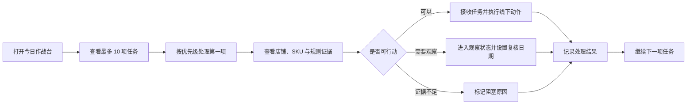

# COM-GROWTH-RADAR-V2.2 超级店长运营助手设计报告

> 设计版本：`GRV2-SUPER-MANAGER-2.2`
>
> 日期：2026-07-27
>
> 状态：产品方向已确认；migration 与正式数据操作仍需单独人工批准

已确认决策：

1. 每位店长首页最多 10 项任务。
2. 销售趋势使用当前 7 天与前 7 天比较。
3. 任务采用本文档定义的生命周期。
4. 店铺状态使用需处理、观察、稳定、阻塞。
5. 蓝海动作统一为“核查在线状态后低风险测试”。
6. `operation_tasks` 复用 `growth_focus_items` / `growth_focus_item_events`。
7. 跨国机会统一称为“跨国候选”。

## 0. 执行结论

Growth Radar V2.2 的核心变化不是增加更多图表，而是改变产品主流程：

```text
过去：
查看数据
-> 自己发现异常
-> 自己判断原因
-> 自己决定动作

V2.2：
系统发现确定性信号
-> 合并为每日运营任务
-> 展示原因和证据
-> 给出受控动作建议
-> 店长处理、跟进和关闭
```

V2.2 的产品名称可以使用“超级店长 AI 运营助手”，但第一阶段仍是确定性运营助手：

- AI 不生成机会和风险；
- AI 不修改优先级；
- AI 不自动执行经营动作；
- 每个结论必须由规则、输入、公式和证据重放；
- 未来 AI 只能在已发布事实之上做摘要、问答和表达优化。

现有 R1 React 工程、ECharts 图表、热力图、四象限、Top SKU 和证据抽屉可以复用。V2.2 需要重排信息优先级，不需要推翻技术栈。

## 1. 产品定位变化

### 1.1 从 BI 看板变为运营工作台

| 项目 | R1 货盘驾驶舱 | V2.2 超级店长运营助手 |
|---|---|---|
| 首要问题 | 数据表现如何 | 今天先处理什么 |
| 首页主角 | 图表和指标 | 最多 10 项运营任务 |
| 用户动作 | 浏览、筛选、下钻 | 接收、处理、观察、关闭 |
| 店铺视角 | 店长汇总 | 50 家店铺的异常与机会队列 |
| SKU 视角 | 排名和象限 | 证据、趋势、缺口与建议动作 |
| 输出单位 | 指标、信号 | 可执行任务 |
| 成功标准 | 看懂数据 | 减少漏看并完成关键动作 |

### 1.2 核心用户

第一核心用户：

- 同时负责约 50 家店铺的店长或运营负责人；
- 跨 Shopee、Lazada、TikTok；
- 跨国家和类目；
- 每天只能投入有限时间排查异常。

第二核心用户：

- 运营主管：查看负责人负载和处理结果；
- 货盘负责人：查看国家、类目和 SKU 机会；
- 系统管理员：维护国家、店铺、店长和规则配置。

### 1.3 产品承诺

店长每天进入系统后，应在 5 分钟内得到三个答案：

1. 哪些店铺今天必须关注？
2. 为什么需要关注？
3. 下一步应核查或执行什么？

产品不承诺：

- 自动判断平台在线 Listing 状态；
- 将来源预测日销量称为市场真实销量；
- 将我方承接率称为市场份额；
- 自动上架、调价、补货或投放广告；
- 使用无证据的 AI 推荐。

## 2. 用户使用流程

### 2.1 每日主流程



### 2.2 任务生成原则

每日分析可以产生大量信号，但不能把每个信号都变成任务。

任务收敛规则：

1. 同一店铺、同一类目、同一规则的多个 SKU 优先合并为一个任务。
2. 同一业务对象和任务类型只保留一个活动任务。
3. 连续命中时更新最近证据，不重复创建。
4. 已在处理中或观察中的任务不因每日重算丢失状态。
5. 每位店长首页最多展示 10 项，剩余任务进入完整任务中心。
6. 数据质量受阻的信号只生成“配置/数据阻塞”任务，不生成经营建议。

### 2.3 任务生命周期

```text
NEW
-> ACKNOWLEDGED
-> IN_PROGRESS
-> MONITORING
-> RESOLVED

NEW / ACKNOWLEDGED / IN_PROGRESS
-> BLOCKED

NEW / ACKNOWLEDGED
-> DISMISSED

RESOLVED / DISMISSED
-> REOPENED
```

状态含义：

- `NEW`：系统新发现，尚未确认；
- `ACKNOWLEDGED`：店长已看到；
- `IN_PROGRESS`：已开始处理；
- `MONITORING`：动作已完成，等待数据反馈；
- `RESOLVED`：问题已解决或机会已完成验证；
- `BLOCKED`：受库存、配置、权限或数据质量阻塞；
- `DISMISSED`：经人工判断无需处理，必须记录原因；
- `REOPENED`：重新命中或人工重开。

### 2.4 优先级

禁止使用不可解释的综合 AI 分数。采用确定性分层排序：

```text
第一层：严重程度
第二层：影响范围
第三层：货盘需求分位或销量变化幅度
第四层：库存可行动性
第五层：连续命中天数
第六层：首次发现时间
```

优先级建议：

- `P0`：有需求且已断货、关键店铺严重异常；
- `P1`：高表现货盘未承接、重点 SKU 明显下滑、库存即将断货；
- `P2`：蓝海、新品和跨国低风险测试候选；
- `P3`：观察项、轻度异常和配置提醒。

每个排序字段必须随任务证据返回。

## 3. 页面信息架构

### 3.1 全局导航

```text
雷达总览
├── 今日作战台
├── 我的店铺战场
└── 店铺缺口诊断

机会雷达
├── 货盘机会地图
├── 产品雷达
└── 市场验证 vs 我方承接

任务中心
├── 全部任务
├── 我的观察项
└── 已完成任务

系统配置
├── 国家映射
├── 店铺与店长
├── 规则阈值
└── 数据新鲜度
```

SKU 详情作为全局下钻页或抽屉，不占用一级导航。

### 3.2 页面 1：今日作战台

目标：让店长先处理任务，再查看图表。

首屏顺序：

1. 日期、数据水位、规则版本和质量状态；
2. 今日必须关注，最多 10 项；
3. 店铺健康概览；
4. 确定性增长机会；
5. 销售下滑与库存风险；
6. 产品四象限和国家 × 类目机会地图摘要。

任务卡必须展示：

- 优先级；
- 任务类型；
- 店铺、国家、平台、负责人；
- 涉及类目和 SKU 数量；
- 一句话发现；
- 三项以内关键证据；
- 推荐动作；
- 首次发现、最近命中；
- 接收、处理、观察、关闭操作。

示例：

```text
P1 · 店铺货盘缺口
菲律宾 Shopee 店 · 太阳能

发现：
来源高表现 Top20 SKU 中，本店近 28 天仅承接 5 个。

证据：
- 来源预测日销量类目内 P80 以上：20 个
- 本店近 28 天已发货 SKU：5 个
- 可用库存满足测试门槛：12 个

建议：
先核查 12 个 SKU 的在线状态，再选择 3-5 个进行低风险测试。
```

文案必须使用“近 28 天未产生已发货订单”，不能直接写“未上架”。

### 3.3 页面 2：我的店铺战场

目标：用一张可排序列表管理约 50 家店铺。

默认列：

- 店铺名称；
- 国家；
- 平台；
- 店长；
- 近 7 天已发货销量；
- 相比前 7 天变化；
- 高表现货盘销售覆盖率；
- 活动任务数；
- 严重异常数；
- 状态；
- 最近数据时间。

店铺状态不使用单一黑盒健康分：

- `ACTION_REQUIRED`：存在 P0/P1 任务；
- `WATCH`：仅有 P2/P3 或趋势证据不足；
- `STABLE`：无活动高优先任务；
- `BLOCKED`：国家、店铺或数据质量配置不完整。

点击店铺后进入店铺详情：

- 当前任务；
- 销售趋势；
- 类目结构；
- 高表现货盘覆盖；
- 亮点 SKU；
- 下滑 SKU；
- 蓝海候选；
- 数据质量和配置状态。

### 3.4 页面 3：货盘机会地图

核心维度：

```text
确认国家 × 二级类目
```

热力图不能只显示星级，点击后必须解释：

- 该国家类目的来源预测日销量分布；
- P80 以上 SKU 数；
- 我方近 28 天承接 SKU 数；
- 可行动 SKU 数；
- 供应受限 SKU 数；
- 数据质量受阻 SKU 数。

机会等级由规则字段组合产生，必须能拆解，不保存一个无法解释的总分。

下钻顺序：

```text
国家 × 类目
-> 高表现 SKU
-> 店铺承接差异
-> 任务或证据详情
```

### 3.5 页面 4：产品雷达

产品雷达按 SKU 展示四类可行动状态：

#### 明星产品

- 来源高表现；
- 我方已有稳定承接；
- 当前库存可支持；
- 动作：守住优势、观察库存。

#### 增长产品

- 我方近 7 天日均销量高于前 7 天；
- 满足最小销量与数据完整性门槛；
- 连续增长天数达到配置要求；
- 动作：扩大验证、观察供应。

前 7 天为 0 时不得显示无限增长率，应显示“新近产生销售”。

#### 衰退产品

- 我方近 7 天日均销量低于前 7 天；
- 前期基数达到最小门槛；
- 排除数据缺口、店铺范围变化和库存断供；
- 动作：核查流量、Listing、价格和库存。

系统只提示核查方向，不在缺少相关数据时断言具体原因。

#### 蓝海产品

- 同国家、同类目来源预测表现达到 P80；
- 我方承接率低于阈值或近 28 天已发货数量为 0；
- 可用库存或在途满足规则；
- 无阻塞级数据质量问题；
- 动作：核查在线状态后低风险测试。

### 3.6 页面 5：市场验证 vs 我方承接

保留 R1 四象限，但修正命名：

```text
纵轴：来源预测表现分位
横轴：我方承接率
```

禁止命名为“市场份额”。

四象限：

1. 来源强、我方弱：优先发力；
2. 来源强、我方强：守住优势；
3. 来源弱、我方强：本店优势；
4. 来源弱、我方弱：低优先观察。

每个点可切换粒度：

- SKU；
- 国家 × 类目；
- 店铺 × 类目。

点击点位必须打开证据，不允许只显示悬浮数值。

### 3.7 页面 6：店铺缺口诊断

回答：“这个店当前缺少哪些已验证货盘承接？”

诊断维度：

```text
店铺
-> 国家
-> 类目
-> 来源高表现 SKU
-> 本店近 28 天已发货承接
```

输出：

- 高表现货盘候选数；
- 已产生已发货销售 SKU 数；
- 当前销售覆盖率；
- 有库存支持的缺口 SKU；
- 供应受限 SKU；
- 数据质量受阻 SKU；
- 推荐核查顺序。

建议动作必须是：

```text
核查在线状态
-> 选择低风险候选
-> 小批测试
-> 进入观察
```

不能直接要求一次引入全部缺口 SKU。

### 3.8 页面 7：SKU 详情

SKU 详情分为五层：

1. **结论**：当前方向、优先级和建议动作；
2. **货盘证据**：国家内类目排名、来源预测日销量、库存和覆盖天数；
3. **我方证据**：店铺、平台和国家的已发货销量；
4. **趋势证据**：7 天、前 7 天、28 天和数据完整性；
5. **规则证据**：公式、阈值、规则版本、分析运行和数据水位。

跨国分析只生成“跨国候选”：

- SKU 在 A 国家表现好；
- B 国家具有该 SKU 的已确认货盘和库存；
- B 国家我方承接低；
- B 国家自身数据满足比较门槛。

禁止仅凭“A 国家卖得好”推断“B 国家一定能卖”。

## 4. 数据需求变化

### 4.1 可直接复用

现有设计已经提供：

- `growth_analysis_runs`：发布运行、规则版本和数据水位；
- `growth_sku_daily_metrics`：国家和 SKU 货盘指标；
- `growth_shop_daily_metrics`：店铺销量、覆盖和信号汇总；
- `growth_shop_sku_daily_metrics`：店铺 SKU 证据；
- `growth_signals`：确定性机会和风险；
- 国家、店铺和店长配置；
- 上一次成功发布结果继续可读。

因此 V2.2 不应重建 SKU 指标和店铺指标。

### 4.2 新增派生需求

V2.2 需要补充以下确定性派生：

| 需求 | 输入 | 输出 |
|---|---|---|
| 店铺 7 天趋势 | 当前 7 天、前 7 天已发货数量 | 增长、下降、稳定、数据不足 |
| SKU 销售趋势 | 店铺 SKU 当前 7 天和前 7 天 | 增长产品、衰退产品 |
| 店铺健康状态 | 活动任务、严重程度、数据质量 | 需处理、观察、稳定、阻塞 |
| 任务聚合 | 多条同类信号 | 店铺/类目级任务 |
| 跨国候选 | 同 SKU 多国货盘与承接事实 | 需要核查的国家候选 |
| 任务持续性 | 连续分析运行中的同一信号 | 首次发现、连续命中、最近命中 |

趋势最低门槛必须配置化。历史快照不足时显示“数据不足”，不得补零或插值。

### 4.3 需要新增或扩展的信号合同

建议在后续规则合同评审中讨论：

- `STORE_SALES_DECLINE`
- `STORE_ASSORTMENT_GAP`
- `SKU_SALES_GROWTH`
- `SKU_SALES_DECLINE`
- `CROSS_COUNTRY_CANDIDATE`
- `STORE_DATA_BLOCKED`

这些属于指标/规则合同变化，当前设计报告不修改现有合同，也不授权实现。

### 4.4 数据语义继续冻结

1. 来源预测日销量不是市场真实销量。
2. 我方承接率不是市场份额。
3. 近 28 天无已发货订单不等于未上架。
4. `NULL` 不等于 0。
5. 国家映射缺失时不得猜测。
6. 多仓预测日销量不得盲目累计。
7. 分析失败时继续展示上一成功发布结果。

## 5. 数据模型变化

V2.2 使用三个逻辑模型，但不要求现在立即新增三张物理表。

### 5.1 `store_intelligence`

定位：面向页面和 API 的店铺情报投影。

来源：

```text
growth_shop_daily_metrics
+ growth_signals
+ 前一成功分析运行
+ 活动跟进任务
```

建议输出字段：

- 店铺、国家、平台、店长；
- 当前 7 天和前 7 天已发货数量；
- 趋势状态和证据；
- 高表现货盘销售覆盖率；
- 活动任务数和最高优先级；
- 店铺状态；
- 数据质量和新鲜度。

第一版优先作为查询投影或 API DTO，不新增重复事实表。

### 5.2 `product_intelligence`

定位：面向产品雷达和 SKU 详情的产品情报投影。

来源：

```text
growth_sku_daily_metrics
+ growth_shop_sku_daily_metrics
+ growth_signals
+ 前一成功分析运行
```

建议输出字段：

- SKU、商品名、国家和类目；
- 来源预测表现、类目分位；
- 我方 7/28 天已发货销量；
- 当前 7 天和前 7 天趋势；
- 承接率；
- 库存、在途和覆盖天数；
- 明星、增长、衰退、蓝海状态；
- 推荐动作和规则证据。

第一版优先作为查询投影或 API DTO，不新增重复事实表。

### 5.3 `operation_tasks`

定位：保存店长真正需要处理的运营工作，不与每日可重算信号混在一起。

现有设计中的 `growth_focus_items` 与 `growth_focus_item_events` 可以承担该职责，避免再建语义重复的 `operation_tasks` 表。

建议核心字段：

- `id/task_key/task_type`；
- `current_signal_id`；
- `owner_user_id/internal_shop_id`；
- `country_code/platform/category`；
- `subject_type/normalized_sku`；
- `priority/status`；
- `reason_code/recommended_action_code`；
- `evidence_snapshot_json`；
- `first_detected_at/last_detected_at`；
- `due_at/snoozed_until`；
- `resolution_code/resolution_note`；
- `created_at/updated_at/resolved_at`。

建议事件：

- 创建；
- 分配；
- 接收；
- 开始处理；
- 进入观察；
- 阻塞；
- 解决；
- 忽略；
- 重新打开。

任务持久化需要未来数据库迁移，属于必须单独人工批准的门禁。

### 5.4 信号与任务的边界

```text
growth_signals
= 每日分析事实，可重算

growth_focus_items
= 人工工作状态，不可被每日重算覆盖

growth_focus_item_events
= 操作历史和处理原因
```

信号消失不应自动删除活动任务。系统应标记“本次未再次命中”，由规则或人工决定是否关闭。

## 6. 与现有 R1 UI 的差异

| R1 组件 | V2.2 处理 |
|---|---|
| 五个 KPI 卡片 | 保留，但改为确定性任务入口 |
| 国家 × 类目热力图 | 保留，移到机会雷达和首页次级区域 |
| Top SKU 表 | 保留，改为确定性增长机会或任务相关 SKU |
| 四象限 | 保留，明确轴名和证据边界 |
| 蓝海机会池 | 保留，增加核查在线状态与任务化入口 |
| 店长诊断表 | 升级为 50 店铺战场 |
| 今日运营指引 | 升级为首页主角和完整任务生命周期 |
| SKU 证据抽屉 | 升级为完整 SKU 详情与趋势证据 |
| 配置抽屉 | 保留，未来连接版本化配置 API |
| 单页驾驶舱 | 调整为任务优先的多页面工作台 |

首页布局变化：

```text
R1：
KPI
-> 热力图 / Top SKU
-> 四象限 / 蓝海
-> 任务

V2.2：
今日任务
-> 店铺健康
-> 增长 / 下滑 / 库存摘要
-> 产品象限
-> 机会地图摘要
```

视觉原则：

- 仍然使用密集、安静、可扫描的运营后台风格；
- 不使用营销落地页式大 Hero；
- 红色只表达必须处理，绿色只表达稳定或正向结果；
- 图表必须支持下钻，不展示无行动含义的装饰图；
- 50 店铺列表优先支持筛选、排序和批量定位；
- 移动端首页先显示任务，图表延后。

## 7. 后续开发路线

### V2.2-0：产品与规则合同确认

确认：

- 任务类型；
- 趋势窗口和最小样本量；
- 店铺状态规则；
- 任务优先级和最多 10 项的收敛方式；
- 任务生命周期；
- 跨国候选的证据门槛。

本设计报告属于该阶段输入。

### V2.2-1：只读数据缺口审计

只检查：

- 当前 7 天和前 7 天能否从现有订单事实准确计算；
- 当前分析表是否已有所需字段；
- 店铺、平台、国家、店长映射完整度；
- 现有信号能覆盖哪些任务类型；
- 迁移 019/020 的代码状态与正式数据库状态。

不修改数据库。

### V2.2-2：前端信息架构原型

继续在独立 React 工程中使用 fixture：

- 今日作战台；
- 我的店铺战场；
- 产品雷达；
- 店铺缺口诊断；
- 任务与 SKU 详情。

不接共享入口，不接正式 API。

### V2.2-3：规则合同扩展

设计并测试：

- 店铺销售下滑；
- SKU 增长/衰退；
- 店铺货盘缺口；
- 跨国候选；
- 任务聚合和去重；
- 店铺状态。

改变指标合同前必须人工确认。

### V2.2-4：任务数据模型

冻结 `growth_focus_items/events`：

- 字段；
- 状态机；
- 唯一约束；
- 权限；
- 审计；
- 并发处理。

若需要新增 migration，必须停止并请求人工批准。

### V2.2-5：API 投影

建议 API：

- `GET /api/growth-radar/v2.2/today`
- `GET /api/growth-radar/v2.2/stores`
- `GET /api/growth-radar/v2.2/stores/:id`
- `GET /api/growth-radar/v2.2/products`
- `GET /api/growth-radar/v2.2/skus/:country/:sku`
- `GET /api/growth-radar/v2.2/tasks`
- `PATCH /api/growth-radar/v2.2/tasks/:id`

所有响应携带：

- 分析运行 ID；
- 规则版本；
- 数据水位；
- 质量状态；
- 证据字段。

### V2.2-6：真实数据联调

- 使用隔离数据库；
- 先验证 5 家店，再扩展到 50 家；
- 验证任务去重、连续命中和上一成功结果；
- 验证负责人权限范围；
- 不修改正式数据库。

### V2.2-7：运营验收

至少完成：

- 一名店长连续使用 5 个工作日；
- 每日任务数量和误报率记录；
- 任务是否可执行；
- 任务处理时间；
- 被忽略原因；
- 规则阈值调整依据。

### V2.3：AI 助手

只有在确定性任务稳定后再接入 AI：

- 汇总今日任务；
- 用自然语言解释既有证据；
- 回答“为什么推荐”；
- 生成核查清单草稿。

AI 不得：

- 创建没有规则信号支持的任务；
- 改变确定性优先级；
- 自动执行上架、调价、投放或补货；
- 将缺失数据补成事实。

## 8. 开发门禁

以下事项在对应阶段必须停止并请求人工确认：

1. 修改现有指标口径；
2. 新增或修改 migration；
3. 应用迁移 019/020 到正式数据库；
4. 新增任务持久化表；
5. 修改 A2 或 COM-015；
6. 接入共享入口；
7. 修改正式数据；
8. 使用 AI 生成信号或优先级。

## 9. 待确认事项

进入任何编码前，需要业务方确认：

1. 首页任务是否按“每位店长最多 10 项”收敛；
2. 销售增长和下滑是否使用“当前 7 天 vs 前 7 天”；
3. 任务状态是否接受本文生命周期；
4. 店铺状态是否接受“需处理/观察/稳定/阻塞”，不使用黑盒健康分；
5. 蓝海动作是否统一为“核查在线状态后低风险测试”；
6. `operation_tasks` 是否复用 `growth_focus_items/events`，避免重复建表；
7. 跨国机会是否使用“跨国候选”命名，避免做确定性销量承诺。

以上七项确认后，下一步应先执行 V2.2-1 只读数据缺口审计，不应直接创建 migration 或连接正式数据。
