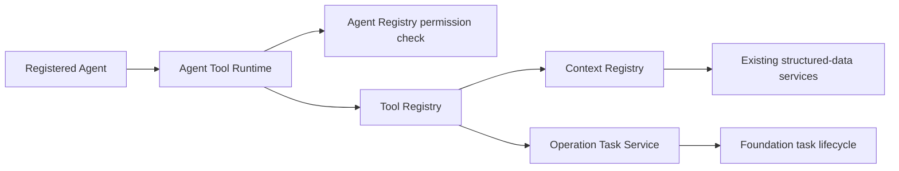

# Commerce Ops AI Agent Foundation 1.2

Status: implemented additive foundation

Successor: `COMMERCE-OPS-AI-AGENT-FOUNDATION-1.3.md` is the current mandatory
production Runtime contract. The direct Framework API below is retained only
as the historical Foundation 1.2 component baseline.

Scope: shared Context and Tool infrastructure only. This version does not add
a business Agent, change Daily Report behavior, or require a database migration.

## 1. Architecture



The Agent receives only the Tool Runtime interface. It does not receive a
database repository, SQLite connection, filesystem handle, provider adapter,
HTTP client, or external-system credential.

The Tool Registry owns the approved business capabilities. Read tools resolve
bounded Context envelopes. The only write tool creates a pending Foundation
operation task and never performs the suggested business action.

## 2. Context Registry

Registry contract version:

```text
AI-CONTEXT-REGISTRY-1.0.0
```

Registered Contexts:

| Context | Input | Output |
| --- | --- | --- |
| `shop` | `subjectId` | Shop profile, sales, inventory, risks, and tasks |
| `product` | `subjectId` | Product, SKU, sales, inventory, listing, risk, and task facts |
| `sku` | `subjectId` | SKU, sales, warehouse inventory, prices, listing, risks, and tasks |
| `sales` | `subjectType`, `subjectId` | Sales projection of a Shop, Product, or SKU Context |
| `inventory` | `subjectType`, `subjectId` | Inventory projection of a Shop, Product, or SKU Context |

`sales` and `inventory` reuse the existing Shop/Product/SKU envelopes. They do
not issue independent queries or create duplicate business facts.

Every Context definition is immutable and includes its version, description,
structured-data source, input schema, and output Context type. Conflicting
registrations are rejected. Resolver output must match the registered Context
type.

`daily_report` remains a runtime-only Context owned by the existing scheduled
Daily Report pipeline. It is deliberately not registered in the shared Context
Registry, preserving current production behavior.

### Context API

```js
contextRegistry.register(definition)
contextRegistry.get(type)
contextRegistry.require(type)
contextRegistry.list()
contextRegistry.resolve(type, input)

aiContextService.get("shop", shopId)
aiContextService.get("product", productId)
aiContextService.get("sku", skuId)
aiContextService.get("sales", shopId, { subjectType: "shop" })
aiContextService.get("inventory", skuId, { subjectType: "sku" })
aiContextService.list()
```

## 3. Tool Registry

Registry contract version:

```text
COMMERCE-OPS-TOOL-REGISTRY-1.0.0
```

Every tool definition is immutable and declares:

- name and version;
- description;
- `read` or `write` access;
- required permission scope;
- input and output schemas;
- fixed boundaries: database access is service-only and external access is
  forbidden.

Registered tools:

| Tool | Access | Permission | Execution boundary |
| --- | --- | --- | --- |
| `query_sales` | read | `sales-assortment.read` | Resolves `sales` Context |
| `query_inventory` | read | `inventory.read` | Resolves `inventory` Context |
| `query_product` | read | `product.read` | Resolves `product` Context |
| `create_task` | write | `agent.task.create` | Creates a pending operation task |

### Query inputs

```js
// query_sales and query_inventory
{
  subject_type: "shop" | "product" | "sku",
  subject_id: "bounded business identifier",
}

// query_product
{
  product_id: "bounded product identifier",
}
```

### Task input

`create_task` uses the existing
`COMMERCE-OPS-AGENT-OPERATION-TASK-1.0.0` contract. The runtime injects the
registered Agent identity, request ID, requester, and correlation ID. The
result always starts `PENDING`, respects the Agent's approval policy, and
records `automatic_execution=false`.

## 4. Runtime Authorization

Before invoking a tool, `AgentToolRuntime` verifies all of the following:

1. the Agent name and version are registered;
2. the tool is registered;
3. the Agent definition declares the tool;
4. declared access exactly matches the Tool Registry;
5. declared permission exactly matches the Tool Registry;
6. the Agent permission scopes contain that permission;
7. request metadata and tool input are bounded JSON.

An undeclared tool returns `AGENT_TOOL_FORBIDDEN`. A permission mismatch
returns `AGENT_TOOL_PERMISSION_MISMATCH`. No fallback or implicit elevation is
allowed.

### Agent Framework API

```js
framework.configureTools(toolRegistry)

await framework.executeTool({
  agent_name: "registered.agent",
  agent_version: "1.0.0",
  request_id: "request-123",
  requested_by: "scheduler-or-user",
  tool_name: "query_sales",
  input: { subject_type: "shop", subject_id: "shop-123" },
})
```

The response contains the immutable tool definition, normalized Agent
reference, request ID, and bounded result. It never exposes repositories,
providers, credentials, or external clients.

## 5. Business-Agent Development Rule

Future Agents must:

1. register an immutable Agent definition;
2. declare every Context, tool, permission, and output schema;
3. access business facts only through registered query tools;
4. create recommendations only through `create_task`;
5. send model calls only through the existing AI Gateway;
6. keep deterministic calculations outside the model;
7. never call a database, filesystem source export, or external system directly.

Adding a new Agent remains a separate product and permission decision. This
Foundation change does not register one.

## 6. Compatibility and Data Impact

- Existing Shop/Product/SKU Context calls remain compatible.
- The Daily Report Agent still uses its runtime Context, Agent Registry,
  Prompt Registry, AI Gateway, Foundation task lifecycle, scheduler, and
  delivery flow without Tool Runtime changes.
- Existing HTTP routes are unchanged.
- No public tool execution endpoint was added.
- Migration 022 remains sufficient. No migration was created or applied.
- Formal SQLite data was not modified.
