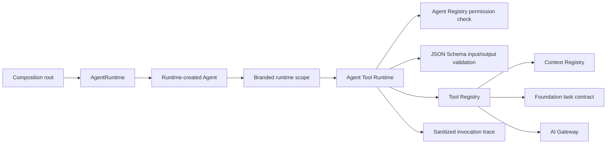

# Commerce Ops AI Agent Foundation 1.3

Status: implemented mandatory runtime contract

Scope: production Agent construction, Tool execution, schema enforcement, and
safe invocation tracing. No new business Agent and no database migration.

## 1. Objective

Foundation 1.2 supplied reusable Context, Tool, Registry, and Gateway
components. Foundation 1.3 makes those boundaries mandatory:



Business Agents cannot receive a Repository, Service, database connection,
provider, Gateway, HTTP client, or filesystem handle. Infrastructure remains
behind registered Tools at the composition root.

## 2. AgentRuntime Contract

`AgentRuntime` is the only production construction path:

```js
const agent = agentRuntime.createAgent({
  definition: REGISTERED_DEFINITION,
  Agent: RegisteredAgentClass,
  options: { configured: true, model: "deepseek-v4-flash" },
})
```

The Runtime, rather than the caller, instantiates the Agent. `options` accepts
only plain JSON configuration. Reserved or infrastructure dependency names are
rejected with `AGENT_RUNTIME_DEPENDENCY_FORBIDDEN`; class instances, functions,
and other non-JSON values are rejected with `AGENT_RUNTIME_OPTIONS_INVALID`.
This prevents factory closures or constructor parameters from smuggling
infrastructure into an Agent.

The production composition root must explicitly provide the Runtime with the
Agent Registry, Context Registry, Tool Registry, AI Gateway, Foundation Task
Service, and Audit Service. Missing Context Registry, Tool Registry, Gateway,
Task Service, or Audit Service fails Runtime construction. Callers cannot
supply a Tool factory or replace the Runtime-owned Tool assembly.

The Runtime supplies an unforgeable, frozen scope containing only:

- the immutable Agent definition;
- `executeTool`;
- `resolveContext`, which invokes the registered `context.resolve` Tool;
- a narrow Runtime clock.

Task creation, transition, and lease operations are registered lifecycle
Tools. They are not methods on the Agent scope and are restricted to tasks
owned by the registered Agent identity.

Agents validate the scope with `assertAgentRuntimeScope`. Direct Agent
construction fails with `AGENT_RUNTIME_SCOPE_REQUIRED`.

## 3. Framework And Tool Enforcement

`AgentFramework` cannot be constructed without a Tool Registry and Tool trace.
Missing Tool infrastructure fails before an Agent can run.

For each invocation, `AgentToolRuntime` verifies:

1. Agent registration and version;
2. exact Tool `name@version` registration;
3. Agent declaration of that Tool version;
4. exact access and permission agreement;
5. permission presence in the Agent scope;
6. bounded JSON input;
7. input JSON Schema;
8. bounded JSON output;
9. output JSON Schema.

Invalid input fails with `AGENT_TOOL_INPUT_SCHEMA_INVALID`. Invalid output
fails with `AGENT_TOOL_OUTPUT_SCHEMA_INVALID`. A Tool result cannot reach the
Agent until output validation succeeds.

Context Registry and Tool Registry both key entries by `name@version`. Agent
definitions must declare every Context and Tool version. Runtime creation
fails closed if any exact dependency version is unavailable.

## 4. Invocation Trace

Every Tool invocation emits a fail-open trace containing:

- request ID;
- Agent name and version;
- Tool name, version, access, and permission;
- duration and success/failure status;
- stable error code on failure;
- SHA-256 digest, byte count, and top-level key summary for input and output.

Raw Tool input and output are not recorded. Production traces use the existing
operation audit service and action `agent.tool.invoke`.

## 5. Daily Report Migration

The existing `sales.daily-report@2.1.0` is migrated to the mandatory Runtime:

```text
Scheduler
  -> AgentRuntime-created DailyReportAgent
  -> context.resolve Tool
  -> agent.task.create Tool
  -> agent.task.lease.acquire Tool
  -> agent.task.transition Tool (RUNNING)
  -> ai.gateway.complete Tool
  -> agent.task.transition Tool (SUCCEEDED or FAILED)
  -> agent.task.lease.release Tool
  -> existing AI Gateway
  -> existing normalized report output
```

The Prompt ID/version, model policy, output validator, normalized output,
Foundation task lifecycle, report renderer, scheduler timing, and DingTalk
delivery contract are unchanged. Only the internal dependency path changed.

## 6. Architecture Gate

Automated architecture tests enforce that:

- production `new AgentFramework` exists only inside `AgentRuntime`;
- the scheduler creates the Daily Report through `AgentRuntime`;
- business Agent modules cannot import repositories, providers, business
  services, data-access/database modules, HTTP/network modules, or filesystem
  modules;
- business Agent modules cannot call `fetch`;
- business Agents require a branded Runtime scope;
- Runtime Agent options cannot contain infrastructure dependencies;
- Runtime startup fails without Context Registry, Tool Registry, AI Gateway,
  Task Service, or Audit Service;
- exact Context and Tool dependency versions must exist;
- Tool input and output schemas execute at runtime;
- audit traces exclude raw input and output.

Adding a future business Agent without these constraints makes the test suite
fail.

## 7. Data And Compatibility

- Migration 022 remains sufficient.
- No migration was created or applied.
- The formal SQLite database was not modified by this change.
- No new public API was added.
- No new business Agent was registered.
- Existing Context, Tool, Prompt, Gateway, task, report, and scheduler contracts
  remain compatible.
