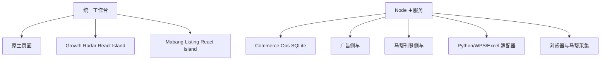
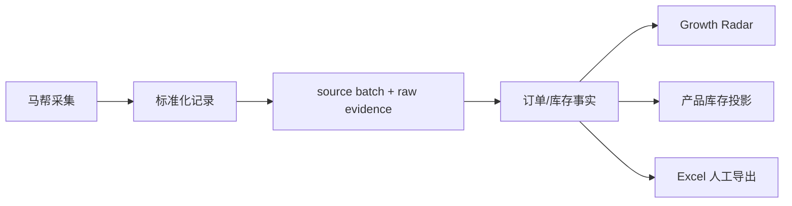

# Commerce Ops 架构复审与优化建议

日期：2026-07-27

## 结论

系统当前能力已经覆盖产品、订单、库存、图片、刊登、广告和 Growth Radar，但代码正在从单体工具快速成长为多业务平台。下一步重点不应继续堆页面，而应收敛数据真源、账号会话、任务生命周期和模块边界。

建议采用：

> 模块化主服务 + 受管本地适配器 + 单一业务数据真源 + React Island 渐进迁移

本次不建议立即微服务化，也不建议立刻引入 MinIO 或 PostgreSQL 来替代尚未收敛的业务模型。

## 当前结构

这个结构适合当前本机部署，但有四个需要尽快治理的重复面：

1. 马帮账号和登录会话。
2. 刊登草稿与发布状态。
3. Python/Node AI 网关。
4. 侧车管理、代理和任务状态。

## 数据真源

| 业务对象 | 当前应认定的唯一真源 | 其他模块的定位 |
| --- | --- | --- |
| 马帮账号 | `mabang_account_profiles` | WPS/刊登侧车只消费短期会话，不保存第二套账号主数据 |
| 订单事实 | `growth_source_batches`、`growth_order_headers`、`growth_order_lines` | Excel/WPS/定时采集只是输入适配器 |
| 库存事实 | `growth_source_batches`、`growth_inventory_snapshots` | 产品库存投影和 Growth Radar 从同一事实层读取 |
| 产品与 SKU | `product_skus`、`product_package_rows` | 马帮 SKU 只做映射，不创建第二套产品主数据 |
| 参考图片 | `product_media_assets`、`product_media_links` | COM-015 负责采集；正式图库仍由 `product_images` 管理 |
| Listing 草稿 | 目标真源应为 `product_listing_drafts` | 当前侧车 `publisher.db` 仅作为兼容存储，后续应迁移 |
| Growth Radar | `growth_analysis_runs`、指标、信号、`growth_focus_items` | 前端只读取最新成功发布结果 |
| 在线刊登状态 | 当前为马帮实时读取 | 只有明确需要趋势时才增加只读快照，不直接复制为产品事实 |

### 可以简化的数据流

自动订单、库存任务已经可以通过 `lib/mabang-data/persistence-service.mjs` 直接进入 Growth Radar 事实层。后续定时任务不需要先生成 Excel 再重新导入；Excel 保留为人工导出和审计证据。

建议统一为：

## 优先问题

### P0：上线前收敛

#### 1. 统一马帮账号与会话代理

当前主项目有加密账号配置，刊登侧车仍保留独立登录表单。建议增加后端 Account Broker：

- 浏览器只选择账号 ID。
- 主服务按需解密并向侧车签发一次性登录请求。
- 密码不进入浏览器、不写入侧车数据库、不进入日志。
- 订单、库存、图片和刊登共享登录重试、错误码和账号健康状态。

#### 2. 收敛 Listing 草稿真源

主库已有 `product_listing_drafts` 和 `product_listing_publish_records`，侧车又有 `publisher.db`。长期双写会导致草稿、版本和发布状态不一致。

建议：

- 主库负责草稿、版本、审批和发布记录。
- Python 侧车退化为马帮协议执行器。
- 发布调用使用幂等键，结果回写主库。
- 完成迁移前维持当前隔离，不做隐式双写。

#### 3. 统一任务生命周期

主项目有 scheduler，刊登侧车仍使用进程内锁和内存任务。建议建立统一任务协议：

- `queued/running/partial_success/succeeded/failed/cancelled`
- 租约、幂等键、重试次数、进度、审计 request ID
- 进程重启后可恢复或明确失败

刊登、图片全量、Growth Radar 分析和文件扫描都可使用同一任务基础设施。

#### 4. 禁止真实业务快照进入源码和前端

原项目曾把 2,246 条真实商品快照放在 `public`。本次已从集成发布资产移除。后续应在 CI 增加：

- `public` 业务快照扫描
- 店铺名、账号 ID、商品 ID 脱敏检查
- 仅允许合成 fixture 进入测试

### P1：降低维护成本

#### 5. 提取通用 Sidecar Kit

广告与马帮刊登重复实现了：

- 回环地址校验
- 内部令牌
- 子进程启动/探活/停止
- 固定目标代理
- 请求体与响应体限制

建议抽取 `lib/sidecar/manager.mjs`、`proxy.mjs`、`token.mjs`，每个业务模块只提供身份、入口和路径映射。

#### 6. 拆分巨型文件

当前主要热点：

- `server.mjs`：约 2,806 行。
- `public/app.js`：约 2,648 行。
- `mabang_listing_service.py`：约 2,912 行。
- `ListingDashboard.tsx`：约 2,271 行。
- `growth-radar-service.mjs`：约 1,299 行。

建议按业务边界拆分：

- Node：route registration、service composition、startup/shutdown。
- Python：session、query、preview、execute、publisher、HTTP handlers。
- React：platform navigation、listing table、batch editor、publisher workbench、hooks/API client。

#### 7. 统一 AI Gateway

主项目已有 `lib/ai/providers/deepseek-provider.mjs`，来源项目还有独立 `ai_service.py`。建议主服务统一负责模型、超时、审计、限流和密钥；Python 侧车只接收已经验证的结构化命令或调用内部 AI 接口。

#### 8. 前端共享运行时

当前同时存在原生页面、Ant Design/Tailwind/ECharts 和 Fluent UI。短期继续使用 Shadow DOM Island 是低风险方案；中期应共享：

- auth fetch
- 错误与空状态
- 设计 token
- 页面加载器
- 审计 request ID

不建议立即重写全部页面。

#### 9. 前端按页面懒加载

当前 Growth Radar 主包约 1.77 MB，gzip 约 572 KB；刊登 Island 约 439 KB，gzip约 127 KB。建议对图表、Publisher 和深层详情做动态导入，避免主工作台首次进入就加载全部业务代码。

### P2：规模化准备

#### 10. 统一文件与对象存储接口

WPS 导出、产品图片、马帮参考素材和 AI 图片都应使用主项目文件服务的 `storage_key`。数据量和多机部署真正出现后，再增加 MinIO/S3 provider；不要让业务表保存绝对路径。

#### 11. PostgreSQL 迁移以模块为单位

当前 SQLite 足以支撑本机部署。优先把高并发任务、审计、Growth Radar 运行结果和 Listing 发布记录做 provider contract 验证，再决定迁移顺序，避免一次性搬迁全部表。

#### 12. 可观测性

主服务 request ID 应贯穿：

- Node API
- Python 侧车
- 马帮远端请求
- 发布任务
- 主库审计

建议统一错误码、耗时、重试和外部 HTTP 状态，不记录密码、Cookie、完整 URL 查询或商品内容。

## 推荐实施顺序

### 阶段 A：不改 schema

1. 通用 Sidecar Kit。
2. 拆分 `server.mjs` 路由和 `mabang_listing_service.py` handler。
3. 共享 auth fetch、Island loader 和设计 token。
4. 主服务 AI Gateway 接管侧车 AI 调用。

### 阶段 B：需 migration 审批

1. Account Broker 与账号健康状态。
2. 把侧车 publisher 草稿迁入主库 Listing 表。
3. 统一任务表、租约和幂等模型。
4. 如运营需要历史趋势，再增加在线刊登只读快照。

### 阶段 C：规模化

1. 文件 provider 接 MinIO/S3。
2. 高频模块迁移 PostgreSQL。
3. 多实例任务调度和集中日志。

## 不建议现在做

- 不要为了“架构整洁”立即微服务化。
- 不要让订单、库存、图片和刊登各自维护账号密码。
- 不要把马帮在线刊登直接写成产品中心事实。
- 不要同时保留两套长期 Listing 草稿真源。
- 不要在业务模型未收敛前迁移全部 SQLite 或引入复杂消息队列。
