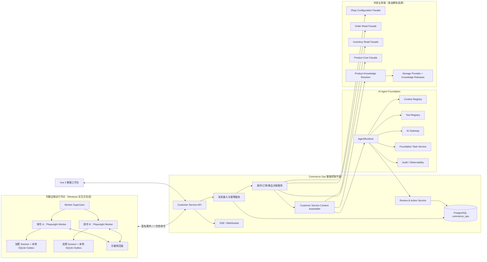
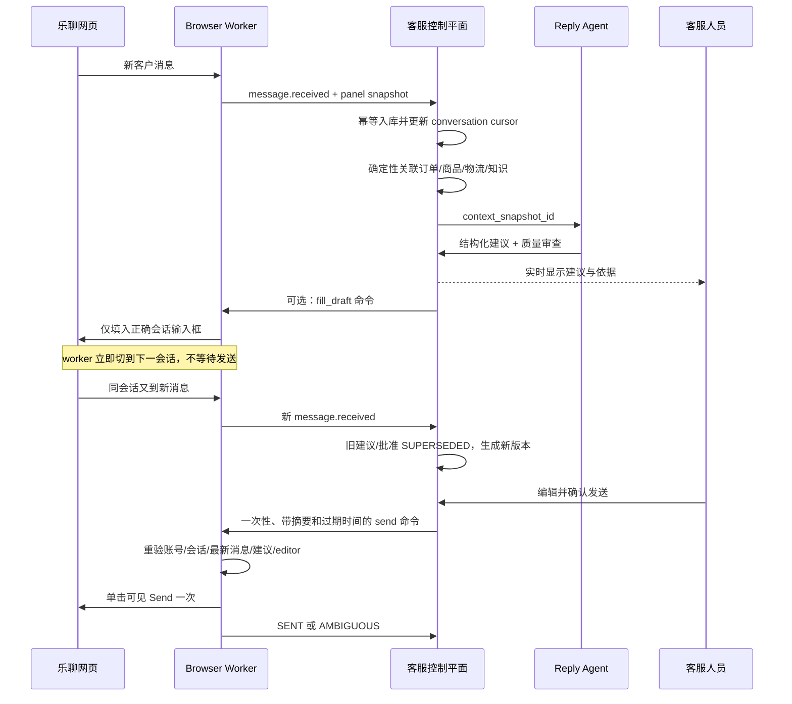

# Commerce Ops 客服智能中台 V1.1 架构设计

Status: revised proposed architecture; no production migration or deployment has been executed  
Date: 2026-08-07  
Scope: 乐聊接入、统一客服工作台、共享业务域消费、业务上下文编排、AI 回复建议、人工审核与多账号运行  
Companion architecture: `COMMERCE-OPS-PRODUCT-KNOWLEDGE-CENTER-V1.md`

## 1. 决策摘要

乐聊不应作为一套独立业务系统嵌进 Commerce Ops，也不应让一个 Playwright
脚本同时负责采集、查订单、检索知识、调用模型和发送。客服也不能复制订单、库存、店铺、
产品包或产品知识形成自己的数据孤岛。修订后的目标架构拆成四个清晰边界：

1. **乐聊边缘适配器**：Python + Playwright，仅负责登录、监听网页、采集消息与右侧面板、
   填入草稿、执行经过人工批准且可验证的单次发送动作。
2. **客服控制平面**：Commerce Ops Node.js 后端 + PostgreSQL，负责账号、店铺、会话、消息、
   关联引用、客服 Context、建议、审核、状态和审计；只拥有客服业务数据。
3. **共享业务域**：订单域、库存域、店铺配置域、Product Core 和 Product Knowledge 分别拥有
   自己的数据真源，通过稳定 Facade/Context 向客服和未来 Listing 等模块提供版本化快照。
4. **客服回复 Agent**：由 AI Agent Foundation `AgentRuntime` 创建，只能通过版本化 Context
   和 Tool 获取数据、调用 AI Gateway、产出结构化建议；Agent 不接触数据库、网络客户端、
   文件系统、Playwright 或平台凭证。

现有 `integrations/liaoliao-ai-assistant` 保留并演进为乐聊边缘适配器。其本地 SQLite
只承担断网缓存、幂等 outbox 和浏览器运行状态，不再是中央会话或建议的业务真源。

新增产品知识库归属 Product Domain，而不是客服控制平面。它向客服发布 `SUPPORT` View，向
未来上架模块发布 `LISTING` View；两个消费者共享同一 Knowledge Release，但只看到各自用途、
可见性和风险范围内的内容。

V1 的最终发送权仍属于人：默认将 AI 建议写入正确的乐聊输入框等待客服确认；中央审核页
也可以在客服明确点击“确认发送”后下发一次性命令。不存在定时自动发送、模型自行发送、
批量静默发送或歧义结果自动重试。

## 2. 业务目标与范围

### 2.1 业务目标

- 让约 300 家店铺的消息进入一个可过滤、可追踪的统一客服队列。
- 新消息到达后，不因前一条消息尚未发送而阻塞其他会话。
- 回复建议同时参考对话上下文、订单、物流、商品主数据、店铺政策和已批准知识。
- 新增产品知识成为 Product Domain 的共享资产，可被客服、Listing 和未来内容 Agent 复用。
- 客服能够看到建议依据、缺失信息和风险，而不是只看到一段不可解释的文案。
- 把人工修改、采用和驳回沉淀成受控质量反馈，不把未经确认的回答自动变成知识。
- 乐聊网页结构改变、某个账号失效或某台浏览器机器宕机时，将故障限制在对应账号。

### 2.2 V1 包含

- 多乐聊账号和多店铺映射。
- 消息、会话及乐聊右侧可见订单/物流/商品事实的实时采集。
- 通过 Product Center 的共享产品知识中心上传、解析、映射、审批、发布和检索。
- Commerce Ops 已有订单、物流、商品、店铺和平台数据的统一上下文编排。
- 两阶段 AI：回复生成 + 质量审查。
- Commerce Ops 内的客服收件箱、建议编辑器、依据侧栏和人工审核。
- 将建议填入乐聊输入框；以及可选的“中央确认后单次发送”。
- 全链路幂等、审计、运行监控、质量指标和成本指标。

### 2.3 V1 不包含

- 绕过验证码、设备验证、平台风控或乐聊权限。
- 通过猜测补齐未知订单、物流时间、退款政策或商品承诺。
- 无人工确认的自动发送。
- 让模型直接访问数据库、平台 API、浏览器、知识文件或客户隐私数据存储。
- 用 AI 模糊匹配自动绑定跨店铺订单或 SKU。
- 将乐聊 Session、Cookie、密码或令牌上传到中央业务数据库。
- 在客服域复制订单、库存、店铺配置、产品包或 `cs_product_knowledge_*` 真源表。

## 3. 总体架构



### 3.1 为什么采用“中央大脑 + 边缘浏览器”

| 关注点 | 中央控制平面 | 乐聊边缘适配器 |
| --- | --- | --- |
| 业务真源 | 只拥有客服会话、消息、关联引用、Context、建议和审核；订单/库存/店铺/产品/知识仍属于共享域 | 不承担 |
| 乐聊 Session | 不保存 | 每账号本机隔离保存 |
| 网页结构 | 不感知 CSS/DOM | 负责选择器、响应观察和页面校准 |
| 订单/商品/知识 | 统一解析和授权读取 | 不直接访问 |
| 模型调用 | 统一 AI Gateway | 不直接调用 |
| 发送 | 创建人工批准动作 | 只执行已签名、未过期、可重放防护的命令 |
| 故障域 | 可水平扩展 | 单账号隔离，失败不影响其他账号 |

## 4. 模块边界

### 4.1 Customer Service API

位于主 Node.js 服务的独立业务模块中，提供统一鉴权、租户/角色检查、分页查询、审核动作、
知识引用展示、知识问题反馈和 worker 内部接口。产品知识管理入口属于 Product Center；客服前端
不直接访问 Python worker、SQLite、乐聊页面或共享域物理表。

### 4.2 Message Ingestion Service

接收 worker 批量事件，验证账号、事件签名、序列号和消息摘要后幂等入库。一个会话可以并行
存在多个处理阶段，但同一 `conversation_id + latest_inbound_message_id` 只能有一个当前建议。
较新的客户消息会将旧建议和未执行批准标记为 `SUPERSEDED`，不会等待旧消息发送完成。

### 4.3 Identity and Business Link Service

负责把乐聊账号和会话绑定到共享域的稳定实体 ID。所有自动关联必须是确定性的；歧义进入
人工映射队列。它只保存关联引用和证据，不复制订单、库存、店铺或产品事实；也不使用 LLM
决定事实关联。

### 4.4 Shared Domain Facades and Product Knowledge Resolver

订单、库存、店铺配置和产品包分别通过 `OrderReadFacade`、`InventoryReadFacade`、
`ShopConfigurationFacade` 和 `ProductCoreFacade` 提供带 revision/observed_at/evidence 的只读快照。
客服不直接跨域 JOIN 原始表。

产品知识由共享 `ProductKnowledgeResolver` 发布。客服固定请求 `consumer_scope=CUSTOMER_SERVICE`
的 SUPPORT View；未来上架请求 LISTING View。产品知识的上传、claim、冲突、审批和 Release 详见
`COMMERCE-OPS-PRODUCT-KNOWLEDGE-CENTER-V1.md`。

### 4.5 Context Orchestrator

围绕一个“会话最新客户消息”生成不可变上下文快照，从五个共享 Facade 读取已授权快照，组合
会话、订单、库存/物流、店铺配置、产品包和 Product Knowledge SUPPORT View，保留每个事实的
来源、revision、时间和匹配状态。它是 Context Registry 的业务解析器，不拼接随意字符串，
也不成为第五套事实数据库。

### 4.6 Customer Service Reply Agent

通过 `AgentRuntime` 运行，生成结构化回复建议，再进行独立质量审查。Agent 只能读取被声明的
Context、调用被声明的 Tool，并把结果写入受控建议服务；它没有发送 Tool。

### 4.7 Review and Action Service

负责人工编辑、采用、驳回、重新生成、批准和动作状态。发送动作必须绑定建议版本、最新客户
消息摘要、目标会话、目标账号和过期时间，任何一项变化都使动作失效。

### 4.8 LiaoLiao Browser Worker

现有 Python/Playwright 工具演进为 worker，继续复用已验证的登录、响应观察、DOM 回退、
右侧面板采集、编辑器保护和发送后验证。worker 不需要能连接 PostgreSQL。

## 5. 统一身份与业务链接

### 5.1 账号和店铺层级

```text
Worker Node
  └─ LiaoLiao Account（一个独立登录 Session）
       ├─ LiaoLiao Store External ID
       │    └─ Commerce Shop Registry ID
       └─ Conversation
            └─ External Customer Reference（仅限该店铺作用域）
```

- 独立乐聊登录账号是浏览器隔离和调度单位，不等于店铺。
- 乐聊店铺必须显式绑定 `commerce_shop_registry.id`。
- 同名店铺不能自动跨平台、跨国家合并。
- 未确认店铺只能采集和展示消息，不能自动关联订单或执行发送动作。

### 5.2 订单关联优先级

自动确认只允许以下证据链：

1. 同一 Commerce Shop 下，乐聊面板出现的完整平台订单号精确匹配平台 Gateway 或马帮订单；
2. 同一店铺、同一平台下，乐聊返回的稳定 provider order ID 精确匹配；
3. 已由人工确认并仍有效的 conversation-to-order 绑定。

客户昵称、姓名片段、地址、商品名或时间接近只能生成候选，不能自动成为订单事实。多个候选时
状态为 `AMBIGUOUS`；没有证据时为 `UNRESOLVED`。模型必须明确知道“未找到/存在歧义”，不能
收到一个猜测订单。

### 5.3 商品关联优先级

```text
订单行 platform SKU
  -> product_identity_mappings（同平台 + 同国家 + 已确认）
  -> product_skus / Product Center
  -> product_package_rows 最新有效产品包事实
  -> Product Knowledge Center 已发布的 SUPPORT View
```

乐聊面板中只出现商品名或截断 SKU 时，先产生候选。只有精确 country/SKU 映射或人工确认后，
才能把产品参数作为确定事实提供给模型。

### 5.4 物流事实

物流上下文允许多个来源并存：

- 平台 Connector / Mabang 可读到的结构化状态；
- 乐聊右侧面板在某一时刻显示的订单和轨迹；
- 客户在聊天中的陈述。

前两者是带时间戳的业务观察，客户陈述只是会话主张。冲突时不静默覆盖，而是在快照中记录
`CONFLICT` 并要求回复使用审慎表达或转人工。预计送达日期、退款到账日期等高风险事实，只有
权威来源明确给出时才能引用。

### 5.5 数据源职责矩阵

| 信息 | 首选来源 | 次级/观察来源 | 关键限制 |
| --- | --- | --- | --- |
| 乐聊账号和会话 | Playwright 观察到的乐聊稳定 ID | DOM 可见内容 | Session 只留在 worker 本机 |
| 店铺身份 | `commerce_shop_registry` | 乐聊显示店铺名仅用于待确认候选 | 未确认映射不能查订单或发送 |
| 订单事实 | 马帮订单、已激活的平台 Gateway | 乐聊右侧订单面板快照 | 必须同店铺、订单号精确匹配 |
| 物流轨迹 | 已激活的平台/ERP 结构化来源 | 乐聊右侧物流面板快照 | 必须展示来源时间；冲突不覆盖 |
| 库存事实 | `growth_inventory_snapshots` 或受控实时库存 Read Facade | 无 | 是否对客户披露由店铺配置决定 |
| 商品主数据 | Product Center、`product_package_rows` | 乐聊商品卡片 | 商品卡片不能覆盖批准的产品主数据 |
| SKU 映射 | `product_identity_mappings` 的 confirmed/manual 记录 | 精确 country/SKU 候选 | 模糊商品名不能自动确认 |
| 店铺配置/服务政策 | 现有 Shop Configuration Facade 的已批准版本 | 无 | 客服只读；缺失时保持未知 |
| 产品/品类知识 | Product Knowledge Center 已发布 Release 的 SUPPORT View | 无 | 必须满足用途、可见性、范围和生效时间 |
| 客户诉求 | 当前会话客户消息 | 历史会话摘要 | 是客户主张，不自动升级为业务事实 |
| 客服表达示例 | 客服域已采用、匿名化、审批后的 Playbook 示例 | 普通历史建议 | 只帮助表达，不成为产品知识或事实 |

现有平台 Gateway 的通用订单读取会排除买家 PII，因此自动订单关联不能依赖客户姓名；乐聊
面板中的稳定订单号/provider order ID 是最重要的连接键。若某个平台当前没有足够的订单或物流
读取能力，Context 必须显示来源不足，而不是降级为跨客户的昵称匹配。

## 6. 共享知识与客服 Playbook

### 6.1 三种内容必须分开治理

| 内容 | 所属域 | 客服使用方式 | 其他消费者 |
| --- | --- | --- | --- |
| 产品/品类知识、规格、兼容性、安装、安全、FAQ | Product Knowledge | 只读 SUPPORT View | Listing、营销、运营检索 |
| 店铺/平台配置、补偿权限、工作时间、披露规则 | Shop Configuration / Policy | 只读有效配置快照 | Listing、履约、价格等模块 |
| 客服语气、升级人工、意图 SOP、匿名回复示例 | Customer Service Playbook | 客服域自己维护 | 默认不提供给 Listing |

客服中心不再提供产品知识上传和发布入口。产品知识在 Product Center 管理，经 claim 抽取、
产品包冲突检查、绑定、审批后形成不可变 Knowledge Release。客服只通过
`ProductKnowledgeResolver` 请求 `CUSTOMER_SERVICE`/`SUPPORT` View。

### 6.2 SUPPORT View 规则

- 先按 product SKU/model/category、国家、语言、有效时间和 customer-service scope 过滤；
- 返回结构化 claim、原文 passage、Release、source section 和证据；
- 精确 SKU > model > category；产品包已有字段仍以 Product Core 为准；
- `SAFETY_WARNING` 和 `PROHIBITED_CLAIM` 不得被相似度排序或 token 裁剪丢弃；
- Internal-only 排障资料可供 Agent 判断，但不得自动写进客户回复；
- Draft、未审批、已失效或 LISTING-only 内容永远不能进入客服 Context。

### 6.3 客服反馈不能直接修改产品知识

客服可提交“资料缺失、内容错误、客户频繁追问、建议新增 FAQ”等反馈，写入共享
`product_knowledge_usage_feedback`。产品知识负责人审核后才能创建新 claim/version/Release。
同理，人工采用的客服回复只能成为客服表达示例；其中出现的产品事实不能自动反哺产品知识。

### 6.4 事实优先级

1. 当前订单、物流和库存的权威实时事实；
2. Product Core 当前产品包事实和已批准人工覆盖；
3. Product Knowledge 当前有效的精确 SKU/model SUPPORT claim；
4. 当前有效的店铺/平台配置和客服 Playbook；
5. 已批准的品类 claim 和匿名表达示例；
6. 客户陈述和模型常识只帮助理解，不覆盖业务事实。

完整 Product Knowledge 数据模型、消费者视图、Release 和未来 Listing 复用契约见
`COMMERCE-OPS-PRODUCT-KNOWLEDGE-CENTER-V1.md`。

## 7. Context Contract

每次生成都绑定不可变的 `context_snapshot_id`。建议的最小结构如下：

```json
{
  "subject": {
    "account_id": "...",
    "shop_id": "...",
    "conversation_id": "...",
    "latest_inbound_message_id": "..."
  },
  "conversation": {
    "language": "vi",
    "recent_turns": [],
    "summary": null
  },
  "shop_configuration": {
    "revision": "...",
    "service_policy_ref": "...",
    "facts": []
  },
  "order": {
    "match_state": "CONFIRMED|AMBIGUOUS|UNRESOLVED",
    "order_ref": null,
    "facts": []
  },
  "logistics": {
    "state": "AVAILABLE|CONFLICT|UNAVAILABLE",
    "facts": []
  },
  "inventory": {
    "state": "AVAILABLE|STALE|UNAVAILABLE",
    "disclosure_policy": "...",
    "facts": []
  },
  "products": {
    "product_revisions": [],
    "product_package_digests": [],
    "items": []
  },
  "product_knowledge": {
    "consumer_view": "SUPPORT",
    "release_ids": [],
    "claims": [],
    "passages": [],
    "mandatory_warnings": []
  },
  "customer_service_playbook": [],
  "data_quality": {
    "missing": [],
    "conflicts": [],
    "stale": []
  }
}
```

每个事实至少携带：

```text
value
source_type
source_entity_id
source_revision_or_release
observed_at
freshness_state
match_state
evidence_ref
```

不得用一个未经定义的“AI 置信度”代替确定性匹配状态。Agent Task 和通用 Audit 只记录 Context
引用、摘要和 digest，不记录客户原文、完整 Context、模型原始响应或订单隐私。受限业务表可以
保存加密后的必要消息和上下文快照，以便客服展示与结果复现。

### 7.1 默认上下文预算

为控制延迟和 token 成本，建议初始预算如下，并由 AI Gateway policy 配置而非写死在 Agent：

- 最近 20 个对话 turn；更早内容使用有证据的会话摘要；
- 一个已确认订单及其当前订单行和物流；只有意图需要时才读取库存快照；
- 最多 5 个关联商品；
- 最多 8 个 Product Knowledge passage/claim，并保留 Release；店铺配置和风险规则单独保留；
- 总输入软上限约 12k tokens，回复建议上限约 400 tokens；
- 任何裁剪都保留最新客户消息、风险规则、数据缺失和来源引用。

## 8. Agent 与模型契约

### 8.1 Agent 定义

建议注册：

```text
customer-service.reply-assistant@1.0.0
```

声明的 Context：

- `customer-service.conversation@1.0.0`
- `commerce.order@1.0.0`
- `commerce.inventory@1.0.0`
- `shop.configuration@1.0.0`
- `product.core@1.0.0`
- `product.knowledge@1.0.0`（固定 consumer scope 为 CUSTOMER_SERVICE）
- `customer-service.playbook@1.0.0`
- `customer-service.reply-feedback@1.0.0`

声明的只读/受控 Tool：

- `context.resolve@现有 Foundation 精确版本`
- `ai.gateway.complete@现有 Foundation 精确版本`
- `customer-service.suggestion.persist@1.0.0`
- Foundation task create/lease/transition 工具的现有精确版本

Agent 不声明 browser、send、database、filesystem 或 provider HTTP Tool。订单、商品或平台数据
若经外部 Connector 读取，只能由 Context resolver 通过 Commerce API Gateway 的
`external_access: gateway_only` 工具完成。

### 8.2 模型路由

不在业务代码中硬编码某个供应商模型。AI Gateway 配置两个独立用途：

- `customer_service.reply_generation`：主回复生成；
- `customer_service.reply_quality_review`：事实一致性、政策、语言和风险审查。

下一条消息到达时，调用的是 Gateway 当前已启用且适用该用途/语言/风险等级的模型版本。
每条建议必须保存 model route、resolved model、prompt version、knowledge snapshot、token usage、
latency 和 review result，便于比较模型质量与成本。模型切换通过版本化 policy 灰度，不修改
乐聊 worker。

### 8.3 结构化输出

```json
{
  "reply_text": "...",
  "reply_language": "vi",
  "intent": "LOGISTICS_DELAY",
  "readiness": "READY|NEEDS_REVIEW|BLOCKED",
  "risk_flags": [],
  "facts_used": [],
  "evidence_refs": [],
  "missing_facts": [],
  "internal_chinese_summary": "..."
}
```

质量审查输出 `PASS`、`REVISE` 或 `BLOCK`。出现下列情况必须 `BLOCK` 或强制人工改写：

- 订单、商品或客户身份关联歧义；
- 建议包含来源未支持的退款、补偿、保修、送达日期或价格承诺；
- 知识冲突、过期或没有适用政策；
- 语言明显错误、包含敏感信息、要求客户提供不必要隐私；
- 建议与最新客户消息或会话状态不一致。

## 9. 消息处理与并发状态机



关键并发规则：

- 调度单位是 `conversation + latest inbound message`，不是一个全局串行队列。
- 同账号 DOM 操作必须串行，但生成任务可在中央并发；填完一个草稿立即处理下一会话。
- 不同账号各自 worker，可并行采集和填入。
- 同一会话较新消息使旧版本失效；其他会话不受影响。
- `AMBIGUOUS` 发送结果绝不自动重试，必须人工核对乐聊消息记录。

## 10. PostgreSQL 逻辑数据模型

以下是逻辑表建议，不代表已授权创建迁移。正式 SQL 需单独备份、评审和用户确认。

### 10.1 连接与运行

| 表 | 作用 |
| --- | --- |
| `cs_channel_accounts` | 乐聊登录账号的非秘密元数据和 Foundation account 关联 |
| `cs_channel_shop_bindings` | 乐聊 store ID 到 `commerce_shop_registry.id` 的确认映射 |
| `cs_worker_nodes` | 运行节点、容量、版本、心跳、健康状态 |
| `cs_browser_sessions` | Session 位置标识、状态、最后验证时间；不保存 Cookie |
| `cs_worker_commands` | 离线可恢复的一次性 fill/send/refresh 命令邮箱 |

### 10.2 会话与消息

| 表 | 作用 |
| --- | --- |
| `cs_conversations` | 账号/店铺作用域内的乐聊会话和最新游标 |
| `cs_messages` | 入站/出站消息、provider ID、时间、加密内容、去重摘要 |
| `cs_message_observations` | 同一消息的采集来源和可追溯事件 |
| `cs_conversation_order_links` | 已确认/候选/歧义的会话订单关联 |
| `cs_panel_snapshots` | 乐聊右侧面板的加密原始观察和解析版本 |

### 10.3 客服域自己的 Playbook

| 表 | 作用 |
| --- | --- |
| `cs_playbooks` | 客服意图、语气、升级人工和响应流程的稳定身份 |
| `cs_playbook_versions` | 客服专属规则、示例、审批和生效版本 |
| `cs_playbook_shop_bindings` | Playbook 到店铺/平台/国家/语言的适用范围 |

产品知识使用共享 `product_knowledge_*` 表；店铺配置/政策继续属于 Shop Configuration；订单、
库存和产品包继续使用现有真源。客服表只保存这些上游对象的稳定 ID、revision/release、digest
和生成时快照，不创建副本真源。

### 10.4 生成、审核和反馈

| 表 | 作用 |
| --- | --- |
| `cs_context_snapshots` | 不可变 Context、五个上游 revision/release 引用、加密 payload、digest 和数据质量 |
| `cs_suggestions` | 版本化建议、模型路由、风险、质量结果和当前状态 |
| `cs_suggestion_evidence` | 建议使用的事实/知识 evidence refs |
| `cs_suggestion_reviews` | 编辑、采用、驳回、原因和人工差异摘要 |
| `cs_send_actions` | 人工批准动作、版本摘要、过期、执行结果 |
| `cs_reply_feedback` | 匿名化后的采用/修改模式和质量标签 |

业务表通过 Repository/Database Provider 访问。通用运行、Tool 调用和权限事件继续进入既有
Foundation Task、Audit 和 Agent Observability，不再复制一套 Agent 生命周期表。

## 11. API 与事件契约

### 11.1 前端 API

```text
GET    /api/customer-service/inbox
GET    /api/customer-service/conversations/:id
GET    /api/customer-service/conversations/:id/context
POST   /api/customer-service/suggestions/:id/regenerate
PATCH  /api/customer-service/suggestions/:id/draft
POST   /api/customer-service/suggestions/:id/adopt
POST   /api/customer-service/suggestions/:id/reject
POST   /api/customer-service/suggestions/:id/approve-send

GET    /api/customer-service/playbooks
POST   /api/customer-service/playbooks/:id/versions
POST   /api/customer-service/playbook-versions/:id/approve
POST   /api/customer-service/knowledge-feedback

GET    /api/customer-service/accounts
GET    /api/customer-service/workers
POST   /api/customer-service/channel-shop-bindings/:id/confirm
```

产品知识上传、映射、审批、发布和冲突处理统一使用 `/api/product-center/knowledge/*`；客服 API
只读取已发布 SUPPORT View 和提交反馈，不提供第二套产品知识管理入口。

### 11.2 Worker 内部 API

```text
POST /api/internal/customer-service/workers/register
POST /api/internal/customer-service/workers/heartbeat
POST /api/internal/customer-service/events/batch
GET  /api/internal/customer-service/commands/pull
POST /api/internal/customer-service/commands/:id/result
```

worker 使用独立节点身份、短期签名凭据、严格账号 allowlist 和单调事件序列。命令包含
`command_id`、`account_id`、`conversation_id`、`latest_message_digest`、`suggestion_digest`、
`expires_at` 和 `nonce`。一个命令只能产生一次终态结果。

### 11.3 领域事件

```text
cs.message.received.v1
cs.conversation.changed.v1
cs.context.snapshot-ready.v1
cs.suggestion.ready.v1
cs.suggestion.superseded.v1
cs.review.approved.v1
cs.send.requested.v1
cs.send.completed.v1
cs.send.ambiguous.v1
cs.playbook.activated.v1
product.knowledge.released.v1
product.knowledge.retired.v1
product.core.revision-changed.v1
```

V1 可用 PostgreSQL transactional outbox + 进程内事件消费者实现，不要求立即引入 Kafka。
当单机事件吞吐、跨服务部署或重放需求超过现有能力时，再替换消息基础设施而不改变事件契约。

## 12. Commerce Ops 前端

主前端使用现有 Vue 3/TypeScript/Pinia/Element Plus，新增“客服中心”一级模块：

### 12.1 统一收件箱

- 左侧：账号、平台、国家、店铺、风险、意图、未处理/待审核/已完成过滤；
- 中间：完整会话、消息状态、草稿和人工编辑；
- 右侧：订单、物流、商品、适用政策、知识引用、更新时间和冲突；
- 顶部：worker 在线状态、Session 失效、积压和生成延迟；
- 每条建议显示 `READY / NEEDS_REVIEW / BLOCKED`，不能只用一个分数掩盖原因。

### 12.2 Product Center 中的共享知识中心

- 上传、解析预览、claim 抽取、产品/型号/SKU/品类范围绑定；
- 与产品包差异、消费者用途、可见性、审批、Release 和失效管理；
- 客服 SUPPORT 与 Listing View 的并排预览，证明同一知识按用途隔离；
- 无绑定、产品包冲突、解析失败、过期知识的待办列表；
- 检索测试台：选择消费者和产品后查看实际 claim、passage、Release 与证据。

客服中心只展示本次回复使用的 Product Knowledge Release，并提供“报告知识问题”。产品知识
编辑、审批和发布全部回到 Product Center，避免客服模块成为第二个产品中心。

### 12.3 运行中心

- 账号/店铺映射、Session 状态、最后采集时间；
- 每账号消息积压、失败 DOM 操作、选择器版本、最近截图证据；
- 可对单个账号暂停填入/发送，采集和中央审核仍可独立控制；
- 重新登录只能在对应 worker 节点的可见浏览器中进行。

## 13. 多账号运行和容量

### 13.1 隔离原则

- 一个独立乐聊登录账号对应一个 Playwright browser context 和一个本地数据目录。
- 不同账号不能共享 storage state、Cookie、IndexedDB、SQLite 或编辑器状态。
- Worker Supervisor 只负责启动、心跳、拉起和容量，不读账号凭证。
- Session 文件使用当前 Windows 用户 ACL 和应用层加密；中央只知道 session reference/status。
- 同一账号只允许一个 active lease，防止两台 worker 同时操作同一网页会话。

### 13.2 扩展方式

300 家店铺不等于 300 个浏览器，容量由“独立乐聊登录账号数量”和“单账号消息量”决定。
先以两个账号做容量基线，测量每个账号的内存、CPU、页面响应率和消息延迟，再为节点设置硬上限。
当前实测一个可见浏览器 worker 约占较高内存，因此不预设单机可以承载所有账号；超过单机上限时，
增加 Windows worker 节点即可，中央 API 和 PostgreSQL 不变。

### 13.3 故障恢复

- worker 离线：中央显示账号离线，保留消息/建议；不下发发送，恢复后按游标补采；
- 乐聊 Session 失效：标记 `LOGIN_REQUIRED`，只暂停该账号；
- DOM 选择器失效：响应观察仍可采集时降级为只读；填入/发送 fail closed；
- 中央暂时不可达：worker 把采集事件写入 SQLite outbox，恢复后按事件 ID 重放；
- 发送结果不确定：状态 `AMBIGUOUS`，不自动重试；
- 新版本部署：按 worker 节点滚动升级，每次只影响一个账号故障域。

## 14. 安全、权限与隐私

- RBAC 至少区分客服、客服主管、知识编辑、知识审批、账号运维和审计只读。
- 客服只能看到被授权店铺；跨店铺订单和客户消息不可搜索或关联。
- 客户消息、客户显示名、面板原文、Context payload 和建议正文使用应用层加密或受控加密存储；
  去重、查询和关联使用不含原文的稳定摘要/内部 ID。
- 日志和 Audit 仅保存 ID、digest、状态、错误码、耗时、token 数和模型路由；不记录客户原文、
  地址、电话、Cookie、token、prompt 或模型原始输出。
- 知识上传先经过大小/MIME/校验和检查和现有文件隔离边界；解析器不能获得数据库凭证。
- 客户消息和 Context 设置可配置保留期，过期后删除或匿名化；匿名反馈不得保留可逆客户身份。
- 发送动作必须有 CSRF 防护、当前用户身份、作用域权限、二次版本检查和完整审计。

## 15. 可观测性与质量运营

### 15.1 运行指标

- `message_ingest_lag_seconds`
- `conversation_backlog_count`
- `suggestion_generation_latency_seconds`
- `worker_heartbeat_age_seconds`
- `session_login_required_count`
- `dom_action_failure_rate`
- `send_ambiguous_count`
- `context_unresolved_order_rate`
- `knowledge_retrieval_empty_rate`
- 每个模型 route 的输入/输出 token、费用和错误率

### 15.2 质量指标

- 原样采用率；
- 小改采用率与编辑距离；
- 驳回率和原因；
- 事实错误率；
- 语言错误率；
- 因缺少订单/物流/知识而阻塞的比例；
- 各品类、店铺、平台、意图的质量差异；
- 回复后客户是否继续追问同一问题（辅助指标，不直接等于质量）。

优先优化“事实错误率”和“高风险承诺”，其次才是原样采用率。不能通过让文案更笃定来人为
提升采用率。

## 16. SLO 与验收门槛

初始目标值是设计基线，需在真实账号试点后校准：

| 项目 | V1 目标 |
| --- | --- |
| 可观察新消息进入中央收件箱 | p95 ≤ 10 秒 |
| Context + 建议可用 | p95 ≤ 25 秒 |
| worker 心跳间隔 | ≤ 15 秒 |
| 未经人工确认的发送 | 0 |
| 跨店铺自动误关联订单 | 0 |
| 歧义发送自动重试 | 0 |
| 未批准知识进入模型 | 0 |
| 新消息到达后旧批准仍可发送 | 0 |

上线门槛：

1. 两个独立账号连续运行，任一账号重登/崩溃不影响另一个账号；
2. 至少 100 条回放消息全部幂等，无重复建议和跨会话草稿；
3. 订单/SKU 人工标注集上的确定性关联无跨店铺错误；
4. 对物流、退款、补偿和兼容性高风险样本完成红队测试；
5. 知识版本可追溯，历史建议可以复现其当时使用的文档版本；
6. 所有发送测试使用测试会话或明确批准，生产默认发送开关关闭；
7. 备份、迁移、回滚、权限和运行监控通过独立验收。

## 17. 分阶段实施方案

### Phase 0：契约和安全基线

- 固化本文、Context schema、Agent definition、事件和 API schema；
- 确认独立乐聊账号数量及账号到店铺映射；
- 完成生产迁移设计、备份和回滚检查；
- 不修改生产数据库，不执行发送。

**出口**：架构、数据字典、权限矩阵和迁移方案获批准。

### Phase 1：中央只读客服收件箱

- 将现有 Playwright 工具改为边缘 worker；
- 增加账号/worker 注册、事件 outbox 和中央幂等接入；
- 在 Vue 中展示多账号会话、消息和采集健康；
- SQLite 历史数据只做一次性可审计导入，不长期双写业务真源。

**出口**：两账号实时采集、断线重放、去重和只读 UI 通过。

### Phase 2：Product Center 共享产品知识中心

- 在 Product Domain 接入 Storage Provider、文档版本、section、claim、映射、审批和 Release；
- 建立 Product Core 冲突检查，完成产品/SKU/model/品类/国家/语言和 consumer scope 绑定；
- 同时提供 SUPPORT 与 LISTING View 预览，不在客服域创建知识表；
- 建立检索测试台和过期/冲突检查。

**出口**：只有已发布 Release 可被消费，每个 claim/passage 可回到文件版本和 section；客服与
Listing 使用同一 Release 的不同 View。

### Phase 3：业务链接和 Context Orchestrator

- 接通 Order、Inventory、Shop Configuration、Product Core 和 Product Knowledge 五个 Facade；
- 实现确定性订单/SKU 关联和人工歧义处理；
- 注册版本化 Context，保存五类上游 revision/release、不可变快照和 evidence refs。

**出口**：同一会话能稳定展示订单、物流、商品和知识依据，未知保持未知。

### Phase 4：Reply Agent 和中央审核

- 通过 `AgentRuntime` 注册 Reply Agent；
- 接入生成、质量审查、结构化建议、实时收件箱和反馈；
- 新消息自动使旧建议/批准失效。

**出口**：质量回放、token/成本、审计和多语言样本通过；仍不自动发送。

### Phase 5：受控填入与人工确认发送

- 中央建议可下发 `fill_draft`，worker 填入后立即处理下一会话；
- 可选启用中央“确认发送”，执行前重验最新消息、建议摘要、会话和编辑器；
- 建立 `AMBIGUOUS` 人工核对流程。

**出口**：不存在无确认发送、重复发送和跨会话发送，所有结果可审计。

### Phase 6：规模化与持续质量

- 增加 worker 节点、账号租约和容量调度；
- 按品类/店铺/语言做质量看板和模型灰度；
- 将人工采用回复匿名化后进入客服 Playbook 候选；产品事实问题只提交 Product Knowledge 反馈；
- 只有在独立业务审批后，才评估低风险场景的更高自动化等级。

## 18. 推荐的首个可交付切片

不要同时一次性打通所有平台和全部知识。首个部署切片建议选择：

- 2 个独立乐聊账号；
- 10–20 家店铺；
- 1 个主要品类；
- 3 个高频意图：物流查询、产品咨询、售后规则；
- 乐聊右侧订单面板 + 现有订单/库存/店铺配置 + Product Core + Product Knowledge SUPPORT View；
- 仅生成、中央审核和填入草稿，不启用中央发送。

这个切片足以验证最难的身份关联、上下文质量、多账号隔离和知识命中，再按数据证明扩展到
300 家店铺。

## 19. 实施前需要确认的输入

这些信息不阻塞架构，但在 Phase 0 结束前必须落表：

1. 独立乐聊登录账号数量，以及每个账号下的店铺清单；
2. 账号运行机器是否长期保持 Windows 用户登录和可见浏览器；
3. 首批知识文件格式、语言、品类、产品/SKU 和政策负责人；
4. 各平台订单/物流的当前可用来源及更新频率；
5. 客服、主管、知识审批人的店铺权限范围；
6. 客户消息、建议和匿名反馈的正式保留期；
7. V1 是否只采用“填入乐聊等待点击”，还是同时启用“中央确认后单次发送”。

## 20. 最终架构原则

- 乐聊是渠道，不是业务真源；浏览器是适配器，不是中央大脑。
- 客服只拥有客服数据；订单、库存、店铺、产品包和产品知识保持全系统唯一真源。
- 产品知识属于 Product Domain，以 Release 和 Consumer View 同时服务客服与未来 Listing。
- 跨域读取通过稳定 Facade/Context，不让 Agent 或客服 Repository 直接 JOIN 上游物理表。
- 事实关联必须确定、同店铺、可解释；歧义不交给模型猜。
- 知识必须有范围、版本、审批、生效时间和证据引用。
- 每条建议绑定最新消息和不可变 Context；新消息使旧批准失效。
- Agent 只通过 AgentRuntime、Context Registry、Tool Registry 和 AI Gateway 运行。
- AI 生成文案，人决定发送；任何不确定发送都 fail closed。
- 用采用反馈持续提升质量，但人工回复不会未经审批自动升级为政策。
