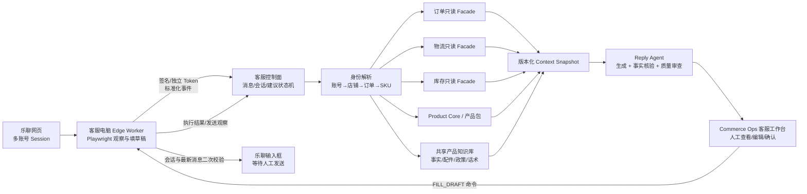

# Commerce Ops 客服中心完整链接与实施计划

状态：实施中  
版本：1.1  
日期：2026-08-08  
上位架构：[COMMERCE-OPS-CUSTOMER-SERVICE-AI-CENTER-V1.md](./COMMERCE-OPS-CUSTOMER-SERVICE-AI-CENTER-V1.md)

## 1. 最终交付结果

在 Commerce Ops 主系统内提供统一客服中心。客服电脑上的 Playwright 工作节点保持乐聊登录态，持续观察多账号新消息；中央系统按会话独立排队，确定性关联店铺、订单、物流、商品、库存、店铺政策和共享产品知识库，通过受控 Reply Agent 生成回复草稿，再命令对应浏览器节点把草稿填入正确乐聊会话的输入框。任何发送动作都必须由真人在乐聊页面或系统审核页明确确认。

系统不把乐聊当成订单、库存或产品事实的主数据源；它只负责消息观察和浏览器草稿执行。订单、库存、店铺、产品包和知识库仍由各自领域拥有。

## 2. 当前真实状态

| 链路 | 当前状态 | 已有资产 | 仍缺内容 |
|---|---|---|---|
| 乐聊网页观察 | 可运行 | `integrations/liaoliao-ai-assistant`，Playwright、Session、本地 SQLite、输入框填充、多账号 Fleet 进程监督 | 真实账号选择器持续验收、客服电脑容量实测 |
| 中央消息控制面 | 代码已落地，未迁移生产库 | migration 033、内部 worker API、消息去重、会话独立排队、加密存储 | 生产迁移审批、密钥配置、运行监控 |
| Commerce Ops 客服页面 | 代码已落地 | 会话队列、消息详情、建议编辑/接受/拒绝/填框、业务 Context、证据区、标记已处理、账户三阶段灰度 | 真实账号和真实业务数据验收 |
| 浏览器到主系统 | 可选桥接已落地 | 确定性事件 ID、注册、批量上报、失败开放 | 在目标客服电脑配置账号 ID 和 worker token 后实机验证 |
| 共享产品知识库 | 首批标准化及治理代码完成，尚未导入生产表 | 18,463 主数据候选、3,241 产品事实、4,724 配件、91 政策、172 话术；审核/发布工作台；四类发布成员表 | 业务逐条审核、943 个冲突裁决、160 条钉钉正文补齐、首批 Release 决策 |
| 订单/物流/商品/库存上下文 | 代码已接入，待真实数据验收 | 客服只读 Facade、确定性身份解析、Context Snapshot、平台网关权威物流、缺失/时效标识 | Lazada/Shopee 真实样本匹配与限流验收 |
| Reply Agent | 代码已接入，待模型与金标集验收 | `AgentRuntime`、AI Gateway、Context Contract、Prompt、质量门禁、独立生成 runner | 模型凭据、金标集和质量阈值确认 |
| 草稿回填 | 中央与边缘命令链已完成，待实机验收 | `FILL_DRAFT`、会话/消息/路由/编辑器二次校验、只填不发、结果回执、人工发送后的出站观察精确归因 | 真实乐聊账号选择器验收和账号级灰度 |

## 3. 完整链接图



## 4. 数据所有权和链接规则

### 4.1 领域所有权

| 数据 | 权威来源 | 客服模块的权限 | 禁止事项 |
|---|---|---|---|
| 乐聊消息与页面快照 | 客服控制面 | 创建、加密保存、审计 | 不写回业务主表 |
| 店铺身份与配置 | 店铺配置/`commerce_shop_registry` | 只读；人工确认映射 | 不凭店铺名称强行合并 |
| 订单 | 现有订单表/订单 Facade | 只读、按店铺和平台订单号确定性查询 | 不由模型改订单 |
| 物流 | 订单物流/平台 Connector | 只读、携带更新时间和来源 | 不把模型推断当轨迹 |
| 库存 | 现有库存表 | 只读、显示仓库与更新时间 | 不承诺未确认库存 |
| 产品与产品包 | Product Core、产品包数据库 | 只读；SKU/型号交叉映射 | 不把知识库候选覆盖主数据 |
| 产品知识 | 新增共享知识领域 | 版本化发布、检索、冲突审核 | 未发布候选不得用于承诺 |
| 回复建议 | 客服模块 | 创建、审查、版本化、反馈 | 不视为已发送消息 |
| 发送动作 | 真人 + 乐聊网页 | 观察、审计 | 第一阶段禁止无人值守发送 |

### 4.2 确定性匹配顺序

1. 乐聊账号 ID → `cs_channel_accounts`。
2. 乐聊店铺外部标识摘要 → `cs_channel_shop_bindings`。
3. 已确认绑定 → `commerce_shop_registry.id`；名称相似只进入 `REVIEW_REQUIRED`。
4. 页面订单号 + 已确认店铺 → 订单 Facade；多条命中或跨店铺冲突时停止自动生成承诺型回复。
5. 订单行 seller SKU → 产品 SKU 精确映射；失败时再用产品包的已确认型号交叉映射。
6. 产品知识按 `product_model_id/product_sku_id + country_code + knowledge_release_id` 获取；国家专属内容覆盖全球内容。
7. 每个证据都写入来源 ID、来源版本、抓取/同步时间和完整性；模型输出保留证据引用。

禁止仅凭客户昵称、商品标题或模糊文本自动绑定订单与 SKU。

## 5. 并发和状态机

队列单位是“会话的最新入站消息”，不是全局单任务。

1. A 会话收到消息 A1：创建建议任务 A1=`QUEUED`。
2. B 会话同时收到 B1：立即创建 B1=`QUEUED`，不等待 A1。
3. A1 生成期间又收到 A2：A1 变 `STALE`，取消 A1 的待执行填草稿命令，A2 独立入队。
4. B1 的生成、审核或回填不受 A2 影响。
5. 回填前 Edge Worker 必须重新确认账号、会话、客户和最新入站消息；任一不一致即拒绝执行。
6. 已经填入但未发送的草稿若遇到新入站消息，系统标记“需重新生成”，不得自动覆盖客服正在编辑的非空草稿。

建议状态：`QUEUED → GENERATING → READY → FILLED`；分支为 `FAILED`、`STALE`、`REJECTED`、`EDITED`、`ACCEPTED`。  
命令状态：`PENDING → LEASED → SUCCEEDED/FAILED`；新消息可将旧命令置为 `CANCELED`。

## 6. 接口契约

### 6.1 Edge Worker 内部接口

所有接口位于 `/api/internal/customer-service`，使用独立 `CUSTOMER_SERVICE_WORKER_TOKEN` 和 `x-cs-worker-id`，不得复用网页访问 Token。

| 方法 | 路径 | 用途 |
|---|---|---|
| POST | `/workers/register` | 注册版本、能力和节点元数据 |
| POST | `/workers/heartbeat` | 上报在线状态、打开账号数、队列深度和安全错误码 |
| POST | `/events/batch` | 批量上报消息观察事件；事件和消息两层幂等 |
| GET | `/commands/pull` | 短租约拉取对应节点命令 |
| POST | `/commands/:id/result` | 回报会话校验、编辑器匹配和执行结果 |

生产加固阶段将从共享 Token 升级为每节点密钥 + 时间戳 HMAC，加入防重放窗口和密钥轮换。

### 6.2 主系统客服接口

| 方法 | 路径 | 用途 | 当前状态 |
|---|---|---|---|
| GET | `/api/customer-service/status` | 模块、节点和队列健康 | 已实现 |
| GET/POST | `/accounts` | 查询/创建乐聊账号记录 | 已实现 |
| GET | `/inbox` | 按账号和状态获取会话 | 已实现 |
| GET | `/conversations/:id` | 消息、建议、证据详情 | 已实现 |
| POST | `/conversations/:id/handled` | 标记已处理并审计 | 已实现 |
| POST | `/suggestions/:id/generate` | 人工重试生成 | 阶段 4 |
| POST | `/suggestions/:id/review` | 接受、编辑、拒绝并可创建安全回填命令 | 已实现 |
| POST | `/accounts/:id/automation` | 切换仅观察、只生成建议、生成并填入 | 已实现 |
| GET | `/knowledge/search` | 解释性检索和证据预览 | 阶段 2 |
| POST | `/knowledge/imports` | 上传标准化知识包、预览冲突 | 阶段 2 |

## 7. Context Contract V1

Reply Agent 只接收经过服务层整理的上下文，不直接拼接任意数据库行：

```json
{
  "request": { "conversationId": "...", "triggerMessageId": "...", "language": "..." },
  "identity": { "accountId": "...", "shopId": "...", "countryCode": "TH", "confidence": "CONFIRMED" },
  "conversation": { "latestInbound": "...", "recentMessages": [], "intentHints": [] },
  "orders": { "matches": [], "selectedOrderId": null, "matchStatus": "NONE|ONE|AMBIGUOUS" },
  "logistics": { "trackingNo": null, "carrier": null, "latestEvent": null, "observedAt": null },
  "product": { "productModelId": null, "skuId": null, "sellerSku": null, "attributes": {} },
  "inventory": { "available": null, "warehouse": null, "observedAt": null },
  "knowledge": { "releaseId": "...", "claims": [], "accessories": [], "policies": [], "playbooks": [] },
  "quality": { "missing": [], "conflicts": [], "allowedCommitments": [] },
  "versions": { "contract": "cs-context-v1", "prompt": "...", "sources": [] }
}
```

快照加密保存。生成后即使订单或知识变化，仍能复盘当时模型看到的证据。

## 8. Reply Agent 生成规则

Reply Agent 必须经现有 `AgentRuntime` 创建和观测，模型通过现有 AI Gateway 调用。不得在客服 API 中直接调用供应商 SDK。

处理管线：

1. 意图与语言识别。
2. 身份和业务上下文装配。
3. 知识检索：先产品事实和政策，再配件和话术示例。
4. 初稿生成：只使用已提供证据；不确定时提出澄清问题。
5. 事实核验：订单号、物流节点、金额、库存、时效、退款/补偿承诺逐项检查。
6. 店铺语气与国家语言校正。
7. 质量审查：完整、准确、简洁、可执行、无越权承诺。
8. 保存草稿、证据、模型、Prompt 版本、Token、耗时和质量标记。

风险门禁：订单或 SKU 多义、知识冲突、物流过期、退款/补偿、地址变更、高价值客户投诉等场景强制人工核对；无证据时不得给出确定性承诺。

模型路由不写死在浏览器 Worker：轻量意图/分类可用低成本模型，最终回复和事实审查使用由主系统配置的生成/审查模型。模型、温度、最大 Token、语言和 Prompt 版本均写入可版本化配置。

## 9. 共享产品知识库落库

标准化工作簿是导入源，不直接作为在线检索数据库。新增共享知识领域表：

- `knowledge_import_batches`：源文件、校验、预览、应用状态。
- `knowledge_releases`：可发布、可回滚的知识版本。
- `product_knowledge_claims`：产品事实与国家覆盖。
- `product_accessory_relations`：主件、配件、适配条件和替代关系。
- `shop_service_policies`：店铺/国家/场景政策。
- `service_playbooks`：意图、条件、推荐动作、禁用承诺和话术模板。
- `knowledge_conflicts`：冲突组、证据、裁决状态。
- `knowledge_source_links`：工作簿、钉钉、人工维护和 Product Core 关联。

导入流程必须是 `上传 → 结构校验 → Product Core 确定性映射 → 冲突预览 → 人工批准 → 发布 release`。首批 943 个冲突在裁决前保持 fail-closed；160 条仅有钉钉链接的正文保持“待补充”，不得进入模型证据。

## 10. 分阶段实施清单

### 阶段 0：数据基地（已完成）

- 首批 Excel 统一标准化。
- 按类目、国家、产品/SKU 建候选事实、配件、政策和话术。
- 对接 Product Core，保留未匹配与冲突。

### 阶段 1：中央客服控制面（代码已完成，待迁移与实机验收）

- migration 033 和 15 张客服领域表。
- Edge Worker 独立认证、事件幂等、消息加密。
- 会话独立队列、新消息淘汰同会话旧建议。
- Commerce Ops 客服工作台、账号管理、标记已处理。
- 新账号由服务端强制为 `OBSERVE_ONLY`，不接受客户端越权初始模式。账号只能逐级放行：采集到至少 1 条入站消息、Reply Agent 配置完成、共享知识迁移就绪并存在至少一个已发布 SUPPORT Release 后才可升级到 `SUGGEST_ONLY`；生成且至少人工接受/编辑 1 条建议后才可升级到 `DRAFT_FILL`。模式降级始终允许并会取消未完成建议/填框命令；API 与 Vue 工作台共用同一门禁判定器。
- Python Edge 中央上报桥。

部署门：测试库迁移验证、`APP_ENCRYPTION_KEY`、`CUSTOMER_SERVICE_IDENTITY_PEPPER`、worker token 和备份确认。

### 阶段 2：共享知识正式入库（候选包、schema、审核/发布控制面和发布态只读已完成）

- 已建立知识领域 migration 035（PostgreSQL Shadow 018）、repository、只读 API 和带摘要二次确认的导入器。
- 已从标准化工作簿生成 29,007 条候选，包摘要为 `1bc094f8f9458a978c2c9102bb36ce9ed5f119b16743ccbc176140bc5003881c`；当前仍是离线候选，未写生产库。
- 运行时只读取 `APPROVED + PUBLISHED` 的 Product Knowledge Release；冲突、未映射、待读源和未发布候选均 fail-closed。
- 已实现按 Product Core 型号/SKU、类目、国家、语言和 consumer scope 的解释性检索。
- 产品中心和未来上架模块共用知识服务，不让客服模块私有化产品事实。
- 已实现产品事实、配件关系、客服政策和客服话术四类候选的逐条审核，以及不可变 Release 的创建与发布。
- 治理默认关闭，审核人和发布人使用独立白名单；发布人不能发布自己创建的 Release，敏感或高风险内容还要求合规角色和风险确认。
- 已增加主系统“产品知识库”工作台；它不提供一键全量批准，只有已批准记录才能勾选进入 Release。
- 客服账号的建议阶段放行会读取 Product Knowledge 状态；仅导入候选而未审核发布，不足以开启 AI 建议。

待办：接入主系统正式 RBAC，完成 943 个冲突的业务裁决，并由业务人员决定首批 Release；任何候选不会因离线文件中的状态而自动批准。

验收：同一产品全球事实继承、国家差异覆盖、冲突不外泄、版本可回滚。

### 阶段 3：订单/物流/库存/商品上下文（代码已完成，待真实数据验收）

- 已为订单、库存、Product Core、产品包和店铺建立客服只读 Facade。
- 只有确认店铺身份且马帮订单精确命中后，才按同一订单号调用 Platform Gateway 的 Lazada/Shopee `get_order_items` 获取运单号、承运商和物流状态；响应错单、未授权、异常和歧义全部 fail-closed。
- 乐聊面板物流继续作为非权威观察单独保留；权威物流短时只读缓存 60 秒，避免消息密集时重复打平台接口。
- 已实现确定性身份解析、人工店铺绑定确认、Context Snapshot 和缺失/冲突清单。
- 客服工作台已区分并展示权威平台物流与乐聊观察物流，同时展示订单、库存、商品、已发布知识及证据时间。

验收：随机 100 个历史会话，订单和 SKU 确定性匹配准确率达到上线阈值；歧义全部 fail-closed。

### 阶段 4：Reply Agent（代码已完成，待模型与金标集验收）

- 已在 `AgentRuntime` 注册 Reply Agent，只允许 Context Resolver 与统一 AI Gateway。
- 已建立独立会话生成队列、租约/重试、同会话新消息淘汰和跨会话并发。
- 已持久化模型、Prompt 版本、输入/输出/总 Token、证据、风险、置信度与质量标记；客服台可查看单条及分维度 Token 用量，退款/补偿等高风险建议不自动回填。
- 已增加模型输出后的确定性质量门禁：拒绝伪造证据引用、未知运单号、无权威订单/物流/库存事实的断言和无依据承诺；低于可配置置信度阈值的草稿仍可人工审核，但不自动回填。

验收：金标集上的事实错误、虚构承诺、语言一致性和人工采用率达到门槛。

### 阶段 5：人工审核与安全回填（代码已完成，待真实乐聊页面验收）

- Commerce Ops 工作台支持查看证据、编辑、接受、拒绝、填入、重建 Context、重新生成和标记已处理；发送仍在乐聊完成。
- `FILL_DRAFT` 绑定 worker/account/conversation/message/suggestion，并携带明确的 `automaticSend:false`。
- Node 与 Python 共用 `CS_FILL_DRAFT_V1` 示例契约；Edge 会校验账号范围、契约版本、中央/乐聊消息身份和所有 safety 字段。
- Edge 会重新打开会话，二次校验最新消息；非空且不同的草稿绝不覆盖。
- 填入后立即处理下一会话，不等待第一条发送；系统将 `FILLED` 与 `SENT` 严格分开。
- 填框命令携带中央生成的草稿内容摘要。客服手动发送后，Edge 观察到的出站消息只有在内容摘要完全一致时才关联到该 AI 建议并记录 `SEND_OBSERVED/MATCHED_AI_DRAFT`；不同内容只记录为人工或未匹配回复。该记录是发送后的观察证据，不是中央发送动作，建议状态仍保持 `FILLED`。

验收：错会话、旧消息、跨账号、重复命令、页面变化全部拒绝；不存在无人值守发送路径。

### 阶段 6：多账号部署与运营

- 已实现 `liaoliao fleet validate/login/assist/status`；每个乐聊账号是独立子进程、Browser Context、Session、SQLite、日志、中央账号 ID 和 Worker ID。
- Fleet 模式强制关闭旧本地程序化发送兼容能力，异常账号可独立重启，不拖停其他账号。
- 单 shard 最多 12 个可见浏览器，默认 4 个；更多账号必须拆到不同客服电脑/边缘节点。
- Fleet 清单强制中央账号 ID 与 Worker ID 唯一，单机监督器只启动一个账号实例；中央已实现账号级短期主控租约，消息上报、命令拉取和结果回传都同时校验账号、Worker 与令牌。第二个 Worker 在打开浏览器前失败关闭，正常退出主动释放，异常退出后由租约超时允许接管。
- 已有子进程状态文件、独立日志和有限退避重启；Windows 服务/计划任务安装仍属于部署阶段。
- 账号分批接入：1 → 5 → 30 → 全量，按国家和业务线设容量；每个新账号都独立经过“仅观察证据 → 建议与人工审核证据 → 草稿回填”三阶段门禁，不能因全局开关已开启而跳级。
- 已提供只读 `CS_DEPLOYMENT_READINESS_V1` 检查命令，按 observe/suggest/draft 目标核对迁移、密钥、绝不自动发送、全局开关、SUPPORT 知识版本和账号证据；阻断时退出码为 2。

验收：断网、重启、Session 失效、乐聊页面升级和中央故障演练通过。

### 阶段 7：质量闭环

- 已保存采纳、编辑和拒绝动作；修改/拒绝使用受控原因码，并以 `NORMALIZED_LEVENSHTEIN_V1` 记录非敏感的规范化修改幅度、长度和是否近似计算。
- 每条生成结果固化模型意图、有效风险等级、国家、系统店铺、Product Model、Product SKU 与类目身份。客服工作台展示生成量、平均置信度、低阈值阻断量、人工采用/编辑/拒绝、平均修改幅度和主要反馈原因，并可按国家、类目、意图、风险、账号、店铺和模型分层。
- 已实现 `CS_REPLY_EVALUATION_V1` JSONL 离线回放器；默认不调用模型、不消耗 Token，可验证风险、自动回填资格、质量标记和必需/禁止文案。当前仓库内三条匿名示例全部通过。
- 已能用出站消息与填框草稿的精确内容摘要区分“AI 建议原样采用”和“人工另写/修改后发送”，客服页对已观察到的人工发送单独提示，且不会把未匹配回复错误归因给 AI。
- 已从每段“此前最后一次出站后出现的首条入站 → 下一条出站观察”计算首次响应耗时，并在客服页展示最近最多 5,000 条观察样本的 P50/P95；超过 7 天或时间顺序异常的记录不进入样本。同时展示已观察出站总量及其中摘要完全一致的 AI 原样采用量，比例分母明确是“已观察出站”，不冒充整体采用率。
- 已从“本轮首条入站观察 → 人工显式标记已处理”计算最近最多 5,000 个样本的处理耗时 P50/P95，并展示当前 OPEN/HANDLED 会话中的显式处理率；重复标记保持幂等。该指标只代表客服操作完成，不宣称客户问题已真正解决。
- 待业务定义“解决/重开/再次来信”的正式口径后补齐真实解决率；仍需由真实历史人工回复构建并业务审核正式金标集，示例集不能代替上线验收。
- 建国家/类目/店铺/意图质量看板。
- 从高质量人工最终回复生成“候选示例”，审核后进入新知识 release。
- Prompt 或模型升级必须离线回放历史金标集，禁止直接全量切换。

## 11. 部署拓扑

- 中央：现有 Commerce Ops Node 服务 + PostgreSQL + AgentRuntime。
- Edge：受控 Windows 客服电脑，Python 3.11、Playwright Chromium、本地加密 Session、独立 worker token。
- 多账号：同一机器可运行多个账号配置，但必须使用不同 `LIAOLIAO_SESSION_PATH`、本地数据库和中央账号 ID；容量超过浏览器稳定阈值后横向增加 Worker 机器。
- 网络：Edge 只需出站访问 Commerce Ops HTTPS；内部 API 不对公网匿名开放。
- 密钥：中央加密密钥、身份 Pepper、每节点 worker 密钥分别管理和轮换；日志不得记录消息正文、Cookie、Token、地址或电话。

## 12. SLO、监控与告警

| 指标 | 首期目标 |
|---|---|
| 新消息进入中央 P95 | ≤ 10 秒 |
| Context 构建 P95 | ≤ 2 秒（不含上游故障） |
| AI 建议就绪 P95 | ≤ 15 秒 |
| 错会话填入 | 0 |
| 无人值守发送 | 0 |
| 重复消息/建议 | 幂等事件下为 0 |
| Worker 心跳过期识别 | ≤ 90 秒 |
| 上下文证据覆盖率 | 按意图分层，必须可观测 |

告警包括：Worker 离线、账号 Session 失效、采集连续为空、DOM 选择器失配、队列堆积、上下文歧义升高、AI 事实门禁失败、回填拒绝率突增和知识 release 冲突。

## 13. 上线 Definition of Done

- 生产 migration 经备份、测试库演练和回滚步骤审核后应用。
- 至少一个真实乐聊账号完成“消息出现 → 中央入库 → Context → AI 草稿 → 人工审核 → 正确输入框填入”的非发送验收。
- 订单、物流、商品、库存和知识证据在工作台可见且带来源时间。
- 新消息并发、旧草稿取消、跨会话互不阻塞通过实机压力验证。
- 日志、审计、加密、Token 轮换和数据保留策略通过安全检查。
- AI 金标评测、人工采用率和高风险场景门禁达到约定阈值。
- observe、suggest 和 draft 三个目标阶段的 `check:customer-service:rollout` 均在对应时点通过并保存结果。
- 任何代码路径都无法在没有真人显式确认时发送客户消息。

## 14. 紧接着执行的顺序

1. 先运行 `npm run verify:customer-service:no-send`，保存离线验收结果。
2. 获得业务负责人对数据库目标、备份和回滚点的明确确认后，在测试 PostgreSQL 应用 migration 033 与 035（Shadow 对应 016 与 018），不直接操作生产库。
3. 以首批包摘要做 plan-only 校验；导入候选后先审核 TOP 产品，禁止自动批准全部 29,007 条记录。
4. 创建第一个乐聊账号并配置一台客服电脑。服务端会强制账号为 `OBSERVE_ONLY`；先以 `CUSTOMER_SERVICE_AI_ENABLED=false`、`CUSTOMER_SERVICE_DRAFT_FILL_ENABLED=false` 验证至少一条消息的只观察链路，并让 observe 检查通过。
5. 先审核并发布首个 SUPPORT 知识版本，再打开中央生成；有真实采集记录后，suggest 检查才允许把测试账号逐级切到 `SUGGEST_ONLY`。使用历史/测试会话完成订单、权威物流、SKU、国家、知识与话术金标验收，并至少接受或编辑一条建议。
6. 最后只对测试账号打开全局 Draft Fill；有人工审核记录且 draft 检查通过后才允许逐级切到 `DRAFT_FILL`，验证正确输入框填入；仍由真人在乐聊发送。
7. 通过 1 → 5 → 30 → 全量账号分片扩容，并持续看错会话率、事实门禁、采用率和队列 P95。

此顺序先证明数据身份和证据链，再引入模型和浏览器写入，避免“回复看起来流畅但引用错订单、错 SKU 或错店铺”的系统性风险。
