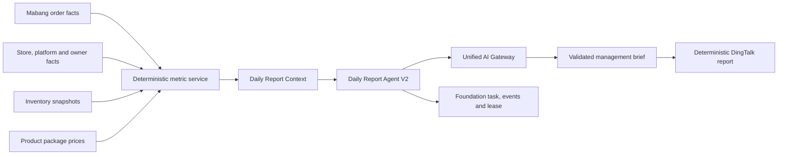

# Commerce Ops Daily Report Agent V2

Status: implemented production runtime
Date: 2026-08-05
Foundation dependency: Commerce Ops AI Foundation V1

## 1. Purpose

Daily Report Agent V2 is the first production business Agent built on the
shared AI Foundation. It converts code-calculated Sales and Assortment facts
into an explainable management brief. It never calculates GMV, order counts,
rankings, product performance, inventory exceptions, or period comparisons in
the model.

## 2. Data Flow

The scheduler calculates the dashboard once. The same immutable facts feed the
Agent and the deterministic report renderer, preventing duplicated database
reads and conflicting numbers.

## 3. Deterministic Metric Boundary

`SalesAssortmentService` remains authoritative for:

- own standardized GMV and assortment standardized GMV;
- order count and average order value;
- current seven days versus the immediately preceding seven days;
- store and product rankings;
- store and style growth or decline impact;
- business opportunities;
- inventory snapshot changes and risk signals;
- the maximum ten deterministic priority alerts.

The LLM may explain likely causes only as hypotheses that require verification.
It may summarize changes, prioritize attention within the supplied evidence,
and write management language. It may not invent or recalculate a number,
change a deterministic priority, or execute an operating action.

## 4. Context Contract

Context type: `daily_report`

Context version: `SALES-ASSORTMENT-DAILY-CONTEXT-2.0.0`

The context includes:

- report date, selected filters and source freshness;
- deterministic summary metrics;
- exact seven-day comparison windows;
- store and product performance;
- store and style anomalies;
- business opportunities and inventory changes;
- deterministic priority alerts;
- data-quality limitations and a SHA-256 fact digest.

The context is created in memory for one scheduled execution. Raw source Excel
files, customer PII, credentials, prompts, and model output are not stored in a
Foundation task.

## 5. Agent Contract

- name: `sales.daily-report`
- version: `2.0.0`
- permission mode: `recommend`
- task domain: `growth`
- scopes: `sales-assortment.read`, `ai.gateway.complete`
- prompt: `sales-assortment.daily-report-agent`
- prompt version: `SALES-ASSORTMENT-DAILY-AGENT-2.0.0`
- output schema: `sales.daily-report-management-brief@2.0.0`

The runtime registers this definition through `AgentFramework`, creates an
`agent_run` Foundation task, acquires a task lease, transitions through
`PENDING -> RUNNING -> SUCCEEDED|FAILED`, and calls DeepSeek only through
`AiGateway`.

Task results contain only safe execution metadata: analysis ID, prompt version,
model, token usage, output schema, and context digest. The validated narrative
is returned to the report renderer but is not persisted in the task envelope.

## 6. Failure Behavior

If the provider, Gateway, or output validator fails:

1. the Agent task transitions to `FAILED` with sanitized evidence;
2. its lease is released;
3. the scheduler continues with the deterministic report;
4. DingTalk still receives the code-calculated metrics and alerts;
5. the report states that the AI summary was unavailable.

The previous successful report is not deleted or overwritten by a model
failure.

## 7. Database Decision

Migration 022 is sufficient. Daily Report Agent V2 reuses:

- `foundation_tasks`;
- `foundation_task_events`;
- `foundation_task_leases`;
- existing order, inventory, product, store, Growth Radar, scheduler, and audit
  tables.

No new migration, Agent queue, prompt table, report table, or model-output
table is required. A future migration should be considered only if the product
explicitly requires durable versioned report artifacts or a model-cost ledger.

