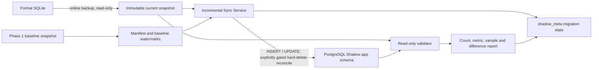

# Commerce Ops Incremental Sync Design

Status: implemented and rehearsed against PostgreSQL Shadow  
Direction: `SQLite production -> PostgreSQL Shadow`  
Production provider: `sqlite`  
Contract: `COMMERCE-OPS-PG-INCREMENTAL-SYNC-1.1.0`

## 1. Purpose and boundaries

This design keeps the formal SQLite database as the only production source while maintaining a
queryable PostgreSQL Shadow copy. It synchronizes INSERT and UPDATE changes for the dependency-closed
Product, Sales, Inventory, Task, and Audit scope. Domain soft deletes flow as ordinary updates. Hard
deletes are blocked by default and may be reconciled only from a full immutable snapshot through the
separately gated child-first procedure described below. It does not switch the application provider,
migrate binary assets, or introduce a reverse synchronization path.

Every synchronization run reads an immutable SQLite online-backup snapshot. The live SQLite file is
never opened for mutation by this subsystem. PostgreSQL writes require both an explicit CLI `--apply`
flag and `POSTGRES_SHADOW_SYNC_ENABLED=true`, and are restricted to database
`commerce_ops_shadow`, schema `app`, through the migrator role.



## 2. Capture strategy decision

Three options were evaluated.

| Option | Strength | Cost or risk | Decision |
| --- | --- | --- | --- |
| A. Table timestamps and primary-key watermarks | Low intrusion; works with the existing schema; supports bounded reads | Legacy rows can be updated without a reliable timestamp; equal timestamps require stable PK ordering | Primary capture mechanism |
| B. New `change_events` CDC table | Complete ordered change history, including immediate DELETE support | Requires a formal SQLite migration and modifications to every write path; changes production behavior before cutover | Deferred for continuous CDC; final full-snapshot reconciliation is implemented |
| C. Audit, Task, and Repository signals | Existing evidence identifies important business changes and repository ownership | Not all table mutations produce audit/task events, so it is not authoritative CDC | Used for scope and evidence, not as the sole feed |

The selected strategy is **A + C with snapshot reconciliation**:

1. Timestamped tables use a timestamp plus primary-key watermark.
2. Each run re-reads a five-minute overlap window and performs idempotent UPSERTs. This covers late
   commits and rows sharing the boundary timestamp.
3. Tables without a reliable timestamp use a deterministic full-table digest. They are re-upserted
   only when the digest changes.
4. Existing repository, Task, and Audit boundaries define the supported domain scope and validation
   evidence.
5. A full count, business metric, and deterministic sample comparison runs after synchronization.
6. Target-only rows are reported as differences. They are never deleted by an ordinary incremental
   run. A full reconcile can detect exact target-only primary keys, and can delete them only through
   the dedicated destructive gate.

This approach is reversible and requires no migration or trigger in the formal SQLite database. A
future CDC phase may replace the capture mechanism without changing the provider-facing repository
contracts.

## 3. Baseline and synchronization scope

The Phase 1 immutable snapshot is the baseline. Its file hash must match the hash stored in
`shadow_meta.table_loads`; otherwise synchronization fails closed.

The manifest starts from the Product, Sales, Inventory, Task, and Audit domain roots and recursively
includes foreign-key parents. The current dependency-closed scope contains 47 tables. Every table
must have a primary key. The manifest topologically orders parents before children while ignoring
self-references for ordering.

Tables that Phase 1 loaded receive watermarks and counts from the baseline snapshot. Tables that
Phase 1 intentionally created as structure-only, including raw Growth Radar source rows, start at an
empty target state and are loaded on the first incremental run.

Watermark columns are selected in this order when available:

`updated_at`, `renewed_at`, `occurred_at`, `last_seen_at`, `created_at`, `snapshot_at`,
`captured_at`, `imported_at`.

## 4. Write and recovery behavior

Each table is processed in its own PostgreSQL transaction:

1. Read candidate rows from the immutable SQLite snapshot.
2. Normalize SQLite values for PostgreSQL types.
3. Execute batched `INSERT ... ON CONFLICT ... DO UPDATE` statements.
4. Update that table's watermark, counts, status, and batch reference in the same transaction.

A failed table transaction rolls back both rows and watermark. The batch and migration state record a
bounded error code and summary. A later run can safely resume because completed table watermarks are
durable and all writes are idempotent. A paused migration refuses new synchronization batches until
an operator resumes it.

### Hard-delete policy

Ordinary synchronization uses `BLOCK` mode. This avoids destructive behavior while SQLite remains
the production source of truth, and any source-missing/target-only row blocks validation.

Two full-reconcile modes are available:

1. `DETECT` copies only source primary keys into a transaction-local PostgreSQL temporary table and
   counts exact target-only keys. It never deletes rows.
2. `APPLY` performs the same exact comparison and removes confirmed target-only rows in reverse
   manifest order, so children are handled before parents. Each table is transactional; foreign-key
   or count drift fails closed and rolls back that table.

`APPLY` requires all of: `--apply`, `--full-reconcile`,
`POSTGRES_SHADOW_SYNC_ENABLED=true`, `POSTGRES_SHADOW_DELETE_ENABLED=true`, and the exact
`--confirm-delete-database=commerce_ops_shadow` argument. It can write only to Shadow through the
migrator role. No production database is a valid target.

## 5. Migration control model

Shadow migration `004_incremental_sync_control.sql` adds control data only in `shadow_meta`:

- `migration_state`: current stage, baseline, successful batch, failures, pause state, validation,
  and explicit switch readiness.
- `migration_sync_batches`: one immutable summary per synchronization or validation batch.
- `migration_sync_table_state`: per-table capture mode, watermark, counts, status, and revision.
- `migration_validation_runs`: validation result and complete difference evidence.

Supported stages are `BASELINE`, `INCREMENTAL`, `VALIDATING`, `PAUSED`, `READY`, and `FAILED`.
Validation success may set stage `READY`, meaning ready for continued Shadow evaluation. It never sets
`is_switch_ready=true`; production cutover requires a separate approved gate.

## 6. Validation contract

Validation is read-only for both source snapshot and `app` data. It checks:

- Row counts for every manifest table.
- Count-based target excess/source missing evidence for every table.
- Exact target-only primary-key detection in `DETECT`/`APPLY` full-reconcile modes.
- Product SKU, order header, order line, inventory snapshot, Task, and Audit totals.
- Deterministic seeded samples of primary keys and core fields.
- SQLite snapshot integrity and foreign-key checks before use.

Reports are written as JSON and Markdown under `docs/reports/`. The JSON is the machine-readable
evidence; Markdown is the operator summary.

## 7. Operator commands

```powershell
# Plan only; no Shadow write
npm.cmd run postgres:sync:plan

# Read-only status; no write gate required
npm.cmd run postgres:sync:status

# Explicit Shadow writes
$env:POSTGRES_SHADOW_SYNC_ENABLED='true'
npm.cmd run postgres:sync
npm.cmd run postgres:sync:validate
npm.cmd run postgres:sync:pause -- --reason=maintenance
npm.cmd run postgres:sync:resume

# Hard-delete plan and exact detection; neither deletes rows
npm.cmd run postgres:sync:delete:plan
npm.cmd run postgres:sync:delete:detect

# Destructive Shadow-only application; requires a separate explicit approval
$env:POSTGRES_SHADOW_DELETE_ENABLED='true'
npm.cmd run postgres:sync:delete:apply -- --confirm-delete-database=commerce_ops_shadow
```

`POSTGRES_INCREMENTAL_SOURCE_SNAPSHOT` may point only to a previously created snapshot inside
`tmp/postgresql-incremental-sync`. This supports repeatable validation without reading the live file
again.

## 8. Operational guarantees and known limits

- Formal SQLite remains the sole writer and production data source.
- PostgreSQL application access remains read-only in Shadow mode.
- Only the migrator role may execute synchronization writes.
- Binary media stays in local storage; MinIO is not part of this phase.
- No reverse synchronization exists.
- No automatic scheduling is enabled by this implementation.
- Hard deletes are not continuous CDC. They are visible and actionable only during a full snapshot
  reconciliation; the final cutover runbook must include one under the approved write freeze.
- Clock or timestamp defects in legacy rows are mitigated by overlap and full validation, not fully
  eliminated. Formal CDC remains the long-term option.
- Large first-load raw tables make the initial run heavier than steady-state runs.

## 9. Rehearsal result

The first controlled run synchronized 47/47 tables. It examined 629,254 rows, inserted 390,928,
updated 204,562, and completed with zero table failures. Independent validation found zero count,
business-metric, or sample differences. Pause, status, resume, and revalidation were exercised.

`DATABASE_PROVIDER` remains `sqlite`, and `is_switch_ready` remains `false`. The recorded rehearsal
predates the 1.1 hard-delete procedure; the new procedure is implemented and unit-tested but has not
been executed against Shadow because destructive reconciliation requires separate approval.
