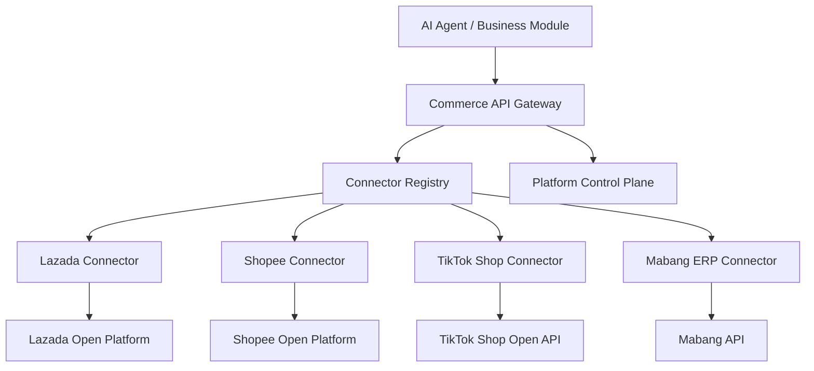

# Commerce Ops Platform Connector Center V1

Status: implemented foundation with Lazada and delegated Shopee access, plus a canonical shop directory.

## Boundary



The Gateway owns shop lookup, authorization retrieval, proactive token refresh, connector
selection, output normalization, write gating, and request audit. No business module or Agent is
allowed to receive app secrets or decrypted tokens.

## Canonical shop directory and authorization projection

`app.commerce_shop_registry` is the business source of truth for store code, name, country,
responsible managers, platform, category, platform short code, seller ID, shop type and lifecycle
status. The Connector SQLite control plane remains the only owner of tokens and provider
authorization records. `/api/platform/shops` joins these two stores at read time and writes back
only the confirmed non-secret Connector binding.

Matching order is stable shop code, same-platform name plus country, then provider seller ID.
Country or seller-ID conflicts are preserved as `REVIEW_REQUIRED`; they are never silently merged.
This separation lets a store exist before authorization, lets manual and system imports use the
same validation path, and makes authorization status update automatically without copying token
state into PostgreSQL. Shopee status is read from the delegated Token Broker with a short cache;
Lazada status is read from the encrypted Connector authorization table.

## Control-plane data model

V1 deliberately stores integration control-plane state in `storage/lazada-oauth.sqlite`, separate
from the Commerce Ops business database. This avoids an unapproved formal business-database
migration while keeping OAuth and connector writes atomic in one SQLite WAL database.

| Logical model | Physical table | Purpose |
| --- | --- | --- |
| Platform | `connector_platforms` | Provider identity, type, API version, lifecycle status |
| Shop | `connector_shops` | One country-specific shop identity per platform and seller |
| ShopAuthorization | `connector_shop_authorizations` | Encrypted token pair, application reference, expiry and refresh lifecycle |
| ApiRequestLog | `connector_api_request_logs` | Connector operation, request time, result, latency and safe error metadata |

`credential_group_id` extends the requested authorization model for multi-country accounts. When
one provider refresh token represents several country shops, a single refresh updates every shop
in that group. Optimistic `version` metadata and a per-process refresh lock prevent avoidable
duplicate refreshes.

Tokens use AES-256-GCM authenticated encryption. App keys and secrets remain in `.env` and are
resolved only by the connector composition root. API responses and logs contain authorization
metadata but never token values.

## HTTP Gateway

All endpoints remain behind the existing Commerce Ops `/api/*` access policy.

| Method | Path | Purpose |
| --- | --- | --- |
| GET | `/api/platform/status` | Connector runtime health and write-gate state |
| GET | `/api/platforms` | Platforms and connector availability |
| GET | `/api/platform/shops` | Canonical shops joined with live non-secret authorization status |
| POST | `/api/platform/shops` | Manually create or update one canonical shop |
| POST | `/api/platform/shops/sync` | Idempotently synchronize up to 1,000 shops from a registered system or spreadsheet import |
| GET | `/api/platform/shop` | Provider shop information |
| GET | `/api/platform/orders` | Normalized paginated orders, without buyer PII |
| GET | `/api/platform/order-items` | Normalized order items and package identifiers |
| POST | `/api/platform/orders/ready-to-ship` | Lazada ReadyToShip, fail-closed by default |
| GET | `/api/platform/products` | Normalized products and SKUs |
| GET | `/api/platform/inventory` | Normalized SKU inventory projection |
| GET | `/api/platform/logs` | Connector request audit records |
| POST/PATCH | `/api/platform/products/update` | Product update, fail-closed by default |
| POST/PATCH | `/api/platform/inventory/update` | Inventory update, fail-closed by default |

Read example:

```text
GET /api/platform/orders?platform=lazada&shop_id=<connector-shop-id>&limit=50&offset=0
```

The `shop_id` may be the connector UUID or an unambiguous provider seller ID. Internal callers
should persist and use the connector UUID.

## Lazada reference implementation

The connector uses country-specific Lazada endpoints, HMAC-SHA256 signing, bounded timeouts, and
read-only retry with exponential backoff. It implements:

- OAuth authorization URL and access/refresh token exchange.
- proactive refresh before access-token expiry;
- `/seller/get`, `/orders/get`, `/order/items/get`, `/products/get`;
- `/order/package/rts` with per-package result validation behind the global write gate;
- `/product/update` and `/product/price_quantity/update` behind the global write gate;
- normalization before data crosses the connector boundary.

Existing OAuth routes stay compatible on the local port `8977`:

- `/lazada/auth`
- `/lazada/callback`
- `/lazada/token`
- `/lazada/apps/<app-id>/...` for Apps 2 and 3.

Every successful OAuth token save now also upserts the unified Shop and ShopAuthorization rows.
Existing encrypted rows in `lazada_store_tokens` are migrated in place without decrypting to a
file or log.

## Safety and scale

- `COMMERCE_PLATFORM_WRITES_ENABLED=false` is the default. Reads can be validated independently.
- GET retries are bounded; non-idempotent provider writes are never automatically retried.
- Each provider call writes an audit record with latency and provider request ID.
- Customer names, addresses, phone numbers, access tokens, refresh tokens, signatures, and app
  secrets are excluded from normalized Gateway output and request logs.
- SQLite WAL and indexed shop/log lookups are adequate for the initial hundreds-of-shops control
  plane. Connector services depend on a repository interface, so a later approved PostgreSQL
  migration does not change the business/Agent boundary.

## Agent contract

`registerPlatformGatewayTools` exposes read-only Tool Registry entries for shop, orders, products,
and inventory. Each declares `external_access: "gateway_only"`. Write tools are intentionally not
registered in V1; future write Agents should create reviewable operation tasks first and require
the existing authorization/confirmation controls before Gateway execution.

## Extension sequence

For Shopee, TikTok Shop, and Mabang ERP, implement provider auth/signing and resource modules,
register the factory, add normalizers and contract tests, run read-only validation, and only then
mark the platform active. Gateway routes and Agent contracts do not change.
