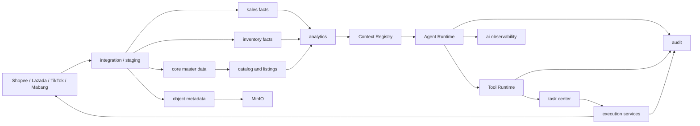

# Commerce Ops PostgreSQL 目标架构设计

版本：1.0  
设计日期：2026-08-05  
目标周期：3-5 年  
目标系统：Commerce Ops AI Operating System

## 1. 设计目标

PostgreSQL 不只是 SQLite 的替代品。目标是形成一个可支持多店铺、多平台、多 Worker、多 Agent 和可审计自动化的核心数据平台。

设计必须同时满足：

1. 业务主数据只有一个权威身份。
2. 平台原始数据、规范事实和分析结果分层保存。
3. Agent 只能通过 Context Registry 和 Tool Runtime 使用业务数据。
4. 高并发任务使用数据库租约、幂等键和事件记录。
5. 文件只保留元数据，对象内容进入 MinIO。
6. 迁移期间可以与现有 SQLite 共存并随时回退。

## 2. 总体结构



## 3. 数据库边界

### 3.1 一个生产集群，一个主数据库

第一阶段使用一个 PostgreSQL 集群和一个 `commerce_ops` 数据库，通过 schema 分域。不要为每个模块建立独立数据库，否则事务、身份关联、备份和排障会过早复杂化。

### 3.2 推荐 schema

| Schema | 职责 |
|---|---|
| `core` | 组织、用户、负责人、店铺、仓库、平台账号、统一外部身份 |
| `catalog` | Product Master、Model、SKU、Variant、Category、成本、价格、Listing |
| `sales` | 订单头、订单行、销售事实、退款与履约事实 |
| `inventory` | 库存批次、仓库库存快照、在途、预测、供给风险 |
| `platform` | 平台账号、同步运行、原始事件、平台特有扩展 |
| `task` | 统一任务、事件、审批、执行、租约、幂等 |
| `ai` | Agent 定义、运行、Context 快照、Tool 调用、Memory、Evaluation |
| `audit` | 不可变操作审计和关联索引 |
| `analytics` | 日指标、KPI、信号、Growth Radar 发布结果 |
| `asset` | 对象元数据、图片关系、导入文件、报告、生成文件 |
| `ops` | 调度任务、调度运行、通知端点、系统配置 |
| `staging` | 有限留存的导入原始行和迁移暂存表 |

不建议继续使用单一 `app` schema 作为最终形态；`app` 只适合作为当前 F3 兼容演练 schema。

## 4. 统一身份与租户模型

### 4.1 组织边界

所有业务事实应显式包含 `organization_id`，即使第一阶段只有一个组织。这样未来新增团队、品牌或外部客户时不需要重写所有唯一约束。

### 4.2 主键策略

- 内部实体：`uuid`，PostgreSQL 18 可使用 `uuidv7()`，或由应用生成 UUIDv7。
- 高频窄事件：允许 `bigint GENERATED BY DEFAULT AS IDENTITY`，同时保留业务 UUID。
- 平台 ID、订单号、SKU、SHA-256、命名空间 ID：**必须为 `text`**，不得因字段名以 `_id` 结尾而推断 UUID。
- 所有外部身份进入 `core.external_identity`，以 `(organization_id, source_system, entity_type, external_key)` 唯一。

### 4.3 建议核心表

```text
core.organization
core.user_account
core.owner
core.store
core.warehouse
core.platform_account
core.source_system
core.external_identity
core.country
core.currency
```

`store`、`warehouse` 和 `owner` 不再由 Growth Radar、Foundation、订单导入分别维护。旧表在迁移期保留映射，切换完成后转为兼容视图或归档表。

## 5. 商品域 `catalog`

### 5.1 建议模型

```text
catalog.category
catalog.product
catalog.product_model
catalog.sku
catalog.variant
catalog.sku_country_profile
catalog.cost_snapshot
catalog.price_snapshot
catalog.current_price
catalog.listing
catalog.listing_variant
catalog.content_version
catalog.field_override
```

### 5.2 关键原则

- Product 表示可被运营理解的商品；SKU 表示可库存和销售的最小单元；Variant 表示平台刊登中的变体。
- `sku_code` 在组织内唯一，但平台 SKU 通过 `external_identity` 关联，不直接覆盖主 SKU。
- 国家成本和标价进入 `sku_country_profile` / `price_snapshot`，货币金额使用 `numeric(20,4)` 和 ISO `currency_code`。
- 当前价格是投影视图或 current 表，历史价格永远追加，不覆盖。
- Listing 作为业务实体，不放进 Python `publisher.db`；Python Worker 只执行命令并回写执行结果。

## 6. 销售域 `sales`

### 6.1 建议模型

```text
sales.order
sales.order_line
sales.payment_fact
sales.fulfillment_fact
sales.refund_fact
sales.daily_sku_fact
sales.daily_store_fact
```

### 6.2 数据类型与约束

- 平台订单号、交易号：`text`。
- 付款、交运、发货、签收：`timestamptz`；业务日期另存 `date`。
- 数量：`numeric(18,4)`，避免未来重量/拆分数量受整数限制。
- 金额：`numeric(20,4)`，必须附带币种；人民币换算金额保留汇率来源和规则版本。
- 原始行不直接成为权威订单；先写 `staging`，通过幂等业务键 upsert 事实表。

### 6.3 分区

订单和销售事实按 `paid_date` 月分区。唯一键必须包含分区键，或用独立身份表解决跨分区唯一性。保留 24-36 个月热数据，旧分区可转低成本存储但不删除审计依据。

## 7. 库存域 `inventory`

### 7.1 建议模型

```text
inventory.snapshot_batch
inventory.stock_snapshot
inventory.stock_position_current
inventory.in_transit_snapshot
inventory.demand_forecast
inventory.supply_risk
```

### 7.2 粒度

库存事实唯一粒度：

```text
organization + source + warehouse + sku + snapshot_at
```

国家是仓库属性，不作为替代仓库的主键。国家聚合只能由查询层完成，避免多仓库存和销量重复计算。

`stock_snapshot` 按 `snapshot_date` 月分区；`stock_position_current` 只保留当前状态，由同一事务或可靠投影更新。

## 8. 平台与导入域 `platform` / `staging`

### 8.1 建议模型

```text
platform.integration_account
platform.account_capability
platform.sync_run
platform.sync_checkpoint
platform.raw_event
platform.api_request_log
platform.shop_extension
platform.listing_extension

staging.import_batch
staging.import_file
staging.raw_order_row
staging.raw_inventory_row
staging.raw_product_row
staging.validation_issue
```

平台 JSON 原文可以使用 `jsonb`，但业务查询字段必须投影为显式列。JSONB 只对实际查询路径建立 GIN 或表达式索引，不能为所有 JSON 字段建立通用索引。

同步运行必须记录：来源账号、范围、游标、watermark、输入哈希、规则版本、开始/结束时间、状态、错误码和重试次数。

## 9. 统一任务域 `task`

### 9.1 建议模型

```text
task.task
task.task_event
task.approval
task.execution_attempt
task.lease
task.idempotency_key
task.outbox_event
```

### 9.2 并发控制

- Worker 领取任务使用 `SELECT ... FOR UPDATE SKIP LOCKED`。
- 租约包含 `owner_id`、`leased_until`、`heartbeat_at` 和 revision。
- 所有外部写操作必须先写审批/任务，再由执行器处理。
- `idempotency_key` 在组织、任务类型和业务对象范围内唯一。
- 任务状态只通过追加 `task_event` 解释；task 主表保留当前投影。

Growth Radar focus item、调度任务、图片任务和履约任务不要求一次性合并为一张巨表，但必须统一引用 `task.task`，共享状态、审批和审计合同。

## 10. AI 平台域 `ai`

### 10.1 建议模型

```text
ai.agent_definition
ai.agent_version
ai.agent_run
ai.context_snapshot
ai.tool_invocation
ai.gateway_call
ai.agent_memory
ai.agent_evaluation
ai.agent_task_link
```

### 10.2 Agent Run

`ai.agent_run` 保存：

- Agent 名称与版本
- request/run/correlation ID
- organization、actor 和来源任务
- prompt/context/tool contract 版本
- 输入/输出摘要哈希
- token、耗时、状态、错误码
- 创建、开始、结束时间

完整原始业务输入不重复写入 Agent Run。大 Evidence Pack 和报告进入 MinIO，表中保存对象引用、摘要和脱敏统计。

### 10.3 Context

`ai.context_snapshot` 是不可变快照，包含：

- Context 类型和版本
- 业务对象引用
- 数据水位和规则版本
- 内容哈希
- JSONB 摘要或 MinIO 对象引用

Context Registry 仍由应用代码管理；数据库只持久化解析结果，不允许 Agent 自行查询任意表。

### 10.4 Tool 调用

`ai.tool_invocation` 必须引用 Agent Run，记录 Tool 版本、权限、输入输出 schema 版本、摘要、状态、耗时和错误码。Tool Runtime 使用受限应用角色，Agent Runtime 本身不获得数据库连接。

### 10.5 Memory

`ai.agent_memory` 仅保存结构化、可审计、可过期的业务记忆：

- `scope_type` / `scope_id`
- `memory_type`
- `content_jsonb` 或对象引用
- `source_run_id`
- `valid_from` / `expires_at`
- `supersedes_id`
- `classification` / `retention_policy`

永久规则仍以代码和受版本控制的合同为权威，不把 Prompt 或系统规则随意写入 Memory。

### 10.6 Evaluation

`ai.agent_evaluation` 支持 rule、human、model 三类评价，保存 evaluator 版本、评分维度、证据引用和审阅状态。不得把原始敏感数据复制到评价表。

Agent Run、Tool Invocation、Gateway Call 和 Audit Event 按月分区，常用筛选字段建立 B-tree，JSONB 只作证据载体。

## 11. 审计域 `audit`

```text
audit.operation_event
audit.entity_change
audit.security_event
```

审计事件只追加，不更新。必须保存 request ID、actor、module、action、业务对象、任务、Agent Run、Tool Invocation、结果和时间。敏感 payload 只保存摘要或脱敏引用。

生产应用角色不能删除审计事件；留存清理由独立受控角色执行。

## 12. 分析域 `analytics`

```text
analytics.analysis_run
analytics.metric_snapshot
analytics.daily_store_metric
analytics.daily_sku_metric
analytics.signal
analytics.focus_item_projection
analytics.kpi_snapshot
```

分析结果必须记录 source watermark、rule version、input fingerprint 和 published 状态。页面只读取最新成功发布结果；失败运行不能清空上一版。

大规模按日事实使用分区表。常用聚合可用物化视图，但刷新必须通过调度任务并有版本记录。

## 13. 资产域与 MinIO

### 13.1 PostgreSQL 保存

```text
asset.object
asset.object_source
asset.object_link
asset.image_metadata
asset.import_file
asset.generated_report
asset.lifecycle_event
```

`asset.object` 建议字段：

```text
id, organization_id, storage_provider, bucket, object_key, version_id,
sha256, etag, size_bytes, mime_type, original_filename,
status, created_at, deleted_at, retention_policy
```

### 13.2 MinIO 保存

- 原始图片、白底图和衍生图
- Excel 导入/导出文件
- 日报 HTML/PDF
- 大型 Agent Evidence Pack
- AI 生成文件

### 13.3 一致性

数据库事务不能与 MinIO 原子提交，采用：

1. 上传临时对象；
2. 校验 SHA-256；
3. 事务写 `asset.object(status='pending')` 和 outbox；
4. Worker 原子确认对象并改为 `available`；
5. 对账任务处理悬空对象和缺失对象。

不把本机绝对路径写进业务表，只保存 bucket/object key。

## 14. 数据类型合同

| 语义 | PostgreSQL 类型 |
|---|---|
| 内部实体 ID | `uuid` |
| 外部/平台/命名空间 ID | `text` |
| 自增事件序号 | `bigint identity` |
| 金额 | `numeric(20,4)` + `currency_code` |
| 数量 | `numeric(18,4)` |
| 百分比/比率 | `numeric(12,6)` |
| 时间 | `timestamptz`，统一 UTC |
| 业务日期 | `date` |
| 开关 | `boolean` |
| 规则证据 | `jsonb` |
| SHA-256 | `char(64)` 或受 CHECK 的 `text` |
| 原始二进制 | MinIO，不进 PostgreSQL |

必须维护显式字段类型 manifest；禁止继续通过列名猜测类型。

## 15. 索引原则

1. 每个外键按实际 join 路径补索引；PostgreSQL 不会自动为引用列建索引。
2. 高频查询使用组合索引，列顺序按过滤、排序和选择性设计。
3. `status + next_run_at`、`organization + business_key`、`source + external_key` 是核心组合索引。
4. 软删除表使用 `WHERE deleted_at IS NULL` 的部分唯一索引。
5. JSONB 只对已证明的查询建立 GIN/表达式索引。
6. 避免为低基数字段单独建索引。

## 16. 权限模型

建议角色：

| 角色 | 权限 |
|---|---|
| `commerce_migrator` | DDL、迁移和受控数据装载 |
| `commerce_app` | 业务 schema 的 DML，不可 DDL |
| `commerce_worker` | task、platform、asset 的受限 DML |
| `commerce_readonly` | 报表和诊断只读 |
| `commerce_audit_reader` | 审计只读 |
| `commerce_backup` | 备份所需最小权限 |

Agent 不拥有数据库角色。Tool Runtime 根据 Tool 权限使用应用侧 Repository。

## 17. 可用性、备份与恢复

- 本地第一阶段：每日 `pg_dump --format=custom`，保留 7 日；每周恢复演练。
- 生产化阶段：启用 WAL 归档和 PITR；备份数据库与 MinIO 清单必须同一批次编号。
- 迁移前保留 SQLite 一致性备份，切换后至少 14 天只读保留。
- 所有恢复演练验证：schema、行数、关键摘要、MinIO 引用和服务启动。

## 18. 现有表到目标域的迁移原则

- `product_*` -> `catalog` / `asset`，保留历史快照。
- `growth_order_*` -> `sales`，原始行进入 `staging`。
- `growth_inventory_*` -> `inventory`，分析结果进入 `analytics`。
- `growth_*metrics/signals/focus*` -> `analytics` 和 `task`。
- `foundation_*` -> `core` / `platform` / `task`，先映射再合并，不直接删除。
- `scheduled_*` -> `ops`，任务执行关联 `task`。
- `mabang_sku_image_*` -> `platform` / `asset` / `task`。
- `operation_audit_events` -> `audit.operation_event`，Agent 事件再投影到 `ai` 专表。
- `price_control_*` -> `catalog` / `platform` / `task`。

第一轮迁移先做同构 staging，以保证可验证；目标域重塑在同构数据验证后执行，不能把“搬数据”和“重构语义”放在同一个不可回退步骤。

## 19. 目标验收标准

目标架构只有在以下条件全部满足后才能成为生产核心：

1. 88 张现有表的数据可无损进入 staging。
2. 目标域表与 staging 的行数、键摘要和业务指标对账一致。
3. 所有生产 Repository 在 PostgreSQL 合同下通过。
4. Scheduler、日报、Agent Monitoring、图片、Listing、价格控制和自动发货通过端到端测试。
5. Agent 仍只能通过 Context/Tool Runtime 获取数据。
6. 回滚到 SQLite 的演练成功。
7. MinIO 缺失不会阻止数据库迁移；引入 MinIO 后对象对账通过。
