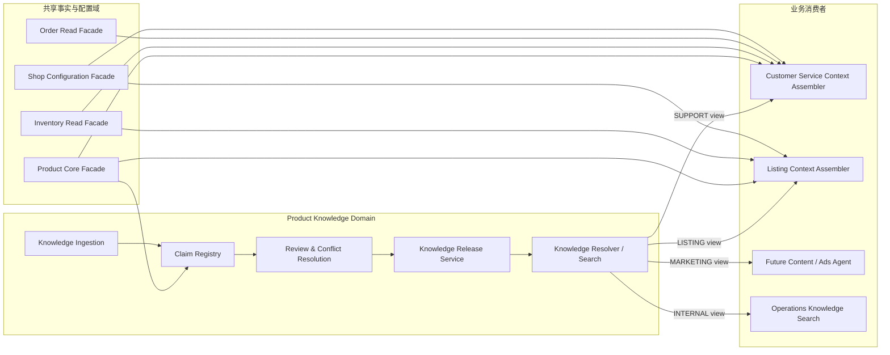
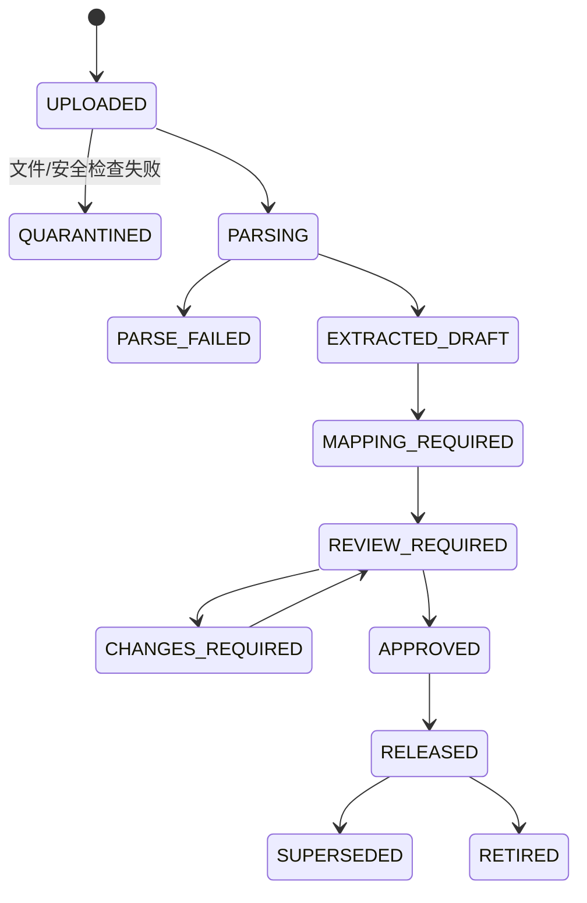
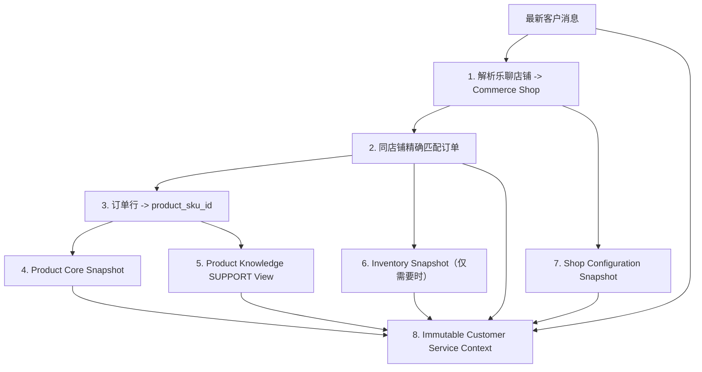

# Commerce Ops 产品知识中心 V1 架构设计

Status: proposed shared-domain architecture; no migration or deployment executed  
Date: 2026-08-07  
Consumers: 客服中心、商品上架、Listing AI、广告/内容生成、运营分析和未来自动化 Agent

## 1. 核心决策

产品知识库不是客服模块的子表，也不是一批专门给客服 Prompt 使用的文档。它属于 Commerce Ops
的 **Product Domain**，以产品、型号、SKU、品类、国家和语言为稳定作用域，向不同业务模块
发布经过审批的用途视图。

```text
产品包 / 产品主数据               已批准的外部产品资料
          \                         /
           -> Product Knowledge Center
                       |
          +------------+-------------+----------------+
          |                          |                |
   SUPPORT 视图                LISTING 视图       INTERNAL 视图
   客服回复/FAQ                标题/卖点/描述       培训/运营分析
```

客服中心负责会话、工单、回复建议和审核；Listing 负责草稿、校验、发布和回读；二者都不能拥有
或复制产品知识真源。它们通过版本化的 `ProductKnowledgeView` 读取同一知识发布版本。

## 2. 现有系统中的正确位置

### 2.1 五类核心数据的所有权

| 数据 | 当前/目标真源 | 所属域 | 客服权限 | Listing 权限 |
| --- | --- | --- | --- | --- |
| 订单 | `growth_order_headers`、`growth_order_lines`，以及受控平台 Gateway 实时读 | Source Facts / Order | 只读相关订单 | 通常不使用 |
| 库存 | `growth_inventory_snapshots`，必要时受控实时库存读 | Source Facts / Inventory | 只读且受披露策略限制 | 只读刊登/履约需要的数据 |
| 店铺配置 | 现有店铺配置能力、`commerce_shop_registry` 和账号绑定 | Shop / Configuration | 只读服务配置 | 只读平台/国家/刊登配置 |
| 产品包 | `product_skus`、`product_package_rows` 和 Product Center | Product Core | 只读 | 只读 |
| 产品知识 | 新增 Product Knowledge Center | Product Knowledge | 消费 SUPPORT 发布视图 | 消费 LISTING 发布视图 |

物理表在同一个 PostgreSQL 中并不等于可以跨模块随意 JOIN。每个业务模块只通过所属域的
Repository、Facade 或版本化 Context 读取；这样未来订单表、库存采集方式或 Listing 实现变化时，
不会迫使客服 Prompt 和知识检索一起重写。

### 2.2 与现有 `product_ai_contents` 的关系

`product_ai_contents` 保存的是由模型生成并可能被人工采用的 Listing 内容版本，它是
Product/Listing 的 **输出与派生内容**，不是产品事实或知识来源。

- 它可以记录生成时使用的 `product_knowledge_release_id` 和 Context digest；
- 经人工采用的内容可以提交为“知识候选反馈”；
- 未经知识审批，不得自动写回 Product Knowledge Center；
- Listing 文案中的营销修辞不能反向覆盖产品规格、兼容性或安全说明。

## 3. 领域边界



### 3.1 Product Core 拥有

- 产品、型号、SKU 和品类身份；
- 产品包原始事实与当前修订；
- 人工字段覆盖的正式流程；
- 产品图片和媒体资产身份；
- 产品生命周期状态。

### 3.2 Product Knowledge 拥有

- 外部文件、内部说明、FAQ、安装/使用/保养/兼容性知识；
- 文档版本、解析结果、结构化 claim、原文证据和冲突；
- 产品/型号/SKU/品类/国家/语言绑定；
- 用途、可见性、风险级别和生效时间；
- 经审批的不可变 Knowledge Release。

### 3.3 Product Knowledge 不拥有

- 订单状态、客户信息或会话；
- 当前库存数字；
- 店铺工作时间、补偿额度、退款权限等店铺配置；
- Listing 草稿、发布结果或平台回读；
- 客服语气、升级人工、敏感场景处理等客服 Playbook；
- 平台 API 凭证和乐聊 Session。

## 4. 知识不是“文档切片”，而是可治理的 Claim

只保存文档和向量切片不足以支撑客服与上架共用，因为不同用途对事实、措辞和风险的要求不同。
V1 同时保留原文 section 和结构化 claim。

### 4.1 Claim 类型

| Claim 类型 | 示例 | 常见消费者 |
| --- | --- | --- |
| `SPECIFICATION` | 尺寸、重量、容量、型号 | 客服、Listing |
| `MATERIAL` | 面料、填充物、表面处理 | 客服、Listing |
| `PACKAGE_CONTENTS` | 包装内包含什么 | 客服、Listing |
| `COMPATIBILITY` | 适配型号、限制条件 | 客服、Listing |
| `USAGE` | 使用方法、适用场景 | 客服、Listing |
| `INSTALLATION` | 安装步骤和工具要求 | 客服、Listing |
| `CARE` | 清洁、维护、存储 | 客服、Listing |
| `SAFETY_WARNING` | 禁止事项、风险提醒 | 客服、Listing，强制保留 |
| `TROUBLESHOOTING` | 故障表现、排查、升级条件 | 客服 |
| `FAQ` | 标准问题和事实答案 | 客服、内部检索 |
| `SELLING_POINT` | 经批准的产品卖点 | Listing、营销 |
| `PROHIBITED_CLAIM` | 不得宣称的功效或承诺 | 所有生成场景 |

产品包已经维护的规格字段仍以 Product Core 为准。知识文档中出现不同值时，不能覆盖产品包；
系统创建冲突，要求在 Product Center 正式更正产品事实或退回知识版本。

### 4.2 Claim 最小契约

```json
{
  "claim_id": "...",
  "claim_type": "COMPATIBILITY",
  "subject": {
    "category_id": null,
    "model_id": null,
    "product_sku_id": "..."
  },
  "value": {
    "text": "...",
    "structured": {}
  },
  "language": "en",
  "country_codes": ["PH"],
  "consumer_scopes": ["CUSTOMER_SERVICE", "LISTING"],
  "visibility": "CUSTOMER_VISIBLE",
  "risk_level": "NORMAL",
  "source_version_id": "...",
  "source_section_id": "...",
  "valid_from": "...",
  "valid_to": null,
  "approval_status": "APPROVED"
}
```

### 4.3 用途和可见性分离

一个内容“对客服有用”不代表可以放到 Listing，也不代表可以直接告诉客户：

- `consumer_scope`：`CUSTOMER_SERVICE`、`LISTING`、`MARKETING`、`INTERNAL`；
- `visibility`：`CUSTOMER_VISIBLE`、`PUBLIC_LISTING`、`INTERNAL_ONLY`；
- `risk_level`：`NORMAL`、`SENSITIVE`、`RESTRICTED`；
- `required_behavior`：可选、必须引用、必须带警告、禁止生成。

例如内部故障排查步骤可以供客服判断，但其中的内部仓库流程不能直接回复客户；安全警告可同时
进入客服和 Listing，并设置为不得被上下文裁剪。

## 5. 知识摄取、审批和发布



### 5.1 上传

入口位于 Product Center，而不是客服中心。原文件使用 Storage Provider 保存，数据库保存
storage key、MIME、大小、SHA-256、所有者和安全状态。支持格式的具体实现按正式解析能力开启；
不能可靠解析的扫描件不进入模型。

### 5.2 AI 辅助抽取

模型可以从文档中提出 section、claim、绑定和冲突候选，但所有候选初始为 Draft。抽取结果必须
保留源页码/工作表/单元格/段落引用，不能只保留模型摘要。

### 5.3 人工映射和审批

- 显式绑定品类、型号、SKU、国家、语言和用途；
- 对同一 claim 的产品包值、现行知识和新版本进行差异对比；
- 高风险 claim 由指定角色审批；
- 审批对象是不可变版本，审批后修改必须产生新版本；
- 一个 Release 内的所有 claim、section 和绑定都有确定版本。

### 5.4 发布

业务模块只读取 Release，不读取 Draft 或散乱的最新行。发布产生不可变
`product_knowledge_release_id`、内容 digest 和索引版本。旧建议、旧 Listing 草稿仍能引用当时的
Release；新生成任务使用当前有效 Release。

## 6. 真源、优先级和冲突

### 6.1 事实优先级

1. Product Center 当前产品主数据、产品包事实和已批准人工覆盖；
2. 已批准并发布的精确 SKU/model Claim；
3. 已批准并发布的品类 Claim；
4. 已批准示例只帮助表达，不成为产品事实；
5. 模型常识不得成为 Commerce Ops 产品事实。

### 6.2 冲突处理

| 冲突 | 处理 |
| --- | --- |
| 知识 claim 与产品包同字段不同 | 阻止该 claim 发布；转 Product Center 更正或退回文档 |
| SKU claim 与品类 claim 不同 | SKU 精确范围优先，同时保留冲突审计 |
| 同范围两个 Active 版本冲突 | 不允许同时发布，必须结束旧版本或明确规则 |
| 国家/语言范围不一致 | 不回退到其他国家的限制性 claim |
| 文档只有营销说法、无事实证据 | 仅可作为待审卖点，不生成规格或承诺 |

“最新上传”不等于“最新有效”；只有已批准 Release 和显式生效时间决定当前版本。

## 7. 面向消费者的稳定契约

### 7.1 Product Core Facade

```text
getProductSnapshot(product_sku_id, country, as_of)
```

返回稳定产品身份、产品包字段、正式覆盖、revision、source evidence 和缺失项。客服、Listing
和 Agent 不直接读取 `product_package_rows.raw_payload_json`。

### 7.2 Product Knowledge Resolver

```text
resolveProductKnowledge({
  product_sku_ids,
  category_ids,
  country,
  language,
  consumer_scope,
  intents,
  as_of,
  token_budget
})
```

返回：

- `release_ids` 和 digest；
- 结构化 claims；
- 有引用的原文 passages；
- 强制警告和 prohibited claims；
- 缺失、冲突、过期和范围回退说明；
- 检索与裁剪元数据。

### 7.3 消费者视图

| View | 允许内容 | 强制排除 |
| --- | --- | --- |
| `SUPPORT` | FAQ、使用、安装、保养、排障、兼容性、安全 | 内部仓库流程、未批准承诺 |
| `LISTING` | 规格、材质、包装、卖点、场景、安全和禁语 | 客服内部 SOP、故障升级流程 |
| `MARKETING` | 已批准卖点和公开素材 | 未验证功效、内部信息、售后承诺 |
| `INTERNAL` | 培训、排障和运营说明 | 仍受角色权限限制 |

这些 View 是服务输出，不是四套复制表。

## 8. 客服上下文如何组合五类数据

Customer Service Context Assembler 是读模型编排器，不拥有任何上游表：

### 8.1 确定性事实链与知识检索链必须分开

| 数据 | 解析方式 | 禁止方式 |
| --- | --- | --- |
| 店铺配置 | 稳定 shop ID + revision 精确读取 | 用店铺名相似度选择配置 |
| 订单 | 同店铺完整 order ID 精确读取 | 向量检索、昵称模糊匹配 |
| 库存 | product SKU/warehouse + snapshot time 精确读取 | 语义检索或让模型估算 |
| 产品包 | product_sku_id + current revision 精确读取 | 对原始 JSON 做无约束 RAG |
| 产品知识 | 先确定产品身份和用途，再混合检索 Release 内容 | 在全库不限定产品/国家/用途检索 |

订单、库存、店铺和产品包不写入向量库，也不作为“知识文档”切片。它们由确定性 Facade 生成
结构化事实快照；只有经过身份范围过滤的 Product Knowledge 使用全文/语义召回。Context
Assembler 最后合并两条链路，并将缺失、冲突和披露限制显式交给 Agent。



生成快照至少包含：

- `conversation_snapshot_id`；
- `shop_configuration_revision`；
- `order_snapshot_id/observed_at`；
- `inventory_snapshot_id/observed_at`；
- `product_revision/product_package_digest`；
- `product_knowledge_release_ids/digest`；
- 缺失、冲突、歧义和数据披露限制。

库存数字属于内部事实。是否告诉客户“有货”、是否展示精确数量、是否承诺发货，必须由店铺配置
和客服政策决定；模型不能因为看到了库存表就自动公开仓库数量。

## 9. 未来上架模块如何复用

Listing Context Assembler 使用相同 Product Core 和 Product Knowledge，但使用不同消费者视图：

```text
Product Core Snapshot
+ Product Knowledge LISTING View
+ Shop Configuration（平台/国家/语言/类目）
+ Approved Product Media
+ Inventory/fulfillment constraints
-> Listing AI Context
-> product_ai_contents
-> product_listing_drafts
-> 人工批准
-> 平台发布与回读
```

建议在 `product_ai_contents` 和 `product_listing_drafts` 后续迁移中增加：

- `product_revision`；
- `product_package_digest`；
- `product_knowledge_release_ids_json`；
- `shop_configuration_revision`；
- `generation_context_digest`。

当产品包或 Knowledge Release 变化时，系统可以确定性标记 Listing 草稿 `STALE`，而不是依靠
模型猜测是否需要重新生成。该迁移属于未来正式实施，不在本设计任务中执行。

## 10. 逻辑数据模型

以下是新 Product Knowledge Domain 的逻辑表，不代表已授权创建：

| 表 | 作用 |
| --- | --- |
| `product_knowledge_documents` | 文档稳定身份、类型、所有者 |
| `product_knowledge_document_versions` | 文件版本、storage key、校验和、解析/审批状态 |
| `product_knowledge_bindings` | category/model/product SKU/国家/语言绑定 |
| `product_knowledge_sections` | 带页码/单元格/段落证据的可检索原文 |
| `product_knowledge_claims` | 结构化产品 claim 和值 |
| `product_knowledge_claim_scopes` | consumer scope、visibility、country、language、risk |
| `product_knowledge_conflicts` | 与 Product Core 或其他 claim 的冲突及处置 |
| `product_knowledge_reviews` | 审批、退回、审批角色和原因 |
| `product_knowledge_releases` | 不可变发布版本、digest、生效/失效时间 |
| `product_knowledge_release_items` | Release 包含的 section/claim/scope 版本 |
| `product_accessory_release_items` | Release 中已批准的主件/配件关系版本 |
| `customer_service_policy_release_items` | SUPPORT Release 中已批准的客服政策版本 |
| `customer_service_playbook_release_items` | SUPPORT Release 中已批准的客服话术版本 |
| `product_knowledge_usage_feedback` | 消费模块提交的缺失/错误/效果反馈，不直接修改知识 |

### 10.1 不创建的表

- 不创建 `cs_product_knowledge_*`；
- 不为 Listing 复制 `listing_product_knowledge_*`；
- 不把向量库当产品事实真源；
- 不把订单、库存或店铺配置 JSON 复制进知识表；
- 不把 `product_ai_contents` 政名后充当知识库。

## 11. API、Context 和事件

### 11.1 Product Center 管理 API

```text
GET    /api/product-center/knowledge/documents
POST   /api/product-center/knowledge/documents
GET    /api/product-center/knowledge/documents/:id/versions
POST   /api/product-center/knowledge/versions/:id/bindings
POST   /api/product-center/knowledge/versions/:id/review
POST   /api/product-center/knowledge/versions/:id/release
POST   /api/product-center/knowledge/releases/:id/retire
GET    /api/product-center/knowledge/conflicts
POST   /api/product-center/knowledge/conflicts/:id/resolve
POST   /api/product-center/knowledge/resolve-preview
```

### 11.2 内部服务契约

```text
ProductCoreFacade.getSnapshot@1
ProductKnowledgeResolver.resolve@1
ShopConfigurationFacade.getSnapshot@1
OrderReadFacade.getOrderSnapshot@1
InventoryReadFacade.getInventorySnapshot@1
```

Agent 通过 Context Registry 间接消费：

```text
product.core@1.0.0
product.knowledge@1.0.0
shop.configuration@1.0.0
commerce.order@1.0.0
commerce.inventory@1.0.0
```

### 11.3 领域事件

```text
product.knowledge.version-parsed.v1
product.knowledge.conflict-detected.v1
product.knowledge.reviewed.v1
product.knowledge.released.v1
product.knowledge.retired.v1
product.core.revision-changed.v1
product.context.consumer-stale.v1
```

客服和 Listing 订阅 `released/retired/product revision changed`，只标记自己的 Context 或草稿
过期，不修改 Product Knowledge 数据。

## 12. 权限和治理

建议权限：

- `product.knowledge.view`
- `product.knowledge.upload`
- `product.knowledge.map`
- `product.knowledge.review`
- `product.knowledge.publish`
- `product.knowledge.resolve-preview`
- `product.knowledge.conflict.resolve`

客服角色默认只有查看已发布 SUPPORT View 和提交反馈权限。Listing 内容人员可以查看已发布
LISTING View，但不能修改知识。上传者不能审批自己的高风险版本；发布与审批均进入统一 Audit。

当前第一阶段治理实现默认关闭，并通过审核人/发布人白名单 fail-closed。逐条审核只允许把
`REVIEW_REQUIRED` 候选转换为已批准、版本化实体；高风险或敏感内容必须显式确认并由
`COMPLIANCE_REVIEWER` 审核。Release 创建人与发布人必须分离，发布事务会重新校验每个实体、
候选摘要和批准状态。该白名单是接入主系统正式 RBAC 前的过渡门禁，不替代最终角色系统。

## 13. 检索和索引

1. 先通过稳定 product/category/model/SKU 身份确定范围；
2. 再按 country、language、consumer scope、visibility 和有效期过滤；
3. 结构化 claim 直接匹配 intent；
4. 原文 section 使用 PostgreSQL 全文检索，必要时启用向量召回；
5. 结果按精确 SKU > model > category 排序；
6. 强制 warning/prohibited claim 不受相似度和 token 裁剪影响。

向量索引只是召回加速器。向量结果必须回到 PostgreSQL 中已发布的 section/claim 和 Release，
不能返回孤立文本。启用 `pgvector` 需单独通过生产数据库扩展、备份和回滚验收。

## 14. 分阶段实施

### Phase A：共享契约

- 盘点现有产品包字段和 `product_ai_contents`；
- 固化 Product Core Facade、Knowledge Claim、Consumer View 和 Release schema；
- 确定知识审批角色和首批品类。

### Phase B：Product Center 知识管理

- 新增文档、版本、绑定、section、claim、审批和 Release；
- 接入 Storage Provider 和词法检索；
- 完成产品包冲突检查和 resolve preview。

### Phase C：客服消费者

- Customer Service Context Assembler 接入 SUPPORT View；
- 建议显示知识引用、Release 和缺失/冲突；
- 客服只能提交知识问题反馈，不能直接改知识。

### Phase D：Listing 消费者

- Listing Context Assembler 接入 LISTING View；
- `product_ai_contents` 和草稿记录知识/产品/店铺版本；
- 上游变化确定性标记草稿过期。

### Phase E：更多消费者和语义检索

- 广告、内容生成、培训检索按各自 Consumer View 接入；
- 数据证明词法召回不足后再启用语义向量；
- 建立知识覆盖率、冲突率、采用率和错误反馈闭环。

## 15. 验收标准

- 客服和 Listing 使用同一个 Knowledge Release，但返回符合各自用途的不同 View；
- 产品包已有字段不能被文档 claim 静默覆盖；
- Draft、未审批、已失效内容进入任何生成 Context 的数量为零；
- 任一生成结果可追溯 product revision、product package digest 和 knowledge release；
- 产品知识变化能确定性标记受影响的客服建议/Listing 草稿过期；
- 客服、Listing 和 Agent 均不直接查询 Product Knowledge 物理表；
- 未授权角色不能上传、审批、发布或读取 Internal-only 内容；
- 知识检索结果全部有 source section 和原文件版本证据；
- 订单、库存、店铺配置和产品知识保持各自单一真源，不产生客服副本。

## 16. 结论

成熟的客服能力不是把五张表直接拼进 Prompt，而是让订单、库存、店铺、产品和产品知识保持
清晰所有权，通过稳定 Facade 组装一个带版本和证据的客服 Context。新增产品知识中心一旦按
Product Domain 建设，客服只是第一个消费者，未来 Listing、广告和运营 Agent 都能复用同一套
经审批的产品认知，而不会形成第二套产品事实。
