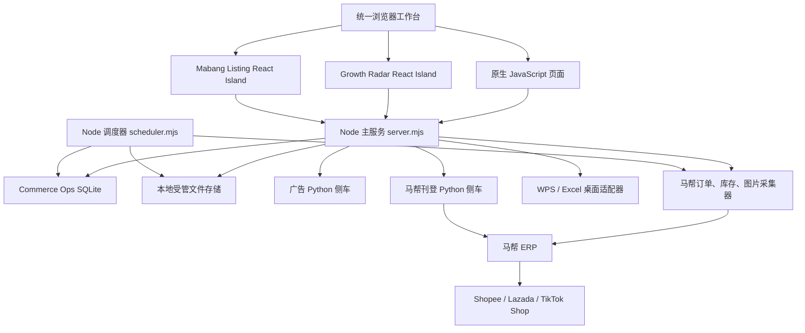
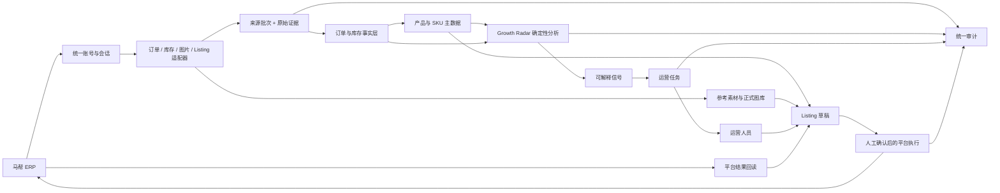
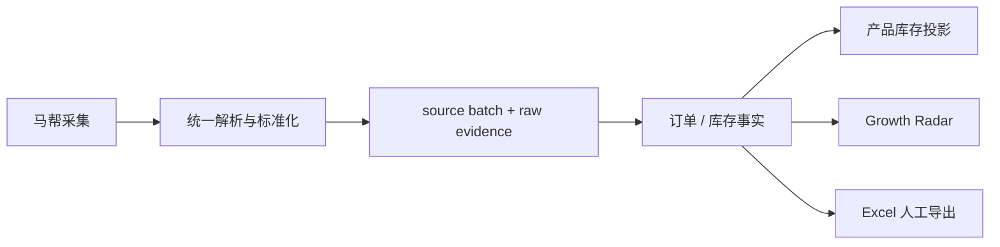
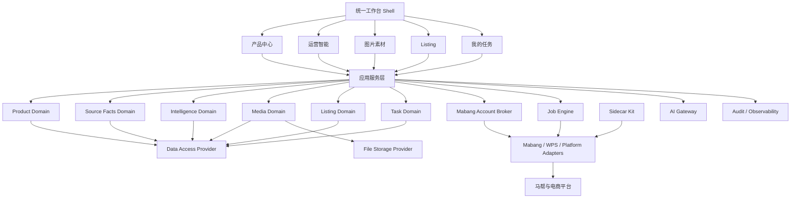
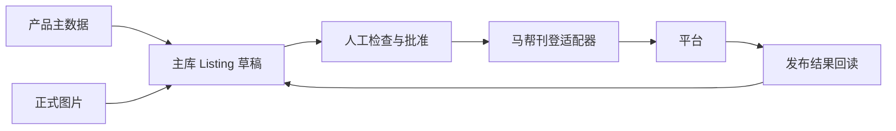

# Commerce Ops V1 系统架构地图

审计日期：2026-07-28

## 0. 审计边界与当前基线

本报告依据当前代码、迁移文件、主服务路由、前端入口、仓储实现和正式 SQLite 只读检查生成，不把设计文档中的候选能力自动视为已上线能力。

当前基线：

- Git 分支：`master`
- 工作树：存在多条并行在途修改，`master` 相对 `origin/master` ahead 2
- 正式数据库：`storage/commerce-ops.sqlite`
- 正式数据库最高迁移：`018_mabang_image_collection_performance.sql`
- 正式数据库表数量：61
- 正式数据库：`integrity_check=ok`，外键异常 0
- 正式库已有：COM-015 全量图片同步表
- 正式库尚无：`growth_analysis_runs`、`growth_focus_items`、`growth_focus_item_events`
- `019/020/021` 当前属于代码仓库中的候选迁移，尚未进入正式数据库

状态术语：

| 状态 | 含义 |
| --- | --- |
| 正式启用 | 正式库已有结构，主服务可直接读写 |
| 代码完成 | 代码、测试或构建存在，但仍有部署门禁 |
| 候选 | 只完成设计、迁移文件或隔离演练 |
| 隔离侧车 | 数据和进程独立于 Commerce Ops 正式库 |

## 1. 系统定位

Commerce Ops 是面向跨境电商运营的本地优先业务控制台。它连接马帮 ERP、产品资料、图片素材、Listing 和经营分析，把来源系统中的数据转化为：

1. 可追溯的订单、库存和产品事实；
2. 可解释的增长机会与风险；
3. 可由运营人员持续处理的任务；
4. 经人工确认后执行的图片、Listing 和平台操作。

系统不是马帮 ERP 的替代品，也不是平台订单或库存的最终权威源。当前合理定位是：

> Commerce Ops 负责统一事实、规则、任务、审计和运营执行编排；马帮及电商平台继续负责外部业务事实和最终发布状态。

核心原则：

- 来源事实、业务主数据、分析结果和执行状态分层。
- 外部数据必须保留来源批次、时间、范围和证据。
- Growth Radar 只使用确定性规则，不使用黑盒 AI 评分。
- 图片和 Listing 的高风险动作必须人工确认。
- 正式数据库、隔离侧车数据库和文件存储不得隐式混用。

## 2. 当前部署与技术结构

当前技术形态：

- 后端：Node.js 模块化单体，HTTP 路由集中在 `server.mjs`
- 后台任务：独立 `scheduler.mjs` 进程
- 数据库：SQLite，仓储层已开始抽象 provider
- 文件：本地文件系统，数据库保存相对路径或文件元数据
- 集成：Python worker、广告侧车、刊登侧车、WPS 桌面助手
- 前端：原生页面 + 两个 Shadow DOM React Island
- Growth Radar：React、TypeScript、Ant Design、Tailwind CSS、ECharts
- Mabang Listing：React、TypeScript、Fluent UI

## 3. 当前模块清单

### 3.1 产品中心

**状态：正式启用**

| 项目 | 内容 |
| --- | --- |
| 功能 | 产品包导入、SKU 主数据、类目/型号、包装与成本、库存投影、字段覆盖、软删除、正式图片、AI 文案、AI 图片任务、Listing 草稿 |
| 输入数据 | 产品包 Excel、人工字段修改、产品图片、COM-015 参考素材、AI 提供方输出 |
| 输出数据 | 产品与 SKU 主数据、正式图库、AI 内容版本、Listing 草稿和发布检查结果 |
| 前端位置 | `public/product-center-page.mjs`、`public/index.html`、`public/styles.css` |
| 后端位置 | `lib/product-center/`、`lib/data/repositories/product-*.mjs`、`lib/data/repositories/product-listing-repository.mjs` |
| API | `/api/product-center/*` |

主要数据库表：

- 导入与证据：`product_import_batches`、`product_import_files`、`product_import_rows`、`product_import_issues`、`product_import_field_changes`
- 产品主数据：`product_categories`、`product_models`、`product_skus`、`product_package_rows`
- 生命周期：`product_sku_lifecycle`、`product_sku_lifecycle_events`
- 业务投影：`product_packaging_profiles`、`product_cost_snapshots`、`product_inventory_snapshots`
- 人工覆盖：`product_field_overrides`、`product_field_override_events`、`product_detail_preferences`
- 正式图片：`product_images`
- AI 内容：`product_ai_contents`、`product_image_generation_tasks`、`product_image_generation_items`
- Listing：`product_listing_drafts`、`product_listing_publish_records`

架构边界：

- `product_skus` 是产品 SKU 主数据。
- `product_inventory_snapshots` 是产品中心投影，不应成为马帮库存事实的第二真源。
- `product_images` 是正式产品图库；COM-015 的 `product_media_assets` 是参考素材层。

### 3.2 马帮数据中心

**状态：正式启用**

| 项目 | 内容 |
| --- | --- |
| 功能 | 马帮账号配置、订单/库存手工采集、定时导出、Excel 证据、自动入库、钉钉通知、失败重试、WPS 助手 |
| 输入数据 | 马帮账号、采集范围、筛选条件、定时配置、马帮订单/库存响应、人工导出的 Excel |
| 输出数据 | Excel 证据文件、来源批次、订单事实、库存事实、关联指标、调度运行与审计事件 |
| 前端位置 | `public/app.js` 中马帮数据页、`public/index.html` |
| 后端位置 | `server.mjs`、`scheduler.mjs`、`lib/mabang-scheduler/`、`lib/mabang-data/`、`scripts/mabang_worker.py` |
| 桌面适配 | `integrations/mabang-getdata/`、`lib/mabang-wps-assistant-manager.mjs` |
| API | `/api/mabang-data/*`、`/api/mabang/account-profiles*`、`/api/mabang/scheduled-*`、`/api/mabang/export-files*` |

主要数据库表：

- 账号与通知：`mabang_account_profiles`、`dingtalk_robot_configs`
- 调度配置：`scheduled_export_tasks`
- 调度执行：`scheduled_export_runs`、`scheduled_export_run_events`
- 文件证据：`export_files`
- 运行协调：`scheduler_leases`、`mabang_filter_option_cache`
- 来源批次：`growth_source_batches`
- 订单事实：`growth_order_raw_rows`、`growth_order_headers`、`growth_order_lines`
- 库存事实：`growth_inventory_raw_rows`、`growth_inventory_snapshots`
- 事实关联：`growth_order_inventory_links`、`growth_sku_warehouse_sales_metrics`
- 数据质量：`growth_data_quality_issues`

架构边界：

- 自动采集和人工 Excel 应进入同一标准化入口。
- Excel 是证据和人工交换格式，不应继续作为系统内部中转数据库。
- `growth_order_*` 与 `growth_inventory_snapshots` 是 Growth Radar 应读取的事实真源。

### 3.3 Growth Radar

**状态：A2 正式启用；V2.2 代码完成但正式数据层未启用**

| 项目 | 内容 |
| --- | --- |
| 功能 | A2 来源批次、店铺/产品映射、数据质量、销售覆盖；V2.2 国家类目机会、SKU 指标、店铺诊断、确定性信号和运营任务 |
| 输入数据 | 标准订单事实、库存快照、店铺映射、负责人、仓库国家映射、指标规则配置 |
| 输出数据 | 分析运行、SKU/仓库/店铺指标、确定性信号、重点运营任务及事件历史 |
| 前端位置 | `frontend/growth-radar-v2/`、`public/growth-radar-v2-loader.mjs`、`public/growth-radar-workspace.mjs`；旧入口仍在 `public/growth-radar-page.mjs` |
| 后端位置 | `lib/growth-radar/`、`lib/growth-radar/v2/` |
| API | A2：`/api/growth-radar/*`；V2：`/api/growth-radar/v2/*` |

A2 正式数据库表：

- 批次与映射：`growth_source_batches`、`growth_shops`、`growth_shop_source_mappings`、`product_identity_mappings`
- 订单与库存：`growth_order_headers`、`growth_order_raw_rows`、`growth_order_lines`、`growth_inventory_raw_rows`、`growth_inventory_snapshots`
- 问题与历史：`growth_mapping_issues`、`growth_data_quality_issues`、`growth_mapping_events`
- 覆盖与关联：`growth_shop_sku_observations`、`growth_shop_sku_coverage_snapshots`、`growth_order_inventory_links`、`growth_sku_warehouse_sales_metrics`

V2.2 候选数据库表：

- 配置：`growth_country_mapping_sets`、`growth_warehouse_country_mappings`、`growth_rule_sets`
- 分析：`growth_analysis_runs`
- 指标：`growth_sku_daily_metrics`、`growth_sku_warehouse_daily_metrics`、`growth_shop_daily_metrics`、`growth_shop_sku_daily_metrics`
- 信号：`growth_signals`
- 任务：`growth_focus_items`、`growth_focus_item_events`
- 查询视图：`growth_open_focus_items_v`

正式启用门禁：

1. 批准并安全应用 `019/020/021`；
2. 生成第一份成功发布的正式分析；
3. 启用任务持久化写入；
4. 确认 `GRV2-METRICS-1.2.0` 是运行时和数据库的唯一合同版本。

### 3.4 图片素材（COM-015）

**状态：正式启用至迁移 018**

| 项目 | 内容 |
| --- | --- |
| 功能 | 马帮 SKU 图片发现、后台登录、下载校验、SHA-256 去重、全量分段、断点恢复、SKU 匹配、参考素材审核和正式图库保护 |
| 输入数据 | 马帮账号、库存 SKU、图片 URL、产品 SKU 主数据 |
| 输出数据 | 物理图片文件、图片资产元数据、来源发现记录、产品关联、批次与全量运行统计 |
| 前端位置 | `public/mabang-images-page.mjs`；产品中心参考素材展示位于 `public/product-center-page.mjs` |
| 后端位置 | `lib/mabang-images/`、`scripts/mabang_worker.py` |
| API | `/api/mabang-images/*` |

主要数据库表：

- 执行：`mabang_sku_image_batches`、`mabang_sku_image_checkpoints`、`mabang_sku_image_sync_runs`
- 来源发现：`mabang_sku_image_discoveries`、`mabang_sku_image_discovery_images`
- 资产与关系：`product_media_assets`、`product_media_links`
- 正式图库消费：`product_images`

文件边界：

- 图片二进制保存到受管文件目录，不保存到 SQLite。
- `product_media_assets` 按 SHA-256 表示物理资产。
- `product_media_links` 表示参考关系。
- 只有显式人工动作才能写入正式 `product_images` 或确认主图。

### 3.5 Listing 工作台

**状态：主库草稿能力正式启用；马帮实时刊登侧车已集成但保持隔离**

当前存在两条 Listing 能力线：

| 能力线 | 功能 | 数据位置 | 前后端位置 |
| --- | --- | --- | --- |
| 产品中心 Listing | 从产品事实生成和维护平台草稿、AI 内容、图片编排、发布前检查 | 主库 `product_listing_drafts`、`product_listing_publish_records` | `public/product-center-page.mjs`、`lib/product-center/product-listing-service.mjs` |
| 马帮在线商品与刊登 | Lazada/Shopee/TikTok Shop 在线查询、安全批改、复制商品、侧车草稿、发布和回读 | 隔离 `publisher.db`、`audit.jsonl`、进程内批改任务 | `frontend/mabang-listing/`、`integrations/mabang-getdata/`、`lib/mabang-listing-*.mjs` |

输入数据：

- 产品中心产品和 SKU 事实
- 正式产品图片或参考素材
- 平台、国家、店铺和类目配置
- 马帮在线商品实时数据
- 人工确认的批量修改和发布动作

输出数据：

- 主库 Listing 草稿及发布记录
- 马帮侧车草稿、发布任务、平台回读
- 在线商品修改结果
- 审计日志

主库数据库表：

- `product_listing_drafts`
- `product_listing_publish_records`
- `product_ai_contents`
- `product_images`

侧车数据库表：

- `publisher_schema_meta`
- `listing_drafts`
- `draft_variants`
- `draft_assets`
- `publish_jobs`
- `publish_events`
- `platform_listings`
- `publisher_audit_logs`

当前边界：

- 浏览器通过主服务 `/api/mabang-listing/*` 代理访问侧车。
- 侧车使用内部令牌和隔离存储，不访问正式 SQLite。
- 在线批改要求预览、明确确认、过期检查、串行执行和结果回读。
- 主库草稿和侧车草稿目前不是同一业务真源。

### 3.6 任务系统

**状态：多套任务系统并存，尚未形成统一平台能力**

| 任务类型 | 当前实现 | 持久化 | 状态特点 |
| --- | --- | --- | --- |
| 马帮定时导出 | `scheduler.mjs`、`lib/mabang-scheduler/` | `scheduled_export_tasks/runs/events` | 支持租约、补跑、跳过、重试 |
| 图片采集 | `lib/mabang-images/service.mjs` | batch、checkpoint、sync run | 支持分段、暂停/恢复、进程重启恢复 |
| Growth Radar 运营任务 | `lib/growth-radar/v2/` | 候选 `growth_focus_items/events` | 有负责人、优先级、生命周期、证据 |
| Listing 发布 | Python publisher | 侧车 `publish_jobs/events` | 有幂等键、发布轮询和平台回读 |
| Listing 批量修改 | Python 进程内 JOBS | 内存 | 进程重启后不能恢复 |
| AI 图片生成 | 产品中心服务 | `product_image_generation_tasks/items` | 领域专用状态机 |
| 文件扫描/审核 | 文件生命周期服务 | scan、item、quarantine 表 | 领域专用审批流程 |

相关前后端位置：

- 调度 UI：`public/app.js`
- 图片任务 UI：`public/mabang-images-page.mjs`
- Growth 任务 UI：`frontend/growth-radar-v2/`
- Listing 任务 UI：`frontend/mabang-listing/`
- 后端：各模块内部独立实现，没有统一 `lib/jobs/` 或任务协议

## 4. 支撑与遗留模块

虽然不属于本次六个核心业务域，但当前主工作台还包含：

| 模块 | 作用 | 主要位置 |
| --- | --- | --- |
| 竞品链接分析 | Lazada/Shopee/TikTok 商品提取、价格和主图分析 | `server.mjs`、`public/app.js` |
| 关键词分析 | 平台关键词和商品发现 | `server.mjs`、`public/app.js` |
| 广告分析 | 广告素材分析和独立侧车 | `lib/ad-service-*.mjs`、`ads/`、`public/` |
| 文件中心 | 文件登记、下载、扫描、隔离、恢复和人工审核 | `lib/files/` |
| 操作审计 | HTTP 与业务事件审计、清理 | `lib/security/audit-*.mjs` |
| AI Gateway | DeepSeek 等模型调用、模块和操作审计 | `lib/ai/` |

这些能力应作为横向平台服务治理，而不是继续塞入单个业务模块。

## 5. 数据真源与投影

| 业务对象 | 当前唯一真源 | 其他数据的正确定位 |
| --- | --- | --- |
| 马帮账号 | `mabang_account_profiles` | WPS、图片和 Listing 只消费短期会话 |
| 订单事实 | `growth_source_batches`、`growth_order_headers`、`growth_order_lines` | Excel 是来源证据 |
| 库存事实 | `growth_inventory_snapshots` | `product_inventory_snapshots` 是产品中心投影 |
| 产品与 SKU | `product_skus`、`product_package_rows` | 马帮 SKU 和 Growth 映射不创建第二套产品 |
| 参考图片 | `product_media_assets`、`product_media_links` | 来源发现表保存证据 |
| 正式产品图片 | `product_images` | 参考素材不能自动升级为正式图 |
| Listing 草稿 | 目标应为主库 `product_listing_drafts` | 侧车 `listing_drafts` 是当前兼容存储 |
| Growth 分析 | `growth_analysis_runs` 及其指标/信号 | 当前正式库尚未激活此层 |
| 运营任务 | `growth_focus_items/events` | 当前正式库尚未激活此层 |
| 平台在线状态 | 马帮实时读取 | 只在明确需要趋势时增加快照 |

## 6. 端到端数据流

推荐的简化采集链：

系统内部不应再采用“先生成 Excel，再由另一个模块重新解释 Excel”的默认链路。

## 7. 重复能力分析

### 7.1 重复登录与账号

| 现状 | 风险 | 推荐边界 |
| --- | --- | --- |
| 主项目保存加密马帮账号；WPS 和 Listing 侧车仍可拥有自己的登录输入或会话 | 密码重复、账号健康状态不一致、错误码分散 | 建立 Account Broker；浏览器只选择账号 ID，主服务签发一次性内部登录请求 |
| 图片、订单、库存、Listing 各自实现登录重试 | 同一账号可能被判定为不同健康状态 | 统一登录、验证、验证码、限流和失效处理 |

### 7.2 重复任务系统

调度、图片、Growth、Listing、AI 图片和文件扫描均维护自己的状态枚举、重试、进度和事件。重复点包括：

- `queued/pending/running/succeeded/failed` 命名不统一；
- 租约和并发控制重复；
- 幂等键位置不同；
- 有的持久化，有的只在内存；
- 进度、取消和进程恢复语义不一致；
- UI 无法形成统一“我的任务”视图。

目标不是把所有领域状态塞进一张表，而是统一任务协议和基础设施，领域表继续保存领域详情。

### 7.3 重复或近似数据

| 数据 | 当前重复面 | 结论 |
| --- | --- | --- |
| 库存 | `growth_inventory_snapshots` 与 `product_inventory_snapshots` | 前者是真实来源事实，后者只做产品中心投影 |
| 产品身份 | `product_skus` 与 `product_identity_mappings` | 产品表是真源，映射表只保存来源解析关系 |
| 图片 | `product_media_assets/links` 与 `product_images` | 前者是参考资产，后者是正式图库，禁止隐式合并 |
| Listing 草稿 | 主库 `product_listing_drafts` 与侧车 `listing_drafts` | 这是需要收敛的真实重复能力 |
| 订单/库存 Excel | `export_files` 与 Growth 事实表 | 文件是证据，事实表才用于查询分析 |
| 国家映射 | 产品 `country_raw`、Growth 仓库国家映射、前端常量 | 应收敛为共享配置服务，保留原始值和确认值 |

### 7.4 重复服务与运行时

- 广告侧车和 Listing 侧车重复实现子进程启动、探活、停止、内部令牌和固定代理。
- 主项目 `AiGateway` 与来源项目 `ai_service.py` 重复管理模型调用。
- 原生前端、Ant Design/Tailwind 和 Fluent UI 并存，认证请求、错误状态和设计 token 未共享。
- 外部原始项目与 `integrations/mabang-getdata` 曾同时保留源码，后续应以主仓集成目录作为唯一维护源，避免修复漂移。
- A2 原生 Growth 页面和 V2 React 工作区并存，入口和能力状态容易混淆。

## 8. 当前技术债

### P0：发布与数据安全

1. **候选迁移位于活动迁移目录**

   `openCommerceDataAccess()` 会在主服务或调度器初始化时调用 `scheduler.migrate()`。正式库当前停在 018，但 `019/020/021` 已在 `migrations/`。如果正式进程重启，候选迁移可能在没有独立批准动作的情况下被自动应用。

   建议：

   - 正式启动不自动应用未批准迁移；
   - 使用显式 allowlist、目标版本或单独 migration 命令；
   - 候选迁移放在非活动目录，批准后再进入正式迁移集；
   - 启动时只检查漂移，迁移由独立部署步骤执行。

2. **混合工作树缺少可发布基线**

   Growth、COM-015、Listing、文档和测试同时在途，且大量文件未跟踪。当前很难证明某次提交只包含一个业务节点。

3. **Growth V2 代码与正式库能力不一致**

   前端和后端已有 V2.2 能力，但正式库没有 019-021。必须保持 fail-closed，不能把“代码可见”展示成“正式分析已发布”。

4. **指标合同和交付文档存在版本漂移**

   早期报告仍引用 `GRV2-METRICS-1.1.0`，后续正式合同和运行时已调整到 `1.2.0`。需要单一合同注册表和生效状态。

### P1：一致性与维护成本

5. **Listing 双草稿真源**

   主库和侧车都保存草稿、发布状态和事件。长期双写会产生版本、审批和回读冲突。

6. **账号与会话重复**

   密码和登录逻辑分散在 Node、Python、WPS 和浏览器会话中。

7. **任务基础设施重复**

   Listing 批改任务还在内存中，进程重启后不能恢复；其他任务的状态和事件协议也不一致。

8. **巨型文件**

   当前热点约为：

   - `server.mjs`：2,900 行级
   - `public/app.js`：2,600 行级
   - `mabang_listing_service.py`：2,900 行级
   - `ListingDashboard.tsx`：2,200 行级
   - `growth-radar-service.mjs`：1,300 行级

9. **前端运行时和依赖版本分裂**

   两个 React Island 使用不同 UI 库、不同 TypeScript 版本和不同 React 补丁版本。认证 fetch、错误处理、设计 token、图表加载和审计 request ID 尚未形成共享包。

10. **vendored 源码同步问题**

    原目录和集成目录没有明确上游同步规则。修复必须决定在哪一份代码发生，并有可审计的同步方式。

### P2：规模化与可运维性

11. **SQLite 单机与多进程写入边界**

    当前适合本机部署，但主服务、调度器和未来更多后台任务同时写入时，需要更清晰的事务、忙等重试和写入所有权。

12. **文件存储 provider 尚未统一**

    导出文件、产品图片、参考素材、AI 图片和侧车文件仍有不同目录约定。

13. **跨进程可观测性不足**

    request ID 尚未完整贯穿 Node、Python、马帮请求、发布任务和审计记录。

14. **前端包体和加载策略**

    Growth Radar 图表和 Listing 工作台需要按页面及深层功能懒加载，避免首次进入主工作台时加载完整业务包。

## 9. 推荐未来架构

推荐采用：

> 模块化单体控制面 + 受管适配器/侧车 + 单一业务真源 + 统一任务协议 + React Island 渐进迁移

现在不建议直接微服务化。

### 9.1 目标模块边界

| 目标模块 | 所有权 |
| --- | --- |
| Product Domain | 产品、SKU、包装、成本、产品属性 |
| Source Facts Domain | 来源批次、订单、库存、原始证据、标准化 |
| Intelligence Domain | 指标、信号、规则版本、分析运行 |
| Task Domain | 通用任务协议、负责人、进度、事件和幂等 |
| Media Domain | 参考资产、正式图库、来源和文件 provider |
| Listing Domain | 草稿、版本、审批、发布记录、平台回读 |
| Integration Layer | 马帮协议、WPS、Chrome、平台 API |
| Platform Services | 账号代理、AI Gateway、审计、文件、安全、可观测性 |

### 9.2 数据源简化

统一入口：

1. 所有订单和库存来源先转成标准记录；
2. 统一写 `growth_source_batches` 和原始证据；
3. 事务性生成订单/库存事实；
4. 产品中心和 Growth Radar 都从事实层生成自己的投影；
5. Excel 只作为人工导入、导出和审计证据；
6. SKU、仓库、国家、店铺和负责人映射通过共享配置服务维护。

### 9.3 Listing 闭环

目标流程：

Python 侧车应最终退化为协议执行器，不再拥有长期草稿真源。

### 9.4 AI 边界

- AI 可以生成内容、图片候选和解释文本。
- AI 不得修改来源事实、规则阈值或任务优先级。
- Growth Radar 的信号必须由确定性规则产生。
- AI 输出必须经过 schema 校验、证据引用、人工确认和审计。

## 10. 未来开发优先级

### P0：先建立可发布基线

1. 修复候选 migration 的自动应用风险。
2. 将混合工作树按模块形成可审计提交和发布清单。
3. 建立合同注册表，统一 `GRV2-METRICS-1.2.0` 生效状态。
4. 明确正式库 018 与候选 019-021 的部署门禁。
5. 为真实业务快照、账号、店铺和商品标识增加 CI 泄漏扫描。

### P1：收敛平台基础能力

1. 建立 Account Broker，统一马帮账号和会话。
2. 抽取通用 Sidecar Kit。
3. 定义统一任务协议和 Job Engine，优先迁移内存 Listing 任务。
4. 将 Listing 草稿和发布记录收敛到主库。
5. 建立共享仓库/国家/店铺/负责人映射服务。

### P2：完成业务闭环

1. 经审批正式启用 Growth Radar 019-021。
2. 将确定性信号稳定转换为店长任务。
3. 从任务跳转到产品、素材或 Listing 草稿，并回写处理结果。
4. 产品中心正式消费马帮参考素材。
5. Listing 发布结果统一回读主库。

### P3：降低维护成本

1. 拆分 `server.mjs`、`public/app.js` 和两个巨型侧车/页面。
2. 建立前端共享运行时和设计 token。
3. 统一 AI Gateway。
4. 给 Growth 图表和 Listing 深层功能做懒加载。
5. 建立 vendored 上游同步策略。

### P4：有规模需求后再做

1. 文件 provider 接入 MinIO/S3。
2. 按模块迁移 PostgreSQL，而非一次性搬迁全部 SQLite。
3. 多实例任务调度、集中日志和指标监控。
4. 在业务模型稳定后评估消息队列。

## 11. 不建议现在做

- 不为“架构漂亮”立即拆微服务。
- 不在迁移门禁未解决前重启正式服务并自动迁移。
- 不让订单、库存、图片和 Listing 继续维护不同账号密码。
- 不让产品库存投影反向覆盖来源库存事实。
- 不把参考素材自动升级为正式主图。
- 不让主库和侧车长期保持两套 Listing 草稿真源。
- 不在任务协议尚未收敛时新增第三套通用任务表。
- 不在业务真源未稳定前整体迁移 PostgreSQL 或引入复杂消息队列。

## 12. 总结

Commerce Ops 已经具备从马帮采集、产品管理、图片资产、经营分析到 Listing 执行的主要能力，但当前更像多个成熟功能模块共享一个工作台，而不是已经完全收敛的平台。

V1 下一阶段的核心不是继续增加页面，而是完成四个收敛：

1. **数据真源收敛**：订单、库存、产品、图片、Listing 各有唯一所有者。
2. **账号会话收敛**：所有马帮能力共享安全账号代理。
3. **任务生命周期收敛**：调度、采集、分析和发布共享任务协议。
4. **部署门禁收敛**：迁移、合同、代码和正式库状态可以被独立证明。

完成这些基础后，Growth Radar 才能稳定地产生运营任务，运营任务才能安全地驱动产品、图片和 Listing 执行，形成真正的业务闭环。

## 13. Foundation V1 实施增量

Foundation V1 已按照上述收敛方向形成候选实现：

- `product_models`、`product_skus`、`growth_shops` 被正式指定为 Product、SKU、Store 主数据，不再新增平行表。
- 新增来源系统与集成账号注册表，密文仍只由原凭证表保管。
- 新增 Warehouse、Owner 主数据以及通用来源身份链接。
- 新增统一任务外壳、事件、重试与租约，领域表仍是各自业务状态真源。
- Mabang 调度、COM-015、Growth Radar 和 Listing 通过适配器投影到统一任务协议。
- Listing 账号桥接器可复用马帮密文所有者，只在内存解密并激活 Listing 能力。

候选迁移位于 `migrations/candidates`，未进入正式迁移目录。正式库仍保持
`018_mabang_image_collection_performance.sql`，Foundation 运行时启用等待单独审批。
