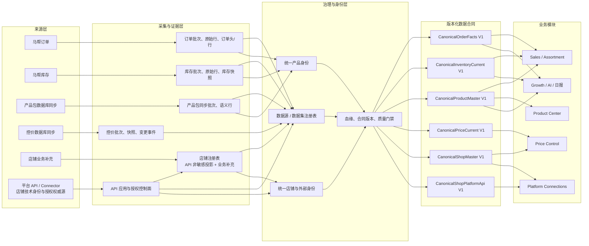
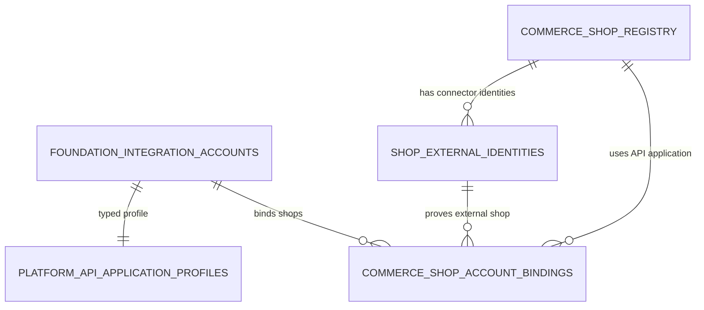

# Commerce Ops 统一数据底座 V1

状态：候选架构，已完成隔离迁移演练，尚未应用生产迁移  
合同版本：1.0.0  
设计时间：2026-08-08

## 1. 结论

订单、库存、产品包、控价和店铺的粒度不同，不能合成一张大宽表。否则一个订单行会被仓库、店铺和价格类型重复展开，销售额、库存量和价格点都会倍增。

合理结构是：

1. 各来源保留自己的原始证据和事实表；
2. 用统一产品身份和统一店铺身份连接；
3. 每种业务粒度只发布一个版本化标准视图；
4. 模块只能通过数据集合同读取，不再自行过滤 `source_system` 或拼店名；
5. 新表通过数据集注册表声明为 `GLOBAL` 或 `MODULE_LOCAL`，不复制到各模块。

## 2. 唯一业务口径

| 业务语义 | 唯一真源 | 明确不能替代 |
|---|---|---|
| 订单、销量、订单金额 | 马帮订单 | 产品包销量字段、平台临时查询 |
| 当前库存、在途、预测日销 | 马帮库存 `growth_inventory_snapshots` | 产品包投影 `product_inventory_snapshots` |
| 产品/SKU、国家、类目、规格、成本 | 数据库同步产品包 | 订单商品名、库存类目 |
| 当前控价和变更 | 已审批 CA 控价批次 | 未审批批次；任意挑选一个价格类型 |
| 店铺技术身份、平台、国家、平台状态 | Platform API / Connector | 人工店铺明细、`growth_shops`、店名匹配 |
| 店铺业务补充（负责人、品类、控价店型） | `commerce_shop_registry` 的业务补充字段 | Connector 授权信息或店名推断 |
| API 应用、能力、授权和 Token 健康 | Connector / Token Broker 控制面 | PostgreSQL 投影或存量 Token 状态字段 |

缺失值必须保留为 `UNKNOWN` 或对应质量状态，不能静默补成 `0`。

## 3. 目标架构流程图

## 4. 模块与数据集绑定

| 模块 | 必需数据集 | 说明 |
|---|---|---|
| Sales / Assortment | 马帮订单、马帮当前库存、产品包、产品主数据 | 店铺和产品映射在标准事实发布前完成，模块不再自己拼接 |
| Product Center | 产品包、产品主数据 | 产品包数据库同步是正式写入入口 |
| Price Control | 当前控价、店铺主数据、控价店铺范围 | 通过平台 + 国家 +控价店铺类型落到店铺 |
| Platform Connections | Platform API 店铺集合、API 控制面、本地业务补充 | 配置页直接采用 API 店铺集合；业务主库只存非秘密投影和补充字段 |
| Growth / AI / 日报 | 已发布的订单、库存和产品合同 | 不直接读来源底表，不另造指标口径 |

## 5. 平台 API 配置与店铺关系

复用现有 Foundation 账号，不再创建第四套账号主表：

关系规则：

- 一个 API 应用可以绑定多家店铺；
- 一家店可以保留历史/备用应用，但同一时点只允许一个主 `platform_gateway` 绑定；
- API 应用平台、店铺平台、Connector 外部身份平台必须一致；
- 只有 `CONFIRMED` 的外部店铺身份可以创建授权绑定；
- Token、Refresh Token、Client Secret 始终留在 Connector 加密存储；PostgreSQL 只保存应用 ID、授权引用、状态和校验时间；
- `commerce_shop_registry.platform_connector_shop_id` 迁移后废弃，Connector ID 属于外部身份和账号绑定，不是店铺自身的单值属性。

当前 API / Connector 有 134 家店：130 家已通过强外部 ID 关联，4 家为 API-only，9 家为 registry-only，另有 2 家身份冲突。配置页以 134 家 API 集合为准；4 家可在显式同步时创建投影，9 家保留历史但不进入 API 配置，2 家冲突保持 fail-closed。店名候选只能进入确认队列，不能自动写成已确认关系。

## 6. 全局加入与局部加入

### GLOBAL

- 发布为共享合同；
- 任何模块都可以申请显式绑定；
- 新模块复用同一标准视图，不复制数据；
- 典型数据：订单、库存、产品、控价、店铺。

### MODULE_LOCAL

- 只允许 owner module 绑定；
- 可以引用全局 `shop_id`、`canonical_product_id`，但不能覆盖公共事实；
- 典型数据：API 控制面、Growth 指标、Listing 草稿、AI Context、履约执行记录。

局部数据要晋升全局，必须新增合同版本、定义粒度和业务键、补齐身份映射、通过质量门禁后再发布。

### 新表接入必填合同

| 字段 | 必填内容 |
|---|---|
| `dataset_code` | 永久稳定的数据集代码 |
| `source_code` | 数据来源，不与数据集代码混用 |
| `publish_scope` | `GLOBAL` / `MODULE_LOCAL` |
| `owner_module_code` | 唯一维护模块 |
| `grain_json` | 每一行代表什么 |
| `business_key_json` | 去重与幂等键 |
| `history_mode` | APPEND / SNAPSHOT / LATEST / SCD2 / REFERENCE |
| `contract_version` | 字段和口径版本 |
| `freshness_sla_minutes` | 新鲜度阈值 |
| 字段规则 | 类型、必填级别、NULL 语义、身份角色、敏感等级 |
| 质量规则 | 阻断条件、告警条件、失败行证据 |

## 7. 首批标准视图

- `app.canonical_mabang_order_lines_v`
- `app.canonical_mabang_inventory_current_v`
- `app.canonical_product_package_current_v`
- `app.canonical_product_sku_v`
- `app.canonical_price_control_current_v`
- `app.canonical_shop_master_v`
- `app.canonical_price_control_shop_v`
- `app.canonical_shop_platform_api_v`

其中 `product_inventory_snapshots` 明确降级为“产品包中的库存参考”，不能作为库存合同来源。

## 8. 已落地的安全修正

- 产品包正式来源常量统一到 `ai_project_a_product_package`；
- Sales / Assortment 三处旧来源硬编码已改为统一常量和参数查询；
- Product Package、Price Control、Foundation 产品身份解析共用同一来源常量；
- 店铺 Repository 统一经过跨 SQLite/PostgreSQL 占位符转换，JSONB 元数据不再被丢弃；
- Growth Readiness 的订单日期统计改为 PostgreSQL 上海时区表达式，移除 `timestamptz` 上的 `SUBSTR`；
- 提供只读数据缺口审计脚本；
- 候选迁移已在独立临时 PostgreSQL 数据库执行通过并自动删除临时库；
- 未应用生产数据库迁移，未回填任何身份关系。

## 9. 仍需明确的金额口径

新产品包不再提供 `price_tier_20/25/35/45`，而当前 116,700 个订单行的 `line_amount` 也全部为空。Sales 现在用“数量 × 产品包 45% 价格”计算金额已失去数据依据。

推荐顺序：

1. 首选补采马帮订单行实际成交金额；
2. 若只能取得订单头金额，必须批准并版本化一套分摊规则；
3. 不建议直接用控价代替成交价；若业务确实需要估算，必须明确平台、店铺、常规/活动/大促价格类型并标记为估算值。

在规则确认前，金额应显示 `UNKNOWN / 数据不足`，不能显示为 0。

## 10. 分阶段迁移

1. 应用数据目录、身份桥、API Profile 与标准视图候选迁移；
2. 将 92 个店铺唯一匹配写入 `REVIEW_REQUIRED` 候选，人工确认后再建立 API 绑定；
3. 修复店铺币种与 `provider_shop_type='1'` 到 STANDARD/MALL 的代码映射；
4. 按正式产品包重新生成产品身份，回填订单和库存映射；
5. Price Control 增加 canonical product/shop 关联并处理未匹配队列；
6. Sales、Product、Price、Growth/AI 逐个切到标准视图，进行行数、业务键和汇总双读；
7. 稳定一个发布周期后，单独审批下线旧来源、旧身份和重复 Token 表。

生产迁移前必须具备：备份、隔离演练、迁移窗口、回滚边界和数据回填脚本；本设计不授权直接清理历史表。
