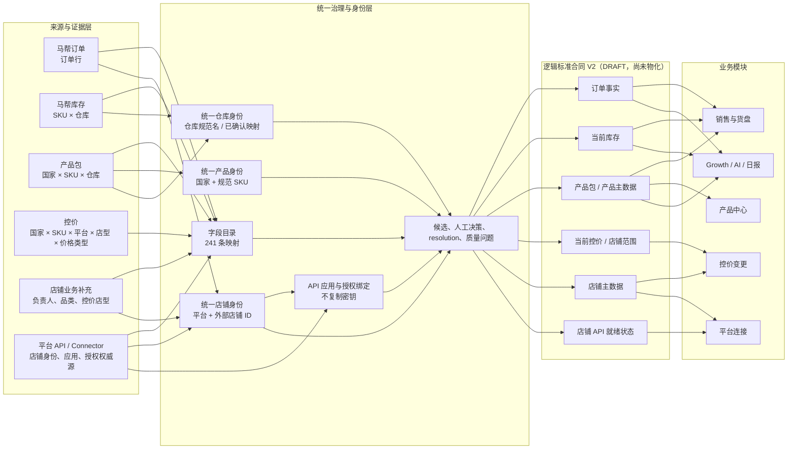
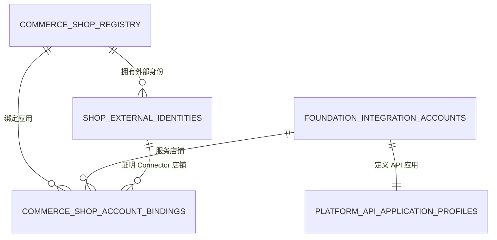

# Commerce Ops 统一字段与身份映射 V2

状态：实现候选；014 纯治理隔离演练通过，生产合同尚未切换  
日期：2026-08-08  
范围：马帮订单、马帮库存、产品包、控价、店铺明细、平台 API / Connector

## 1. 结论

系统不应把六类来源横向合并成一张宽表。它们的业务粒度不同，正确做法是保留各自事实，再通过统一产品、店铺、仓库和 API 应用身份连接。

本版已经建立：

- 6 类来源、241 个源字段的机器可读映射；
- 6 条跨来源身份规则；
- 字段目录、身份候选、人工决策、resolution 和问题队列的数据库候选结构；
- 8 个 V2 数据合同，当前均为 `DRAFT`，没有物理关系、没有替换 V1；
- 新表按 `GLOBAL` 或 `MODULE_LOCAL` 接入的统一入口。

## 2. 架构与数据流

## 3. 来源口径与业务粒度

| 来源 | 权威内容 | 标准粒度 | 关键连接键 | 主要消费者 |
|---|---|---|---|---|
| 马帮订单 | 订单、销量、成交字段 | 一条当前订单行 | 平台、店铺、订单号、行键、SKU | 销售与货盘、Growth、日报 |
| 马帮库存 | 当前库存、在途、预测日销、可售天数源值 | 一个 SKU × 一个仓库 | 规范仓库名 + 规范 SKU | 销售与货盘、Growth |
| 产品包 | 产品、国家、类目、规格、成本、仓库属性 | 国家 × SKU × 仓库 × 源行 | 国家 + `sku_code_normalized`；仓库名 | 产品中心、销售与货盘、Growth |
| 控价 | 已审批当前价格及变更 | 国家 × SKU × 平台 × 店型 × 价格类型 | 国家 + SKU；平台 + 国家 + 店型 | 控价变更 |
| 店铺业务补充 | 负责人、上级、品类、控价店型及审核状态 | 一个平台卖家店铺 | 已确认 Connector 店铺 ID | 全局店铺维度补充 |
| 平台 API / Connector | 店铺技术身份、平台、国家、平台状态、应用、授权、能力和 Token 健康 | 店铺 × API 应用 × 能力 | Connector 店铺 ID；平台 + 国家 + Seller ID | 平台连接与全局店铺身份（凭据局部敏感） |

## 4. 字段映射目录

| 来源代码 | 字段数 |
|---|---:|
| `MABANG_ORDERS` | 58 |
| `MABANG_INVENTORY` | 30 |
| `PRODUCT_PACKAGE_DB` | 62 |
| `PRICE_CONTROL_DB` | 27 |
| `SHOP_MASTER` | 29 |
| `PLATFORM_CONNECTOR` | 35 |
| 合计 | 241 |

映射方式：`DIRECT` 75、`NORMALIZE` 137、`EXPAND` 16、`REDACT` 13。每条记录同时定义源关系、源字段、标准字段、转换器、必填等级、NULL 语义、身份角色、敏感等级、发布范围和基数。

完整逐字段清单见：

- `docs/reports/COMMERCE-OPS-UNIFIED-FIELD-MAPPING-20260808.csv`
- `docs/reports/COMMERCE-OPS-UNIFIED-IDENTITY-RULES-20260808.csv`

## 5. 跨来源身份规则

| 规则 | 来源键 | 目标键 | 自动策略 |
|---|---|---|---|
| 订单店铺 → 店铺主数据 | `shop.platform` + `shop.source_shop_name` | `shop.platform` + `shop.normalized_shop_name` | 唯一候选仍需确认；名称不能直接授权 |
| 马帮仓库 → 产品包仓库证据 | `warehouse.source_warehouse_name` | `product.warehouse_raw` | 只有已确认且唯一的仓库映射才可使用 |
| 库存 → 产品包 | 仓库源名 + `product.source_sku` | 产品包仓库 + `product.sku_code` | 国家和产品同时唯一才可生成自动候选 |
| 产品包 → 产品主数据 | `product.country_raw` + `product.sku_code` | `product.country_code` + `product.sku_code_normalized` | 目标唯一才可生成自动候选 |
| 控价 → 店铺范围 | `price.platform` + 国家 + `price.shop_type` | 店铺平台 + 国家 + `control_shop_type` | 允许一个价格范围落到多家店 |
| Connector → 店铺投影 | Connector 店铺 ID；平台 + 国家 + `seller_id` | 投影的 Connector ID；平台 + 国家 + `platform_shop_id` | 强 ID 幂等投影；API-only 自动建投影；代码/名称匹配只进入复核 |

“唯一候选”不等于“已确认”。候选、决策与 resolution 被拆开管理；本候选迁移没有事实回填执行器或回滚账本，任何事实写回都必须由后续独立迁移、CAS 校验和单独审批完成。

## 6. 关键字段口径

- 产品纯 SKU 使用 `sku_code_normalized`；现有 `normalized_sku` 含 `国家|SKU` 的复合语义，不能当纯 SKU 连接。
- 库存当前值在确认马帮是完整快照前，沿用“最新成功完整批次”口径；只有源端正式声明增量、删除和水位语义后，才允许改成逐键最新，避免幽灵库存。
- 产品包是多仓粒度。同一国家 + SKU 出现多个仓库以及跨仓成本不同是合法事实；只有同一国家 + SKU + 仓库内成本不一致才是冲突，不能任取一行。
- 控价宽表的 15 个价格列展开成长表；一个价格范围到多家店铺是业务规定的 `1:N`，不是重复数据。
- 订单 `商品总金额` 即使源字段存在，当前也标为 `unconfirmed`，直到币种、含税/优惠口径以及行级/订单级语义被确认；`商品销售单价 × 数量` 只能作为复核估算，不能写回正式 GMV。
- `当前可售天数` 可直接从马帮库存原始字段恢复；`locked_quantity` 和 `sellable_quantity` 没有来源，必须保持未知。
- `未发货量` 与 `分仓调拨未发货量` 是两个独立事实，禁止互相 fallback；分别落到普通待发和调拨待发字段。
- 订单买家/联系方式以及 Connector Token 字段在采集边界删除或隔离，共 13 个字段不发布到全局合同。

## 7. 平台 API 配置与店铺明细

正式关系为：

Platform API / Connector 是店铺技术身份与授权的权威源；`commerce_shop_registry` 只保存其非敏感投影，并叠加负责人、品类、控价店型等业务补充。业务 PostgreSQL 只存应用引用、外部身份、授权状态摘要、到期时间和能力；Access Token、Refresh Token、Client Secret 继续留在 Connector 加密存储。配置列表 GET 直接以 Gateway 店铺集合为基准且保持只读，只有显式同步动作才更新投影。国家默认币种按 `SHOP_SITE_DEFAULT_CURRENCY_V1` 派生并标明不是订单结算币种；Mall/C 店型、负责人和品类不得从 API 授权或店名推断。

## 8. 模块使用规则

| 模块 | 允许读取的统一数据集 |
|---|---|
| 销售与货盘 | 订单、当前库存、产品包、产品主数据、店铺主数据 |
| 产品中心 | 产品包、产品主数据 |
| 控价变更 | 当前控价、控价店铺范围、店铺主数据 |
| 平台连接 | 店铺主数据、平台 API 控制面 |
| Growth / AI / 日报 | 发布后的订单、库存、产品、店铺合同 |

模块不得自行按店名、旧 `source_system` 或任意产品包行重复拼接。

## 9. 新表全局/局部接入

新增数据集必须登记：`source_code`、`dataset_code`、`scope`、owner、粒度、业务键、历史模式、合同版本、新鲜度、字段目录、身份规则和质量门禁。

- `GLOBAL`：通过版本化标准合同共享，模块申请显式绑定，不复制数据。
- `MODULE_LOCAL`：只允许 owner 模块使用，可引用全局产品/店铺 ID，但不能覆盖全局事实。
- 局部数据晋升全局：新建合同版本，完成身份映射和双读校验后发布，禁止原地改口径。

## 10. 上线边界

`014_identity_crosswalk_backfill_candidate.sql` 只创建治理目录和 V2 草稿合同：不创建 V2 业务视图、不修改事实表、不回填身份、不改变模块绑定。V1 未被覆盖，生产库也未执行该迁移。正式上线仍需单独批准：备份、迁移窗口、脚本指纹、候选确认、独立回填方案、双读阈值、回滚边界和模块切换顺序。字段映射的 `ACTIVE` 发布还会强制校验当前合同版本、质量运行和物理关系；现阶段只能同步为 `DRAFT`。

隔离 PostgreSQL 已验证：事实/绑定表结构与行数不变、模块绑定不变、V2 view 为 0、backfill ledger 为 0、8 个 V2 合同均为未物化 DRAFT、重复执行会拒绝，且 9 项治理约束负向测试通过。详见 `docs/reports/COMMERCE-OPS-UNIFIED-GOVERNANCE-014-REHEARSAL-20260808.md`。
