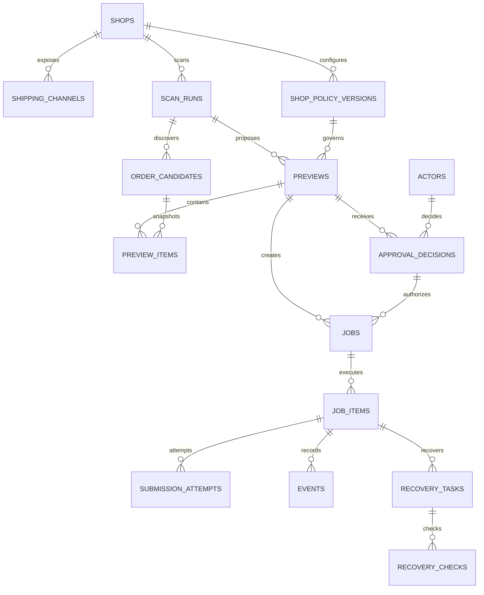

# Fulfillment V2 Database Design

## 1. Status and scope

- Status: design candidate; not approved for production cutover.
- Target: PostgreSQL, isolated in the `fulfillment` schema.
- Current SQLite database remains read-only evidence during migration.
- This design covers discovery, preview, approval, execution, recovery, auditing, and reliable notifications.
- It does not make the fulfillment database the source of truth for marketplace orders. Order payloads are immutable execution snapshots.

## 2. Required decisions

The following decisions are fixed for V2:

1. Every real submission must reference an immutable preview.
2. Every real submission must reference an approval decision.
3. Manual approval must record the specific authenticated operator.
4. Automatic approval must record a service actor and policy evidence; it must never impersonate a human.
5. Approval, execution events, and submission attempts are append-only audit evidence.
6. External submission is protected by a durable idempotency key.
7. Existing SQLite data is migrated without deleting or mutating the legacy database.

## 3. Actor and approval contract

### 3.1 Actor identity

`fulfillment.actors` stores a stable local reference to an authenticated identity:

- `actor_type`: `human`, `service`, or `system`.
- `auth_source`: identity provider or trusted caller, such as `commerce_ops`, `windows`, or `scheduler`.
- `external_subject`: immutable subject from that provider. Usernames alone are not sufficient.
- `display_name`: current display label.

The application must resolve an actor before accepting a manual approval. A caller-provided display name without an authenticated subject is rejected.
An existing `(auth_source, external_subject)` identity may update its display name but may not change between human, service, and system actor types.

### 3.2 Approval evidence

`fulfillment.approval_decisions` is append-only and records:

- actor reference plus actor type, subject, and display-name snapshots;
- decision: `approved`, `rejected`, or `revoked`;
- approval mode: `manual` or `automatic`;
- preview hash and policy hash approved by the actor;
- request ID, authentication source, source IP, and user agent;
- reason code, optional note, and decision timestamp.

Snapshots preserve the historical operator identity even if the identity provider later changes the user's display name.

For automatic fulfillment, the actor must be a registered `service` actor, the mode must be `automatic`, and `reason_code` must identify the policy path that authorized execution.

### 3.3 Revocation

Approval rows are never updated. Revocation inserts a new `revoked` decision referencing the earlier approval through `supersedes_decision_id`. A queued job may be cancelled after revocation; a job that has started submission remains audit-visible and moves according to execution state.

## 4. Data domains

### 4.1 Configuration

- `shops`: canonical fulfillment shop identity.
- `shipping_channels`: observed channel catalog by shop.
- `shop_policy_versions`: immutable policy versions with hashes.
- `actors`: human and machine identities used by approval and audit records.

### 4.2 Discovery and preview

- `scan_runs`: one scheduler or manual discovery operation.
- `order_candidates`: immutable order snapshots discovered during a scan.
- `previews`: immutable execution proposal bound to a shop and policy version.
- `preview_items`: selected and excluded candidates with eligibility evidence.

### 4.3 Approval and execution

- `approval_decisions`: append-only manual or automatic decisions.
- `preview_approval_state`: one mutable projection pointing to the latest decision; decision history remains append-only.
- `jobs`: execution batch created from one approved preview.
- `job_items`: per-order execution state.
- `submission_attempts`: every external API attempt and result.
- `idempotency_keys`: durable reservation preventing duplicate fulfillment.
- `events`: append-only state and operational audit stream.

### 4.4 Recovery and delivery

- `recovery_tasks`: tracking-number or uncertain-submission recovery workflow.
- `recovery_checks`: every automated or manual recovery check.
- `outbox_messages`: transactional notification and integration delivery.

## 5. Core relationships



## 6. State machines

### 6.1 Preview

`pending -> approved | rejected | expired | cancelled`

Only a `pending` preview with an unexpired approval challenge may receive an approval decision.

### 6.2 Job

`queued -> running -> succeeded | partially_succeeded | failed | needs_attention | cancelled`

A job can be inserted only for an `approved` decision whose preview hash and policy hash match the preview.

### 6.3 Job item

`queued -> submitting -> succeeded | failed | recovery_required | needs_attention | cancelled`

Retries append `submission_attempts`; they do not overwrite previous request or response evidence.

### 6.4 Recovery

`pending -> checking -> waiting -> retry_ready -> recovered | manual_attention | expired | cancelled`

## 7. Integrity rules

1. `(platform, external_shop_id)` uniquely identifies a shop.
2. `(shop_id, version)` and `(shop_id, policy_hash)` uniquely identify policy versions.
3. `(scan_run_id, order_key)` uniquely identifies a discovered candidate in one scan.
4. `(preview_id, order_key)` uniquely identifies a preview item.
5. A preview contains candidates from one shop only; the service validates this transactionally.
6. `preview_approval_state` allows only one current decision per preview; transitions update it with optimistic locking.
7. Only one job is allowed per preview and per approved decision; retry uses submission attempts, not a second job.
8. Only one active idempotency reservation is allowed per fulfillment order scope.
9. Approval identity snapshots and hashes are required, never nullable.
10. Raw request and response payloads are redacted before persistence.

## 8. PostgreSQL type policy

- Internal IDs: `uuid`, generated by the application or `gen_random_uuid()`.
- External IDs and order keys: `text`.
- Time: `timestamptz` stored in UTC.
- Money: `numeric(20,6)` when introduced; never floating point.
- Flags: `boolean`.
- Structured evidence and snapshots: `jsonb`.
- IP address: `inet`.
- Hashes: lowercase hexadecimal `text` with length checks where practical.

## 9. Identity propagation API

Manual approval requests must provide authenticated server-side context equivalent to:

```json
{
  "actorId": "local actor UUID",
  "actorType": "human",
  "authSource": "commerce_ops",
  "externalSubject": "immutable identity-provider subject",
  "displayName": "operator display name",
  "requestId": "request correlation ID"
}
```

The browser must not be trusted to populate these fields directly. The API derives them from the authenticated session and records source IP and user agent separately.

## 10. Retention

- Approvals, events, jobs, job items, and recovery outcomes: permanent business evidence.
- Submission attempts: retain structured result permanently; large redacted payloads may move to object storage after 180 days.
- Order candidate snapshots: online for 180 days, then archive according to compliance policy.
- Scan runs with no candidates: online for 90 days.
- Outbox messages: purge delivered payloads after 90 days while retaining delivery metadata.

Retention jobs must never remove evidence referenced by an active job, approval, recovery task, or unresolved incident.

## 11. Migration strategy

### Phase A: foundation

1. Create the PostgreSQL schema from `fulfillment-v2-postgresql-schema.sql`.
2. Register service actors for scheduler and fulfillment worker.
3. Import shops, channels, and current policies.
4. Verify constraints and backup/restore procedures.

### Phase B: historical import

1. Import legacy previews and preview orders as immutable snapshots.
2. Import batches and batch orders as jobs and job items.
3. Create migration events identifying the legacy primary keys.
4. Import tracking recoveries and checks where evidence exists.
5. Mark legacy confirmations without authenticated operators as `legacy_unattributed`; never invent an operator.

### Phase C: shadow write

1. Keep SQLite as the production write path.
2. Shadow-write V2 records without allowing PostgreSQL to submit orders.
3. Compare counts, terminal states, idempotency reservations, and recovery queues.

### Phase D: controlled cutover

1. Pause new fulfillment scheduling.
2. Drain or classify active legacy batches.
3. Run final incremental migration and reconciliation.
4. Switch reads, then writes, then external submission.
5. Keep the SQLite database immutable for rollback evidence.

## 12. Acceptance gates

- A manual confirmation without an authenticated human actor is rejected.
- An automatic confirmation is attributable to a registered service actor and policy version.
- Replaying the same external order cannot create a second active submission.
- Every terminal job item has a complete event and attempt history.
- Interrupted submissions become `recovery_required` or `needs_attention`, never silently retried.
- Legacy and V2 terminal outcomes reconcile for the agreed migration window.
- PostgreSQL backup restoration is rehearsed before production cutover.

## 13. Implementation status

- PostgreSQL provider, V2 approval repository, signed internal actor assertions, configuration gates, and health readiness are implemented behind `FULFILLMENT_V2_ENABLED`.
- `FULFILLMENT_V2_ENABLED` and shadow writing remain disabled by default.
- The current main application authenticates with a shared access token and cannot identify a specific human. It must not create a human actor from that token.
- A user identity provider or individual operator-session mechanism must populate the trusted server-side actor context before manual V2 approval is enabled.
- Legacy SQLite remains the only active fulfillment execution path; no production cutover or dual write is performed by this implementation stage.
