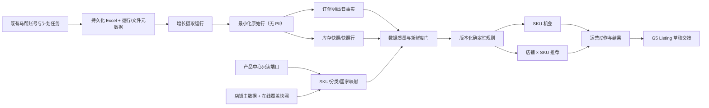
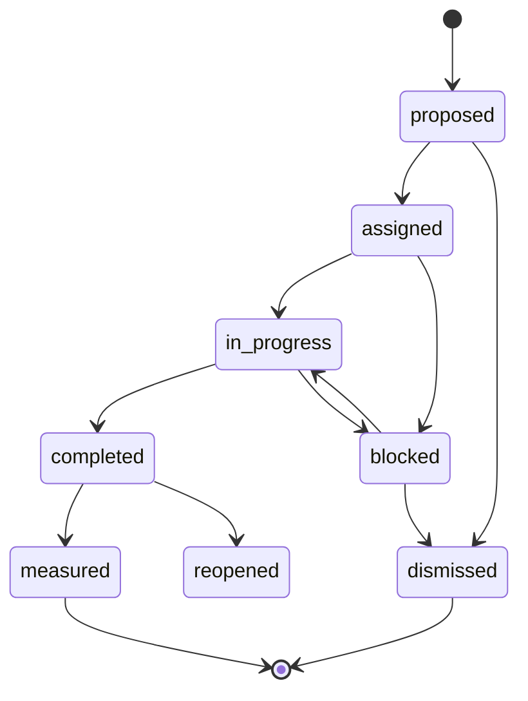

# 确定性货盘增长雷达：G0 现状审计与系统设计

> 文档状态：G0 设计冻结候选稿  
> 审计基线：`e659000bb5a396a291d7434c3d1f963f4a3ba58a`  
> 审计日期：2026-07-21（Asia/Shanghai）  
> 当前工作树：`C:\Users\PC\.codex\worktrees\22d5\New project2`（detached HEAD）  
> 永久工作树：`C:\Users\PC\Documents\New project2`（`master`，相对 `origin/master` ahead 2，且存在未提交工作）  
> 本文范围：只做审计、架构、数据契约、规则、阶段计划与验收设计；不实现业务代码、不执行数据库迁移、不写业务数据、不真实采集马帮数据。

## 1. 执行结论

本项目已经具备可复用的马帮账号、订单/库存导出、调度运行、文件留存、哈希校验、审计日志和产品中心能力，但尚不具备一条可直接用于“确定性货盘增长雷达”的完整事实链。主要断点是：

1. 当前订单与库存结果主要以 Excel 文件及运行元数据留存，没有面向增长规则的、可查询且幂等的订单明细事实和库存快照事实。
2. 当前没有权威的店铺主数据和“店铺当前在线商品”快照；历史订单只能证明曾经观察到销售，不能证明当前在线。
3. 产品中心的可靠身份是“国家 + SKU”，主 SKU/款式只作为关系证据；马帮 SKU、平台 SKU、商品中心 SKU 之间尚无经过确认且可审计的映射层。
4. 库存导出中的 `预测日销量(个)` 尚不能直接等同于业务口径“货盘日销”；其周期、粒度、覆盖范围、是否含 AI 团队均未在现有代码或文档中得到确认。
5. 当前订单字段不足以准确计算退款订单数、退款件数和退款金额，只有退货原因、备注、作废状态等线索。
6. 当前认证是单一应用令牌/本地兼容模式，没有可信的用户身份和负责人声明，因此暂时不能安全实现“普通运营仅看本人负责范围”。
7. 永久工作树正在进行产品 Listing 工作，包含未提交的 `011_product_listing_workbench.sql` 等文件；增长雷达若修改共享的服务端、数据访问、权限、审计或前端入口，合并风险较高。

因此，G1 应先建立“来源绑定 → 不可变导出证据 → 类型化事实 → 映射与质量门 → 可重放计算”的数据底座。只有在日销口径、AI 团队边界、SKU 身份和在线覆盖都被确认且数据新鲜时，系统才允许输出确定性推荐；否则只显示“数据不足/口径待确认/数据过期”，不得猜测。

## 2. 目标、非目标与确定性原则

### 2.1 业务目标

增长雷达从公司已经验证的商品中，结合可用库存能力、AI 团队负责范围以及适配店铺的当前覆盖，稳定识别：

- 已验证但尚未覆盖的商品；
- 已覆盖但覆盖不足的商品；
- 已覆盖但表现偏弱、需要运营动作的商品；
- 销量强但库存风险高的商品；
- 库存高但动销弱的商品；
- 具体到“店铺 × SKU”的可解释上新、补铺、优化、补货、调拨、清仓或观察动作。

### 2.2 非目标

- 不让 DeepSeek、LLM 或其他生成式模型决定候选商品、分数、优先级或动作。
- 不在 G0/G1 自动发布 Listing、修改正式商品资料或修改马帮数据。
- 不从历史订单推断“当前在线”。
- 不把缺失值当作 0，也不通过静默兜底制造推荐。
- 不在未确认退款口径前输出“净销量/退款金额”等伪精确指标。
- 不在缺少可信用户身份前声称实现了负责人级行权限。

### 2.3 确定性约束

所有推荐必须由版本化规则、固定输入快照和明确公式产生。同一规则版本与同一输入版本必须得到相同结果。每个候选结果至少保存：

- 规则版本、评估运行 ID 和输入截止时间；
- 产品身份、来源 SKU、映射证据及映射版本；
- 销量、库存、覆盖、店铺适配和质量门的输入值；
- 每条硬门是否通过、每个得分项的原始值/归一值/权重/得分；
- 最终分类、分数、优先级、建议动作以及未入选原因。

模型可在未来用于文案解释、相似词辅助或人工映射候选，但模型输出只能作为“待人工确认建议”，不得进入确定性规则的事实输入，除非被人工确认并形成可审计映射。

### 2.4 本文标记

- **现状事实**：由当前仓库代码、迁移、测试或工作树状态直接证实。
- **设计提案**：G1 以后建议实现，尚未存在。
- **待确认**：现有证据无法确定，必须由业务、数据源或平台负责人确认。

## 3. 当前系统只读审计

### 3.1 Git、工作树与运行隔离

**现状事实**

- 当前审计工作树位于 `C:\Users\PC\.codex\worktrees\22d5\New project2`，处于 detached HEAD。
- HEAD 为 `e659000bb5a396a291d7434c3d1f963f4a3ba58a`，与本地 `master` 当前指向相同。
- 永久工作树位于 `C:\Users\PC\Documents\New project2`，`master` 相对 `origin/master` ahead 2，并存在产品查询/Listing 方向的大量未提交修改。
- 本 G0 没有创建或切换分支；建议分支名尚未实际创建。
- 当前默认端口为 3101；SQLite 默认位于 `storage/commerce-ops.sqlite`。本审计工作树中没有可供核对的实时 `storage` 数据库。

**设计提案**

开发 G1 前先从永久工作树最新稳定提交创建 `feature/deterministic-product-growth-radar`，并使用完全隔离的本地配置，例如：

```dotenv
APP_PORT=3102
PORT=3102
DATA_ROOT=storage/worktrees/deterministic-growth-radar
STORAGE_ROOT=storage/worktrees/deterministic-growth-radar
DATABASE_PATH=storage/worktrees/deterministic-growth-radar/dev.sqlite
SCHEDULER_DB_PATH=storage/worktrees/deterministic-growth-radar/dev.sqlite
UPLOAD_ROOT=storage/worktrees/deterministic-growth-radar/uploads
EXPORT_ROOT=storage/worktrees/deterministic-growth-radar/exports
TEMP_ROOT=storage/worktrees/deterministic-growth-radar/tmp
CHROME_PROFILE_ROOT=storage/worktrees/deterministic-growth-radar/browser-profiles
```

这些值只应进入被 `.gitignore` 排除的本地配置，不应在 G0 创建。当前未发现可配置的独立日志目录；运行日志主要存在于数据库运行/审计表及标准输出。

### 3.2 马帮订单采集与字段

**现状事实**

- 订单来源由 `scripts/mabang_order_source.py` 实现，`scripts/mabang_worker.py` 作为统一 Python worker，Node 侧通过 `lib/mabang-worker-runner.mjs` 调用。
- 已支持账号密码登录、日期区间、筛选条件、远端导出、Excel 解析、记录数校验，以及手工/计划任务两条调用链。
- 日期区间最大 93 天；支持平台、店铺、负责人、仓库、订单状态、SKU 等过滤和多条件组合。
- 订单约 59 个字段，包括订单/交易标识、发货/付款时间、平台、店铺、负责人、状态、仓库、SKU、数量、中文名、价格/金额、人民币/原币记账金额、汇率、平台 SKU、退货原因/备注、作废时间/状态等。
- 数据还包含客户姓名、地址、电话等 PII。增长事实层不需要这些字段，也不应复制或暴露这些字段。
- 手工采集的解析结果暂存在进程内 `Map`，最多 8 份、30 分钟过期；用户发起导出后才通过统一文件服务持久化。
- 计划任务的订单导出会形成任务、运行、事件和持久化 Excel 文件记录。
- 当前迁移中没有标准化订单头、订单行、订单日聚合事实表。
- 现有退货原因、退货备注、作废状态不能可靠等价于退款订单、退款件数或退款金额。

**设计结论**

- G1 首选复用既有计划任务导出文件，不新建登录器或抓取器。
- 增长模块只摄取业务需要的非 PII 字段；PII 既不进入 `growth_raw_rows`，也不出现在增长 API/导出。
- 必须定义稳定的来源记录键，解决重叠日期窗口、重复导出和同一订单多行导致的重复计数。
- 在退款字段和状态映射得到来源确认前，增长指标使用发货件数/订单件数等明确口径，不输出退款后净值。

### 3.3 马帮库存采集与字段

**现状事实**

- 库存来源由 `scripts/mabang_inventory_source.py` 实现，支持登录、页面/iframe 操作、官方 Excel 导出、总记录数与汇总校验。
- 已有字段包括 SKU 编号、商品状态、活跃度、新款标识、三级目录、品牌、采购员、中英文名、父仓/仓库/仓位、`销量(7/28/42)`、`预测日销量(个)`、仓位库存、当前可售天数、在途量、海外仓/预分配调拨、预警量/天数、未发货量、调拨未发货、可用库存量、最近出入库等。
- 计划任务可持久化库存 Excel 与运行元数据，但通用运行表中的部分计数字段仍沿用订单命名。
- `product_inventory_snapshots` 是产品包导入中的仓库库存快照，不是马帮公司库存快照；它缺少可用、锁定、在途和日销等增长所需口径。
- 库存导出没有明确的“锁定库存”字段；仓位库存、可用库存、未发货和调拨量不能在无公式依据时互相替代。
- `销量(7/28/42)` 当前仍是一个原始复合字段；`预测日销量(个)` 的业务定义未在仓库中得到确认。

**待确认**

1. `预测日销量(个)` 的算法、窗口、更新时间、时区和粒度。
2. 该值是公司全渠道、账号可见范围，还是单平台/单店/单仓口径。
3. 该值是否已经包含 AI 团队销量；是否可能重复到每个仓库行。
4. `销量(7/28/42)` 的确切格式、退货处理和跨仓重复规则。
5. 哪些仓库、商品状态和库存字段可进入“可售库存”公式。

在这些问题确认前，`预测日销量(个)` 只能作为带来源标签的候选指标，不能作为“已验证商品”的硬事实。

### 3.4 登录、账号与采集复用

**现状事实**

- 订单和库存客户端各自实现了马帮账号密码 HTTP 登录，登录会话 Cookie 仅存在于运行内存。
- 验证码失败信息建议改用 Cookie/API，但当前没有可配置的 Cookie 登录实现。
- `mabang_account_profiles` 保存账号名称、用户名、加密密码、启用状态和最近验证结果；密码依赖 `APP_ENCRYPTION_KEY` 加密。
- 已有账号管理、登录测试、计划任务解密调用和 worker runner。
- 手工订单入口仍会直接接收本次请求的用户名/密码；计划任务复用保存的账号档案。

**设计提案**

- 增长模块不保存任何马帮凭证，只保存对既有 `mabang_account_profiles`、`scheduled_export_tasks` 的引用。
- G1 创建专用且无业务筛选的“AI 订单来源任务”和“完整库存来源任务”，或绑定到经审核可复用的现有任务。
- 增长摄取器轮询已成功且未摄取的 `export_files`，避免首阶段修改调度器和登录代码。
- 若未来需要保存马帮返回的原始文件，应在 worker/文件服务契约中单独设计；当前留存的是系统重新生成的标准 Excel，而不是可证明逐字节一致的远端原文件。

### 3.5 调度、运行、文件与当前原始数据留存

**现状事实**

- 已有 `mabang_account_profiles`、`scheduled_export_tasks`、`scheduled_export_runs`、`scheduled_export_run_events`、`export_files`、筛选缓存、调度租约等表。
- 任务支持订单/库存、日/周/月频率、时区、today/yesterday/7/14/30 日/周/月/相对/固定日期范围、筛选、重试、并发保护、陈旧运行恢复、漏跑处理和钉钉通知。
- 文件服务使用临时文件和原子移动，记录大小、SHA-256、状态、过期时间及元数据；下载仅通过文件 ID，并复核路径、大小和哈希。
- Excel 输出具备公式注入防护；文件有生命周期、隔离和人工复核机制。
- 当前“原始数据”主要是持久化的系统生成 Excel 加任务/运行/文件元数据。解析后的手工记录是临时内存数据，计划任务也没有落成增长可查询的行事实。
- 当前工作树没有实时 SQLite 文件，因此本文没有验证现有数据库中的真实任务、账号、店铺、订单或库存数量。

**设计结论**

G1 把已持久化 Excel 视为不可变来源证据，记录 `file_id`、哈希、任务、运行、账号、采集区间和解析版本，再生成类型化事实。来源文件不被覆盖，重跑解析生成新摄取运行；同一文件哈希和解析版本必须幂等。

### 3.6 商品中心与 SKU 身份

**现状事实**

- 产品中心已经有导入批次、原始/标准化行、分类、款式、SKU、生命周期与事件、包装、成本快照、产品库存快照、问题、国家身份、人工覆盖及事件、图片、无损产品包行、变更记录和 AI 内容表。
- 产品包必填字段约 34 个，并可带 `预测日销量`；包含 SKU、主 SKU、名称、国家、一二级分类、款式/规格/状态、尺寸重量、仓库库存/计划、成本价格和连带率等。
- 当前产品身份的权威粒度是内部 UUID，业务唯一性为 `(source_system, country_raw, sku_code_normalized)`；显示标准键可表达为 `UPPER(country)|UPPER(sku)`。
- 主 SKU 只在来源真实提供时建立款式关系，不允许系统编造。SKU 是身份，主 SKU/款式是关系证据。
- 产品中心读 API 已支持国家、分类、生命周期和分页查询。
- 当前产品中心的 `operationalEligible` 覆盖 ACTIVE/NEW/CLEARANCE；增长“已验证商品池”不能无条件复用这个更宽的定义。
- 产品包没有平台商品 ID、店铺商品 ID、当前在线状态等 Listing 覆盖事实。

**设计提案**

- 增长模块通过只读适配器读取产品中心，不修改产品正式表、无损原始行、人工覆盖或导入流程。
- 默认只有 `ACTIVE` 且数据完整的商品进入已验证池；NEW/CLEARANCE 是否进入由版本化规则明确配置并审核。
- 使用独立 `product_identity_mappings` 连接马帮 SKU/平台 SKU/外部商品与 `product_skus.id`，保存匹配方式、证据、置信状态、版本和人工确认人。

### 3.7 店铺主数据与覆盖现状

**现状事实**

- 当前稳定分支没有权威店铺主表。
- `mabang_filter_option_cache` 只缓存从订单筛选中见到的账号、负责人、店铺、平台、区域、仓库等文本；它没有稳定店铺 ID、国家、启停状态、店铺层级或主营分类。
- 历史订单中的店铺/SKU 只能标记为 `historical_observed`，不能标记为 `online`。
- 永久工作树的未提交 `011_product_listing_workbench.sql` 设计了 Listing 草稿和发布记录，但当前草稿服务主要支持 draft/ready/upsert/archive；它仍不是平台当前在线商品的权威同步。

**设计提案**

覆盖来源优先级为：

1. 平台或马帮官方商品列表/API 的当前在线导出；
2. 运营上传并签字确认的店铺在线商品基线；
3. 后续经批准的专用采集器；
4. 历史订单仅作为旁证，永不自动升级为在线状态。

推荐引擎只有在店铺主数据和覆盖快照处于有效期、SKU 映射已确认时，才允许判断“未覆盖/覆盖不足”。

### 3.8 认证、权限与审计

**现状事实**

- 应用当前主要使用单一 `APP_ACCESS_TOKEN`，并有 loopback 本地兼容模式。
- 产品中心已有基于环境配置的权限动作和国家/一二级分类范围，但不是基于可信用户身份的逐人授权。
- `operation_audit_events` 支持 request ID、模块、动作、结果、脱敏 actor/IP、任务/运行/文件、错误及白名单元数据，默认保留 180 天。

**设计结论**

- 增长权限建议至少包含：`growth.view`、`growth.refresh`、`growth.rule_manage`、`growth.action_assign`、`growth.action_update`、`growth.mapping_confirm`、`growth.export`。
- 在接入可信身份提供方、负责人 ID 和服务端授权声明前，只允许管理员或明确的服务账号访问增长雷达；不能信任客户端提交的 `owner` 参数来做行权限。
- HTTP 审计用于安全与操作追踪；规则版本、映射确认、动作流转和结果归因必须另有长期业务事件表，不能只依赖 180 天审计日志。

### 3.9 迁移、配置与测试基线

**现状事实**

- 当前生产数据访问默认仍是 SQLite，启动时按文件名顺序执行 `migrations/*.sql`，通过 `schema_migrations` 记录，单迁移事务化，没有 down migration。
- PostgreSQL 依赖和准备代码已经存在，但当前工作树未安装/不可解析 `pg` 依赖，不能把 PostgreSQL 视作已验证运行路径。
- G0 执行了完整 `npm test`：363 项中 358 通过、5 失败。失败均与本机运行依赖有关：Node 子进程路径 `ENOENT`、被忽略的 `.venv-mabang` Python 不存在、`pg` 包未安装。
- 测试没有真实访问马帮；计划任务相关测试使用 mock worker/通知。

**设计结论**

G1 不能以“现有测试全绿”为基线；开发前需恢复本地 Node 子进程、Python 环境和 npm 依赖，再建立增长模块的纯 fixture 测试。真实马帮访问继续排除在自动测试之外。

## 4. 目标架构与责任边界



### 4.1 模块边界

| 模块 | 负责 | 不负责 |
| --- | --- | --- |
| 既有马帮模块 | 登录、远端导出、Excel 生成、调度 | 增长规则、SKU 身份、覆盖判断 |
| 统一文件服务 | 原子存储、哈希、下载、生命周期 | 解释业务字段 |
| 产品中心 | 正式商品身份、分类、生命周期、成本/图片等 | 店铺当前在线覆盖、增长动作 |
| 增长摄取 | 来源绑定、幂等解析、类型化事实、血缘 | 远端登录、修改来源文件 |
| 主数据/映射 | 国家、平台、店铺、SKU、分类别名与人工确认 | 自动猜测并确认 |
| 规则引擎 | 硬门、计算、分类、评分、优先级、证据 | 生成式模型决策 |
| 运营工作台 | 分配、处理、结果回收、导出 | 自动发布平台商品 |
| Listing 交接 | G5 创建可审核草稿/交接单 | 自动发布或绕过现有发布权限 |

### 4.2 读写原则

- 对产品中心、马帮任务、运行和文件仅通过明确的只读端口读取。
- 增长模块只写自身命名空间的表和获准的统一文件记录。
- 首阶段不修改 scheduler 执行链；摄取器按已完成文件进行增量消费。
- 一个来源文件对应一个摄取输入版本；解析器版本改变时允许重放，但不能覆盖旧运行。
- 一个评估运行绑定固定的订单截止日、库存快照、覆盖快照、映射版本和规则版本。

## 5. 采集、摄取、原始层、聚合与快照

### 5.1 来源绑定

`growth_source_bindings` 将业务用途绑定到现有账号和计划任务，建议字段：

- `purpose`：`ai_orders`、`company_inventory`、`shop_listing_coverage`；
- `account_profile_id`、`scheduled_task_id`；
- 期望粒度、时区、日期模式、允许筛选摘要；
- 启用状态、最晚成功时间、最大允许陈旧时间；
- 审核人、审核时间、备注。

订单任务必须明确“只覆盖 AI 团队负责范围”还是“公司全量”；库存任务必须明确可见仓库范围。任何隐含筛选都会使公司级结论失效。

### 5.2 摄取运行

`growth_ingestion_runs` 一次消费一个 `export_files.id`，状态建议为：

`discovered → validating → parsing → normalizing → aggregating → quality_checking → succeeded | failed | quarantined`

唯一键建议为 `(source_file_sha256, parser_name, parser_version)`。运行保存来源文件、计划任务/运行、采集窗口、发现/开始/完成时间、总行数、有效行数、拒绝行数、质量问题数、错误代码和错误摘要。

### 5.3 原始行

`growth_raw_rows` 不是全量复制来源，而是无 PII 的最小业务证据：

- 来源运行、工作表、源行号、记录类型；
- 规范化前的 SKU、平台、店铺、国家、仓库、状态、时间、数量、金额、库存和销量相关文本；
- 原始业务字段 JSON（严格白名单）；
- 行内容哈希、解析状态、拒绝原因。

不得保存客户姓名、地址、电话、登录凭证或 Cookie。只有具备受限排障权限的人员可查看原始业务 JSON，普通运营只访问标准事实。

### 5.4 订单明细与日事实

`growth_order_lines` 建议保留：

- 来源订单键、来源行键、订单/交易标识的不可逆或受控标识；
- 业务日期、付款时间、发货时间、平台、店铺、国家、仓库；
- 来源 SKU、平台 SKU、映射后的产品 SKU；
- 件数、币种、原币/人民币金额；
- 订单状态、退货/作废原始状态及其映射版本；
- 来源运行、源行号、行哈希。

来源行键优先使用官方稳定行 ID；若没有，则使用经验证的复合键，例如 `account + order/trade id + sku + warehouse + line ordinal + business timestamp`。复合键必须用真实样本验证，不能仅凭字段名假定唯一。

`growth_order_daily_facts` 按固定粒度聚合，建议主粒度为：

`business_date × product_sku_id × shop_id × platform_id × country_id`

字段包括订单数、件数、发货件数、毛销售额及来源行数。退款相关字段在来源语义确认前保持 `NULL` 并附口径状态，不以 0 代替。聚合表保存定义版本和输入摄取运行集合。

### 5.5 库存快照

`growth_inventory_snapshots` 保存来源账号、采集时间、来源汇总、覆盖仓库范围、定义版本、输入文件及质量状态。`growth_inventory_snapshot_lines` 建议粒度为：

`snapshot_id × product_sku_id/source_sku × warehouse_id`

字段包括仓位库存、可用库存、在途量、未发货量、调拨量、来源可售天数、7/28/42 销量原值、预测日销量原值和单位。库存字段保持来源原义，不在原始快照阶段混合成一个“可售”值。

### 5.6 批次原子性、重复与最后成功版本

- 新摄取先写隔离批次，解析、约束和质量检查通过后才把批次标记为可见。
- 失败批次不替换“最后成功版本”，界面显示失败和当前仍在使用的旧版本时间。
- 同一文件、同一解析器版本重复处理必须 no-op。
- 重叠订单采集窗口依赖来源行键去重，日事实按被接受的唯一行重新聚合。
- 库存是时间点快照，不跨快照累加；同一 SKU 多仓汇总必须先按仓库资格过滤。
- 评估运行保存完整输入版本集合，避免刷新途中出现订单新、库存旧、覆盖半更新的混合结果。

### 5.7 刷新编排

建议刷新 DAG：

1. 检查并触发现有订单/库存计划任务，或等待预定任务完成；
2. 验证运行成功、文件状态、大小与 SHA-256；
3. 幂等摄取订单/库存文件；
4. 解析并生成类型化订单事实和库存快照；
5. 读取固定版本的产品、映射、店铺和覆盖数据；
6. 运行数据质量规则；
7. 仅在硬质量门通过后创建评估运行；
8. 原子发布新雷达结果；
9. 写操作审计和业务运行事件。

自动刷新可每日执行，时间应位于马帮来源刷新完成之后。手工刷新需要 `growth.refresh` 权限，并做幂等、互斥和频率限制。任何步骤失败都保留最后成功结果，同时显著标注陈旧时间。

## 6. 主数据与映射设计

### 6.1 国家、平台与店铺

- `growth_countries`：内部 ID、标准代码、显示名、时区、启用状态。
- `growth_platforms`：内部 ID、标准代码、名称、覆盖来源能力、启用状态。
- `growth_shops`：稳定 ID、来源账号、来源店铺键/名称、平台、国家、状态、负责人 ID、层级、主营分类、首次/最近观察时间、确认状态。
- `growth_dimension_aliases`：维度类型、来源系统、原始值、目标 ID、生效区间、状态和确认事件。
- `growth_shop_category_scopes`：店铺适配的一二级分类、允许/禁止标志、来源、版本和有效期。
- `growth_ai_responsibility_scopes`：AI 团队负责的平台、国家、店铺、分类或 SKU 范围，以及优先级/排除规则。

店铺名称只作为别名，不能作为长期主键。平台、国家和负责人不从名称字符串静默解析；解析结果必须进入待确认队列。

### 6.2 SKU 身份映射

`product_identity_mappings` 建议字段：

- 来源系统、来源账号、来源国家、来源 SKU、平台 SKU、可选店铺；
- 目标 `product_sku_id`；
- `match_method`：`exact_country_sku`、`exact_external_id`、`manual`、`suggested`；
- `status`：`suggested`、`confirmed`、`rejected`、`superseded`；
- 证据 JSON、规则版本、有效期；
- 确认人/时间、替代映射 ID、创建/更新时间。

自动 `confirmed` 只允许在来源国家和规范化 SKU 与产品中心唯一命中、没有冲突时发生。名称、主 SKU、模糊文本或模型相似度只能生成 `suggested`，不能参与推荐硬事实。

同一来源身份在同一有效期只能有一个 confirmed 目标。一个产品可映射多个来源身份，但系统必须保留别名和历史版本。

### 6.3 分类映射

`growth_category_mappings` 连接马帮目录、产品中心分类和平台/店铺类目，保存来源路径、目标路径、方向、适配状态、证据、版本和人工确认。分类适配必须使用已确认映射；未映射分类不自动进入店铺推荐。

### 6.4 在线覆盖快照

`growth_shop_listing_snapshots` 保存来源类型、店铺、抓取/上传时间、有效期、文件、审核状态和总数。`growth_shop_listing_snapshot_items` 保存：

- 店铺、平台商品 ID/变体 ID、来源 SKU/平台 SKU；
- 映射后的产品 SKU；
- 在线状态、可售状态、首次/最近观察时间；
- 映射状态、来源行和证据。

覆盖状态分为：

- `verified_online`：权威来源确认当前在线；
- `verified_offline`：权威来源确认已下线；
- `historical_observed`：仅历史订单观察到；
- `unknown`：无有效覆盖证据。

只有新鲜的 `verified_online` 才计入当前覆盖数。覆盖快照过期时，未覆盖结论整体失效，而不是把所有商品当成未上架。

## 7. 指标口径、日销、防重与库存天数

### 7.1 指标定义注册表

`growth_metric_definitions` 对每个指标保存代码、版本、业务定义、粒度、时间窗口、时区、包含/排除状态、退款处理、来源、舍入规则、生效时间和审核人。规则版本只能引用已激活的指标定义。

### 7.2 公司日销与 AI 团队销量

系统必须明确区分：

- `company_daily_sales`：公司级、同一商品粒度、同一日期窗口的日均销量；
- `ai_daily_sales`：AI 团队负责范围内、同粒度同窗口的日均销量；
- `other_team_daily_sales`：只有在确认公司值包含 AI 且二者完全同口径时，才可计算。

禁止把“公司日销”和“AI 日销”相加。若业务确认公司日销已包含 AI，可计算：

```text
other_team_daily_sales = company_daily_sales - ai_daily_sales
```

前提是商品映射、日期、时区、平台/国家范围、状态和退款口径完全一致。若结果小于 0，记录质量错误并停止该商品计算，不做 `max(0, …)` 静默修正。

若无法确认 AI 销量是否已包含在货盘日销中，系统必须展示：

> 当前无法确认 AI 团队销量是否已包含在公司货盘日销中，因此不执行相加或相减，也不据此生成确定性推荐。

### 7.3 日销计算候选

在 `预测日销量(个)` 未确认前，可并行保存但不混用两个候选指标：

1. 来源预测日销：直接保留马帮字段和值、来源快照和定义状态；
2. 订单观察日销：`合格订单件数 / 有效自然日数`，窗口、订单状态、退款处理、缺失日补零策略全部版本化。

规则必须显式选择一个已审核指标，不能在缺失时自动从来源预测日销切换到订单观察日销。

### 7.4 重复计数控制

- 订单按稳定来源行身份去重，不按 Excel 行号跨文件去重。
- 同一订单多 SKU 必须按订单行计件；订单数使用稳定订单键去重。
- 账号/店铺范围重叠时，重复来源身份进入冲突队列，不能双计。
- 多仓库存可汇总，销量若是 SKU 级重复展示在每个仓库行，则只取一次；是否重复必须通过样本验证。
- 平台 SKU 映射到同一产品 SKU 时允许汇总，但必须先检查国家、单位和变体关系。
- 所有聚合保存 `input_row_count`、`distinct_source_key_count` 和冲突数，便于审计。

### 7.5 可售库存与可售天数

可售库存使用版本化公式，例如：

```text
eligible_available_inventory = SUM(eligible_warehouse.available_inventory)
days_of_supply = eligible_available_inventory / approved_daily_sales
```

该公式只是框架，哪些仓库合格、使用 `可用库存量` 还是其他字段、是否扣除锁定/未发货量，必须由业务审核后写入指标定义。由于当前没有明确锁定库存字段，不能自行推导。

空值语义：

- 库存为空：`days_of_supply = NULL`，状态 `inventory_missing`；
- 日销为空：`NULL`，状态 `sales_missing`；
- 日销等于或小于 0：`NULL`，状态 `non_positive_sales`；
- 库存为 0 且日销大于 0：可售天数为 0，是有效值；
- 任一输入过期或口径未确认：`NULL`，状态 `stale` 或 `definition_unconfirmed`。

### 7.6 新鲜度

每类数据独立配置 TTL，例如订单 36 小时、库存 12 小时、覆盖 24 小时、产品主数据 7 天；这些只是待校准的初始建议。评估使用所有依赖中的最早有效截止时间。任一硬依赖过期时：

- 旧结果保留供追溯，但状态改为 `stale`；
- 不生成新的 P0/P1 推荐；
- 不把“无新数据”解释为 0 销量、0 库存或未覆盖。

## 8. 五类识别规则与硬质量门

### 8.1 通用硬门

任何商品或“店铺 × SKU”进入评分前，必须逐项通过：

1. 产品中心身份唯一且生命周期符合当前规则版本；
2. SKU、国家、分类映射为 `confirmed`，没有有效期冲突；
3. 商品属于明确的 AI 团队责任范围；
4. 所用日销指标的定义已审核，窗口与粒度明确；
5. 库存快照、订单事实和产品主数据未过期；
6. 店铺推荐还要求店铺主数据、分类适配和在线覆盖快照已确认且未过期；
7. 数量、单位、币种、时区和来源范围没有阻断级质量问题；
8. 商品未被人工禁止、法务/平台规则禁止或列入停售排除集。

任一硬门失败时，输出明确原因码，例如 `mapping_unconfirmed`、`coverage_stale`、`daily_sales_definition_unconfirmed`、`out_of_ai_scope`，状态为 `data_insufficient`、`stale` 或 `not_eligible`。它不参与分数排名，也不能被低阈值“救回”。

### 8.2 已验证但未覆盖

定义框架：

- 商品通过“已验证商品”规则；
- 在 AI 责任范围内存在至少一个适配且启用的目标店铺；
- 目标店铺的有效覆盖快照中不存在该产品 SKU 的 `verified_online` 记录；
- 日销、库存/可售天数、产品状态均通过硬门；
- 不存在人工禁止上新、平台限制或有效中的同类任务。

若覆盖快照为 `unknown` 或过期，分类必须是“覆盖待核”，不能是“未覆盖”。

### 8.3 已覆盖但覆盖不足

定义框架：

- 商品通过已验证规则；
- `eligible_shop_count > verified_online_shop_count > 0`；
- 缺口店铺都有新鲜覆盖快照和已确认适配关系；
- 覆盖率低于规则阈值，或缺少规则指定的关键平台/国家/店铺层级。

建议同时展示：

```text
coverage_rate = verified_online_eligible_shop_count / eligible_shop_count
coverage_gap = eligible_shop_count - verified_online_eligible_shop_count
```

分母只包含明确适配且启用、数据有效的店铺；未知店铺不进入分母。

### 8.4 已覆盖但表现偏弱

定义框架：

- 目标店铺已有 `verified_online`；
- 商品公司层或可比店铺群表现达到已验证阈值；
- 目标店铺在相同窗口下的销量/转化代理显著低于可比基准；
- 已上线天数满足最小观察期，且没有断货、暂停销售或数据缺失等解释因素。

当前系统没有曝光、点击、转化率等平台漏斗事实，因此 G3 首期只能基于订单销量、上架天数和库存可得性做有限判断，并把动作描述为“检查/优化”，不能声称定位了点击率或转化率问题。

### 8.5 热销但低库存

定义框架：

- 日销达到热销阈值或位于配置分位数；
- 可售天数小于安全阈值；
- 日销稳定性达到最低要求；
- 在途量和预计到货如果没有可靠 ETA，不得直接抵消风险。

动作可为补货、调拨、暂停扩铺或限制促销。若库存为 0 且日销大于 0，应优先识别断货风险，而不是推荐更多店铺。

### 8.6 高库存但低动销

定义框架：

- 合格可售库存或可售天数高于阈值；
- 已审核日销低于阈值；
- 产品不是新品保护期、季节性等待期或明确的战略备货；
- 覆盖状态可用于区分“覆盖不足导致低动销”与“已充分覆盖仍低动销”。

动作可为补铺、优化、组合促销、调拨、降采或清仓，但具体动作由规则矩阵决定，不由生成式模型决定。

### 8.7 销量稳定性

可使用固定窗口的变异系数：

```text
coefficient_of_variation = standard_deviation(daily_units) / mean(daily_units)
```

只有有效天数达到最小样本量且均值大于 0 时计算。对零膨胀或间歇销售商品，可配置“非零天占比”和“连续有销量天数”等补充门。算法、窗口和阈值必须版本化；无法计算时为 `NULL`，不能默认稳定。

## 9. 两层评分、优先级与解释

评分只在硬门通过后执行。以下权重是用于设计和测试的暂定初值，不代表已经获得业务批准；G2 激活前必须通过历史回放校准并由授权人批准。

### 9.1 第一层：SKU 机会分

总分 100：

| 维度 | 暂定权重 | 示例组成 |
| --- | ---: | --- |
| 公司表现 | 40 | 日销水平、稳定性、有效销售天数 |
| 库存承载 | 25 | 可售库存、可售天数、库存风险反向项 |
| AI 覆盖缺口 | 25 | 适配店铺缺口数、覆盖率、关键平台缺口 |
| 状态/范围/质量 | 10 | 产品生命周期、映射完整度、数据新鲜度余量 |

每个指标使用明确的分段或线性归一函数。例如：

```text
metric_score = clamp((value - floor) / (target - floor), 0, 1) * weight
sku_score = SUM(metric_score)
```

阈值、方向、上下限、缺失处理和舍入方式都存于规则版本。缺失硬依赖不会得到 0 分继续计算，而是停止评分。

### 9.2 第二层：店铺 × SKU 适配分

先通过平台、国家、分类、店铺状态、非在线、库存和质量硬门，再计算总分 100：

| 维度 | 暂定权重 | 示例组成 |
| --- | ---: | --- |
| 可比店铺/同类证据 | 30 | 同平台同国家同层级店铺的销售证据 |
| 分类适配 | 25 | 已确认主营分类、店铺类目映射 |
| 利润/成本可行性 | 15 | 成本、目标售价、平台费用的已确认数据 |
| 组合缺口 | 15 | 款式/规格/价格带的确定性缺口 |
| 库存承载 | 10 | 扩铺后的安全库存余量 |
| 店铺能力/层级 | 5 | 店铺状态、层级或运营容量规则 |

平台、国家或分类不匹配属于硬门，不用加分来抵消。若平台费用、售价或毛利数据不完整，利润项不能静默取 0；规则版本可以明确“不启用利润项并重新归一”，但必须显示该版本不含利润判断。

### 9.3 优先级

暂定规则：

- `P0`：硬门全过、分数 ≥ 80，并且是紧急库存风险或高把握高价值缺口；
- `P1`：硬门全过、分数 ≥ 70，可进入当日动作队列；
- `P2`：已覆盖表现偏弱或需进一步运营核查；
- `P3`：观察项，不直接要求执行；
- `HOLD`：数据不足、数据过期、定义未确认、映射冲突或等待人工确认。

80/70 仅为初始校准候选。最终版本应基于历史回放中“建议被接受率、上架成功率、7/30 日增量和误报率”确定。分类优先级冲突按显式矩阵处理，例如“热销低库存”优先于“未覆盖扩铺”，避免在缺货时继续扩铺。

### 9.4 解释结构

每条机会展示结构化证据：

- 一句话结论；
- 当前分类、优先级和分数；
- 通过/失败的硬门；
- 公司日销、AI 日销、库存、可售天数、覆盖率及其时间窗口；
- 各分项得分与阈值；
- 来源文件/快照时间、规则版本、映射状态；
- 建议动作、原因码和禁止动作；
- 可复现的评估运行 ID。

解释文本由模板拼接结构化证据，避免模型改写造成语义漂移。

## 10. 每日动作与结果闭环

### 10.1 动作类型

建议动作枚举：

- `LIST_NEW`：适配店铺新增 Listing；
- `EXPAND_COVERAGE`：补齐更多适配店铺；
- `OPTIMIZE_LISTING`：检查标题、主图、价格、内容或变体；
- `REPLENISH`：补货；
- `TRANSFER_STOCK`：跨仓/区域调拨；
- `PAUSE_EXPANSION`：因低库存暂停扩铺；
- `PROMOTE`：在库存允许时做促销；
- `REDUCE_PURCHASE`：降低采购；
- `CLEARANCE_REVIEW`：进入清仓评审；
- `VERIFY_DATA`：确认映射、口径、覆盖或异常数据；
- `OBSERVE`：继续观察。

动作矩阵由分类、优先级、库存状态和覆盖状态决定。例如热销低库存不能同时生成 `LIST_NEW`；高库存低动销且覆盖不足可优先 `EXPAND_COVERAGE`，已充分覆盖则转为 `OPTIMIZE_LISTING` 或 `CLEARANCE_REVIEW`。

### 10.2 动作状态机



每次流转写入 `growth_action_events`，记录旧/新状态、actor、时间、原因码、备注和关联证据。系统不得因下一次刷新直接删除人工动作；新评估通过关联和 supersede 机制更新建议状态。

### 10.3 结果指标

G5 至少回收：

- 是否接受建议、是否创建 Listing 草稿、是否成功上线；
- 分配到完成/上线的耗时；
- 7 日、30 日订单件数和销售额；
- 上线前后可比窗口的增量或相对变化；
- 库存天数变化、断货情况；
- 被拒绝、阻断和数据错误原因。

结果归因必须标注“观察性”，除非有可靠对照设计；系统不能把上线后的全部销量都宣称为推荐带来的增量。

## 11. 信息架构与核心页面

### 11.1 导航

建议在现有 Commerce Ops 导航增加独立“增长雷达”，内部页面：

1. 总览；
2. 已验证商品；
3. 商品机会；
4. 店铺缺口；
5. 库存风险；
6. 每日动作；
7. 映射中心；
8. 数据质量与刷新；
9. 规则版本；
10. 结果复盘。

前端应保持增长模块路由、状态和组件独立，减少对永久工作树正在修改的产品中心页面和全局脚本的冲突。

### 11.2 总览

顶部固定显示：最后成功评估时间、订单/库存/覆盖各自时间、规则版本、质量状态和是否可用于决策。核心卡片：

- 已验证 SKU 数；
- 未覆盖 SKU 数；
- 覆盖不足 SKU 数；
- 表现偏弱项；
- 低库存风险；
- 高库存低动销；
- P0/P1 待办；
- 阻断级数据问题。

任何陈旧或定义未确认状态使用显著警示，不用绿色总数掩盖。

### 11.3 机会列表

表格至少包含 SKU、商品名、国家、分类、分类标签、公司日销、AI 日销、可售库存、可售天数、在线/适配店铺数、机会分、优先级、建议动作、数据时间和负责人。支持服务端过滤、排序、分页和导出当前筛选。

点击行进入证据抽屉/详情页，显示公式、阈值、得分拆分、映射、来源血缘和历史评估。

### 11.4 店铺缺口

以店铺为入口查看：平台、国家、负责人、主营分类、当前覆盖数、推荐 SKU、适配分、未推荐原因和覆盖快照时间。未知覆盖与确定未覆盖必须采用不同状态和视觉样式。

### 11.5 每日动作

支持按负责人、优先级、动作类型、状态、截止日筛选；批量分配只允许对兼容状态执行。动作详情保留推荐生成时的证据快照，而不是仅显示最新指标。

### 11.6 映射与数据质量

- 映射中心提供来源值、候选目标、证据、冲突、确认/拒绝/supersede 操作。
- 数据质量页按阻断/警告/信息分级，展示来源、影响 SKU/店铺、首次/最近出现、修复人和状态。
- 刷新页展示 DAG 步骤、任务/运行/文件、行数、哈希、解析器版本和错误摘要。

## 12. 分阶段数据表设计

表名为逻辑设计；G1 开发时应遵循项目现有 SQLite/PostgreSQL 可移植规范、时间戳格式、软删除和迁移约定。不得在 G0 创建这些表。

### 12.1 G1：事实、主数据和质量底座

| 表 | 关键职责 |
| --- | --- |
| `growth_source_bindings` | 业务用途与既有账号/计划任务绑定 |
| `growth_ingestion_runs` | 文件摄取、解析器版本、批次状态与统计 |
| `growth_raw_rows` | 无 PII 的最小原始行和行哈希 |
| `growth_order_lines` | 去重后的类型化订单行 |
| `growth_order_daily_facts` | 固定粒度、固定定义版本的日聚合 |
| `growth_inventory_snapshots` | 库存快照头、来源范围和质量状态 |
| `growth_inventory_snapshot_lines` | SKU × 仓库的库存原义字段 |
| `growth_platforms` | 平台主数据 |
| `growth_countries` | 国家、时区主数据 |
| `growth_dimension_aliases` | 店铺/平台/国家/仓库别名映射 |
| `growth_shops` | 稳定店铺身份、状态、负责人和层级 |
| `growth_shop_category_scopes` | 店铺适配分类与禁止范围 |
| `growth_ai_responsibility_scopes` | AI 团队责任范围 |
| `growth_shop_listing_snapshots` | 在线覆盖快照头与有效期 |
| `growth_shop_listing_snapshot_items` | 店铺当前 Listing 项及 SKU 映射 |
| `product_identity_mappings` | 来源 SKU/平台 SKU 到产品中心 SKU |
| `growth_category_mappings` | 来源/产品/平台分类映射 |
| `growth_metric_definitions` | 日销、库存、稳定性等版本化口径 |
| `growth_data_quality_issues` | 可归档、可指派的数据质量问题 |

约束要点：

- 每个表都有内部 ID、创建/更新时间；配置/映射表有有效期、版本和 actor。
- 来源表保存外键及来源自然键；不要只保存易变名称。
- 数量、金额和比率用可移植的定点类型/整数最小单位，禁止二进制浮点承担财务事实。
- JSON 仅保存扩展证据，核心过滤/连接字段必须类型化。
- 唯一键体现幂等性；所有外键和常用筛选列建立明确索引。

### 12.2 G2：规则和 SKU 机会

| 表 | 关键职责 |
| --- | --- |
| `growth_rule_versions` | 草稿/审核/激活/停用的不可变规则版本 |
| `growth_evaluation_runs` | 固定输入版本与评估状态 |
| `growth_sku_opportunities` | 五类 SKU 机会、分数、优先级、状态 |
| `growth_rule_evidence` | 硬门和每个分项的结构化证据 |

激活后的规则版本不可原地修改，只能复制产生新版本。一次评估运行只引用一个激活版本。

### 12.3 G3：店铺推荐

| 表 | 关键职责 |
| --- | --- |
| `growth_shop_sku_recommendations` | 店铺 × SKU 硬门、适配分、动作和证据 |

唯一性至少包含评估运行、店铺和产品 SKU。已经在线的组合不得生成新增 Listing 推荐。

### 12.4 G4：动作闭环

| 表 | 关键职责 |
| --- | --- |
| `growth_actions` | 当前动作、负责人、截止日和关联推荐 |
| `growth_action_events` | 不可变的状态、分配、备注和驳回事件 |

### 12.5 G5：Listing 交接与结果

| 表 | 关键职责 |
| --- | --- |
| `growth_listing_handoffs` | 向现有 Listing 工作台提交的幂等交接单 |
| `growth_recommendation_outcomes` | 7/30 日结果快照与观察性归因 |

### 12.6 复用现有表

- `export_files`：来源文件和增长导出；G1 需要新增受控的 source type 白名单，例如 `growth_radar_source`、`growth_radar_export`、`growth_coverage_import`。
- `operation_audit_events`：刷新、映射确认、规则激活、动作分配、导出和 Listing 交接等操作审计。
- 现有账号、计划任务、运行与事件表：只读引用，不复制凭证和调度状态。
- 产品中心商品、分类、生命周期、成本和图片：只读引用。

若为了 MVP 合并物理表，也必须保留上述逻辑边界、唯一性、血缘和状态机，不能用一个无约束 JSON 大表替代。

## 13. API 设计

所有接口沿用现有响应风格，返回 `{ ok, request_id, ... }`；列表统一提供服务端过滤、稳定排序、游标或页码分页和最大页大小。写接口要求权限、幂等键、操作审计和并发版本。

### 13.1 读取接口

- `GET /api/growth-radar/overview`
- `GET /api/growth-radar/verified-products`
- `GET /api/growth-radar/opportunities`
- `GET /api/growth-radar/opportunities/:id`
- `GET /api/growth-radar/inventory-risks`
- `GET /api/growth-radar/shops`
- `GET /api/growth-radar/shops/:id/gaps`
- `GET /api/growth-radar/recommendations`
- `GET /api/growth-radar/mappings`
- `GET /api/growth-radar/data-quality`
- `GET /api/growth-radar/refresh-runs`
- `GET /api/growth-radar/refresh-runs/:id`
- `GET /api/growth-radar/rule-versions`
- `GET /api/growth-radar/actions`
- `GET /api/growth-radar/outcomes`

常用过滤：国家、平台、店铺、负责人、分类、机会类型、优先级、动作状态、映射状态、数据质量和评估运行。API 不返回 PII、凭证、Cookie、文件物理路径或未脱敏错误体。

### 13.2 写接口

- `POST /api/growth-radar/refresh-runs`：请求刷新/评估；
- `POST /api/growth-radar/coverage-imports`：上传并验证覆盖基线；
- `POST /api/growth-radar/mappings/:id/confirm`；
- `POST /api/growth-radar/mappings/:id/reject`；
- `POST /api/growth-radar/rule-versions`：从现有版本创建草稿；
- `POST /api/growth-radar/rule-versions/:id/activate`：经审核激活；
- `POST /api/growth-radar/actions`；
- `PATCH /api/growth-radar/actions/:id`：分配、状态、截止日；
- `POST /api/growth-radar/listing-handoffs`：G5，仅创建交接/草稿；
- `POST /api/growth-radar/exports`：按当前授权范围和筛选异步导出。

对映射确认、规则激活、动作流转、Listing 交接使用 `If-Match`/版本号防止覆盖并发更新。文件下载复用现有 ID 型文件 API。

### 13.3 错误契约

错误至少包含稳定 `code`、用户可理解 `message`、`request_id` 和可选 `details` 白名单。示例：

- `GROWTH_SOURCE_STALE`
- `GROWTH_MAPPING_UNCONFIRMED`
- `GROWTH_COVERAGE_UNKNOWN`
- `GROWTH_METRIC_DEFINITION_UNCONFIRMED`
- `GROWTH_REFRESH_ALREADY_RUNNING`
- `GROWTH_RULE_VERSION_CONFLICT`
- `GROWTH_SCOPE_FORBIDDEN`

解析和数据质量错误进入问题表；系统错误进入运行事件/审计。响应中不泄露堆栈、SQL、凭证或原始 PII。

## 14. 权限、审计、导出、质量与异常

### 14.1 权限矩阵

| 动作 | 查看者 | 运营 | 数据管理员 | 规则管理员 | 系统管理员 |
| --- | :---: | :---: | :---: | :---: | :---: |
| 查看雷达 | ✓ | ✓ | ✓ | ✓ | ✓ |
| 刷新 |  | 可选 | ✓ | ✓ | ✓ |
| 确认映射 |  |  | ✓ |  | ✓ |
| 管理/激活规则 |  |  |  | ✓ | ✓ |
| 分配/更新动作 |  | ✓ | ✓ | ✓ | ✓ |
| 导出 | 按授权 | 按授权 | ✓ | ✓ | ✓ |
| Listing 交接 |  | 按授权 |  | ✓ | ✓ |

这是目标矩阵。当前单令牌认证无法安全识别这些角色和负责人，故在身份改造完成前采用管理员/服务账号封闭访问，不声称已实现细粒度权限。

### 14.2 审计事件

必须审计：

- 来源绑定创建/修改/停用；
- 手工刷新、失败重试和隔离解除；
- 覆盖导入；
- 映射确认/拒绝/替代；
- 指标定义和规则版本创建/审核/激活；
- 动作创建、分配、状态变更和驳回；
- 数据导出；
- Listing 交接及幂等冲突。

审计元数据只允许 ID、计数、状态、规则版本、筛选摘要和原因码，禁止记录凭证、Cookie、完整来源行或 PII。

### 14.3 导出

支持导出当前授权范围和筛选条件下的：SKU 机会、店铺缺口、库存风险、每日动作、映射问题和质量问题。导出文件必须：

- 通过统一文件服务落盘并记录 SHA-256、大小、创建人、请求 ID、筛选摘要和过期时间；
- 使用稳定列头、时区和指标定义版本；
- 对 Excel 公式注入进行转义；
- 不包含 PII、物理文件路径或未授权范围；
- 大文件异步生成并可审计下载。

### 14.4 数据质量规则

阻断级示例：

- 来源文件哈希/大小不匹配或记录数校验失败；
- 来源行键在不同内容中冲突；
- 一个来源 SKU 同时命中多个 confirmed 产品；
- 店铺国家/平台与覆盖项冲突；
- AI 日销大于同口径公司日销；
- 库存或销量单位不可识别；
- 硬依赖数据过期；
- 覆盖快照总数异常下降超过已审核阈值。

警告级示例：名称变化、非关键字段缺失、销量剧烈变化、库存汇总与来源汇总有小幅差异、历史订单观察到但覆盖快照没有映射。阈值必须版本化，不能把异常自动纠正为合理值。

### 14.5 异常处理

- 来源登录/验证码失败：记录既有任务失败，增长继续使用最后成功快照并标记陈旧。
- Excel 模板变化：解析器拒绝未知必填列变化，文件进入隔离，不部分发布。
- 单行错误：若属于可配置的非阻断字段，可隔离该行并显示受影响范围；身份/数量字段错误则阻断批次。
- 映射冲突：进入人工队列，相关商品不评估。
- 规则运行失败：不覆盖上一个成功评估；失败运行可重放。
- 覆盖来源不可用：冻结店铺缺口结果，不能把未知当未覆盖。
- Listing 交接失败：动作保持阻断并可幂等重试，不自动重新发布。

## 15. 与产品中心、Listing 和马帮的集成

### 15.1 产品中心

增长模块读取：SKU 身份、国家、分类、生命周期、名称、成本、包装、图片和数据问题。它不写产品正式资料。产品中心人工覆盖变化会在下一评估运行以新输入版本生效，旧推荐保留历史证据。

### 15.2 马帮

首阶段复用现有账号、worker、计划任务、运行和文件。增长模块不新增凭证入口、不控制浏览器会话、不绕开现有哈希与文件生命周期。专用任务的筛选、账号可见范围、时区和运行 SLA 必须经过审核并绑定。

### 15.3 Listing 工作台

永久工作树中的 Listing 工作台仍在开发且未提交，当前只能视作潜在 G5 目标。集成采用显式端口，例如：

```text
createListingDraftFromGrowthRecommendation(recommendationId, idempotencyKey)
```

交接只创建可审核草稿，携带产品、平台、国家、店铺、推荐证据和来源 ID；发布仍由 Listing 模块权限、校验和状态机控制。增长模块不直接写 Listing 内部表，以降低耦合和迁移冲突。

## 16. 冲突、合并与迁移风险

### 16.1 当前冲突面

永久工作树当前正在修改/新增的高风险区域包括：

- `server.mjs`；
- `lib/data/data-access.mjs` 与 PostgreSQL/SQLite 迁移支持；
- 产品中心权限、AI 内容、API、审计和前端文件；
- 新的产品 Listing repository/service；
- 未提交的 `migrations/011_product_listing_workbench.sql`；
- `public/app.js`、`public/index.html`、`public/product-center-page.mjs`、`public/styles.css`。

### 16.2 缓解策略

1. G1 开始前基于永久工作树已提交且稳定的最新 HEAD 重新建立功能分支。
2. 等 Listing 的 `011` 迁移编号稳定后，再分配增长迁移编号；不要在当前支线抢占 `011`。
3. 新逻辑优先放在 `lib/growth-radar/`、独立 repository/service/route/page/test 中。
4. 对 scheduler、产品中心和 Listing 使用窄只读/交接端口，避免修改它们的核心表和服务。
5. 共享 `server.mjs`、权限、审计白名单、文件 source type 和导航入口采用小补丁，最后集成。
6. 前端先提供独立模块脚本和样式命名空间，避免大规模修改全局 CSS/产品中心页面。
7. 每次 rebase 后重跑迁移可移植性、认证、审计、文件服务和产品中心回归测试。

## 17. G1–G5 路线图、验收与预计文件

### G1：可信事实底座

**范围**

- 来源绑定、无 PII 摄取、订单行/日事实、库存快照；
- 国家/平台/店铺、SKU/分类映射、AI 责任范围；
- 覆盖基线导入和快照；
- 指标定义、质量问题、刷新运行；
- 使用脱敏 fixture 和现有文件服务，不真实访问马帮。

**验收**

- 同一文件同一解析器重复摄取不产生重复事实；
- 重叠订单窗口不重复计件；
- 库存快照不跨时间累加；
- PII 不进入增长表、API、日志或导出；
- SKU/覆盖/口径未确认时明确阻断；
- 刷新失败保持最后成功版本；
- SQLite 和目标 PostgreSQL 迁移/查询契约测试通过；
- 不生成商品机会或店铺推荐。

**预计文件范围**

- `migrations/<next>_deterministic_growth_radar_foundation.sql`
- `lib/growth-radar/source-binding-service.mjs`
- `lib/growth-radar/ingestion-service.mjs`
- `lib/growth-radar/order-normalizer.mjs`
- `lib/growth-radar/inventory-normalizer.mjs`
- `lib/growth-radar/mapping-service.mjs`
- `lib/growth-radar/coverage-service.mjs`
- `lib/growth-radar/data-quality-service.mjs`
- `lib/data/repositories/growth-radar-repository.mjs`
- `tests/growth-radar-foundation.test.mjs` 及脱敏 fixtures
- 必要的窄路由、权限动作、审计白名单、文件 source type 和配置说明改动。

### G2：已验证商品池与 SKU 机会

**范围**

- 版本化指标/规则、硬门、五类 SKU 识别、第一层评分和证据；
- 规则草稿/审核/激活，历史输入回放；
- 总览、已验证商品、机会和库存风险页。

**验收**

- 相同规则和输入产生字节级稳定的结构化结果；
- 每条入选/未入选原因可解释、可追溯；
- 口径不明、映射冲突、数据过期均不能进入 P0/P1；
- 历史回放报告给出阈值敏感性和误报样本；
- DeepSeek/LLM 不参与分类、评分、优先级或动作。

**预计文件范围**

- 新迁移中的规则/评估/机会/证据表；
- `lib/growth-radar/rule-engine.mjs`、`scoring-service.mjs`、`evidence-service.mjs`；
- 独立 growth radar API 路由与前端页面；
- 确定性、边界值、回放和权限测试。

### G3：店铺缺口与精准推荐

**范围**

- 店铺适配硬门、第二层评分；
- 未覆盖、覆盖不足和已覆盖偏弱的店铺 × SKU 推荐；
- 店铺缺口和推荐详情页面。

**验收**

- 覆盖未知/过期时不产生“未覆盖”推荐；
- 已在线组合不会生成新增 Listing 推荐；
- 不同平台/国家/禁止分类不能靠分数穿透硬门；
- 每条推荐可追溯到覆盖快照、店铺范围、SKU 映射和得分项。

**预计文件范围**

- 店铺推荐迁移；
- `shop-fit-service.mjs`、`shop-recommendation-service.mjs`；
- 店铺缺口 API/页面和测试。

### G4：运营动作工作台

**范围**

- 动作分配、状态机、原因码、截止日和批量处理；
- 业务事件和安全审计；
- 权限范围与每日待办导出。

**验收**

- 所有状态转换由服务端校验并留不可变事件；
- 刷新不会删除/覆盖人工处理历史；
- 并发更新能检测版本冲突；
- 未接入可信身份时保持管理员封闭，不伪装负责人级权限。

**预计文件范围**

- 动作/事件迁移；
- `growth-action-service.mjs`、动作 API/页面、导出和审计测试。

### G5：Listing 草稿交接与效果复盘

**范围**

- 与稳定后的 Listing 工作台进行幂等草稿交接；
- 上线状态回流；
- 7/30 日结果快照、接受率、完成时效和观察性效果复盘。

**验收**

- 交接只创建草稿，不自动发布；
- 同一推荐和幂等键不会创建重复草稿；
- Listing 拒绝/失败可追溯并安全重试；
- 结果明确区分观察销量和因果增量；
- 能用结果校准下一规则版本，但不自动改动激活规则。

**预计文件范围**

- 交接/结果迁移；
- `listing-handoff-service.mjs`、`outcome-measurement-service.mjs`；
- Listing 端口适配、结果 API/页面和端到端契约测试。

## 18. 开放问题与进入 G1 的阻断项

### 18.1 必须由业务/数据源确认

1. “已验证商品”的正式定义：日销阈值、观察窗口、稳定性、生命周期和排除项。
2. `预测日销量(个)` 和 `销量(7/28/42)` 的官方口径、粒度、更新时间、覆盖账号/平台/店铺/仓库范围。
3. 公司货盘日销是否包含 AI 团队销量；两者能否在同一商品、日期和范围上相减。
4. AI 团队的权威责任范围及其变更维护人。
5. 可售库存公式、合格仓库、锁定/未发货/在途/调拨的处理。
6. 退款订单、退款件数和退款金额的来源字段与状态映射。
7. 当前在线 Listing 的权威来源、刷新频率和下线语义。
8. 店铺稳定标识、国家、平台、状态、负责人、层级和主营分类的权威来源。
9. SKU 单位、套装/组合品、父子变体和一对多映射规则。
10. P0/P1 阈值、动作冲突矩阵、可接受误报率和人工审核责任人。

### 18.2 必须由工程确认/完成

1. 永久工作树 Listing 工作提交并稳定迁移编号，或明确增长分支的合并顺序。
2. 恢复缺失的 npm/Python/Node 子进程依赖，使现有基线测试可重现。
3. 确认目标数据库是当前 SQLite、PostgreSQL，还是双兼容；G1 迁移必须有相应契约测试。
4. 明确可信身份/SSO 计划；在此之前批准管理员封闭访问策略。
5. 使用脱敏真实样本验证订单来源行唯一键、仓库重复日销和 Excel 模板。
6. 确认统一文件服务新增 source type 和保留期策略。

这些问题不阻止 G0 设计完成，但第 2、3、4、7、8 项业务口径若未解决，会阻止 G2/G3 输出确定性推荐。

## 19. G0 验收记录

本 G0 已完成：

- 对当前分支、永久工作树及冲突面做只读核查；
- 核查订单/库存登录、采集、调度、文件、原始留存和重复风险；
- 核查产品中心身份、分类、生命周期、成本/库存能力及不可修改边界；
- 核查店铺/覆盖缺口、权限、审计、导出、迁移、配置和测试基线；
- 给出目标架构、表、API、刷新、质量、异常、规则、评分、动作和 G1–G5 验收设计；
- 只新增本设计文档。

本 G0 未执行：

- 未实现业务代码；
- 未新增或执行数据库迁移；
- 未写入任何业务数据库；
- 未登录或真实采集马帮；
- 未创建/切换 Git 分支，未暂存、提交或推送；
- 未开始 G1。

## 20. 需求覆盖索引（48 项）

| # | 设计要求 | 覆盖章节 |
| ---: | --- | --- |
| 1 | 目标 | 2.1 |
| 2 | 边界/非目标 | 2.2–2.3 |
| 3 | 当前订单能力 | 3.2 |
| 4 | 当前库存能力 | 3.3 |
| 5 | 可复用能力 | 3.4–3.6、4 |
| 6 | 当前缺口 | 1、3.7–3.9 |
| 7 | 采集方式 | 5.1、5.7 |
| 8 | 登录与账号 | 3.4、5.1 |
| 9 | 原始数据保存 | 3.5、5.3 |
| 10 | 聚合 | 5.4、7.4 |
| 11 | 快照 | 5.5–5.6、6.4 |
| 12 | 日销口径 | 7.1–7.3 |
| 13 | 防重复统计 | 5.6、7.4 |
| 14 | SKU 映射 | 3.6、6.2 |
| 15 | 分类映射 | 6.3 |
| 16 | 国家映射 | 6.1 |
| 17 | 平台映射 | 6.1 |
| 18 | 店铺映射 | 6.1 |
| 19 | 覆盖关系 | 3.7、6.4 |
| 20 | 已验证但未覆盖 | 8.2 |
| 21 | 覆盖不足 | 8.3 |
| 22 | 覆盖但偏弱 | 8.4 |
| 23 | 热销低库存 | 8.5 |
| 24 | 高库存低动销 | 8.6 |
| 25 | 两层评分 | 9.1–9.2 |
| 26 | 优先级 | 9.3 |
| 27 | 可售天数 | 7.5 |
| 28 | 新鲜度 | 7.6 |
| 29 | 每日动作 | 10.1–10.2 |
| 30 | 结果回收 | 10.3 |
| 31 | 信息架构 | 11 |
| 32 | 表设计 | 12 |
| 33 | API | 13 |
| 34 | 刷新机制 | 5.7 |
| 35 | 权限 | 3.8、14.1 |
| 36 | 审计 | 3.8、14.2 |
| 37 | 导出 | 14.3 |
| 38 | 数据质量 | 14.4 |
| 39 | 异常处理 | 14.5 |
| 40 | 产品中心集成 | 15.1 |
| 41 | Listing 集成 | 15.3 |
| 42 | 马帮集成 | 15.2 |
| 43 | 冲突风险 | 16.1 |
| 44 | 合并/迁移风险 | 16.2 |
| 45 | G1–G5 路线图 | 17 |
| 46 | 分阶段验收 | 17 |
| 47 | 预计修改文件 | 17 |
| 48 | G0 停止边界 | 19 |

---

**停止点：** 本文即 G0 唯一交付物。进入 G1 前，应先确认第 18 节阻断项、恢复测试基线，并在永久工作树最新稳定提交上创建隔离分支与运行目录。
