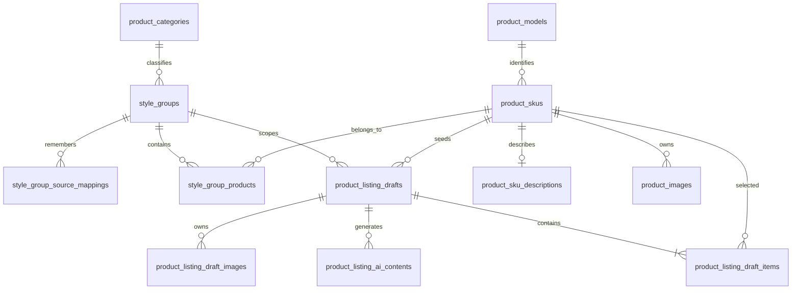
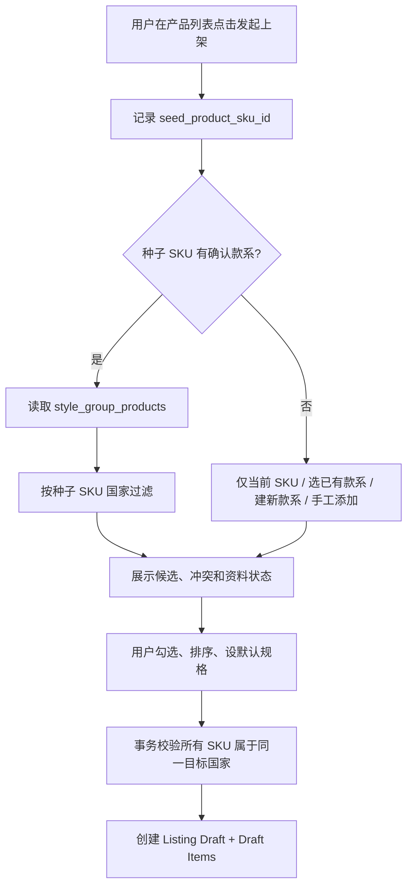

# Commerce Ops SKU 资料与多 SKU 上架架构

版本：1.0

日期：2026-07-21

状态：DESIGN COMPLETE / MIGRATION REQUIRED / IMPLEMENTATION PAUSED

## 0. 决策摘要

本次审计确认，当前“产品编辑工作台”把单个 SKU 资料、款系组织和平台 Listing 草稿混在同一个页面与保存流程中。现有数据库也把 `product_listing_drafts` 直接绑定到一个必填 `product_sku_id`，无法正确表达“一条平台链接包含多个 SKU”。

冻结以下决策：

1. Product SKU、Style Group、Listing Draft、Listing Draft Item 是四个独立实体。
2. SKU 资料页只维护单 SKU 事实、运营补充、SKU 详情描述和 SKU 产品图。
3. 款系通过稳定 `style_group_id` 组织跨国家的同款 SKU；国家不是款系身份的一部分。
4. 一条 Listing Draft 只属于一个目标国家，但可以包含该国家下同一款系的多个 SKU。
5. SKU 与 Listing Draft 的多对多选择必须落在 `product_listing_draft_items`，不得存入 JSON 代替关系表。
6. SKU 详情 AI 与系列 Listing AI 使用不同作用域、上下文和当前内容记录。
7. SKU 产品图与 Listing 系列图分别保存；任何采用动作都必须显式发生。
8. 旧单 SKU 草稿、AI 历史和图片任务保留为 legacy，只读可见；转换需要用户确认 SKU 范围。
9. 正确实现需要数据库迁移。本节点在创建迁移前停止，不修改页面、API、业务代码或数据库。
10. 主线最高迁移为 `012`；支线 A 已提交 `013`，并正在开发未提交的 `014`。建议本功能在支线合并后使用 `015_multi_sku_listing_foundation.sql`，当前不创建或占用编号。

## 1. 现状审计

### 1.1 仓库和迁移状态

| 项目 | 审计结果 |
|---|---|
| 主线工作树 | `<project-root>` |
| 主线分支/HEAD | `master` / `6faa0789f15c27c57abd2071ca41971856845af8` |
| 主线迁移 | `001` 至 `012` |
| 支线 A | `feature/deterministic-product-growth-radar` |
| 支线 A 已提交迁移 | `013_deterministic_growth_radar_foundation.sql` |
| 支线 A 在研迁移 | 未跟踪的 `014_deterministic_growth_radar_scope_and_linkage.sql` |
| 迁移器行为 | 按 SQL 文件名排序，逐文件事务执行，以完整文件名记录到 `schema_migrations` |
| 连号要求 | 代码不强制连续编号，但跨分支依赖仍必须按合并顺序形成完整迁移链 |

支线 A 当前还修改了增长雷达 Repository、Service 和解析脚本。主线不得读取后回写、暂存或提交这些文件。

### 1.2 正式 SQLite 只读审计

审计时 `PRAGMA integrity_check = ok`，`PRAGMA foreign_key_check` 为 0。以下仅为行数和结构统计，未读取或修改正式业务值。

| 表 | 行数 | 当前含义 | 主要问题 |
|---|---:|---|---|
| `product_skus` | 18,347 | 国家 + SKU 产品身份 | 没有稳定款系外键 |
| `product_models` | 6,500 | 主 SKU / 款型 | 一个款系可含多个主 SKU，不能替代款系 |
| `product_package_rows` | 21,714 | 产品包逐行无损事实 | 保持不变 |
| `product_inventory_snapshots` | 21,978 | SKU × 仓库快照 | 保持不变 |
| `product_field_overrides` | 81 | SKU 人工覆盖 | 可继续服务 SKU 事实纠错，不承载 Listing 字段 |
| `product_images` | 1 | SKU 产品图 | 归属正确，可保留 |
| `product_listing_drafts` | 0 | 单 SKU Listing 草稿结构 | `product_sku_id` 必填，变体存 JSON |
| `product_ai_contents` | 0 | 单 SKU/旧 Listing AI 历史结构 | `product_sku_id` 必填，Listing 作用域不独立 |
| `product_image_generation_tasks` | 0 | 单 SKU 图片任务结构 | `product_sku_id` 必填，Listing 仅为可空关联 |

当前数据还显示：

- 1,068 个 SKU 没有 `product_models` 关系，这可能包含灭款或尚未归组记录，不能据此猜测款系。
- 所有当前 SKU 都有款名和款号原文，但文本存在业务歧义。
- 按“相同二级类目 + 规范化款名”统计，有 2,118 个多 SKU 候选组。
- 其中 1,834 个候选组覆盖多个国家，说明款系身份需要跨国家稳定存在，再在 Listing 选择阶段按目标国家过滤。
- 有 23 个规范化款名跨越多个类目，必须进入人工确认，不能只按款名自动合并。

### 1.3 当前页面问题

产品列表目前只有“详情、编辑、删除/恢复”，没有“发起上架”。点击“编辑”后会加载：

```text
单 SKU 产品事实
+ 人工覆盖字段
+ SKU 图片
+ 平台/站点/店铺/平台类目
+ 系列定位和平台文案
+ Listing 图片任务
+ 价格、库存、物流和平台属性
+ 发布检查
```

当前 `saveListingWorkbench()` 还会先保存 SKU 人工覆盖，再保存单 SKU Listing 草稿。两个所有权区域在一次用户动作中耦合，任何局部失败都难以解释。

### 1.4 当前 API 和代码边界

| 能力 | 当前路径/实现 | 审计结论 |
|---|---|---|
| Listing 草稿 | `/api/product-center/products/:productId/listing-drafts` | 路径和服务都以单 SKU 为根 |
| Listing AI | `/products/:productId/ai/listing/generate` | 上下文只从一个产品开始 |
| 图片任务 | `/products/:productId/ai/images/...` | 任务以单 SKU 为必填作用域 |
| SKU 图片 | `/products/:productId/images` | 边界正确，继续保留 |
| SKU 人工覆盖 | `product_field_overrides` | 边界正确，继续保留 |
| 产品包事实 | import/package/cost/inventory 表 | 不修改 |

`product_models` 表代表主 SKU/款型，不是款系。按照已冻结的产品层级，一个款系可以包含多个主 SKU，因此不能把 `model_id` 改名后冒充 `style_group_id`。

## 2. 四个实体的业务边界



### 2.1 Product SKU

一个国家下的一个具体规格产品，可靠身份仍为“标准国家 + SKU”。它拥有：

- 产品包来源事实和人工纠错。
- 销售规格、材质、颜色、尺寸、重量和包装。
- SKU 详情描述。
- SKU 产品图。
- 当前款系关系及其来源。
- 生命周期、数据来源和变更历史。

它不拥有平台、目标国家、店铺、平台类目、系列标题、系列描述、系列卖点、系列图片或发布检查。

### 2.2 Style Group / 款系

代表同一款名、同一产品系列的一组 SKU。它拥有稳定 ID、款系代码、规范名称、类目、说明、状态和 SKU 排序。款名是来源证据和展示名称，不是主键。

一个款系可以：

- 跨多个国家存在。
- 包含多个 Product Model/主 SKU。
- 在每个国家拥有不同的国家 + SKU 记录。
- 因人工拆分或合并而调整成员，但稳定 ID 和历史映射不丢失。

### 2.3 Listing Draft / 上架草稿

代表准备发往一个平台、一个国家/站点和一个店铺的一条商品链接。它拥有：

- 上架目标、平台类目和输出语言。
- 系列定位、标题、副标题、系列描述和系列卖点。
- 系列图片、平台属性、物流配置和发布检查。
- 草稿状态、版本、操作者和审计记录。

Listing Draft 不属于某个 SKU。`seed_product_sku_id` 只记录发起入口和转换来源，不代表所有权。

### 2.4 Listing Draft Item / 上架 SKU 明细

代表一条草稿中被用户明确选中的一个国家 + SKU。它拥有该 Listing 场景下的规格名、规格值、SKU 图选择、售价、库存配置、排序、默认规格和启用状态。

## 3. SKU 资料页职责

### 3.1 页面保留

1. SKU 基础资料。
2. 产品规格。
3. 尺寸与重量。
4. 包装信息。
5. SKU 详情描述。
6. 产品图。
7. 所属款系。
8. 数据来源与修改记录。

### 3.2 页面移除

- 平台、国家/站点上架目标、店铺、平台类目和输出语言。
- 平台商品标题、副标题、整条链接描述和系列卖点。
- 系列主图、系列详情图和 Listing 图片生成。
- Listing 价格、变体、物流、平台属性、发布准备度和发布检查。
- 单 SKU Listing 草稿选择器及保存按钮。

这些不是视觉隐藏，而是从 SKU 页面加载、状态管理、保存 API 和脏数据判断中移除。

### 3.3 “素材”更名

用户可见名称统一改为“产品图”。内部 `asset`、`media`、文件元数据和存储目录不因展示文案修改而改名。

SKU 产品图按来源显示标签：

- 产品包图片。
- 用户上传图片。
- 马帮采集图片。
- AI 生成 SKU 图片。
- 当前采用图片。

现有 `product_images` 没有稳定 `source_type`，不能根据文件名或 `operator_label` 猜测来源。迁移设计需增加 `source_type`（`product_package/user_upload/mabang_collected/ai_generated`）、可空 `source_reference_id` 和来源审计字段；当前采用状态继续由 `is_primary`/排序或后续明确采用关系表达。

### 3.4 SKU 详情描述保存位置

新增 `product_sku_descriptions` 保存当前已采用描述。AI 候选和历史继续使用 `product_ai_contents`，新增 `content_type = sku_description` 语义。

采用 AI 版本时：

1. `product_ai_contents` 保留原始输入、输出、模型、Prompt 版本和历史状态。
2. `product_sku_descriptions` 写入当前采用文本、来源 `ai_adopted` 和 `adopted_ai_content_id`。
3. 人工编辑只更新当前描述并留 revision/审计，不覆盖 AI 原始输出。
4. 恢复历史版本会创建新的当前 revision，不删除后续历史。

SKU 描述不是产品包事实，因此不写入 `product_field_overrides`，也不写回 `product_package_rows`。

## 4. 稳定款系身份

### 4.1 `style_groups`

| 字段 | 约束/用途 |
|---|---|
| `id` | UUID/TEXT PK，稳定 `style_group_id` |
| `style_group_code` | 系统生成、唯一、不可从款名推导 |
| `style_name` | 当前确认展示名 |
| `normalized_style_name` | 精确候选匹配值，不作为永久身份 |
| `category_id` | FK `product_categories`，款系所属二级类目 |
| `description` | 款系事实说明，可空 |
| `status` | `candidate/confirmed/review_required/inactive/archived` |
| `identity_source` | `central_exact/manual_created/manual_split/manual_merge` |
| `revision` | 乐观锁版本 |
| `created_by/updated_by` | 操作来源 |
| `created_at/updated_at/inactive_at` | 审计与软停用 |

唯一约束：`style_group_code`。不得对 `normalized_style_name` 单独建唯一约束。

### 4.2 `style_group_source_mappings`

保存款号、款名、类目和来源批次到稳定款系的有效期映射。款名变更时结束旧映射并建立新映射，不创建新的款系 ID。

核心字段：`id`、`style_group_id`、`source_system`、`category_id`、`source_style_code`、`source_style_name`、`normalized_style_name`、`mapping_status`、`effective_from_batch_id`、`effective_to_batch_id`、`confirmed_by/at`。

### 4.3 `style_group_products`

| 字段 | 约束/用途 |
|---|---|
| `id` | PK |
| `style_group_id` | FK style group |
| `product_sku_id` | FK `product_skus`，实际国家 + SKU 产品记录 |
| `country_code_snapshot` | 分配时国家，仅用于审计；查询以 Product SKU 当前身份为准 |
| `membership_status` | `candidate/confirmed/excluded/ended` |
| `match_method` | `exact_name_category/manual/legacy_model_evidence` |
| `sort_order` | 款系默认 SKU 顺序 |
| `is_default_seed` | 款系默认种子 SKU，非 Listing 默认规格 |
| `source_batch_id` | 候选来源批次 |
| `created_by/confirmed_by` | 操作来源 |
| `created_at/updated_at/removed_at` | 历史和软移除 |

约束：

- 同一 SKU 同一时刻最多有一个 `confirmed` 且未移除的款系成员关系。
- 同一款系同一 SKU 不重复创建活动成员。
- `product_models` 保持主 SKU/款型含义；一个款系可通过成员 SKU 派生出多个 Product Model。
- 同一 Product Model 的活动 SKU 通常应属于同一款系，发现跨款系时进入人工确认，不自动改写。

### 4.4 候选生成规则

第一期只使用确定性证据：

1. 规范化后款名完全相同。
2. 二级类目相同。
3. SKU 未被删除，生命周期允许参与运营。
4. 款名不是空值、占位词或过于通用的值。

国家不作为款系 ID 的组成部分。完全相同的款系可跨国家归入同一稳定款系，进入 Listing 时再按目标国家过滤。

以下情况只生成 `candidate/review_required`：款名为空、跨不相关类目、同一 SKU 多候选、占位/通用款名、已有人工拆分、来源款号与款名关系冲突。禁止模糊相似度静默合并。

迁移文件只创建结构，不在 DDL 中批量确认款系。款系初始化应是独立、可重复、可回滚的数据批次：先按确定性规则生成候选和统计，再自动确认无冲突候选或交给人工确认；每个成员都记录来源批次和匹配方法。这样可以在不回滚数据库结构的情况下撤销一次错误归组。

## 5. 同款 SKU 匹配和国家隔离



规则：

1. 首次候选国家等于种子 SKU 的标准国家。
2. 只读取该 `style_group_id` 下、目标国家一致、成员状态已确认且产品有效的 SKU。
3. 同一个 SKU 代码在不同国家是不同 `product_skus.id`，不会同时进入一条草稿。
4. 用户在工作台更换目标国家时，原 Draft Items 不直接换国家；系统重新查询目标国家候选并要求用户确认替换。
5. 国家切换确认应在同一事务中替换 items，保留变更事件和旧 items 历史。
6. 手工添加也只能选择目标国家一致的 SKU；跨国请求返回稳定错误码 `LISTING_ITEM_COUNTRY_MISMATCH`。
7. 无款系时允许仅当前 SKU 发起，但仍创建 `multi_sku` 草稿和一条显式 Draft Item；不得回退到旧单 SKU 保存模型。

## 6. 发起上架流程

产品列表操作顺序：查看、编辑、发起上架、删除。

“发起上架”分两步：

1. 选择同款 SKU：读取种子、款系和同国家候选；支持全选、取消、单选、排序、默认规格和查看资料。
2. 创建草稿：用户确认后一次事务写入 Listing Draft 与 Draft Items，随后进入独立工作台。

推荐 API：

```text
GET  /api/product-center/products/:productId/listing-candidates?country_code=MY
GET  /api/product-center/style-groups/:styleGroupId/products?country_code=MY
POST /api/product-center/listing-drafts
GET  /api/product-center/listing-drafts/:draftId
PATCH /api/product-center/listing-drafts/:draftId
PUT  /api/product-center/listing-drafts/:draftId/items
POST /api/product-center/listing-drafts/:draftId/check
POST /api/product-center/legacy-listing-drafts/:legacyDraftId/convert-preview
POST /api/product-center/legacy-listing-drafts/:legacyDraftId/convert
```

创建请求必须包含 `seedProductSkuId`、目标国家和用户确认后的 `productSkuIds`。服务端重新加载产品，不信任前端传入的国家、SKU 名称、库存或款系归属。

## 7. 多 SKU Listing Draft 结构

### 7.1 `product_listing_drafts` 目标结构

现有表需要安全重建或等价的兼容迁移，不能只添加一个 JSON 字段。

新增/调整关键字段：

| 字段 | 说明 |
|---|---|
| `draft_scope` | `legacy_single_sku/multi_sku` |
| `style_group_id` | 可空 FK；无款系单 SKU 发起时为空 |
| `seed_product_sku_id` | 发起或旧草稿转换的种子，不代表草稿所有者 |
| `legacy_product_sku_id` | 只供旧单 SKU 草稿保留历史 |
| `country_code/country_name` | 草稿目标国家，multi_sku 必填 |
| `platform/shop/category/language` | Listing 目标字段，只存在草稿层 |
| `title/subtitle/description` | 系列文案 |
| `target_users/product_positioning/content_style` | 系列定位 |
| `status/revision/deleted_at` | 状态、并发和软删除 |
| `idempotency_key` | 创建草稿防重复提交，可空唯一 |

旧 `sku` 字段仅作为 legacy 快照保留，不参与新草稿身份或查询。旧“单 SKU + 目标”唯一索引只保留在 legacy 作用域；新草稿按 ID 更新，不因相同目标被静默合并。

### 7.2 `product_listing_draft_items`

| 字段 | 说明 |
|---|---|
| `id` | PK |
| `listing_draft_id` | FK Listing Draft |
| `product_sku_id` | FK 国家 + SKU 产品 |
| `sku_snapshot` | 创建时 SKU 审计快照，不作为关联键 |
| `source_product_revision` | 创建/刷新时产品版本，用于陈旧提示 |
| `variant_name/variant_value` | 该平台链接下的规格展示 |
| `selected_product_image_id` | 可空 FK SKU 产品图，必须显式选择 |
| `sale_price/original_price/promotion_price` | 当前 Listing SKU 价格 |
| `available_stock` | 发布库存配置，不覆盖库存事实 |
| `sort_order` | 稳定顺序 |
| `is_default` | 一条草稿最多一个默认规格 |
| `is_enabled` | 是否参与发布 |
| `created_by/updated_by` | 操作来源 |
| `created_at/updated_at/removed_at` | 审计和软移除 |

索引/约束：

- 活动 `(listing_draft_id, product_sku_id)` 唯一。
- 活动 `(listing_draft_id, sort_order)` 唯一。
- 每条草稿活动默认规格最多一个。
- 服务层事务校验全部 Product SKU 国家等于 Draft 目标国家。
- 至少一个启用 item、默认规格属于启用 items、已删除/灭款产品不可新加入。

### 7.3 Listing 图片关系

新增 `product_listing_draft_images`，保存草稿级系列图片及其顺序、槽位、来源和文件关系。来源可以是：

- `sku_product_image`：用户明确从某 SKU 产品图采用。
- `user_upload`：仅上传到当前 Listing。
- `ai_generated`：系列图片任务结果。

核心字段：`listing_draft_id`、`source_type`、`source_product_sku_id`、`source_product_image_id`、`generated_item_id`、正式文件元数据/ID、`slot_key`、`is_primary`、`sort_order`、状态和审计时间。

系列图片不能写入 `product_images`。SKU 图片被采用时只建立引用或受控副本，不改变 SKU 图片的主图状态。

## 8. SKU 描述与系列描述

| 内容 | 所有者 | AI 上下文 | 当前值位置 | 历史位置 |
|---|---|---|---|---|
| SKU 详情描述 | Product SKU | 当前 SKU 事实、规格、材质、颜色、尺寸、包装、款系基础信息 | `product_sku_descriptions` | `product_ai_contents` 的 `sku_description` |
| 系列 Listing 描述 | Listing Draft | 全部选中 SKU、差异、目标平台/国家/店铺、系列定位 | Listing Draft | `product_listing_ai_contents` |

系列文案必须以稳定顺序读取所有活动 Draft Items，并明确：共同特征、SKU 差异、可选规格、适用场景和选择建议。上下文哈希至少包含 Draft revision、目标、item ID/顺序/产品 revision、规格和采用图片版本。

新增 `product_listing_ai_contents`，避免继续要求 Listing AI 记录必须拥有 `product_sku_id`。它保存 `listing_draft_id`、内容类型、输入快照、输出、Prompt 版本、上下文哈希、版本、状态、采用值、人工修改和审计字段。

## 9. 系列图片生成上下文

系列图片任务以 Listing Draft 为所有者，输入必须包含：

- 全部启用 Draft Items 和稳定顺序。
- 每个 SKU 的规格、颜色、尺寸和选中的 SKU 产品图。
- 平台、目标国家/站点、店铺和平台类目。
- 目标用户、产品定位、系列卖点和风险提示。
- 图片模板版本，默认 1 张主图 + 6 张副图，但允许配置。

现有 `product_image_generation_tasks` 需要增加明确 `scope_type`，新任务必须绑定 Listing Draft；原 `product_sku_id` 只作为 legacy/seed 来源。生成项完成后先进入 Listing 图片候选，只有用户采用后才写 `product_listing_draft_images`。

## 10. 旧数据兼容

### 10.1 审计事实

当前正式库中旧 Listing 草稿、AI 内容和图片任务均为 0，因此本机没有需要转换的用户内容。但迁移必须按“可能有历史数据”的通用方式编写，不能依赖当前恰好为空。

### 10.2 兼容规则

1. 所有旧草稿标记 `legacy_single_sku`，原单 SKU 写入 `legacy_product_sku_id` 和 `seed_product_sku_id`。
2. 旧草稿保持只读查看，不自动生成多 SKU items。
3. 用户点击“转换”后先展示种子 SKU、款系和同国家候选。
4. 用户确认后创建新的 `multi_sku` 草稿和显式 items；旧草稿保持不变并记录 `converted_to_draft_id`。
5. 不自动加入全部同款 SKU。
6. 旧 `product_ai_contents` 原样保留；可以在转换页预览，但只有用户明确采用时才复制为新的 Listing AI 当前内容。
7. 旧图片任务和方案原样保留；不把旧生成结果写入 SKU 图片或新 Listing 图片。
8. 发布记录继续关联旧草稿，不迁移到新草稿。

## 11. 页面结构和低保真原型

保留现有左侧导航与顶部系统框架，仅重做产品中心内部页面。

### 11.1 SKU 资料页

```text
┌ SKU资料 ───────────────────────────────────────────────┐
│ 产品名称  SKU  款名  所属款系  当前国家  产品状态       │
│                                      [保存SKU资料] [发起上架] │
├────────────────────────────────────────────────────────┤
│ 基础资料 │ 产品规格 │ 尺寸重量 │ 包装信息               │
├────────────────────────────────────────────────────────┤
│ SKU详情描述                                             │
│ [AI生成] [重新生成] [历史记录]                          │
├────────────────────────────────────────────────────────┤
│ 产品图                                                  │
│ 产品包图片 / 用户上传 / 马帮采集 / AI生成SKU图片        │
├────────────────────────────────────────────────────────┤
│ 所属款系 │ 数据来源与修改记录                           │
└────────────────────────────────────────────────────────┘
```

### 11.2 选择同款 SKU

```text
┌ 选择本次上架SKU ─ 款名 / 目标国家 ─────────────────────┐
│ Seed SKU: ...      款系: SG-...       国家: 马来西亚     │
│ [全选] [取消全选] [添加SKU]                             │
│ ☑ 图 SKU-A  小号/白色  有价格  有库存  描述完整  ↕ 默认 │
│ ☑ 图 SKU-B  中号/白色  有价格  有库存  描述完整  ↕      │
│ ☐ 图 SKU-C  大号/胡桃  缺价格  有库存  待确认    ↕      │
│                              [返回] [确认并创建上架草稿] │
└────────────────────────────────────────────────────────┘
```

### 11.3 多 SKU 上架工作台

```text
┌ 多SKU上架工作台 ─ 款名 / 3个SKU / 平台 / 站点 / 店铺 ─┐
│ 1 本次上架SKU   2 上架目标   3 系列定位                 │
│ 4 系列商品文案  5 系列图片   6 SKU规格与价格            │
│ 7 物流与属性    8 平台预览   9 发布检查                 │
├────────────────────────────────────────────────────────┤
│ 当前步骤的工作区域                                      │
└────────────────────────────────────────────────────────┘
```

本节点不修改页面，因此没有实现后截图。以上原型作为迁移后 UI 实施依据，不能被描述为已经上线。

## 12. 权限、审计和状态

现有认证守卫保持不变。建议在当前 `product.listing.*` 基础上增加或细分：

- `product.style_group.view/manage`。
- `product.listing.create/view/edit/check/convert_legacy`。
- SKU 描述沿用 `product.edit`、`product.ai.generate/confirm/view_history`。

审计事件至少包含：款系创建/确认/拆分/合并、成员加入/移除、发起上架、items 批量确认/重排/国家替换、旧草稿转换、系列 AI 生成/采用/恢复、系列图片采用/移除和发布检查。

## 13. 迁移判断和建议方案

### 13.1 是否需要迁移

**需要。** 原因不是当前数据量，而是现有约束无法表达正确所有权：

- Listing Draft 的 `product_sku_id` 必填并被唯一索引使用。
- Draft Items 不存在，多 SKU 只能落入 `variants_json`。
- AI 内容必须绑定单 SKU。
- 图片任务必须绑定单 SKU，系列图片没有独立持久化关系。
- 稳定款系和款系成员关系不存在。
- SKU 当前详情描述没有独立运营内容记录。

### 13.2 必要数据库对象

必须新增：

1. `style_groups`。
2. `style_group_source_mappings`。
3. `style_group_products`。
4. `product_sku_descriptions`。
5. `product_listing_draft_items`。
6. `product_listing_ai_contents`。
7. `product_listing_draft_images`。

必须调整：

1. `product_listing_drafts`：作用域、款系、seed/legacy SKU、目标约束和旧索引。
2. `product_image_generation_tasks`：新增作用域并以 Listing Draft 作为新任务所有者。
3. `product_image_generation_items`：明确生成文件与 Listing 图片候选关系。
4. `product_images`：增加可审计图片来源，不能用展示层猜测来源。

保持不变：产品包逐行事实、国家 + SKU 唯一身份、成本/库存快照、SKU 人工覆盖、SKU 产品图和增长雷达表。

### 13.3 建议迁移编号与合并顺序

当前不得创建 `014`。建议顺序：

1. 支线 A 先确认并完成自己的 `013` 与在研 `014`，提交前解决其工作树修改。
2. 支线 A rebase/merge 主线时处理 `data-access.mjs`、`server.mjs`、`public/index.html`、`public/app.js` 和审计文件的重叠修改。
3. 将支线 A 合并进主线，确认新环境可按顺序执行 `001` 至 `014`，全量测试通过。
4. 从合并后的主线创建新的多 SKU 开发分支。
5. 使用 `015_multi_sku_listing_foundation.sql`。如果支线 A 最终放弃 `014`，仍需在开始编码前重新确认最高迁移号，不能在本节点预占。

迁移必须包含：SQLite 旧表安全重建测试、PostgreSQL DDL 转换/兼容测试、旧草稿逐行保留、重复执行保护、FK/index 检查、正式库前后行数/哈希核验和回滚脚本。当前不执行这些动作。

## 14. 后续实施拆分

| 阶段 | 内容 | 独立验收 |
|---|---|---|
| M1 | 迁移编号确认、表/索引/兼容迁移 | 临时 SQLite/PostgreSQL 测试库通过 |
| M2 | Style Group Repository/Service/API 和确定性候选 | 不改产品包来源事实 |
| M3 | SKU 详情描述及 SKU 页面解耦 | SKU 保存不再触碰 Listing 草稿 |
| M4 | 发起上架与同款 SKU 选择 | seed、国家过滤、排序和默认规格通过 |
| M5 | Multi-SKU Listing Repository/Service/API | 一条草稿关联多个显式 items |
| M6 | 独立上架工作台 | 九步页面、草稿保存和恢复通过 |
| M7 | 系列 AI 文案与系列图片作用域 | 上下文包含全部 items，图片不回写 SKU |
| M8 | Legacy 查看与显式转换 | 旧数据只读、转换不静默复制 |
| M9 | 全量回归、安全、性能与截图验收 | 原功能和增长雷达均通过 |

## 15. 测试计划

必须覆盖用户要求的 27 项，并补充以下数据库级断言：

- 款名修改不改变已确认 `style_group_id`。
- 相同款名跨类目不自动合并。
- 一个产品不能有两个活动确认款系。
- Draft Items 的产品国家全部等于 Draft 目标国家。
- 同一国家 + SKU 在同一 Draft 不重复。
- item 排序和默认规格约束稳定。
- 系列 AI 上下文哈希随任一 item revision、顺序或目标变化而变化。
- 删除/移除 SKU 产品图后，Listing 引用进入可解释的 missing 状态，不越权删除 Listing 文件。
- legacy 草稿迁移前后字段、状态、AI 历史和发布记录数量一致。
- 新迁移从 `012` 单独运行时应明确阻止或等待支线迁移合并，不形成隐藏断层。

页面测试需分别验证 SKU 资料页、候选选择页和多 SKU 工作台。静态源码断言不能代替浏览器交互截图和真实 DOM 冒烟。

## 16. 风险与回滚

| 风险 | 控制 |
|---|---|
| 错误按款名合并 | 只做精确名称 + 类目候选；冲突人工确认 |
| 跨国家 SKU 混入草稿 | Repository 事务内重新读取国家并拒绝不一致 |
| 产品更新使 Listing 陈旧 | 保存产品 revision/context hash，展示 stale 提示 |
| 旧草稿语义丢失 | legacy 原样保留，新草稿通过显式转换创建 |
| SKU 图与系列图串写 | 两张归属表、不同 API 和显式采用动作 |
| 支线迁移冲突 | 先合并 013/014，再从新基线创建 015 |
| SQLite 表重建失败 | 在数据库副本演练，事务失败不改正式库 |
| 页面再次混杂 | SKU 与 Listing 使用不同路由、状态对象和保存服务 |

迁移实施阶段的回滚单位必须是独立 commit + 数据库迁移前一致性备份。若迁移尚未应用，直接回滚代码 commit；若已应用，先停写，按迁移回滚手册恢复数据库备份，再恢复代码和配置。不得通过删除新表来假装完成回滚。

## 17. 本节点停止条件

本审计已确认需要新迁移，因此按任务约束在设计完成后暂停：

- 未创建迁移文件。
- 未修改数据库。
- 未修改 SKU 页面、产品列表、API、Repository 或 AI/图片逻辑。
- 未修改支线 A 文件。
- 未进入多 SKU 功能编码。
