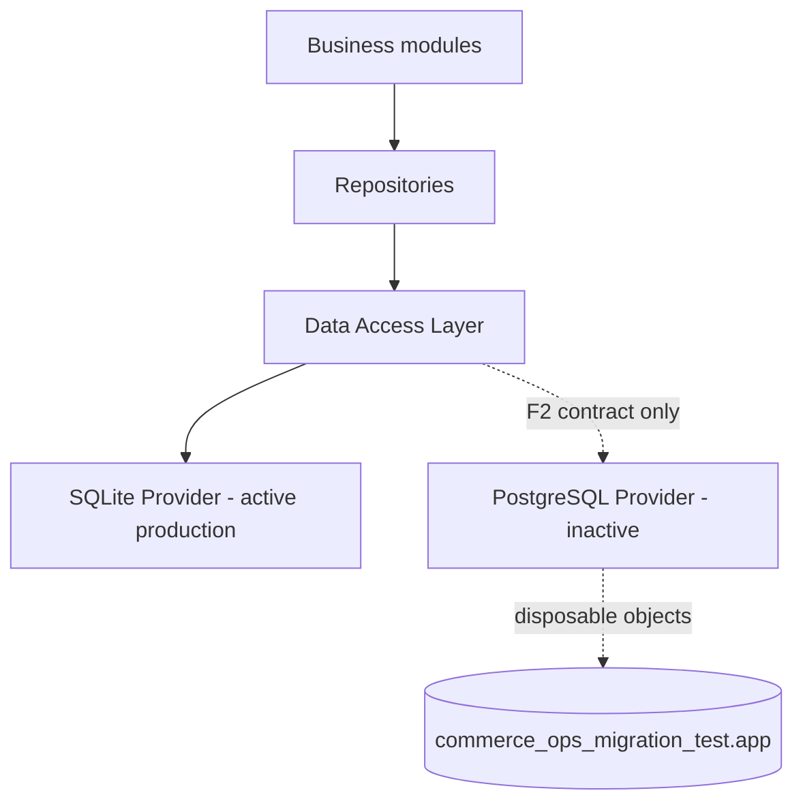

# Commerce Ops PostgreSQL Provider Report (F2)

Date: 2026-07-20
Status: COMPLETE
Production provider: SQLite (unchanged)
PostgreSQL use in F2: connectivity and disposable contract objects in `commerce_ops_migration_test` only

## Scope and safety boundary

F2 adds a PostgreSQL-capable data-access provider without changing the active production path. `lib/data/data-access.mjs` still constructs `SqliteProvider` directly, and `DATABASE_PROVIDER` remains `sqlite`. No production SQLite schema or row was changed, no production file was changed, and no business data was copied to PostgreSQL.

## Completed capabilities

| Capability | SQLite Provider | PostgreSQL Provider | Result |
|---|---|---|---|
| Parameterized `query` | `?` placeholders | `$1...$n` placeholders | Passed |
| Parameterized `execute` | `DatabaseSync` statements | `pg` Pool clients | Passed |
| Script execution | `exec` | client query | Passed |
| Transactions | commit and rollback | one checked-out client per transaction | Passed |
| Migration entry point | transactional SQL scripts | transactional SQL scripts | Passed |
| Connection management | owned SQLite connection | bounded `pg.Pool` | Passed |
| Constraint behavior | primary key and foreign key | primary key and foreign key | Passed |
| Index creation | explicit index | explicit index | Passed |
| Cleanup | temporary table removed | temporary tables removed | Passed |

PostgreSQL pool configuration is environment-driven. The default pool size is 5, with bounded connection, idle, and statement timeouts. Each acquired PostgreSQL client receives the configured `app` search path and UTC session timezone. Pool errors retain only a bounded error code.

The PostgreSQL driver is isolated in `lib/data/postgresql/postgresql-provider.mjs`. Server entry points, schedulers, repositories, and business route modules do not import `pg` directly.

## Compatibility layer

The compatibility layer defines explicit encoding and normalization for values that differ between engines.

| Logical type | SQLite representation | PostgreSQL representation | F2 handling |
|---|---|---|---|
| Boolean | integer `0/1` | `boolean` | normalized to JavaScript boolean |
| JSON | JSON text | `jsonb` | normalized to object/array |
| Timestamp | ISO-8601 UTC text | `timestamptz` | normalized to UTC ISO string |
| UUID | text | `uuid` | validated and lowercase-normalized |
| Big integer | integer/text depending on range | `bigint` | normalized to decimal string |
| Identity | `INTEGER PRIMARY KEY AUTOINCREMENT` | identity column | mapping documented; production DDL deferred |
| Index | SQLite index | PostgreSQL index | temporary contract verified |
| Foreign key | requires `PRAGMA foreign_keys=ON` | always enforced | temporary contract verified |

The same provider contract ran against a temporary SQLite database and `commerce_ops_migration_test.app`. It checked parameter binding, returned row shape, data normalization, commit, rollback, duplicate primary-key rejection, foreign-key rejection, index existence, and cleanup.

## Deliberately incomplete in F2

1. Existing business repositories are still synchronous and SQLite-specific. They have not been converted to PostgreSQL SQL or asynchronous repository methods.
2. Provider selection is not wired into application startup. `openCommerceDataAccess` continues to create SQLite directly.
3. Existing SQLite migrations are not yet translated to PostgreSQL DDL. `AUTOINCREMENT`, `datetime('now')`, `PRAGMA`, and SQLite table-rebuild patterns require explicit conversion.
4. SQLite-specific repository statements such as `INSERT OR IGNORE` and lock/upsert behavior require dialect-aware review before PostgreSQL use.
5. The F2 migration entry point executes supplied dialect-specific scripts transactionally but does not yet maintain a PostgreSQL migration-history table. Formal DDL and migration history belong to F3.
6. No production data, production schema, or file metadata has been migrated or compared.
7. PostgreSQL is not yet a supported production runtime despite the provider contract passing. F3 and F4 must complete first.

## Migration risks carried forward

- Timestamp semantics must remain UTC while preserving existing business timezone calculations.
- JSON text must be validated before loading into `jsonb`; malformed historical values need a defined policy.
- SQLite integers used as booleans or identities need per-column conversion, not global guessing.
- Large integers must avoid JavaScript precision loss and remain strings at the DAL boundary.
- Foreign-key ordering and current delete actions must be preserved when generating PostgreSQL DDL.
- SQLite migration scripts that rebuild tables cannot be replayed unchanged on PostgreSQL.
- Repository APIs currently mix synchronous behavior with synchronous transactions; production PostgreSQL requires an intentional async compatibility phase in F4.

## Verification evidence

- Shared provider unit tests: 6 passed.
- Full Commerce Ops regression suite: 295 passed, 0 failed.
- Build and portable-path checks: passed.
- Project doctor: passed; existing running service ports were reported as already in use.
- Real provider contract: SQLite passed; PostgreSQL migration test database passed.
- PostgreSQL test cleanup: `f2_provider_contract` and its child table removed.
- Production PostgreSQL guard: `commerce_ops.app` table count remained 0.
- Active provider: `sqlite`.
- PostgreSQL package: `pg@8.22.0`, exact version.

## F3 boundary

F3 may create an immutable copy of the production SQLite database, translate its schema to PostgreSQL DDL, and migrate only that copy into `commerce_ops_migration_test`. It must validate table, column, row, index, foreign-key, and key-field hash parity. F2 has not performed any of those operations.
