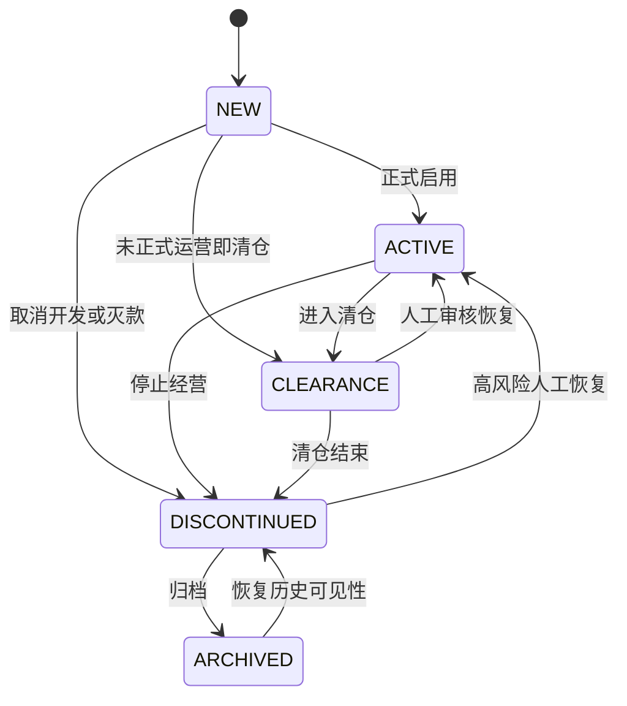
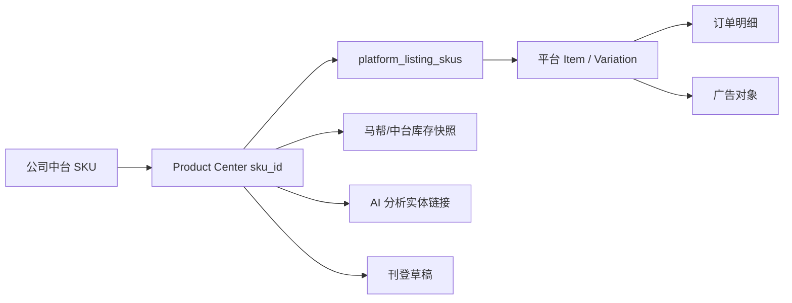

# Commerce Ops Product Center 数据库设计（G1A-1）

版本：1.0

日期：2026-07-20

状态：DESIGN COMPLETE / NOT IMPLEMENTED

目标数据库：PostgreSQL，Schema `app`

当前生产数据库：SQLite，保持不变

## 0. 设计结论

Product Center 采用“来源证据、商品身份、生命周期、业务事实、扩展关系、数据质量”分层模型，不建立一张巨型 `products` 表。

本设计冻结以下决策：

1. 公司商品中台产品包是可信来源，但每次导入仍需做表头、类型、唯一性、公式和关系校验。
2. 产品包原始行不可变；确认应用后形成可查询的产品系列、款型和 SKU 当前事实。
3. `SKU` 是来源商品身份键，内部使用 UUID；`主SKU`、`款号`和`款名`是关系证据，不是数据库主键。
4. 已人工确认的 16 条主 SKU 缺失记录属于灭款 SKU。它们保留 SKU、来源行、成本、库存和历史关系，不创建虚假款型，也不产生待处理数据异常。
5. 灭款通过 `DISCONTINUED` 生命周期管理，并从增长运营池、新刊登和新增广告候选中排除。
6. 生命周期当前状态和历史事件分开存储；任何恢复、清仓或归档都有审计轨迹。
7. 成本缺失、批次内重复 SKU、汇率无法核对和规格冲突是真正阻断问题；阻断的是确认应用或运营资格，不删除原始来源证据。
8. 图片素材和平台 Listing 当前没有真实数据，只设计关系表，不生成占位业务记录。
9. 所有表位于 PostgreSQL `app` Schema；使用 `uuid`、`timestamptz`、`numeric`、`jsonb` 和文本 `CHECK`，首期不使用 PostgreSQL 原生 enum。
10. 本阶段只完成设计，不创建迁移、不修改 SQLite、不写 PostgreSQL、不导入产品包。

本设计对 G1A-0.5 的一项解释作出业务修订：已确认灭款的 16 条主 SKU 缺失记录不再生成 `MISSING_MASTER_SKU` 活动问题；该字段对 `DISCONTINUED/ARCHIVED` 商品为不适用。

## 1. 设计边界

### 1.1 本阶段设计对象

- 产品包导入批次、文件、原始行和字段变化证据。
- 一级/二级类目、产品系列、产品款型/主 SKU、SKU。
- 商品生命周期定义、当前状态和状态事件。
- 产品动态属性定义和值。
- 产品与正式素材文件的关联。
- 产品与平台 Listing/Variation 的关联。
- 包装、仓库、库存、成本和价格快照。
- 数据质量规则、问题和处理记录。
- 面向增长运营、维护运营和历史查询的只读视图。

### 1.2 非目标

- 不开发上传、查询、详情或问题中心页面。
- 不导入 `产品包20260610.xlsx` 或任何正式产品数据。
- 不修改原 Excel、SQLite Schema 或现有业务表数据。
- 不切换 `DATABASE_PROVIDER`。
- 不实现图片上传、AI 富化、平台刊登或自动广告操作。
- 不建立用户、组织、角色和多租户系统。

## 2. PostgreSQL 建模规范

| 主题 | 规范 |
|---|---|
| Schema | 全部新表位于 `app` |
| 主键 | 应用生成 UUID；数据库不依赖扩展生成 ID |
| 时间 | `timestamptz`，统一写 UTC |
| 日期/周期 | 日期用 `date`；来源周期用 `char(6)` 并校验 `YYYYMM` |
| 金额 | `numeric(20,6)` + ISO 4217 币种 |
| 汇率 | `numeric(24,12)`，显式保存方向 |
| 重量/尺寸 | `numeric(18,3)`，单位固化在字段代码或单位列 |
| 数量 | 库存用 `numeric(20,6)`；装箱数用正整数 |
| JSON | 原始行、规范行、规则配置使用 `jsonb`；高频筛选字段必须拆列 |
| 状态 | `text` + `CHECK`，避免早期 enum 迁移成本 |
| 软删除 | 来源证据不删除；业务身份使用生命周期/停用时间；关系使用 `removed_at` |
| 并发 | 批次 revision、SKU revision 和事务内乐观锁 |
| 审计 | 保存批次、来源行、操作员标签、request ID 和可空 audit event ID |
| 文件 | 只保存现有文件元数据 ID，不保存绝对路径或文件二进制 |

所有中台事实字段均保留来源原文和来源行。标准化、纠错、AI 候选和平台回读不得覆盖来源原文。

## 3. 总体 ER 图

```mermaid
erDiagram
    export_files ||--o{ product_import_files : registers
    product_import_batches ||--|{ product_import_files : contains
    product_import_batches ||--o{ product_import_rows : parses
    product_import_rows ||--o{ product_import_changes : produces

    product_categories ||--o{ product_categories : parent_of
    product_categories ||--o{ product_families : classifies
    product_families ||--o{ product_family_source_mappings : maps
    product_families ||--o{ product_models : groups
    product_models ||--o{ product_sku_model_assignments : assigns
    product_skus ||--o{ product_sku_model_assignments : belongs_to
    product_import_rows }o--o| product_skus : applies_to

    product_lifecycle_status_definitions ||--o{ product_sku_lifecycle : defines
    product_lifecycle_status_definitions ||--o{ product_lifecycle_source_mappings : maps_to
    product_skus ||--|| product_sku_lifecycle : current_state
    product_skus ||--o{ product_sku_lifecycle_events : records

    product_attribute_definitions ||--o{ product_attribute_options : offers
    product_attribute_definitions ||--o{ product_attribute_values : defines
    product_models ||--o{ product_attribute_values : model_value
    product_skus ||--o{ product_attribute_values : sku_value

    managed_files ||--o{ product_asset_links : stores
    product_models ||--o{ product_asset_links : model_asset
    product_skus ||--o{ product_asset_links : sku_asset

    platform_listings ||--o{ platform_listing_skus : contains
    product_skus ||--o{ platform_listing_skus : maps

    product_skus ||--o{ product_packaging_profiles : packages
    product_skus ||--o{ product_inventory_snapshots : stocks
    product_skus ||--o{ product_cost_snapshots : costs
    product_cost_snapshots ||--o{ product_price_band_snapshots : prices

    product_data_quality_rules ||--o{ product_data_issues : detects
    product_skus ||--o{ product_data_issues : has
    product_data_issues ||--o{ product_data_issue_events : tracks
```



## 4. 产品包与导入证据表

产品包不是一张可被覆盖的业务表，而是四层证据：批次、正式文件、原始行和字段变化。

### 4.1 `product_import_batches`

一次公司中台产品包导入及其状态。

| 字段 | PostgreSQL 类型 | 约束 | 说明 |
|---|---|---|---|
| `id` | `uuid` | PK | 应用生成 |
| `source_system` | `text` | NOT NULL | 首期 `company_product_center` |
| `source_period` | `char(6)` | NOT NULL, CHECK | 产品包周期 |
| `country_code` | `char(2)` | NULL | 国家映射成功后写 ISO 代码 |
| `source_country_raw` | `text` | NOT NULL | 原始国家值 |
| `file_sha256` | `char(64)` | NOT NULL | 来源文件哈希 |
| `header_fingerprint` | `char(64)` | NOT NULL | 固定 34 字段及顺序指纹 |
| `status` | `text` | NOT NULL, CHECK | `uploaded/validating/preview_ready/applying/applied/validation_failed/apply_failed/cancelled` |
| `row_count` | `integer` | NOT NULL, >= 0 | 来源行数 |
| `new_count` | `integer` | NOT NULL, >= 0 | 新增行数 |
| `updated_count` | `integer` | NOT NULL, >= 0 | 更新行数 |
| `unchanged_count` | `integer` | NOT NULL, >= 0 | 无变化行数 |
| `conflict_count` | `integer` | NOT NULL, >= 0 | 冲突行数 |
| `exception_count` | `integer` | NOT NULL, >= 0 | 异常行数 |
| `revision` | `integer` | NOT NULL, >= 1 | 乐观锁版本 |
| `operator_label` | `text` | NOT NULL | 当前单 Token 环境下的操作标签，不作为权限身份 |
| `request_id` | `uuid` | NULL | 与操作审计关联 |
| `error_code` | `text` | NULL | 稳定错误码，不保存敏感异常对象 |
| `created_at` | `timestamptz` | NOT NULL | 创建时间 |
| `updated_at` | `timestamptz` | NOT NULL | 更新时间 |
| `applied_at` | `timestamptz` | NULL | 应用完成时间 |
| `cancelled_at` | `timestamptz` | NULL | 取消时间 |

唯一约束：

```text
(source_system, file_sha256, header_fingerprint, source_period)
```

同一文件重复上传返回原批次，不重复解析和应用。

### 4.2 `product_import_files`

| 字段 | 类型 | 约束 | 说明 |
|---|---|---|---|
| `id` | `uuid` | PK | 关系 ID |
| `batch_id` | `uuid` | FK batches, NOT NULL | 导入批次 |
| `export_file_id` | `uuid` | FK existing `export_files`, NOT NULL | 现有正式文件记录 |
| `file_role` | `text` | CHECK | 首期 `source`；未来可有 `error_report/diff_export` |
| `created_at` | `timestamptz` | NOT NULL | 关联时间 |

唯一约束：`(batch_id, file_role)`。

未来迁移需要安全扩展现有 `export_files.source_type` 的允许值，增加 `product_package_import` 和产品包报告类型；必须保留已有马帮文件记录和文件哈希。

### 4.3 `product_import_rows`

保存产品包每一行的不可变来源证据。

| 字段 | 类型 | 约束 | 说明 |
|---|---|---|---|
| `id` | `uuid` | PK | 行 ID |
| `batch_id` | `uuid` | FK batches, NOT NULL | 来源批次 |
| `source_row_number` | `integer` | NOT NULL, >= 2 | Excel 行号 |
| `source_sku` | `text` | NULL | 原始 SKU；为空仍保存证据 |
| `row_sha256` | `char(64)` | NOT NULL | 规范化行哈希 |
| `raw_payload` | `jsonb` | NOT NULL | 原始 34 字段，空值保持 NULL |
| `normalized_payload` | `jsonb` | NOT NULL | 类型转换后的 34 字段 |
| `validation_codes` | `jsonb` | NOT NULL, default `[]` | 稳定校验码列表 |
| `outcome` | `text` | NOT NULL, CHECK | `new/updated/unchanged/conflict/exception` |
| `target_sku_id` | `uuid` | FK product_skus, NULL | 预览或应用目标 |
| `applied_at` | `timestamptz` | NULL | 应用时间 |
| `created_at` | `timestamptz` | NOT NULL | 解析时间 |

唯一约束：`(batch_id, source_row_number)`。不对 `(batch_id, source_sku)` 建唯一约束，因为必须先保存并识别批次内重复 SKU。

### 4.4 `product_import_changes`

| 字段 | 类型 | 约束 | 说明 |
|---|---|---|---|
| `id` | `uuid` | PK | 变化 ID |
| `batch_id` | `uuid` | FK batches, NOT NULL | 批次 |
| `row_id` | `uuid` | FK rows, NOT NULL | 来源行 |
| `target_sku_id` | `uuid` | FK product_skus, NULL | 目标 SKU |
| `field_code` | `text` | NOT NULL | 稳定字段代码 |
| `change_type` | `text` | CHECK | `new/update/conflict/exception` |
| `old_value` | `jsonb` | NULL | 当前规范值 |
| `new_value` | `jsonb` | NULL | 候选规范值 |
| `source_raw_value` | `text` | NULL | 来源原文 |
| `is_applicable` | `boolean` | NOT NULL | 是否允许应用 |
| `decision_status` | `text` | CHECK | `pending/approved/ignored/blocked/applied` |
| `reason_code` | `text` | NULL | 冲突/异常原因 |
| `suggestion_code` | `text` | NULL | 机器可读建议，不保存模型长文 |
| `expected_sku_revision` | `integer` | NULL | 防止预览后静默覆盖 |
| `decided_by` | `text` | NULL | 操作标签 |
| `decided_at` | `timestamptz` | NULL | 决策时间 |
| `applied_at` | `timestamptz` | NULL | 应用时间 |
| `created_at` | `timestamptz` | NOT NULL | 创建时间 |

唯一约束：`(row_id, field_code)`。变化记录不硬删除；无变化字段不逐字段落库。

## 5. 分类、产品系列、款型与 SKU

### 5.1 `product_categories`

动态分类树，避免把当前 3C 数码或未来五个类目写死为 enum。

| 字段 | 类型 | 约束 | 说明 |
|---|---|---|---|
| `id` | `uuid` | PK | 内部类目 ID |
| `parent_id` | `uuid` | self FK, NULL | 一级类目为空，二级指向一级 |
| `level` | `smallint` | CHECK 1/2 | G1A 首期两级 |
| `source_system` | `text` | NOT NULL | 来源系统 |
| `source_name` | `text` | NOT NULL | 来源原文 |
| `normalized_name` | `text` | NOT NULL | 查询规范值 |
| `status` | `text` | CHECK | `active/inactive/review_required` |
| `first_seen_batch_id` | `uuid` | FK batch | 首次来源 |
| `last_seen_batch_id` | `uuid` | FK batch | 最近来源 |
| `created_at/updated_at` | `timestamptz` | NOT NULL | 审计时间 |
| `inactive_at` | `timestamptz` | NULL | 软停用 |

唯一约束：`(source_system, parent_id, normalized_name)`，一级类目通过单独部分唯一索引处理 `parent_id IS NULL`。

### 5.2 `product_families`

内部产品系列，不直接把款号当主键。

| 字段 | 类型 | 约束 | 说明 |
|---|---|---|---|
| `id` | `uuid` | PK | 产品系列 ID |
| `category_id` | `uuid` | FK categories, NOT NULL | 所属二级类目 |
| `canonical_name` | `text` | NOT NULL | 确认后的系列名称 |
| `identity_status` | `text` | CHECK | `confirmed/placeholder/review_required/inactive` |
| `revision` | `integer` | NOT NULL | 并发版本 |
| `created_by/updated_by` | `text` | NOT NULL | 操作标签或系统来源 |
| `created_at/updated_at` | `timestamptz` | NOT NULL | 审计时间 |
| `inactive_at` | `timestamptz` | NULL | 软停用 |

`3C0000`、`3C9999` 不会被自动创建为一个包含全部 SKU 的系列。

### 5.3 `product_family_source_mappings`

保存款号、款名与内部系列的可追溯映射。

| 字段 | 类型 | 约束 | 说明 |
|---|---|---|---|
| `id` | `uuid` | PK | 映射 ID |
| `family_id` | `uuid` | FK families, NOT NULL | 内部系列 |
| `category_id` | `uuid` | FK categories, NOT NULL | 来源分类上下文 |
| `source_system` | `text` | NOT NULL | 来源系统 |
| `source_style_code` | `text` | NULL | 款号原文 |
| `source_style_name` | `text` | NULL | 款名原文 |
| `mapping_status` | `text` | CHECK | `confirmed/review_required/ended` |
| `effective_from_batch_id` | `uuid` | FK batch | 生效批次 |
| `effective_to_batch_id` | `uuid` | FK batch, NULL | 结束批次 |
| `created_at` | `timestamptz` | NOT NULL | 创建时间 |

活动映射的唯一约束基于来源系统、分类、款号和规范款名；占位款号必须人工确认后才创建活动映射。

### 5.4 `product_models`

有真实主 SKU 时才创建 Product Model。主 SKU 缺失的灭款 SKU 不创建空壳 Model。

| 字段 | 类型 | 约束 | 说明 |
|---|---|---|---|
| `id` | `uuid` | PK | 款型 ID |
| `family_id` | `uuid` | FK families, NULL | 系列未确认时允许为空 |
| `source_system` | `text` | NOT NULL | 来源系统 |
| `source_main_sku` | `text` | NOT NULL | 公司中台主 SKU |
| `canonical_name` | `text` | NULL | 确认款型名称 |
| `identity_status` | `text` | CHECK | `confirmed/review_required/inactive` |
| `revision` | `integer` | NOT NULL | 并发版本 |
| `first_seen_batch_id/last_seen_batch_id` | `uuid` | FK batch | 来源范围 |
| `created_at/updated_at` | `timestamptz` | NOT NULL | 审计时间 |
| `inactive_at` | `timestamptz` | NULL | 软停用 |

唯一约束：`(source_system, source_main_sku)`。

### 5.5 `product_skus`

SKU 身份与当前高频来源事实，不承载库存、成本、素材、平台或 AI 历史。

| 字段 | 类型 | 约束 | 说明 |
|---|---|---|---|
| `id` | `uuid` | PK | 内部 SKU ID |
| `source_system` | `text` | NOT NULL | 来源系统 |
| `source_sku` | `text` | NOT NULL | 中台 SKU 原文 |
| `normalized_sku` | `text` | NOT NULL | 查询与唯一性规范值 |
| `category_id` | `uuid` | FK categories, NOT NULL | 当前二级类目 |
| `source_product_name` | `text` | NOT NULL | 当前中台商品名称 |
| `source_sales_spec` | `text` | NULL | 当前销售规格原文 |
| `source_style_code` | `text` | NULL | 款号来源证据 |
| `source_style_name` | `text` | NULL | 款名来源证据 |
| `source_status_raw` | `text` | NOT NULL | 中台状态原文 |
| `source_is_gift` | `boolean` | NULL | NULL 表示 unknown |
| `source_product_type` | `text` | CHECK | `sellable_product/accessory/spare_part/packaging_material/gift/unknown` |
| `current_source_row_id` | `uuid` | FK import_rows, NOT NULL | 当前事实证据 |
| `revision` | `integer` | NOT NULL, >= 1 | 乐观锁版本 |
| `first_seen_batch_id/last_seen_batch_id` | `uuid` | FK batch | 首次/最近批次 |
| `created_at/updated_at` | `timestamptz` | NOT NULL | 审计时间 |
| `archived_at` | `timestamptz` | NULL | 仅辅助隐藏；业务归档以生命周期为准 |

唯一约束：`(source_system, normalized_sku)`。

### 5.6 `product_sku_model_assignments`

保存 SKU 与款型关系历史，避免主 SKU 变化覆盖旧关系。

| 字段 | 类型 | 约束 | 说明 |
|---|---|---|---|
| `id` | `uuid` | PK | 关系 ID |
| `sku_id` | `uuid` | FK skus, NOT NULL | SKU |
| `model_id` | `uuid` | FK models, NOT NULL | 款型 |
| `status` | `text` | CHECK | `active/ended/review_required` |
| `source_batch_id` | `uuid` | FK batch | 关系来源 |
| `decision_source` | `text` | CHECK | `central/manual/rule` |
| `effective_from` | `timestamptz` | NOT NULL | 生效时间 |
| `effective_to` | `timestamptz` | NULL | 结束时间 |
| `created_at` | `timestamptz` | NOT NULL | 创建时间 |

每个 SKU 只允许一个 `effective_to IS NULL AND status='active'` 的当前关系。灭款且主 SKU 缺失的 16 条 SKU 没有当前关系，这是合法状态。

## 6. 商品生命周期

### 6.1 状态定义

| 状态 | 业务含义 | 增长运营池 | 维护运营池 | 新刊登 | 新增广告 | 历史保留 |
|---|---|---|---|---|---|---|
| `NEW` | 新品或待开发商品 | 是，仍受完整度/质量阻断 | 是 | 条件允许 | 条件允许 | 是 |
| `ACTIVE` | 正常销售商品 | 是 | 是 | 条件允许 | 条件允许 | 是 |
| `CLEARANCE` | 清仓商品 | 否 | 是，进入清仓维护池 | 默认禁止 | 默认禁止扩量 | 是 |
| `DISCONTINUED` | 灭款/停止经营 | 否 | 否，仅历史查看 | 禁止 | 禁止 | 是 |
| `ARCHIVED` | 已归档历史商品 | 否 | 否 | 禁止 | 禁止 | 是，默认列表隐藏 |

“进入运营池”不是 SKU 表上的可手工修改布尔值，而是生命周期、质量阻断和资料完整度共同计算的结果。

### 6.2 `product_lifecycle_status_definitions`

状态及默认策略字典，由迁移种子建立，应用角色只读。

| 字段 | 类型 | 约束 | 说明 |
|---|---|---|---|
| `code` | `text` | PK | 五个冻结状态 |
| `display_name` | `text` | NOT NULL | 中文名称 |
| `growth_pool_eligible` | `boolean` | NOT NULL | 是否可进入增长池 |
| `maintenance_pool_eligible` | `boolean` | NOT NULL | 是否进入维护池 |
| `allows_new_listing` | `boolean` | NOT NULL | 生命周期默认策略 |
| `allows_ad_growth` | `boolean` | NOT NULL | 是否允许新增/扩量广告 |
| `is_terminal` | `boolean` | NOT NULL | 是否历史终态候选 |
| `sort_order` | `smallint` | NOT NULL | 展示顺序 |
| `created_at/updated_at` | `timestamptz` | NOT NULL | 版本审计 |

策略是默认值，最终操作仍需通过质量、库存、权限和平台规则。

### 6.3 `product_sku_lifecycle`

每个 SKU 一条当前状态记录。

| 字段 | 类型 | 约束 | 说明 |
|---|---|---|---|
| `sku_id` | `uuid` | PK, FK skus | SKU |
| `status_code` | `text` | FK definitions | 当前状态 |
| `revision` | `integer` | NOT NULL, >= 1 | 生命周期乐观锁 |
| `decision_source` | `text` | CHECK | `central/manual/rule` |
| `source_status_raw` | `text` | NULL | 最近中台状态原文 |
| `source_batch_id` | `uuid` | FK batch, NULL | 状态来源批次 |
| `reason_code` | `text` | NOT NULL | 稳定原因码 |
| `operator_label` | `text` | NOT NULL | 操作标签/系统 |
| `request_id` | `uuid` | NULL | 操作审计关联 |
| `effective_at` | `timestamptz` | NOT NULL | 当前状态生效时间 |
| `updated_at` | `timestamptz` | NOT NULL | 更新时间 |

### 6.4 `product_lifecycle_source_mappings`

版本化保存公司中台状态到内部生命周期的默认映射：

| 来源状态 | 默认内部状态 | 说明 |
|---|---|---|
| 待开发 | `NEW` | 进入新品治理池，仍需通过完整度和质量检查 |
| 正常销售 | `ACTIVE` | 可进入增长和维护运营池 |
| 清仓商品 | `CLEARANCE` | 只进入清仓维护池，不新增增长动作 |

表字段包括 `id`、`source_system`、`source_status_normalized`、`target_status_code`、`mapping_version`、`enabled`、`effective_from/effective_to` 和审计时间。唯一约束为 `(source_system, source_status_normalized, mapping_version)`。

状态决策优先级为：经过审核的人工生命周期决定 > 当前生效的中台状态映射 > 派生规则。已人工确认 `DISCONTINUED` 的 SKU 后续若收到“正常销售”，系统只创建 `LIFECYCLE_SOURCE_CONFLICT` 审核事项，不自动恢复。

### 6.5 `product_sku_lifecycle_events`

不可变生命周期事件。

| 字段 | 类型 | 约束 | 说明 |
|---|---|---|---|
| `id` | `uuid` | PK | 事件 ID |
| `sku_id` | `uuid` | FK skus, NOT NULL | SKU |
| `revision` | `integer` | NOT NULL | 对应生命周期版本 |
| `from_status` | `text` | FK definitions, NULL | 首次创建可空 |
| `to_status` | `text` | FK definitions, NOT NULL | 新状态 |
| `decision_source` | `text` | CHECK | `central/manual/rule` |
| `reason_code` | `text` | NOT NULL | 迁移原因 |
| `source_batch_id` | `uuid` | FK batch, NULL | 来源批次 |
| `note` | `text` | NULL | 有界说明，不存敏感信息 |
| `operator_label` | `text` | NOT NULL | 操作标签 |
| `request_id` | `uuid` | NULL | 审计关联 |
| `occurred_at` | `timestamptz` | NOT NULL | 事件时间 |

唯一约束：`(sku_id, revision)`。事件只允许 INSERT/SELECT，不允许 UPDATE/DELETE。

### 6.6 灭款 SKU 处理

已确认的 16 条灭款 SKU 应按以下方式保存：

1. 原始 34 字段进入 `product_import_rows`。
2. 建立 `product_skus`，保留来源商品名、规格、分类、成本、库存和当前来源行。
3. 不创建虚假 `product_models`，也不创建 SKU-Model 活动关系。
4. 生命周期当前状态写为 `DISCONTINUED`，原因码建议为 `MANUAL_CONFIRMED_DISCONTINUED_WITHOUT_MASTER_SKU`。
5. 不生成 `MISSING_MASTER_SKU` 活动问题；完整度规则对该字段返回 `not_applicable`。
6. 排除在增长池、维护池、新刊登、广告增长、批量内容富化和活动报名候选之外。
7. 历史订单、库存、成本、文件、平台 Listing 和审计关系全部保留。
8. 后续中台再次出现且状态变化时，不自动恢复；创建生命周期冲突供人工确认。

### 6.7 状态迁移



`DISCONTINUED → ACTIVE` 必须人工审核并记录原因，不能由一次来源文件自动触发。`ARCHIVED` 不允许直接进入 `ACTIVE`。

### 6.8 运营池视图

建议提供三个只读视图：

- `product_growth_pool_view`：生命周期 `NEW/ACTIVE`，无活动 blocker，且所需完整度维度不是 blocked。
- `product_maintenance_pool_view`：生命周期 `NEW/ACTIVE/CLEARANCE`，用于已有链接、库存和清仓维护。
- `product_history_view`：生命周期 `DISCONTINUED/ARCHIVED`，默认不进入普通运营列表。

刊登、广告、活动和 AI 批处理服务必须通过统一 Eligibility Service 或上述视图获取候选，不能直接查询全部 `product_skus`。

## 7. 产品属性

固定物理事实如重量、尺寸、成本和仓库不存入通用属性 JSON。通用属性用于材质、颜色、层数、床型、安装方式等类目差异字段。

### 7.1 `product_attribute_definitions`

| 字段 | 类型 | 约束 | 说明 |
|---|---|---|---|
| `id` | `uuid` | PK | 属性定义 ID |
| `category_id` | `uuid` | FK categories, NULL | NULL 表示跨类目通用 |
| `attribute_code` | `text` | NOT NULL | 稳定代码 |
| `display_name` | `text` | NOT NULL | 展示名称 |
| `scope` | `text` | CHECK | `model/sku` |
| `value_type` | `text` | CHECK | `text/integer/decimal/boolean/date/enum/json` |
| `unit_code` | `text` | NULL | cm、g 等标准单位 |
| `is_multivalue` | `boolean` | NOT NULL | 是否多值 |
| `source_ownership` | `text` | CHECK | `central/human/ai/platform/system` |
| `validation_config` | `jsonb` | NOT NULL | 长度、范围、格式、选项等 |
| `status` | `text` | CHECK | `active/inactive/draft` |
| `version` | `integer` | NOT NULL | 定义版本 |
| `created_at/updated_at` | `timestamptz` | NOT NULL | 审计时间 |

唯一约束：`(category_id, attribute_code, version)`。

### 7.2 `product_attribute_options`

枚举选项及本地化标签。唯一约束：`(definition_id, option_code)`；停用选项保留历史。

### 7.3 `product_attribute_values`

| 字段 | 类型 | 约束 | 说明 |
|---|---|---|---|
| `id` | `uuid` | PK | 值 ID |
| `definition_id` | `uuid` | FK definitions, NOT NULL | 属性定义 |
| `model_id` | `uuid` | FK models, NULL | 款型值 |
| `sku_id` | `uuid` | FK skus, NULL | SKU 值 |
| `value_text` | `text` | NULL | 文本/枚举代码 |
| `value_decimal` | `numeric(20,6)` | NULL | 数值 |
| `value_boolean` | `boolean` | NULL | 布尔 |
| `value_date` | `date` | NULL | 日期 |
| `value_json` | `jsonb` | NULL | 多值/结构值 |
| `source_type` | `text` | CHECK | 中台、人工、AI 审核采纳、平台回读、系统计算 |
| `source_batch_id` | `uuid` | FK batch, NULL | 来源批次 |
| `review_status` | `text` | CHECK | `accepted/pending/rejected` |
| `version` | `integer` | NOT NULL | 值版本 |
| `effective_from/effective_to` | `timestamptz` | NULL | 有效期 |
| `created_at` | `timestamptz` | NOT NULL | 创建时间 |

约束：`model_id` 和 `sku_id` 必须且只能填写一个；值列必须符合属性类型。AI 未审核候选未来进入独立候选表，不直接写 accepted 值。

## 8. 包装、库存、成本与价格快照

### 8.1 `product_packaging_profiles`

保存单品尺寸原文、解析状态、维度数量、净/毛重、外箱长宽高、装箱数、出货方式、来源批次和有效期。支持一维、二维、三维及范围表达；结构化字段不得覆盖原文。

关键约束：重量和箱规为正；有净重和毛重时毛重不得小于净重；`dimension_count` 允许 1-4 或 NULL。

### 8.2 `product_warehouses` 与 `product_inventory_snapshots`

- 仓库以来源系统 + 稳定来源代码/规范名称唯一。
- 产品包仓存作为不可变周期快照，唯一键为 `sku_id + warehouse_id + source + observed_at`。
- 马帮实时库存继续保留独立来源，不与产品包仓存直接相加。

### 8.3 `product_cost_snapshots`

保存 SKU、国家、来源周期、人民币成本、当地币成本、币种、汇率、`fx_direction`、核对状态、来源批次和有效期。

关键约束：

- 成本和汇率必须大于 0。
- `fx_direction` 为 `local_per_cny/cny_per_local`。
- 相同 SKU、国家、周期和来源只有一个有效成本快照。
- 244 条乘法口径和 18 条除法口径均为合法来源，不因方向不同报错。

### 8.4 `product_price_band_snapshots`

一个成本快照对应 20%、25%、35%、45% 四条价格线。保存来源价格、公式复核结果和偏差，不把四档价宣称为最低控价或净利润价。

## 9. 素材关联

### 9.1 `product_asset_links`

G1A-1 只冻结关系，不产生素材数据。G1B 实施时必须接入现有安全文件持久化和生命周期体系。

| 字段 | 类型 | 约束 | 说明 |
|---|---|---|---|
| `id` | `uuid` | PK | 关联 ID |
| `managed_file_id` | `uuid` | FK existing `managed_files` | 正式受管文件 |
| `family_id` | `uuid` | FK families, NULL | 系列素材 |
| `model_id` | `uuid` | FK models, NULL | 款型素材 |
| `sku_id` | `uuid` | FK skus, NULL | SKU 素材 |
| `asset_type` | `text` | CHECK | `main_image/detail_image/size_image/install_image/video/manual/other` |
| `asset_role` | `text` | NULL | 业务角色 |
| `country_code/platform_code/language_code` | `text` | NULL | 适用范围 |
| `sort_order` | `integer` | NOT NULL | 排序 |
| `source_type` | `text` | CHECK | `central/supplier/human/ai/platform` |
| `review_status` | `text` | CHECK | `pending/approved/rejected/inactive` |
| `version` | `integer` | NOT NULL | 素材版本 |
| `created_at/updated_at/removed_at` | `timestamptz` | NULL | 生命周期 |

`family_id/model_id/sku_id` 必须且只能填写一个。当前 `managed_files` 的允许根目录和来源类型只覆盖广告文件；G1B 必须通过受控迁移扩展 `product_asset` 类型，不能把产品图片塞进广告目录，也不能新增绕过路径安全的文件表。

## 10. 平台 Listing 关联

### 10.1 `platform_listings`

| 字段 | 类型 | 约束 | 说明 |
|---|---|---|---|
| `id` | `uuid` | PK | 内部 Listing ID |
| `platform_code` | `text` | NOT NULL | `shopee/tiktok_shop/lazada` |
| `country_code` | `char(2)` | NOT NULL | 销售国家 |
| `shop_id` | `uuid` | NOT NULL | 未来店铺主数据 FK |
| `platform_item_id` | `text` | NOT NULL | 平台商品 ID |
| `platform_category_id` | `text` | NULL | 平台类目 |
| `title` | `text` | NULL | 平台回读标题 |
| `listing_url` | `text` | NULL | 访问地址，不作为身份键 |
| `status` | `text` | CHECK | `draft/active/inactive/deleted/error` |
| `last_synced_at` | `timestamptz` | NULL | 平台回读时间 |
| `created_at/updated_at` | `timestamptz` | NOT NULL | 审计时间 |

唯一约束：`(platform_code, country_code, shop_id, platform_item_id)`。

### 10.2 `platform_listing_skus`

| 字段 | 类型 | 约束 | 说明 |
|---|---|---|---|
| `id` | `uuid` | PK | 映射 ID |
| `listing_id` | `uuid` | FK listings, NOT NULL | Listing |
| `sku_id` | `uuid` | FK product_skus, NOT NULL | 内部 SKU |
| `platform_variation_id` | `text` | NULL | 平台变体 ID |
| `seller_sku` | `text` | NULL | 店铺 Seller SKU |
| `mapping_status` | `text` | CHECK | `confirmed/review_required/ended` |
| `source_type` | `text` | CHECK | `platform/manual/import` |
| `effective_from/effective_to` | `timestamptz` | NULL | 有效期 |
| `created_at` | `timestamptz` | NOT NULL | 创建时间 |

活动关系对 `(listing_id, platform_variation_id)` 唯一。灭款 SKU 的历史 Listing 关系继续保留，但生命周期守卫禁止创建新 Listing。

## 11. 数据质量中心

### 11.1 阻断层级

数据来源可信不代表跳过校验。系统区分三种阻断：

- `batch_blocker`：整批不能确认应用，例如固定表头不一致、批次内重复 SKU 无法判定。
- `field_blocker`：相关字段变化不能覆盖当前事实，例如规格冲突。
- `operation_blocker`：身份可保存，但不能进入增长运营、刊登或广告，例如成本/汇率无效。

原始文件和原始行始终保留，不因 blocker 被删除。

### 11.2 真正阻断问题

| 问题代码 | 阻断层级 | 判定 | 处理 |
|---|---|---|---|
| `DUPLICATE_SKU_IN_BATCH` | batch | 同一批次同规范 SKU 多行且内容不能证明一致 | 阻断应用，人工选择/修复来源文件 |
| `COST_MISSING_OR_INVALID` | operation | 核心成本为空、非数或不大于 0 | SKU 身份可保留，禁止增长/刊登/利润计算 |
| `FX_RECONCILIATION_FAILED` | operation | 人民币成本、当地币成本和任一合法方向均无法核对 | 保留来源三值，禁止重算和价格动作 |
| `SPEC_CONFLICT` | field/operation | 同一 SKU 的新规格与当前已确认规格冲突，且无法由版本解释 | 不覆盖当前规格，阻断依赖规格的操作 |

合法的汇率双方向不是错误；只有无法按任一方向核对才是 blocker。

### 11.3 非阻断或不适用

| 场景 | 处理 |
|---|---|
| 灭款 SKU 缺少主 SKU | 不创建活动质量问题；生命周期说明中保留原因，主 SKU 完整度为 `not_applicable` |
| 历史 SKU 缺少包装/规格 | warning/info；保留来源，若已 DISCONTINUED/ARCHIVED 不影响运营池 |
| 占位款号 | `review_required`，不自动合并系列；不阻断来源事实保存 |
| 同主 SKU/规格存在多个来源 SKU | `POTENTIAL_DUPLICATE_VARIANT` warning；不自动去重 |
| 素材/平台字段未接入 | `not_evaluated`；不生成缺失问题 |
| 连带率为空 | unknown；不计入成本完整度 |

### 11.4 `product_data_quality_rules`

保存规则代码、版本、适用实体、分类范围、严重度、阻断层级、规则配置、生效时间和启停状态。规则通过迁移/代码审查发布，G1A 不提供在线规则编辑。

### 11.5 `product_data_issues`

| 字段 | 类型 | 约束 | 说明 |
|---|---|---|---|
| `id` | `uuid` | PK | 问题 ID |
| `issue_key` | `char(64)` | NOT NULL | 规则+实体+字段稳定指纹 |
| `rule_id` | `uuid` | FK rules, NOT NULL | 规则版本 |
| `sku_id/model_id/family_id` | `uuid` | NULL | 关联实体，按规则填写一个 |
| `batch_id/row_id` | `uuid` | NULL | 来源证据 |
| `field_code` | `text` | NULL | 关联字段 |
| `severity` | `text` | CHECK | `info/warning/error/blocker` |
| `blocking_scope` | `text` | CHECK | `none/batch/field/operation` |
| `status` | `text` | CHECK | `pending/in_progress/pending_review/resolved/ignored` |
| `current_value/suggested_value` | `jsonb` | NULL | 有界证据，不存完整产品包 |
| `first_seen_batch_id/last_seen_batch_id` | `uuid` | FK batch | 首次/最近发现 |
| `assignee_label` | `text` | NULL | 当前操作标签 |
| `revision` | `integer` | NOT NULL | 并发版本 |
| `created_at/updated_at/resolved_at` | `timestamptz` | NULL | 状态时间 |

活动问题对 `issue_key` 建部分唯一索引。问题复发时重新打开并追加事件，不创建互不相认的重复待办。

### 11.6 `product_data_issue_events`

追加式保存创建、领取、提交审核、退回、解决、忽略和重开。记录前后状态、原因码、操作标签、request ID 和时间，不允许更新或删除。

## 12. 与 Commerce Ops 现有及未来模块的关系

### 12.1 统一身份桥



### 12.2 订单

- 订单明细优先关联 `platform_listing_skus.id`，并冗余成交时 `sku_id` 快照。
- 标题、规格、价格、币种和成本按成交时保存，当前产品变化不改历史订单。
- 灭款不会删除历史订单关系。

### 12.3 库存

- 产品包仓存进入 `product_inventory_snapshots`，来源为中台周期快照。
- 马帮库存继续独立采集，通过来源 SKU/仓库映射到同一 `sku_id`。
- 不同口径不直接求和；运营层读取明确的可售库存计算结果。

### 12.4 广告

- 广告数据先关联平台 Item/Variation，再通过 `platform_listing_skus` 归因 SKU。
- `DISCONTINUED/ARCHIVED` 禁止新增广告或加预算；历史花费和订单保留。
- `CLEARANCE` 只允许清仓规则明确许可的维护动作，不进入增长建议。

### 12.5 AI 分析

- AI 分析通过实体链接关联 family/model/sku/listing，并保存输入快照、模型、提示词版本和证据。
- AI 只能写候选内容或建议，不修改中台事实和生命周期。
- 灭款默认排除在批量内容富化任务之外，但历史分析记录仍可查询。

### 12.6 刊登系统

- 刊登草稿引用 `sku_id`、已审核属性、已审核素材、国家规则和成本快照。
- 创建草稿前调用 Eligibility Service，验证生命周期、质量 blocker、库存、利润和资料完整度。
- 任何服务不得通过“知道 SKU ID”绕过生命周期守卫。

## 13. 索引设计

### 13.1 导入

- `product_import_batches(status, created_at DESC)`。
- `product_import_batches(source_period, source_system, created_at DESC)`。
- 唯一：`source_system, file_sha256, header_fingerprint, source_period`。
- `product_import_rows(batch_id, source_row_number)` 唯一。
- `product_import_rows(batch_id, source_sku)`，用于重复检测。
- `product_import_rows(target_sku_id, created_at DESC)`。
- `product_import_changes(batch_id, change_type, decision_status)`。
- `product_import_changes(target_sku_id, field_code, created_at DESC)`。

### 13.2 身份与生命周期

- `product_skus(source_system, normalized_sku)` 唯一。
- `product_skus(category_id, updated_at DESC)`。
- `product_skus(normalized_sku text_pattern_ops)`，支持 SKU 前缀搜索。
- `product_models(source_system, source_main_sku)` 唯一。
- `product_family_source_mappings(source_system, category_id, source_style_code)`。
- 当前 SKU-Model 关系部分唯一索引：`sku_id WHERE effective_to IS NULL AND status='active'`。
- `product_sku_lifecycle(status_code, updated_at DESC)`。
- `product_sku_lifecycle_events(sku_id, revision)` 唯一，并另建 `sku_id, occurred_at DESC` 查询索引。
- 增长池部分索引：生命周期 `NEW/ACTIVE`。

### 13.3 属性、素材和 Listing

- 属性定义：`category_id, attribute_code, version` 唯一。
- 属性值：针对 model 和 SKU 分别建立活动值部分唯一索引。
- 素材：`sku_id/model_id/family_id + asset_type + review_status + sort_order` 分别建立部分索引。
- Listing：`platform_code, country_code, shop_id, platform_item_id` 唯一。
- Listing SKU：活动 `listing_id, platform_variation_id` 唯一；另建 `sku_id, mapping_status`。

### 13.4 质量与搜索

- 活动问题 `issue_key` 部分唯一，状态为 pending/in_progress/pending_review。
- `product_data_issues(status, severity, updated_at DESC)`。
- `product_data_issues(sku_id, status, updated_at DESC)`。
- 商品名称和款名首期使用规范化前缀/精确查询；没有真实慢查询证据前不强制引入 `pg_trgm`。
- `product_search_view` 首期为普通只读视图；先优化底表索引，有证据后再考虑物化视图。

## 14. 权限设计

沿用 F1 已建立的最小权限角色，不新增超级管理员业务账号。

### 14.1 `commerce_migrator`

- 可以在 `app` Schema 创建、修改和删除表、视图、索引、约束和种子数据。
- 不拥有超级管理员、创建数据库或创建角色权限。
- 只用于迁移，不用于 Web 服务运行。

### 14.2 `commerce_app`

- 可以连接正式数据库并使用 `app` Schema。
- 对查询视图和状态定义表只授予 SELECT。
- 对当前事实表按业务需要授予 SELECT/INSERT/UPDATE，不授予 DDL。
- 对生命周期事件、导入行、问题事件等不可变证据只授予 SELECT/INSERT，禁止 UPDATE/DELETE。
- 对批次状态和当前生命周期表授予受控 UPDATE；服务层仍需字段白名单和事务校验。
- 不授予直接删除产品、来源行、生命周期事件、订单关系或文件元数据的权限。

### 14.3 服务边界

- 产品包来源事实只允许 Import Apply Service 写入。
- 生命周期只允许 Lifecycle Service 写入当前状态和事件。
- 质量问题只允许 Data Quality Service 创建/更新，事件追加式。
- AI、平台和运营扩展不能调用来源事实通用 PATCH。
- 现有 APP_ACCESS_TOKEN 只证明访问权限，不证明自然人身份；`operator_label` 仅是审计标签。

### 14.4 行级安全

当前为单工作区、单 Token 工具，G1A 不启用 PostgreSQL RLS。未来出现多团队或多租户后，再按 `workspace_id` 设计 RLS；现在提前添加伪造租户字段只会制造错误安全感。

## 15. 事务、一致性与删除策略

### 15.1 导入应用事务

一次批次确认应用必须在一个数据库事务中完成：

1. 锁定批次并核对 revision/status。
2. 重新核对所有 blocker 和决策状态。
3. 按稳定顺序 upsert 类目、系列映射、款型和 SKU。
4. 写 SKU-Model 关系、生命周期、包装、库存、成本和价格快照。
5. 写变化应用结果和问题记录。
6. 更新批次为 applied。
7. 提交后再触发非事务型异步动作。

任何一步失败则整体回滚；原始文件、行和预览证据保留，当前产品事实不能部分更新。

### 15.2 生命周期事务

状态迁移在同一事务内：锁定 `product_sku_lifecycle`、验证允许迁移和 revision、更新当前状态、插入事件、写操作审计关联。事件写入失败则当前状态不能提交。

### 15.3 删除策略

- 导入批次、文件关系、原始行、变化、生命周期事件和问题事件永不硬删除。
- SKU 通过 `DISCONTINUED/ARCHIVED` 管理，不删除。
- 系列/款型使用 `inactive_at`，历史关系保留。
- 属性值通过有效期结束；素材关系使用 `removed_at`；Listing 使用状态和有效期。
- 文件物理清理继续遵循现有文件生命周期审批，产品表不能直接删除文件。

## 16. PostgreSQL 迁移与实施方案

本节说明未来 G1A-1 实施，不在本阶段执行。

### 16.1 阶段 1：DDL 与双 Provider 映射

1. 将本设计转换为版本化迁移。
2. PostgreSQL 使用原生 `uuid/timestamptz/numeric/jsonb`。
3. 为现有双 Provider 测试建立 SQLite 语义镜像，但只用于临时测试数据库。
4. 所有 Repository 使用现有 Data Access Layer，不直接导入 `pg` 或 `node:sqlite`。
5. 为 JSON、时间、布尔、UUID、NULL 和 decimal 返回值增加兼容测试。

### 16.2 阶段 2：测试库演练

只允许在 `commerce_ops_migration_test.app`：

- 执行新表和视图迁移。
- 插入合成产品、灭款 SKU、重复 SKU、汇率双方向和规格冲突夹具。
- 验证生命周期、部分唯一索引、FK、事务回滚和权限。
- 测试完成后清理夹具，不操作 PostgreSQL `commerce_ops`。

### 16.3 阶段 3：迁移安全检查

- 扩展 `export_files.source_type` 时验证已有 2 条文件记录、任务/运行关系和哈希不变。
- G1B 扩展 `managed_files` 前验证已有 7 条受管广告文件记录不变。
- 验证 `commerce_app` 对不可变表没有 UPDATE/DELETE 权限。
- 运行现有 305 项回归、Provider 合同、PostgreSQL 权限和迁移回滚测试。

### 16.4 阶段 4：功能开关

- Product Center Repository 和 API 默认关闭。
- `DATABASE_PROVIDER` 继续为 `sqlite`，正式 Product Center 不写 PostgreSQL `commerce_ops`。
- 在正式 PostgreSQL 迁移另行批准前，不形成双写、影子生产或隐藏数据源。

### 16.5 阶段 5：未来正式迁移

正式切换遵循 `docs/postgresql-production-migration-plan.md`：备份、停写、迁移、全量校验、Provider 切换、24/72 小时/7 天观察和 SQLite 回滚保留。产品中心表必须与现有 15 张业务表一起进入最终结构、行数、索引、外键和哈希校验。

## 17. 回滚方案

设计阶段无数据库回滚动作，因为本次没有执行迁移。

未来迁移演练回滚：

1. 仅在 `commerce_ops_migration_test.app` 逆序删除本次新建视图和表。
2. 回滚对应 Git commit 和迁移版本。
3. 不触碰生产 SQLite、PostgreSQL `commerce_ops` 或正式文件。
4. 若扩展现有 CHECK 表失败，整个迁移事务回滚并核对原表行数/哈希。
5. Product Center 功能开关保持关闭，原四个业务模块继续运行。

## 18. G1A-1 验收标准

本设计在进入迁移编码前必须满足：

- 34 字段来源事实有明确落点，但没有巨型 products 表。
- 款号、款名和主 SKU 不作为内部主键。
- 主 SKU 缺失的已确认灭款 SKU 可以合法保存且无虚假 Model。
- `DISCONTINUED/ARCHIVED` 无法进入增长和维护运营池。
- 生命周期当前状态与不可变事件历史一致。
- 成本、重复 SKU、汇率和规格冲突具有明确阻断范围。
- 灭款主 SKU 缺失和历史缺字段不制造阻断待办。
- 属性、素材、Listing 与现有文件/平台边界清晰。
- 订单、库存、广告、AI 和刊登均通过稳定 `sku_id/listing_id` 关联。
- PostgreSQL 权限保持最小化，应用角色不能 DDL 或删除证据。
- 未来迁移可以只在测试库演练，并能独立回滚。

## 19. 最终状态

G1A-1 完成的是 Product Center PostgreSQL 数据模型设计，不是数据库实施。

```text
SQLite              = 当前唯一生产数据库
PostgreSQL           = 已准备、尚未承载 Product Center 正式数据
产品包原 Excel       = 未修改
产品中心业务表       = 尚未创建
正式产品数据         = 尚未导入
前端页面             = 尚未开发
```

下一步只有在另行确认后，才进入数据库迁移文件、Repository 合同和 `commerce_ops_migration_test` 演练；不得直接导入正式产品包或切换生产 Provider。
