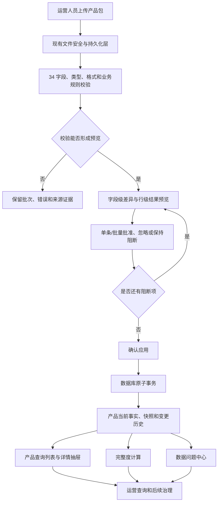
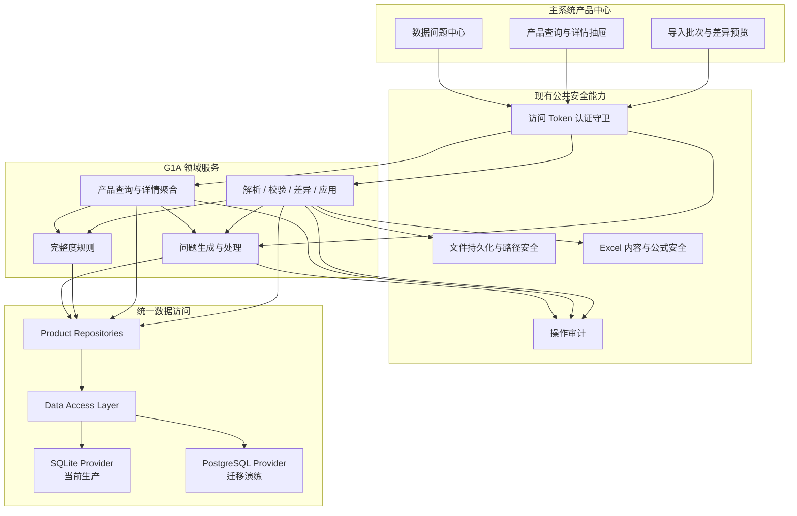
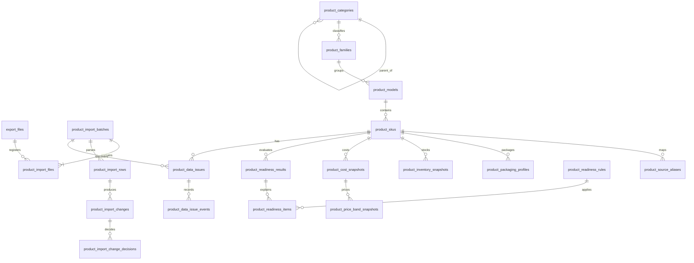
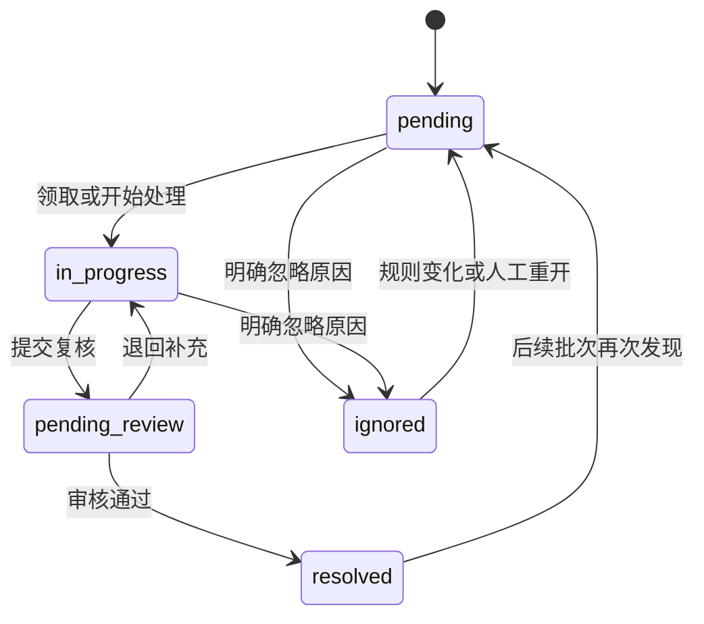
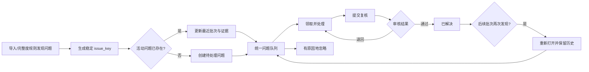
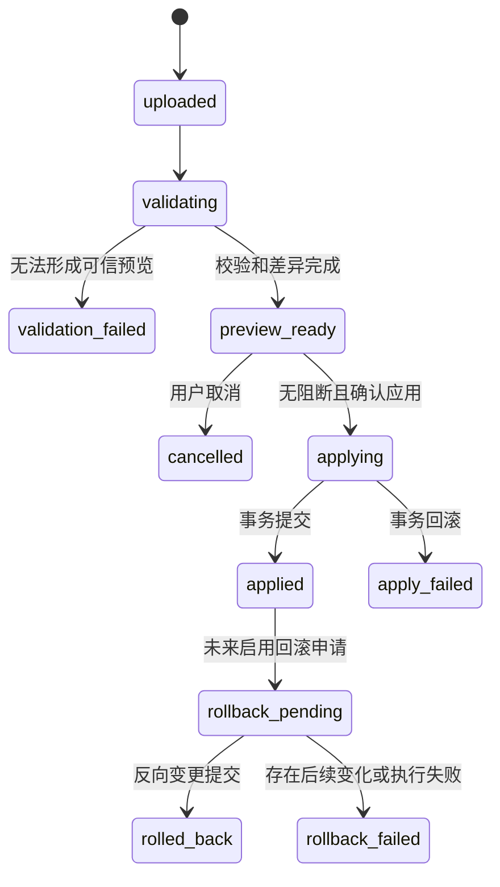
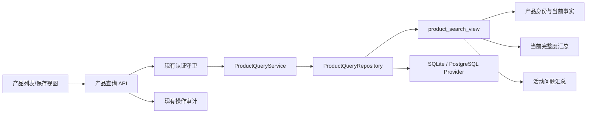

# Commerce Ops 产品查询与数据治理中心 G1A 实施计划

日期：2026-07-20

状态：DESIGN COMPLETE / NOT IMPLEMENTED

前置基线：G0 产品包设计、F0-F5 PostgreSQL 迁移准备、现有安全与文件治理能力
生产数据库边界：SQLite 仍是唯一生产数据库；PostgreSQL 只用于 Provider 兼容和迁移演练，未经单独批准不得切换

## 0. 决策摘要

G1A 不把产品包做成“上传 Excel 后直接覆盖 products 表”的工具，而是建设一条可审计、可预览、可确认、可追溯的数据治理流水线：

```text
产品包文件
→ 安全校验与文件登记
→ 34 字段解析和质量校验
→ 新增/更新/无变化/冲突/异常预览
→ 人工逐条或批量决策
→ 原子应用到产品事实层
→ 产品查询与详情
→ 完整度和数据问题
→ 导入、变更与处理历史
```

本设计冻结以下原则：

1. SKU 是当前来源行的主要唯一匹配依据，数据库内部关系使用 UUID。
2. 中台事实只由确认后的产品包批次或未来中台同步更新，前端没有直接编辑入口。
3. 导入预览不会直接改当前产品事实；正式应用要么全部成功，要么全部回滚。
4. 产品包没有的图片、AI 内容、平台属性和刊登结果保持“未接入/未评估”，不能伪造为 0、失败或处理中。
5. G1A 复用现有认证守卫、文件持久化、路径安全、Excel 安全、审计和软删除，不创建平行实现。
6. 新的数据访问从第一天遵循 Repository → Data Access → Provider 合同，并纳入 SQLite/PostgreSQL 双 Provider 测试；本阶段不切换生产 Provider。
7. 首期使用数据库索引、普通 SQL 视图和服务端分页，不引入 Redis、MinIO、Elasticsearch 或新的任务基础设施。
8. 当前访问 Token 只能证明“持有密钥”，不能证明自然人身份。导入人和负责人首期保存为明确标注的操作员标签，不能伪造用户外键。

## 1. 产品目标

### 1.1 用户目标

运营人员应当能够回答：

- 这份产品包是否符合固定格式，哪些行不能使用？
- 和系统当前产品相比，新增、变化、冲突和异常分别是什么？
- 哪些变化可以安全应用，哪些需要业务确认？
- 某个 SKU、主 SKU、款号或款名当前是什么状态，来源于哪次导入？
- 产品资料缺什么，为什么不完整，下一步应该处理什么？
- 某个异常由谁处理、处理到哪一步、依据是什么？
- 一次导入应用了什么，能否追溯或设计性回滚？

### 1.2 业务成功标准

- 当前 34 字段、262 行样本可安全导入、重复上传幂等。
- 16 条缺少主 SKU、占位款号、重复关系、汇率方向和包装异常能被解释性识别。
- 任何中台事实变化在应用前都有字段级旧值、新值、来源行和决策记录。
- 查询列表只展示真实存在的数据；未知状态明确可见。
- 产品问题可以进入统一队列并保留处理事件。
- 原有竞品、广告、马帮和定时任务功能不受影响。

### 1.3 产品定位

参考产品查询中台的优秀部分包括：高密度服务端列表、详情抽屉、批次导入摘要、状态标签和快速筛选。G1A 不照搬其平面大表、同名产品推断、直接编辑来源字段或额外基础设施，而是在现有 Commerce Ops 安全与数据迁移框架内实现治理闭环。

## 2. 非目标范围

G1A 不包含：

- 图片、视频、说明书上传与素材画廊；这些属于 G1B。
- AI 卖点、FAQ、结构化属性提取和内容审核；这些属于 G1B。
- 平台刊登模板、平台属性映射、批量刊登和平台回读。
- 客服、退款差评、活动报名、联盟、达人和视频生产。
- 中台实时爬取或 API 同步；G1A 只建立可复用 Source Adapter 合同。
- 产品包来源事实的直接人工改写。
- 正式 PostgreSQL 迁移、Provider 切换或生产 SQLite 删除。
- 新用户、角色、组织或多租户系统。
- Redis、MinIO、Elasticsearch、Kafka 或独立分布式队列。
- 首期实际执行批次回滚；只完成可回滚的数据证据、预检规则和接口契约设计。

## 3. 用户操作闭环

### 3.1 主闭环



### 3.2 日常操作顺序

1. 在“产品中心 → 导入批次”上传 Excel，填写来源周期与操作员标签。
2. 系统先完成文件签名、MIME、ZIP 结构、宏/外链、行列数和 34 表头检查。
3. 后台解析生成行级结果和字段级变化；页面显示批次摘要。
4. 运营按新增、更新、冲突、异常筛选，查看旧值、新值、来源行和建议。
5. 对可应用变化逐条或批量批准；冲突和异常默认阻断。
6. 应用前系统再次检查批次版本、目标记录版本和并发锁。
7. 应用成功后刷新产品查询视图、完整度结果和问题队列。
8. 运营在列表检索产品，在抽屉查看来源、缺失、异常和最近变化。
9. 问题中心负责分派、处理、复核、解决或忽略，不直接篡改中台事实。

### 3.3 G1A 模块架构



## 4. 页面与信息架构

### 4.1 产品中心入口

主系统增加一个“产品中心”入口，内部使用三个工作视图：

```text
产品查询 | 导入批次 | 数据问题
```

保存视图放在产品查询工具栏内，不额外制造一个空页面。布局延续当前内部工具的高密度风格：克制配色、紧凑控件、服务端表格和右侧详情抽屉，不使用营销式卡片墙。

### 4.2 产品包导入页

导入采用四步工作流：

1. 上传与来源信息。
2. 校验结果。
3. 差异预览与决策。
4. 应用结果。

页面必须显示：来源文件名、SHA-256 摘要、周期、上传时间、操作员标签、34 字段指纹、总行数、新增、更新、无变化、冲突、异常、当前状态和错误摘要。

差异表首期列：

| 列 | 说明 |
|---|---|
| SKU | 来源主要匹配键 |
| 字段名称 | 使用稳定字段代码并显示中文名 |
| 原值 | 当前正式值；无值时显示“暂无” |
| 新值 | 本批次标准化值，同时可查看来源原文 |
| 变化类型 | 新增、更新、无变化、冲突、异常 |
| 来源行号 | Excel 原始行号 |
| 是否允许应用 | 规则计算结果，不是前端猜测 |
| 冲突原因 | 稳定错误码和可读说明 |
| 系统建议 | 建议确认、忽略、纠错或补资料 |
| 决策 | 待确认、批准、忽略、阻断 |

支持变化类型、异常类型、严重程度、SKU 和决策状态筛选；支持单条决策、基于当前筛选结果的批量决策、忽略、取消批次。批量操作必须先显示影响数量和不可应用数量。

### 4.3 产品查询列表

查询、筛选、排序和分页全部在服务端完成。首期搜索：SKU、主 SKU、款号、款名。首期筛选：一级类目、二级类目、来源产品状态、仓库、国家、资料完整度、图片状态、数据异常状态、最近导入批次、更新时间。

默认稳定排序：`updated_at DESC, sku_id ASC`。首期页大小为 20、50、100，最大 100。前期采用参数化 `LIMIT/OFFSET`，当真实数据超过约 10 万 SKU 或深翻页出现性能证据后，再引入游标分页；不提前引入搜索引擎。

### 4.4 列表数据真实性矩阵

| 首屏字段 | G1A 数据状态 | 展示规则 |
|---|---|---|
| 商品缩略图 | 无真实数据 | 显示统一中性占位图和“未接入素材”，不显示破图 |
| SKU | 真实 | 来自中台产品包 |
| 主 SKU | 真实但可缺失 | 缺失显示“缺少主 SKU”并关联问题 |
| 款号 | 真实但可能为占位值 | 原值照常展示，异常标识独立显示 |
| 款名 | 真实 | 来自中台产品包 |
| 一级/二级类目 | 真实 | 来自中台产品包 |
| 规格 | 真实原文 | 不在 G1A 伪造结构化属性 |
| 仓库 | 真实快照 | 展示来源口径和快照时间 |
| 库存 | 真实快照 | 是中台仓存，不冒充马帮实时可售库存 |
| 来源成本 | 真实快照 | 展示币种、口径和快照时间 |
| 产品状态 | 真实来源状态 | 与 Commerce Ops 内部治理状态分开 |
| 资料完整度 | 部分真实 | 仅基础、包装、成本三个启用维度 |
| 图片数量 | 无真实数据 | 显示“未接入”，不能显示 0 张 |
| AI 内容状态 | 无真实数据 | 显示“未启用”，不能显示“待生成” |
| 可刊登状态 | 尚未评估 | 显示“未评估”，不能显示可刊登/不可刊登 |
| 数据更新时间 | 真实 | 显示最近应用批次时间和来源周期 |

列配置保存在保存视图中；系统必需列 SKU、款名和问题状态不可全部隐藏。用户选择的列只影响展示，不改变接口字段权限。

### 4.5 产品详情抽屉

抽屉用于快速查看，不承担全量复杂编辑。内容分为：

- 基础资料：SKU、主 SKU、款号、款名、类目、状态和字段来源。
- 规格和包装：销售规格原文、单品尺寸、净/毛重、箱规、装箱数。
- 成本价格摘要：人民币成本、国家币成本、汇率方向、四档价和异常。
- 素材摘要：G1A 显示“素材中心未启用”，不制造数量。
- 资料缺失项：按完整度维度列出缺失、阻塞和建议动作。
- 数据异常：当前未解决问题及严重程度。
- 最近变更：最近批次、字段、旧值、新值和应用时间。
- 数据来源：来源系统、来源周期、文件、行号、批次和更新时间。
- 导入批次记录：最近相关批次与行级结果。

中台事实字段全部只读。抽屉预留“进入完整详情页”入口，但 G1A 不实现完整详情页，也不提供来源字段编辑表单。

### 4.6 数据问题中心

问题列表支持类型、严重程度、状态、负责人标签、类目、批次、更新时间和关联 SKU 筛选。详情侧栏显示证据、建议、来源批次和完整事件时间线。

允许动作：领取/分派标签、开始处理、提交审核、解决、忽略、重新打开。所有动作必须填写或生成原因，并进入问题事件与统一操作审计。

## 5. 字段权限边界

### 5.1 六类字段

| 字段类别 | 权威来源 | G1A 写入者 | 前端权限 | 变更要求 |
|---|---|---|---|---|
| 中台事实字段 | 产品包/未来中台同步 | 导入应用服务 | 只读 | 批次、来源行、旧新值、审计 |
| 运营扩展字段 | 运营人员 | 未来运营编辑服务 | 可编辑，G1A 只预留 | 版本、原因、操作员标签、审计 |
| AI 候选字段 | AI 服务 | G1B AI 服务 | 未审核只读 | 人工审核后才能采纳 |
| 平台回读字段 | 平台同步 | 平台适配器 | 只读 | 平台、店铺、同步批次和时间 |
| 计算字段 | 规则引擎 | 规则服务 | 只读 | 规则版本、输入证据、计算时间 |
| 纠错字段 | 问题处理流程 | 纠错服务 | 流程操作 | 不覆盖中台原值；保留建议和处理结果 |

### 5.2 后端强制规则

- Repository 的来源事实更新方法仅供导入应用服务调用，不暴露通用 PATCH。
- 每个写入命令包含允许字段集合；未知字段和越权字段返回 400/403。
- AI、平台、运营扩展和来源字段存储在不同逻辑实体中，避免一次对象更新覆盖多个所有权区域。
- 前端来源徽标只是解释层，真正权限由服务端命令和 Repository 边界执行。

### 5.3 操作员身份限制

现有系统是单 Token 认证，没有用户表或角色。G1A 首期：

- 服务端审计身份固定为 `access_token_operator`。
- 导入表单可要求填写 1-64 字符的 `operator_label`，仅作为未验证的业务标签。
- 标签经过字符、长度和日志脱敏校验，不作为权限依据。
- 保存视图为工作区级，不宣称是某个用户的私有视图。
- 将来建立用户体系时增加 `actor_id/owner_id`，不回填伪造身份。

## 6. 数据模型总览

### 6.1 建模原则

- 不建立巨型 `products` 表承载 34 个来源字段、图片、AI、平台、库存和成本。
- 身份、包装、库存、成本、建议价、导入治理、完整度和问题分别建模。
- 当前事实与历史快照分离；来源批次和变化记录不可丢失。
- SQLite 使用现有迁移机制，PostgreSQL 通过既有转换/演练路线验证，不另开手工 Schema。
- JSON 在 Repository 层使用规范化对象；SQLite 保存规范 JSON 文本，PostgreSQL 使用 `jsonb`，Provider 返回值统一。
- 时间统一保存 UTC ISO 时间，页面按本地时区展示。
- UUID 为内部主键；来源 SKU、文件哈希和稳定指纹承担业务幂等约束。

### 6.2 ER 关系图



## 7. 逻辑表与查询视图

下表描述 G1A 目标逻辑模型。具体 SQL 类型在 G1A-0 冻结，在 G1A-1 才生成迁移。

### 7.1 导入治理表

| 表 | 用途 | 主键、外键与唯一约束 | 索引 | 状态、审计与软删除 |
|---|---|---|---|---|
| `product_import_batches` | 一次产品包导入的状态、统计、版本和错误摘要 | UUID `id`；`source_file_hash + header_fingerprint + source_period + source_system` 唯一；可关联上一个批次 | `status`、`created_at`、`source_period`、`file_hash` | 状态机字段、`revision`、创建/更新/应用/取消时间、操作员标签；不硬删除，取消保留 |
| `product_import_files` | 批次与现有正式文件记录的关系 | UUID `id`；FK `batch_id`、`export_file_id`；同批次同角色唯一 | `batch_id`、`export_file_id` | 文件角色、创建时间；不软删，随批次保留证据 |
| `product_import_rows` | 来源行原文、标准值、行哈希和行级结果 | UUID `id`；FK `batch_id`；`batch_id + source_row_number` 唯一；`batch_id + source_sku` 非唯一用于发现重复 | SKU、行结果、错误码、行号 | `new/updated/unchanged/conflict/exception`、解析版本、创建时间；不删除 |
| `product_import_changes` | 字段级差异、冲突和应用证据，即所要求的 `product_import_change` | UUID `id`；FK `batch_id`、`row_id`、可空目标实体 ID；`row_id + field_code` 唯一 | `batch_id + change_type`、SKU、字段、是否可应用、决策状态 | 旧/新规范值、原始值、目标修订号、原因码、系统建议、应用时间；不删除 |
| `product_import_change_decisions` | 单条/批量批准、忽略和阻断的不可变决策历史 | UUID `id`；FK `change_id`；批量动作含 `decision_group_id` | `change_id + created_at`、批量组 | 决策、原因、操作员标签、预期 change revision、时间；追加式，不软删 |
| `product_import_locks` | 跨 SQLite/PostgreSQL 兼容的来源范围租约，避免并发应用 | `lock_key` PK；FK 可空 `batch_id`；同来源范围唯一 | `expires_at` | 持有者随机 ID、过期时间、更新时间；过期可接管，不保存为业务历史 |

说明：

- 现有 `export_files` 是正式文件元数据入口。G1A-1 只扩展其 `source_type` 允许 `product_package_import`，并由 `product_import_files` 关联；不复制绝对路径、哈希、大小和 MIME 字段。
- `product_import_changes` 默认只持久化新增、更新、冲突和异常字段。无变化行由 `product_import_rows.outcome=unchanged` 记录；避免未来 20 万行文件产生 680 万条无价值字段记录。页面“无变化”页签展示行级摘要。
- 取消批次不会删除原始文件、行、变化或决策。文件后续遵循统一保留策略。

### 7.2 商品事实与快照表

| 表 | 用途 | 主键、外键与唯一约束 | 索引 | 状态、审计与软删除 |
|---|---|---|---|---|
| `product_categories` | 一级/二级类目树 | UUID `id`；自 FK `parent_id`；`source_system + source_code/normalized_name + parent_id` 唯一 | parent、level、name | 来源批次、创建/更新；停用 `inactive_at`，不硬删 |
| `product_families` | 款号与款名层，允许占位和待确认 | UUID `id`；FK `category_id`；来源款号不是全局唯一 | 款号、款名、类目、identity_status | `confirmed/placeholder/review_required/inactive`；来源批次、创建/更新；软停用 |
| `product_models` | 主 SKU/SPU 层 | UUID `id`；FK `family_id`；`source_system + main_sku` 在非空时唯一 | main_sku、family、identity_status | 缺失主 SKU 不创建伪造 model；历史关系通过别名/变更保留；软停用 |
| `product_skus` | 可销售 SKU 身份与高频当前来源字段 | UUID `id`；FK 可空 `model_id`、FK `category_id`；`source_system + source_sku` 唯一 | SKU、主 SKU 映射、款名、来源状态、更新时间 | 来源商品名、销售规格原文、生命周期状态、current revision、首末批次；`not_seen/inactive_at`，不硬删 |
| `product_source_aliases` | 款号、主 SKU、历史 SKU 和来源 ID 的可追溯别名 | UUID `id`；FK 目标实体；`source_system + alias_type + alias_value + effective_from` 唯一 | alias lookup、target | 有效期、来源批次、创建时间；用 `effective_to` 结束，不删除 |
| `product_packaging_profiles` | 尺寸、净/毛重、箱规和装箱数的版本化事实 | UUID `id`；FK `sku_id`、`source_batch_id`；`sku_id + effective_from` 唯一 | sku、current、batch | 原文与规范值、单位、有效期、创建时间；用有效期关闭版本 |
| `product_warehouses` | 产品包仓库/规划仓的来源维度 | UUID `id`；`source_system + source_warehouse_code/name` 唯一 | name、active | 来源批次、创建/更新、`inactive_at` |
| `product_inventory_snapshots` | 产品包中的中台仓存快照 | UUID `id`；FK `sku_id`、`warehouse_id`、`source_batch_id`；`sku + warehouse + observed_at + source` 唯一 | sku/date、warehouse/date、batch | 数量、口径、原文、快照时间；不可修改和删除 |
| `product_cost_snapshots` | 人民币/当地币成本与汇率口径快照 | UUID `id`；FK `sku_id`、`source_batch_id`；`sku + country + source_period + source` 唯一 | sku/period、country/period、异常状态 | 金额、币种、汇率、方向、来源结果、有效期；不可覆盖历史 |
| `product_price_band_snapshots` | 20/25/35/45 四档来源建议价 | UUID `id`；FK `cost_snapshot_id`；`cost_snapshot_id + margin_band` 唯一 | cost、band | 来源价、规则复核结果、偏差；不可删除 |

`product_skus` 只保存身份和高频当前来源字段，不承载库存历史、成本历史、素材、AI、平台或问题详情。详情通过 Repository 聚合，避免大宽表成为新的单点混乱。

### 7.3 完整度、问题和视图表

| 表/视图 | 用途 | 主键、外键与唯一约束 | 索引 | 状态、审计与软删除 |
|---|---|---|---|---|
| `product_readiness_rules` | 版本化完整度规则配置 | UUID `id`；`rule_code + version` 唯一；可关联类目 | dimension、enabled、effective dates | 维度、权重、阻断级别、条件配置、建议模板、规则版本；停用不删除 |
| `product_readiness_results` | 某 SKU 某维度的当前/历史汇总，即 `product_readiness` | UUID `id`；FK `sku_id`；`sku + dimension + ruleset_version + evaluated_at` 唯一 | sku/current、dimension/score、status | `complete/incomplete/blocked/not_evaluated`、分数、完成/缺失/阻断数量、评估批次和时间；历史保留 |
| `product_readiness_items` | 完整度每条规则的解释证据 | UUID `id`；FK result、rule；同结果同规则唯一 | result、outcome、field | `passed/missing/blocked/not_applicable`、证据值、建议动作；不可删除 |
| `product_data_issues` | 统一数据问题队列，即 `product_data_issue` | UUID `id`；FK 可空 SKU/model/family/batch；活动问题 `issue_key` 唯一 | 状态、严重度、类型、负责人、实体、最近批次、更新时间 | `pending/in_progress/pending_review/resolved/ignored`、首次/最近批次、当前/建议值、revision；不硬删 |
| `product_data_issue_events` | 问题分派、处理、审核、解决、忽略和重开的时间线 | UUID `id`；FK `issue_id` | issue/time、action | 追加式动作、前后状态、原因、操作员标签、审计关联 ID；不删除 |
| `product_saved_views` | 工作区级筛选、排序和列配置 | UUID `id`；活动记录 `scope + normalized_name` 唯一 | scope、is_default、updated_at | filters/sort/columns JSON、version、创建/更新、`deleted_at` 软删除 |
| `product_search_view` | 产品列表只读聚合视图 | 逻辑键 `sku_id`；不单独生成业务主键 | 依赖底表 SKU、主 SKU、款号、款名、类目、状态、批次和更新时间索引 | 普通 SQL VIEW；不接受写入、不软删、不把未接入数据补为假值 |

### 7.4 四个重点逻辑模型结论

#### `product_search_view`

- 类型：普通 SQL 只读视图，不是物化视图。
- 组成：SKU 当前身份、类目/款系/主 SKU、最新包装摘要、最新成本/库存摘要、三个 G1A 完整度维度汇总、活动问题数量、最近批次。
- 图片、AI 和刊登状态返回 `NULL` 加能力状态枚举，不在 SQL 中补 0。
- 查询只接受服务端允许列表中的字段、排序和筛选；所有值参数化。
- 如后续实测视图变慢，先增加底表索引和预聚合当前结果表；有数据证据后再考虑物化视图。

#### `product_readiness`

- 类型：`product_readiness_results + product_readiness_items`，不是单一百分比列。
- G1A 启用基础资料、规格包装、成本价格；素材内容、刊登合规为 `not_evaluated`。
- 每个维度独立计分；阻断项可使维度状态为 blocked，但不抹掉已完成项。
- 规则配置以版本化规则清单为源，G1A 首期不做在线规则编辑页面。

#### `product_data_issue`

- 类型：当前问题表 + 追加式事件表。
- `issue_key` 由规则、实体、字段生成稳定指纹。同一问题再次发现只更新最近批次；已解决问题复发则重新打开并产生事件。
- 导入行尚未应用时可以创建批次/行级问题；批次取消后问题标记为 ignored，原因是 batch_cancelled，证据仍保留。

#### `product_import_change`

- 类型：字段级不可变差异证据 + 独立决策历史。
- 保存规范旧值、新值、来源原文、目标修订号、来源行、类型、可应用性、原因和建议。
- 应用时使用预期目标修订号做乐观并发校验；预览过期则回到冲突，不静默覆盖。

## 8. 完整度规则设计

### 8.1 规则配置结构

每条规则至少包含：

- `rule_code`、版本、维度、适用类目/国家范围。
- 检查字段、值类型、判断条件和 `not_applicable` 条件。
- 权重、严重程度、是否阻断。
- 缺失说明、建议动作模板和证据脱敏策略。
- 启用状态、生效时间和替代版本。

首期规则通过经过代码审查的版本化清单和迁移种子建立，避免运营随手改规则造成结果不可复现。未来再增加规则管理页面。

### 8.2 G1A 启用规则

基础资料：

- SKU 非空且来源内唯一。
- 主 SKU 存在；缺失不阻断产品事实入库，但阻断后续批量刊登。
- 款号存在且不属于已确认占位集合。
- 款名、一级类目、二级类目和来源状态存在。

规格包装：

- 销售规格原文存在。
- 单品尺寸可解析或至少有有效原文。
- 净重、毛重和箱规为正数。
- 毛重不小于净重。
- 装箱数为正整数。

成本价格：

- 人民币成本和国家币成本为正数。
- 币种和汇率方向明确。
- 四档价均存在且大于 0。
- 四档价与已确认公式在允许容差内；口径未确认时只告警，不重算覆盖。

### 8.3 延后规则

- G1B：主图、详情图、视频、说明书、卖点、FAQ、内容语言和人工审核。
- G2/G3：国家禁限售、平台类目、必填属性、利润、库存门槛、标题和详情合规。
- 未启用规则不参与得分，不产生“缺失”问题，只显示能力尚未接入。

## 9. 数据问题模型与状态机

### 9.1 问题类型

| 组 | 首期问题 |
|---|---|
| 身份 | 缺少主 SKU、缺少款号、重复 SKU、款号关联冲突、占位款号 |
| 成本 | 成本非正数、四档价偏差、汇率方向未知、币种缺失 |
| 包装 | 尺寸缺失/非正、净重缺失、毛重小于净重、箱规异常 |
| 完整度 | 基础资料缺失、规格包装缺失、成本价格缺失 |
| 后续占位 | 图片缺失、平台属性缺失；在对应能力启用前不自动生成 |
| 导入 | 表头错误、类型错误、重复行、目标版本冲突、决策阻断 |

严重程度：`info`、`warning`、`error`、`blocker`。严重程度与是否允许应用分开；例如缺少主 SKU 可以允许来源事实入库，但阻断刊登。

### 9.2 状态机



### 9.3 处理规则

- 解决问题必须记录处理结论和证据；只改变状态不能改中台原值。
- 身份纠错可以建立来源别名或确认关系，但必须保留原始款号/主 SKU。
- 忽略必须选择原因并可设置到期时间；新批次继续发现时仍更新最近证据。
- 每次状态变化同时写入 `product_data_issue_events` 和现有操作审计。

### 9.4 数据问题处理流程



## 10. 导入技术设计

### 10.1 导入状态机



### 10.2 文件安全与持久化

上传链路必须复用：

1. 现有认证守卫。
2. 独立临时目录和安全路径解析。
3. XLSX 扩展名、MIME、ZIP 文件签名和实际内容校验。
4. 宏、外部链接、压缩炸弹、文件大小、工作表、行数和列数限制。
5. SHA-256 计算、原子移动和正式文件元数据。
6. 失败临时文件清理与现有文件生命周期扫描。

源文件作为审计证据保留，取消批次不删除。数据库只保存正式文件 ID 和相对路径，不接受绝对路径。

### 10.3 Excel 解析

当前项目已有 Python 运行配置和 `openpyxl`。G1A 使用专用只读解析 Worker：

- Node 负责文件安全、批次、数据库、事务、审计和错误边界。
- Python 使用 `openpyxl` 的只读模式解析，不连接数据库，不写正式文件。
- Worker 通过有界 JSON Lines 每 500 行回传，Node 使用背压分块写入暂存表，避免整本文件驻留内存。
- 读取公式单元格时不执行公式；同时保留公式存在标识和缓存值状态。来源公式或外链触发既有 Excel 安全策略。
- 任何未来导出的差异表继续调用现有 Excel 单元格安全策略，转义以 `= + - @` 开头的用户可控文本。

当前真实文件只有 262 行，但实现不能依赖该规模。首期文件上限沿用现有策略，性能验收以真实样本、1 万行和 5 万行合成数据分级执行。

### 10.4 校验层级

1. 文件级：格式、MIME、签名、大小、宏/外链和哈希。
2. Schema 级：工作表、严格 34 表头、顺序、重复列和表头指纹。
3. 行级：SKU、必填、类型、日期、金额、数值、枚举和长度。
4. 关系级：重复 SKU、主 SKU 缺失、款号占位、同款号多主 SKU 和关系修订。
5. 业务级：汇率方向、成本、四档价、尺寸、重量、箱规和状态。
6. 目标级：与当前正式记录比较、目标 revision 和字段所有权。

### 10.5 幂等机制

- 文件幂等键：`source_system + file_sha256 + header_fingerprint + source_period`。
- 行幂等键：`batch_id + source_row_number`，并保存规范行哈希。
- 业务匹配键：`source_system + normalized_sku`。
- 应用命令携带 `batch_revision + decision_set_hash`。
- 重复上传返回已有批次，不重新写行和变化。
- 重复应用已应用批次返回当前结果，不重复写快照。

### 10.6 并发与恢复

- 验证可以并行，但同一来源系统/周期只有一个批次可以进入 applying。
- `product_import_locks` 使用带过期时间的租约和比较更新，兼容 SQLite/PostgreSQL。
- 应用前比较每条变化保存的目标 revision；过期预览转为冲突并要求重新验证。
- Worker 每批写入后记录检查点。服务重启后可以从最后完整检查点继续 validating；不重用半行结果。
- applying 依赖数据库事务。进程崩溃由数据库回滚，启动恢复程序把无活动事务的 applying 批次标记为 apply_failed 或重新核验。

### 10.7 事务边界

- 文件登记：独立短事务。
- 行解析暂存：每 500 行一个事务，可恢复。
- 差异生成：按批次分块，但只有完成后才能切换为 preview_ready。
- 人工决策：每次命令一个短事务，使用 revision 防止覆盖他人决策。
- 正式应用：当前规模使用一个原子事务，写身份、快照、变化应用标记、完整度失效标记、问题和批次状态。
- 若未来超过 5 万行导致事务超时，采用“写新版本 + 最后切换当前指针”的影子版本方案；不能退化为可见的部分应用。

### 10.8 回滚能力设计

G1A 保存足够证据，但首期不开放执行按钮。未来回滚预检：

1. 读取已应用变化的旧值、新值和目标 revision。
2. 检查同一字段是否被后续批次、平台或人工流程修改。
3. 有后续变化则阻断自动回滚并生成影响清单。
4. 无冲突时在新事务中写反向版本，不删除原批次。
5. 生成 rollback batch、审计事件和重新计算任务。

## 11. 搜索与查询技术设计

### 11.1 查询数据流



### 11.2 搜索规则

- SKU、主 SKU、款号：去首尾空格、统一大小写后支持精确和前缀搜索。
- 款名：转义 `%`、`_` 和转义符后做受控包含搜索。
- 不做拼音、同义词、模糊纠错或全文搜索。
- 查询字段、筛选字段、排序字段使用服务端允许列表映射到真实 SQL 列；客户端不能提交 SQL 片段。
- 所有值使用 Provider 参数化查询。

### 11.3 索引计划

至少评估：

- `product_skus(source_system, source_sku)` 唯一。
- 规范 SKU、主 SKU、款号、款名的查询索引。
- 类目、来源状态、更新时间、最近批次。
- 库存/成本的 `sku_id + observed_at/effective_from`。
- 活动问题的 `entity_id + status + severity`。
- 当前完整度的 `sku_id + dimension + evaluated_at`。
- 导入批次状态、文件哈希和创建时间。

索引必须由真实查询计划验证，不给所有列盲目建索引。G1A-10 保存 SQLite `EXPLAIN QUERY PLAN` 与 PostgreSQL `EXPLAIN` 证据。

## 12. 后端 API 设计

所有 `/api/product-center/*` 接口默认受现有 Bearer Token 守卫保护。健康检查不增加产品数据。响应错误不得包含服务器绝对路径、SQL、来源整行或敏感环境变量。

### 12.1 导入批次

```text
POST   /api/product-center/imports
GET    /api/product-center/imports
GET    /api/product-center/imports/:batchId
GET    /api/product-center/imports/:batchId/rows
GET    /api/product-center/imports/:batchId/changes
PATCH  /api/product-center/imports/:batchId/changes/:changeId/decision
POST   /api/product-center/imports/:batchId/decisions/bulk
POST   /api/product-center/imports/:batchId/apply
POST   /api/product-center/imports/:batchId/cancel
GET    /api/product-center/imports/:batchId/rollback-preview
```

`rollback-preview` 首期只返回是否具备设计性回滚条件；执行回滚接口不启用。

### 12.2 产品查询

```text
GET /api/product-center/products
GET /api/product-center/products/:skuId
GET /api/product-center/products/:skuId/changes
GET /api/product-center/products/:skuId/imports
GET /api/product-center/products/:skuId/readiness
GET /api/product-center/products/:skuId/issues
```

列表请求示例：

```text
?q=ABC
&searchFields=sku,main_sku,style_code,style_name
&categoryL1=...
&status=...
&issueStatus=open
&sort=updated_at:desc
&page=1
&pageSize=50
```

服务端忽略未知展示列但拒绝未知过滤和排序字段。响应包含 `capabilities`，明确图片、AI、平台刊登是否启用。

### 12.3 完整度和问题

```text
POST /api/product-center/readiness/recalculate

GET  /api/product-center/issues
GET  /api/product-center/issues/:issueId
POST /api/product-center/issues/:issueId/assign
POST /api/product-center/issues/:issueId/start
POST /api/product-center/issues/:issueId/submit-review
POST /api/product-center/issues/:issueId/resolve
POST /api/product-center/issues/:issueId/ignore
POST /api/product-center/issues/:issueId/reopen
```

完整度重算首期只允许对指定批次或 SKU 集合执行，限制数量并记录审计，不提供任意全库高频重算接口。

### 12.4 保存视图

```text
GET    /api/product-center/saved-views
POST   /api/product-center/saved-views
PUT    /api/product-center/saved-views/:viewId
DELETE /api/product-center/saved-views/:viewId
```

过滤、排序和列 JSON 必须按同一 API 允许列表校验。删除为软删除。

## 13. 前端模块划分

当前前端仍是原生 HTML/CSS/JavaScript。G1A 应模块化增加，不把全部逻辑继续堆进 `public/app.js`：

```text
public/
  product-center-page.mjs
  product-center-api.mjs
  product-center-state.mjs
  product-center-table.mjs
  product-center-import.mjs
  product-center-drawer.mjs
  product-center-issues.mjs
  product-center.css
```

现有 `public/app.js` 只负责入口、导航和统一认证 fetch 的接入。所有 API 请求继续走现有认证封装；401 触发主系统锁定，不在产品模块保存 Token。

主要组件：

- 产品中心导航和能力状态。
- 搜索/筛选工具栏、保存视图菜单、列配置菜单。
- 服务端产品表格和分页。
- 产品详情抽屉。
- 导入上传、批次摘要、差异表和批量决策确认框。
- 完整度维度列表和解释项。
- 数据问题列表、详情与事件时间线。
- 加载、空、错误、服务恢复和未接入状态。

## 14. 服务端模块划分

避免把新路由直接堆进 `server.mjs`：

```text
lib/product-center/
  api.mjs
  product-package-schema.mjs
  product-package-worker-runner.mjs
  import-validator.mjs
  import-diff-service.mjs
  import-apply-service.mjs
  product-query-service.mjs
  product-detail-service.mjs
  readiness-service.mjs
  issue-service.mjs
  saved-view-service.mjs

lib/data/repositories/
  product-import-repository.mjs
  product-catalog-repository.mjs
  product-query-repository.mjs
  product-readiness-repository.mjs
  product-issue-repository.mjs
  product-saved-view-repository.mjs

scripts/
  product_package_worker.py
```

`server.mjs` 只完成模块注册和依赖注入。Repository 只能依赖 Data Access/Provider，不直接导入 `better-sqlite3` 或 `pg`。

## 15. 现有基础能力接入

### 15.1 认证

- 所有读写产品数据接口受现有认证守卫保护。
- 不新增 URL Token、Cookie、localStorage 或模块私有认证。
- 局域网/云端仍由 `APP_HOST` 和 `APP_ACCESS_TOKEN` 规则控制。

### 15.2 审计

在现有固定审计描述符中增加：

- `product.import.upload/validate/decision/apply/cancel/rollback_preview`
- `product.query.list/detail`
- `product.issue.assign/start/submit/resolve/ignore/reopen`
- `product.saved_view.create/update/delete`

审计只记录批次 ID、问题 ID、SKU ID、结果、数量、耗时和脱敏错误摘要，不记录完整产品行、文件路径、访问 Token 或整份差异。

### 15.3 文件和路径

- 复用正式文件 ID 下载，不接受路径参数。
- 产品包文件保存相对路径，由路径边界校验解析。
- 取消和失败批次不直接删除文件；统一生命周期处理。
- G1A 不使用 `managed_files` 冒充产品包文件，也不另造路径表。

### 15.4 Excel 安全

- 上传前执行现有 XLSX 内容与结构安全检查。
- 解析器不执行公式或外链。
- 未来差异导出、错误样本导出和 CSV 输出复用现有公式注入转义工具。
- 测试覆盖 `= + - @`、控制字符、宏、外链、伪 MIME 和损坏 ZIP。

### 15.5 软删除

- 产品、类目、款系和主 SKU 使用停用/有效期，不因一个批次缺失而删除。
- 批次、来源行、变化、决策、快照、问题事件不可删除。
- 保存视图使用 `deleted_at`。
- 问题使用状态结束，不硬删除。

### 15.6 PostgreSQL 迁移路线

- G1A-1 先按当前生产方式增加 SQLite 迁移。
- 同时扩展 F3 Schema 转换和 migration_test 演练，使新表、索引、外键和视图可进入 PostgreSQL `app` Schema。
- G1A Repository 纳入 F4 双 Provider 兼容测试。
- `DATABASE_PROVIDER=sqlite` 保持不变；G1A 不操作 PostgreSQL 正式库 `commerce_ops`。

## 16. 性能与容量设计

### 16.1 首期目标

- 当前 262 行真实样本：解析、预览和查询应在日常交互可感知范围内完成。
- 1 万 SKU：常用首屏查询本机 p95 目标小于 500 ms。
- 5 万 SKU：首屏列表目标小于 1 s；差异生成允许后台运行并显示进度。
- 单页最大 100 行；详情按需查询，不把全部历史塞进列表响应。

这些是验收目标，不是未经测量的保证。G1A-10 必须保存机器、数据量、查询和测量结果。

### 16.2 优化顺序

1. 参数化查询和正确索引。
2. 当前快照/完整度/问题汇总预计算，避免列表逐行查询。
3. 普通 SQL 视图和 Repository 投影，只返回当前页面字段。
4. 分块解析、背压和可恢复检查点。
5. 真实证据证明不足后再评估物化视图、缓存或全文检索。

## 17. 测试方案

### 17.1 单元测试

- 34 表头指纹、顺序、缺失、重复和新增字段。
- SKU 规范化、必填、类型、日期、金额、空值和单位。
- 主 SKU 缺失、占位款号、重复 SKU、款号多主 SKU。
- 汇率方向、四档价容差、尺寸和重量规则。
- 差异类型、允许应用、冲突原因和建议。
- 完整度五维度、未启用维度 NULL 语义和阻断项。
- 问题指纹、复发、状态转换和忽略原因。
- 保存视图过滤/排序/列允许列表。

### 17.2 Provider 与迁移测试

同一 Repository 合同在 SQLite 和 PostgreSQL migration_test 执行：

- 批次、行、变化和决策 CRUD。
- 产品身份、快照、查询视图和事务。
- JSON、布尔、NULL、UUID 和 UTC 时间一致性。
- 应用事务提交和回滚。
- 唯一约束、外键和软删除。
- PostgreSQL app Schema 权限边界。

### 17.3 集成测试

- 上传 → 文件安全 → 批次 → 解析 → 预览。
- 单条和批量决策 → 应用 → 查询 → 完整度 → 问题。
- 重复文件返回同一批次。
- 目标 revision 变化后拒绝过期预览。
- 应用中任一写入失败时整个事务回滚。
- 服务重启恢复 validating，已应用批次不重复应用。
- 取消批次保留文件和历史。

### 17.4 安全测试

- 未认证访问全部产品接口返回 401。
- 路径穿越、伪 XLSX、错误 MIME、损坏 ZIP、宏、外链和压缩炸弹拒绝。
- Excel 公式注入字符在导出中被安全转义。
- 搜索字段、排序字段和过滤值不能注入 SQL。
- 错误响应和日志不包含绝对路径、Token、整行产品数据或敏感配置。
- 审计元数据有大小限制和脱敏。

### 17.5 前端测试

- 产品入口、三个工作视图和原四个业务入口共存。
- 搜索、筛选、排序、分页、列配置和保存视图。
- 抽屉快速打开、异步详情、空值和未接入状态。
- 导入各状态、批量确认、取消和错误恢复。
- 401 返回主锁定页，不保存 Token。
- 广告 iframe、马帮页面和现有导航不受影响。

### 17.6 性能测试

- 262、1 万、5 万行解析和差异生成。
- 常用搜索组合和深分页查询计划。
- 100 条并发只读查询与单个导入验证任务共存。
- 应用事务锁持有时间、失败恢复和数据库文件增长。

## 18. 实施阶段

所有阶段默认通过 `PRODUCT_CENTER_ENABLED=false` 隐藏未完成入口；应用能力另用 `PRODUCT_IMPORT_APPLY_ENABLED=false` 控制。每个节点独立提交、验收后再继续。

### G1A-0：设计确认与数据库映射

- 开发内容：冻结 34 字段代码、表关系、身份规则、汇率口径、状态机、问题规则和真实/占位字段矩阵。
- 涉及文件：本实施计划、`docs/product-package-design.md`、字段字典和未来 ADR。
- 数据库变化：无。
- API/前端变化：无。
- 测试：现有全量测试、构建、数据库与原 Excel 哈希保护。
- 验收：12 个待确认业务问题有明确结论或被标为阻断规则；表/API/字段命名冻结。
- 风险：主 SKU、款号和汇率口径未确认导致错误身份或金额解释。
- 回滚：纯文档提交可独立 revert。

### G1A-1：数据库表和迁移

- 开发内容：建立导入、身份、快照、完整度、问题和保存视图表；创建 `product_search_view`；扩展正式文件来源类型；新增 Repository 骨架。
- 涉及文件：`migrations/007_product_center_g1a.sql`、`lib/data/repositories/product-*.mjs`、兼容 Data Access 注册、迁移和 Provider 测试。
- 数据库变化：只做加法迁移；SQLite 生产先备份；PostgreSQL 只在 migration_test 演练。
- API/前端变化：无公开功能，功能开关关闭。
- 测试：迁移幂等、表/索引/外键/视图、旧数据行数不变、双 Provider 合同。
- 验收：新表为空、旧表数据和文件哈希不变、SQLite 与 PostgreSQL 结构语义一致。
- 风险：SQLite CHECK 表重建扩展 `export_files.source_type` 时损坏旧记录。
- 回滚：功能开关保持关闭；有数据前可执行验证过的 down 脚本，有数据后只回滚代码并保留空/历史表，不强制 drop。

### G1A-2：产品包解析与校验

- 开发内容：只读 Python Worker、Node Runner、34 字段 Schema、分块解析、行规范化和质量规则。
- 涉及文件：`scripts/product_package_worker.py`、`lib/product-center/product-package-worker-runner.mjs`、`product-package-schema.mjs`、`import-validator.mjs`、测试 fixtures。
- 数据库变化：写导入批次和暂存行，不写正式产品事实。
- API 变化：内部解析命令；上传接口可先仅在测试开放。
- 前端变化：无或仅开发诊断页，不进入主导航。
- 测试：真实样本、损坏文件、边界值、1 万/5 万行、Worker 崩溃和超时。
- 验收：262 行和 34 字段准确解析，已知 16 条缺主 SKU/占位款号等问题被识别，原文件不改。
- 风险：Python/Node 数值、日期和空值语义不一致。
- 回滚：关闭上传路由并 revert Worker；暂存批次保留或软取消。

### G1A-3：导入批次和差异预览

- 开发内容：批次状态机、当前事实比较、字段级变化、冲突建议、单条/批量决策和预览 API。
- 涉及文件：`import-diff-service.mjs`、导入 Repository、`api.mjs`、导入前端模块和测试。
- 数据库变化：写 changes、decisions、issue preview；不应用正式事实。
- API 变化：导入列表/详情/行/变化/决策/取消。
- 前端变化：导入四步流程的前三步和差异表。
- 测试：五类结果、过滤、分页、revision 冲突、重复上传、取消保留证据。
- 验收：新增/更新/无变化/冲突/异常统计与明细一致；批量决策不越过阻断规则。
- 风险：差异数量大、预览过期、批量操作误选。
- 回滚：关闭预览入口；批次软取消，不删除文件和历史。

### G1A-4：确认应用与变更记录

- 开发内容：原子应用服务、租约、乐观并发、身份/快照写入、审计和回滚预检。
- 涉及文件：`import-apply-service.mjs`、相关 Repository、审计描述符、集成测试。
- 数据库变化：开始写正式产品事实和快照；不写平台/AI/运营字段。
- API 变化：apply、rollback-preview。
- 前端变化：应用确认、影响摘要、成功/失败结果。
- 测试：事务提交/回滚、重复应用、锁超时、过期预览、字段所有权和故障注入。
- 验收：任一失败不产生部分可见事实；重复调用不重复写；审计可追溯。
- 风险：长事务和错误身份合并。
- 回滚：立即关闭 `PRODUCT_IMPORT_APPLY_ENABLED`；回滚代码，已应用事实保留；实际数据逆转只能走经确认的批次回滚流程。

### G1A-5：产品搜索 API

- 开发内容：查询视图、允许列表过滤/排序、服务端分页、产品详情聚合和保存视图 API。
- 涉及文件：`product-query-repository.mjs`、query/detail/saved-view services、`api.mjs`、查询测试。
- 数据库变化：必要索引和只读视图调整；保存视图数据。
- API 变化：products、detail、changes、imports、saved-views。
- 前端变化：无或使用测试页面验证。
- 测试：搜索、组合筛选、排序稳定性、SQL 注入、NULL/未知语义、双 Provider 结果一致。
- 验收：真实字段可查询，未接入字段为明确 NULL/capability，首屏性能达标。
- 风险：视图 join 放大、N+1 和深分页。
- 回滚：移除路由注册并 revert 视图版本；底层数据不变。

### G1A-6：产品列表页面

- 开发内容：产品中心入口、查询工具栏、服务端表格、分页、列配置、保存视图和状态展示。
- 涉及文件：`public/product-center-*.mjs/css`、`public/index.html`、最小 bootstrap 修改。
- 数据库变化：仅保存视图写入。
- API 变化：无新增，消费 G1A-5。
- 前端变化：产品查询主视图。
- 测试：导航、响应式、文本溢出、空/错/加载状态、401、当前 origin、原四模块回归。
- 验收：列表字段真实、密度适合运营、筛选分页不在浏览器全量处理。
- 风险：当前原生前端状态耦合和大表格移动端可用性。
- 回滚：关闭产品中心功能开关或 revert 前端入口；API 保留不影响业务。

### G1A-7：产品详情抽屉

- 开发内容：快速抽屉、来源徽标、规格/成本摘要、缺失、问题和历史；预留完整详情入口。
- 涉及文件：drawer 模块、详情 service/API、样式和测试。
- 数据库变化：无。
- API 变化：扩充详情投影，不增加写来源字段接口。
- 前端变化：右侧详情抽屉和各状态区块。
- 测试：列表行即时打开、异步刷新、竞态取消、键盘/焦点、长文本和空值。
- 验收：不离开列表即可解释产品事实、来源、缺失和异常；无来源字段编辑控件。
- 风险：详情聚合请求慢或旧响应覆盖新选择。
- 回滚：关闭抽屉入口，列表不受影响。

### G1A-8：完整度规则

- 开发内容：版本化规则、三个启用维度、评估服务、解释项和批次应用后增量重算。
- 涉及文件：readiness service/repository、规则清单、API、列表/抽屉组件和测试。
- 数据库变化：规则、结果和解释项写入。
- API 变化：readiness 查询和受限重算。
- 前端变化：维度得分、覆盖 3/5、缺失/阻断/建议。
- 测试：权重、not_evaluated、类目适用、规则版本、增量重算和旧结果可解释。
- 验收：不展示虚假总分；同一结果可追到规则和证据。
- 风险：规则频繁变化、把业务未知误判为缺失。
- 回滚：停用新规则版本并回到上一 ruleset；历史结果保留。

### G1A-9：数据问题中心

- 开发内容：问题生成/去重/复发、问题列表、详情时间线、分派标签和状态动作。
- 涉及文件：issue service/repository/API、issues 前端模块、审计描述符和测试。
- 数据库变化：问题和事件记录。
- API 变化：问题查询及状态动作。
- 前端变化：数据问题工作视图和详情侧栏。
- 测试：稳定指纹、并发状态更新、非法转换、复发、忽略、审计和权限。
- 验收：同一问题不重复刷屏；每个处理动作有原因和历史；不直接改来源事实。
- 风险：规则噪音和负责人标签不是真实身份。
- 回滚：停止新问题生成并隐藏入口；已有问题/事件保留。

### G1A-10：测试、性能和安全验收

- 开发内容：全链路回归、双 Provider、性能、安全、恢复演练、文档和运维检查。
- 涉及文件：测试、fixtures、性能脚本、doctor/readiness 扩展和操作文档。
- 数据库变化：只在隔离测试库/副本生成测试数据；生产仅做只读校验。
- API/前端变化：只修复验收发现的问题，不扩大范围。
- 测试：本章全部测试；原有模块回归；数据库/文件/Excel 哈希保护。
- 验收：所有门槛通过、功能开关和回滚演练有效、SQLite 仍为生产、PostgreSQL migration_test 兼容。
- 风险：合成性能与真实业务差异、长时间导入对单机资源影响。
- 回滚：保留功能开关关闭；按阶段 commit 反向回滚代码，数据使用批次和软删除策略保持可追溯。

## 19. 总体验收标准

### 19.1 功能

- 安全上传固定 34 字段产品包并生成可解释校验结果。
- 新增、更新、无变化、冲突、异常统计和明细一致。
- 单条/批量决策、取消和原子应用有效。
- 产品搜索、筛选、排序、分页、列配置和保存视图有效。
- 详情抽屉展示事实、来源、完整度、问题和变化。
- 三个 G1A 完整度维度可解释，两个后续维度明确未评估。
- 问题中心状态、处理记录和复发机制有效。

### 19.2 数据

- SKU 幂等，重复文件和重复应用不增加重复事实。
- 主 SKU 缺失、占位款号和关系冲突不被系统猜测修复。
- 中台事实、运营、AI、平台和计算字段边界不被越过。
- 应用失败无部分可见数据。
- 来源文件、行、变化、决策和审计可以串联回放。

### 19.3 安全

- 产品 API 全部经过现有认证。
- 文件 ID、相对路径、XLSX 内容、公式注入和临时文件符合现有安全策略。
- SQL 使用参数化和字段允许列表。
- 日志和错误不暴露 Token、绝对路径、完整业务行或敏感配置。
- 写操作全部进入现有审计。

### 19.4 回归

- 链接维度竞品分析正常。
- 搜索关键词竞品分析正常。
- Lazada 广告分析及代理正常。
- 马帮订单、库存、定时任务、钉钉、执行记录和文件下载正常。
- SQLite 正式数据、正式文件和原产品包哈希未发生非预期变化。

## 20. 风险与缓解

| 风险 | 影响 | 缓解 |
|---|---|---|
| 主 SKU/款号业务定义未冻结 | 错误身份合并 | G1A-0 作为阻断项；缺失关系保持未知 |
| 汇率存在两个方向 | 金额误判 | 保存方向和来源结果；口径未确认不重算覆盖 |
| 单 Token 无真实用户身份 | 导入人和负责人不可验证 | 明确保存操作员标签，权限不依赖标签；后续用户体系升级 |
| 大文件解析占用内存 | 服务卡顿或崩溃 | Python 只读流式解析、JSONL 分块、Node 背压和检查点 |
| 长应用事务 | 锁等待 | 预览阶段完成重计算；应用只写必要行；超规模后用影子版本切换 |
| 查询视图 join 复杂 | 列表变慢 | 当前结果预聚合、正确索引、查询投影和执行计划证据 |
| 问题规则噪音 | 待办不可用 | 稳定指纹、严重度、启停版本和复发机制 |
| 错误回滚覆盖后续变化 | 数据倒退 | 回滚前按字段 revision 检查；有后续变化时阻断 |
| SQLite/PostgreSQL 行为差异 | 未来迁移失败 | 每个 Repository 纳入双 Provider 兼容和 F3 演练 |
| 参考中台诱导过度建设 | 提前引入复杂设施 | 首期坚持 SQL、文件系统和现有单机能力，按测量升级 |

## 21. 回滚总策略

1. 功能回滚：`PRODUCT_CENTER_ENABLED=false` 隐藏全部入口；`PRODUCT_IMPORT_APPLY_ENABLED=false` 单独停止应用。
2. 代码回滚：每个 G1A 节点独立 commit，使用 `git revert <commit>`，不使用破坏性 reset。
3. 数据库回滚：迁移前做 SQLite 一致性备份；只做加法迁移。已有业务数据后不直接 drop 表，关闭功能并保留证据。
4. 导入回滚：预览/取消阶段不触碰正式事实；已应用批次使用未来受控反向批次，不直接 SQL 删除。
5. 文件回滚：源文件由正式文件层保留，取消功能不删除文件；生命周期按统一策略处理。
6. Provider 回滚：保持 `DATABASE_PROVIDER=sqlite`；PostgreSQL 仅 migration_test，不影响生产读取。

## 22. G1A 完成后的下一步

G1A 全部验收后才进入 G1B。G1B 在稳定 `product_id/sku_id` 上建设素材文件、图片画廊、说明书、结构化属性、AI 候选内容和人工审核，并启用“素材内容”完整度维度。G1B 不应重新定义 SKU 身份、导入批次或问题体系。

在 G1A 编码前，必须先完成 G1A-0 的业务口径确认，并单独批准 G1A-1 数据库迁移。本文档本身不授权创建表、修改数据库或切换 Provider。
