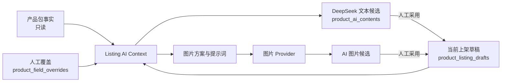
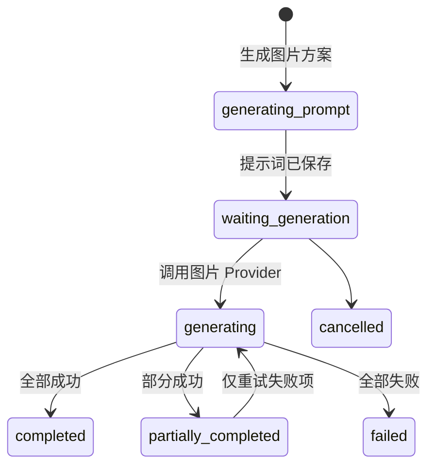

# 产品上架 AI 内容与图片框架

## 1. 目标与边界

本节点把产品编辑工作台调整为 13 个连续模块，并建立统一的 `Listing AI Context`。文本候选由 DeepSeek 生成；真实图片由独立图片 Provider 负责。AI 结果只进入候选与版本记录，必须由用户明确采用后才进入上架草稿。

明确不做：修改 `product_package_rows`、回写产品包事实、全量产品包导入、真实平台发布、在前端保存密钥、在图片 Provider 未配置时伪造图片。

## 2. 数据分层



- 产品包事实：只读，仍由中台产品包同步维护。
- 人工产品信息：保存到 `product_field_overrides`。
- 上架内容：保存到 `product_listing_drafts`。
- AI 文本历史：保存到 `product_ai_contents`。
- AI 图片任务：保存到 `product_image_generation_tasks` 与 `product_image_generation_items`。
- 上架采用图片：只更新草稿 `media_json`，不覆盖 `product_images` 基础素材。

## 3. 国家与站点合并

页面只保留“平台”和“国家/站点”两个选择：平台为 Shopee、Lazada、TikTok Shop；国家/站点为 TH、PH、MY、ID、VN。保存时同时写入 `country_code`、`country_name`、`marketplace_code`，用户不需要重复选择国家和站点。

| 页面值 | country_code | country_name | marketplace_code |
|---|---|---|---|
| 泰国 | TH | 泰国 | TH |
| 菲律宾 | PH | 菲律宾 | PH |
| 马来西亚 | MY | 马来西亚 | MY |
| 印度尼西亚 | ID | 印度尼西亚 | ID |
| 越南 | VN | 越南 | VN |

## 4. Listing AI Context

每次生成都从当前页面重新收集，不复用打开工作台时的旧快照：

```json
{
  "product": {
    "product_name": "当前产品名称",
    "sku": "SKU",
    "main_sku": "主SKU",
    "category_l1": "一级类目",
    "category_l2": "二级类目",
    "sales_spec": "当前销售规格",
    "dimensions": "尺寸",
    "net_weight_g": 0,
    "gross_weight_g": 0,
    "package_dimensions": "包装尺寸",
    "carton_quantity": 0,
    "material": "材质",
    "color": "颜色",
    "available_source_fields": {},
    "manual_overrides": {}
  },
  "target": {
    "platform": "shopee",
    "country_code": "MY",
    "country_name": "马来西亚",
    "marketplace_code": "MY",
    "shop_id": "",
    "shop_name": "",
    "platform_category_name": "",
    "output_language": "马来语"
  },
  "positioning": {
    "target_audience": "",
    "product_positioning": "",
    "content_style": "",
    "price_positioning": "",
    "primary_scenarios": "",
    "special_requirements": "",
    "forbidden_content": ""
  },
  "current_content": {
    "title": "",
    "subtitle": "",
    "description": "",
    "selling_points": [],
    "usage_scenarios": [],
    "adopted_ai": {}
  }
}
```

上下文按稳定字段顺序序列化并计算 SHA-256。生成记录保存完整快照和 `context_hash`。

## 5. 目标用户、定位与风格

“AI 建议”一次生成 `target_audience`、`product_positioning`、`content_style` 三种独立记录。候选显示生成依据和风险；采用任一项不会自动采用其他项。采用后仍可人工修改，保存时记录 `manual_content_json`。

## 6. 标题生成

- 每次返回 3 个候选，包含文本、字符数和推荐原因。
- 平台长度上限通过 `LISTING_TITLE_LIMIT_*` 集中配置。
- 禁止虚构品牌、认证、材质、尺寸、功能、承重和承诺。
- 生成只创建候选版本；用户点击“采用此候选”后，才写入当前草稿。
- `adopted_content_json` 记录三选一的实际采用值，历史恢复不会默认回到第一个候选。

## 7. 副标题生成

副标题使用相同上下文，返回 3 个候选。提示词要求突出价值、人群或场景，避免机械重复标题。支持采用、人工编辑、清空、重新生成、历史查看和恢复。

## 8. 商品描述生成

描述候选包含产品简介、特点、场景、人群、规格、包装、使用说明和注意事项。缺少事实的数据进入风险说明，不补写未确认规格。页面采用“当前版本 / AI 候选”并排对比，采用前不覆盖当前描述。

## 9. 卖点与使用场景

- 默认请求 5 条卖点和 5 个场景，数量限制由请求参数控制。
- 每条卖点保留 `source_fields`；无依据内容进入 `risk_notes`。
- 保存到草稿时转换为可逐条编辑的结构。
- 已采用内容人工修改后，来源标记改为“已人工修改”。

## 10. 历史、采用与恢复

统一使用 `product_ai_contents`，`content_type` 支持：

`target_audience`、`product_positioning`、`content_style`、`listing_title`、`listing_subtitle`、`listing_description`、`selling_points`、`usage_scenarios`、`image_prompt`、`product_images`。

每次生成创建新版本。一个产品与内容类型仅有一个 `confirmed` 版本，其余保留为候选或历史。历史页显示生成时间、类型、摘要、平台、国家、采用状态和人工修改状态。恢复前二次确认，恢复后仍需保存上架草稿。

## 11. 上下文变化

平台、国家/站点、类目、定位字段、产品名称、规格、尺寸、材质等当前值变化后，旧内容不删除、不替换；工作台显示粘性提示“上下文已变化，建议重新生成”。该状态随草稿保存，不因刷新草稿而静默消失。

## 12. 销售规格与视觉层级

销售规格使用自动伸缩多行文本框：最小 84px、最大 260px，内容自动换行，超过最大高度后仅纵向滚动。查看状态使用 `white-space: pre-wrap`、`overflow-wrap: anywhere` 和 `word-break: break-word`。

标题、模块、字段名、字段内容、次要说明和来源标签分别使用不同字号与颜色。来源标签区分产品包、人工修改、AI 生成和平台字段。

## 13. 图片生成两阶段流程



1. DeepSeek 根据统一上下文生成每个槽位的用途、构图、提示词、负面提示词和比例。
2. 图片 Provider 按槽位逐张生成。每张图独立记录状态，单张失败不清除其他成功结果。

未配置图片 Provider 时，图片方案仍可生成；真实生成按钮返回：`尚未配置图片生成模型API，目前仅支持生成图片方案和提示词。`

## 14. 图片 Provider 接口

Provider 只接受已校验参数：

```js
await provider.generate({ prompt, negativePrompt, aspectRatio, referenceImageIds })
// 成功必须返回已持久化的 { fileId }
```

当前运行时只注册 `UnconfiguredImageGenerationProvider`。没有获批的模型合同前，不进行网络请求，也不生成假 URL 或占位图片。测试通过依赖注入 Mock Provider 验证部分失败、单张重试和显式采用。

## 15. 图片模板

默认模板为 1 张主图加 6 张副图：大主图、核心卖点图、场景图 1、场景图 2、细节图、尺寸/结构图、包装/功能补充图。底层遍历 `IMAGE_AI_TEMPLATE_JSON` 的槽位，不写死 7 张，可配置 1-30 个唯一槽位。

## 16. 图片保存与采用

- 图片任务与每图状态独立保存。
- Provider 必须先把结果写入受控文件存储，再返回 `fileId`。
- 生成结果属于 AI 候选，不属于产品基础图片。
- 只有“采用到上架素材”会把文件 ID 追加到草稿 `media_json.imageIds`。
- 重试失败图片只处理选定 item；其他成功 item 保留。

## 17. 数据库变化

迁移 `012_product_listing_ai_content_images.sql` 仅做增量扩展：

- `product_listing_drafts`：国家/站点代码、定位字段、AI 上下文和采用映射。
- `product_ai_contents`：草稿、平台、店铺、上下文哈希、上一版本、实际采用内容和人工修改内容。
- `product_image_generation_tasks`：任务上下文、方案、Provider、模型和总状态。
- `product_image_generation_items`：槽位、提示词、文件 ID、单图状态和采用记录。

迁移未修改 `product_package_rows`，也没有触发产品包导入。

## 18. 环境变量

```env
IMAGE_AI_PROVIDER=
IMAGE_AI_API_KEY=
IMAGE_AI_BASE_URL=
IMAGE_AI_MODEL=
IMAGE_AI_TEMPLATE_JSON=
LISTING_TITLE_LIMIT_SHOPEE=120
LISTING_TITLE_LIMIT_LAZADA=255
LISTING_TITLE_LIMIT_TIKTOK_SHOP=188
```

真实密钥仅放在被 Git 忽略的本地环境文件中。状态接口只返回是否配置、Provider 名、模型名和模板，不返回密钥、密钥长度或哈希。

## 19. 页面截图

截图使用真实产品页面和本机拦截的 Mock AI 候选完成视觉验收，不调用真实模型、不写入业务数据库，候选文案不代表正式生成结果：

- `docs/screenshots/product-listing-long-spec-target.png`：真实销售规格自动换行，无横向隐藏内容。
- `docs/screenshots/product-listing-country-site.png`：国家/站点合并后的单一选择控件。
- `docs/screenshots/product-listing-ai-positioning-title.png`：目标用户、产品定位和内容风格候选。
- `docs/screenshots/product-listing-ai-title-candidates.png`：三个标题候选、字符数和生成依据。
- `docs/screenshots/product-listing-ai-history.png`：标题历史、采用状态、人工修改状态和恢复入口。
- `docs/screenshots/product-listing-selling-scenes.png`：五条卖点与五个场景候选。
- `docs/screenshots/product-listing-ai-images.png`：真实未配置状态、1+6 槽位和禁用的真实生图操作。
- `docs/screenshots/product-listing-mobile.png`：390px 移动端工作台布局。

## 20. 验收与测试

本节点新增 40 项专项测试，并补充 2 项真实 SQLite 采用/恢复测试。覆盖长文本、国家/站点、统一上下文、候选不覆盖、历史恢复、人工修改、图片未配置、可配置槽位、部分失败、单张重试、显式采用、密钥隔离和源数据写保护。

最终验收结果：

- 全量 Node 测试：427/427 通过。
- `npm run build`：通过，前端检查包含 391 个唯一 ID 和 185 个静态绑定。
- `npm run doctor`：通过。
- SQLite：`integrity_check=ok`，外键异常 0；迁移前后所有既有业务表行数一致。
- 桌面浏览器：13 个模块、1 个国家/站点控件、3 个标题候选、3 条历史版本、10 条卖点/场景候选、7 个图片槽位，无页面异常和失败请求。
- 销售规格：`textarea` 的 `scrollWidth` 与 `clientWidth` 均为 563px，没有横向隐藏内容。
- 移动浏览器：390px 视口下页面、弹窗和工作台均为 390px，无页面级横向溢出，关闭操作正常。
- 服务健康检查：`GET /api/health` 返回 200。
