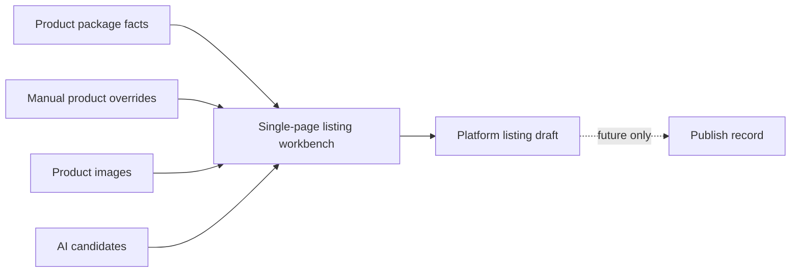

# Product Listing Workbench Design

Date: 2026-07-21
Status: Implemented and verified

## 1. Product facts and listing content

The workbench keeps three distinct data layers:

| Layer | Tables | Ownership | Write rule |
|---|---|---|---|
| Product facts | `product_package_rows`, `product_skus`, `product_images` | Company product center | Product import and image APIs only |
| Manual product overrides | `product_field_overrides`, `product_field_override_events` | Commerce Ops operator | Explicit field edits with history |
| Platform listing | `product_listing_drafts` | Platform/country/shop draft | Workbench draft save only |
| Publish history | `product_listing_publish_records` | Future platform connector | Reserved; no publishing is implemented |
| AI content | `product_ai_contents` and adopted draft fields | AI candidate plus human confirmation | Never writes product-package source facts |

The displayed product value follows the existing rule: manual override, then latest product-package fact. Listing titles, prices, media order, logistics overrides, and platform attributes never replace either source.

## 2. Why the data is split but the page is unified

Data separation prevents a Shopee title or price from corrupting company product facts, and allows the same country + SKU to have independent Lazada, Shopee, and TikTok Shop drafts for different shops. The operator still needs one continuous task surface, so the UI combines facts, editable overrides, AI candidates, listing fields, and validation in a single scrollable workbench.



## 3. Page modules

The sticky toolbar contains return, product identity, draft status, cancel, save draft, save and check, disabled publish, and close controls. A left module navigator highlights the active section.

1. Product information: read-only identity facts plus manual override fields and restore-source actions.
2. Listing target: platform, country, shop, marketplace, platform category, and listing mode.
3. Title and description: title, subtitle, description, keywords, brand, model, audience, and language.
4. AI selling points and scenarios: generation inputs, results, adoption actions, save, and history.
5. SKU and price: variant, listing price, promotional price, available stock, and status.
6. Images and video: reusable product media and draft-only selection, primary image, order, and video URL.
7. Logistics and packaging: draft values seeded from product facts without overwriting those facts.
8. Platform attributes: generic source-aware key/value structure for future category APIs.
9. Publish checks: blockers and warnings; checking does not publish.

## 4. Listing draft model

`product_listing_drafts` is identified by the active combination of:

```text
product_sku_id + platform + country + shop_key
```

`shop_key` is the normalized shop ID, falling back to the normalized shop name and then `__unassigned__`. The table stores target metadata, title and description fields, JSON listing structures, validation output, status, revision, operator labels, timestamps, and `deleted_at`.

Supported stored statuses are `draft`, `ready`, `publishing`, `published`, `failed`, and `archived`. This release only creates `draft` and `ready`; the other states are reserved for a future platform connector. Active target identity is enforced by a partial unique index, while archived drafts remain historical records.

## 5. Publish record reservation

`product_listing_publish_records` reserves immutable request/response snapshots, platform IDs, status, failure information, and publication timestamps. No route or UI action currently writes this table. The Publish button is deliberately disabled and no Shopee, Lazada, or TikTok Shop API is called.

## 6. AI content rules

- The DeepSeek API key is read only by the backend from an ignored local environment file.
- The browser receives only `configured`, model, prompt version, and capability state.
- Prompt version `product-selling-points-v2` requests summary, target users, pain points, title suggestions, description suggestion, selling points, scenarios, feature-benefit mapping, and risk notes.
- Generated output remains an editable candidate until explicitly saved or confirmed.
- Adopting a title or description changes only the current listing draft.
- AI content is stored in `product_ai_contents` or draft-owned fields; it never writes product-package source columns.
- Unverified claims must be returned as risk notes and appear in publish checks.

Local configuration uses `.env.local`:

```env
DEEPSEEK_API_KEY=
DEEPSEEK_BASE_URL=https://api.deepseek.com
DEEPSEEK_MODEL=deepseek-v4
```

The real key is not committed, logged, rendered into HTML, or returned by an API.

## 7. Product media and listing media

`product_images` and the physical storage layer own uploaded source assets. A listing draft's `media_json` stores only selected image IDs, their order, the primary image ID, and the draft video URL. Reordering or removing an image from a draft does not mutate the product image rows or files. Upload and delete continue through the existing authenticated, path-safe product-image endpoints.

## 8. Save and close behavior

The previous dialog used a `method="dialog"` form. Its Cancel and X controls had no explicit `type="button"`; both therefore submitted the form and entered the product-save handler, which prevented normal dialog closure. That mixed native dialog cancellation with business saving and had no unified dirty-state guard.

The workbench is now a non-form command surface. Every toolbar command has an explicit button type. All exits call:

```text
handleRequestClose(source)
```

Supported sources are `cancel-button`, `close-icon`, `escape-key`, `backdrop`, and `route-change`. Clean state closes immediately. Dirty state opens one confirmation dialog. Continue editing keeps all in-memory values; discard aborts any AI request, disconnects observers, clears product/draft/attribute/media/AI state, and closes without saving. A pending-close lock prevents duplicate execution.

Product overrides and the listing draft are saved independently. If the product part succeeds and the listing part fails, the message names both outcomes so the successful part is not silently repeated.

## 9. Permissions

The existing product capability endpoint and authentication guard remain authoritative. New permissions are:

- `product.listing.view`
- `product.listing.edit`
- `product.listing.check`

Listing APIs are mounted inside the authenticated product-center API. Product deletion archives active listing drafts; it does not physically delete draft or publish-history rows.

## 10. Visual system

The workbench uses `#F5F7FA` page background, white modules, `#17233D` headings, `#334155` body text, `#64748B` secondary text, `#94A3B8` disabled text, and `#2563EB` primary actions. Success, warning, danger, and source badges use the requested green, orange, red, gray-blue, blue, purple, and platform green states. Cards use 8px or smaller radii, restrained borders, and clear focus rings.

Desktop uses a fixed toolbar, 188px anchor navigation, and a separately scrolling content pane. Below 900px the navigation becomes a horizontal scroller and modules reduce to two columns; below 640px the dialog becomes full viewport and fields become one column. Toolbar controls remain visible and tappable on mobile.

## 11. Verification

Automated coverage includes additive migration, draft identity isolation, revision updates, product-fact isolation, media-order isolation, re-import preservation, soft deletion, product archive behavior, publish checks, single-page structure, explicit button types, five close sources, dirty confirmation copy, backend-only key handling, and PostgreSQL migration compatibility.

Browser verification against the running local service covered:

| Case | Result |
|---|---|
| Cancel with no changes | PASS |
| X with no changes | PASS |
| Escape with no changes | PASS |
| Backdrop with no changes | PASS |
| Dirty close opens confirmation | PASS |
| Continue editing retains value | PASS |
| Discard closes without save | PASS |
| Next product has no previous values | PASS |
| Route change is guarded | PASS |
| Route cancel stays on Product Center | PASS |
| Route discard completes navigation | PASS |
| Mobile Cancel and X are visible and functional | PASS |

The unconfigured DeepSeek screenshot uses an intercepted status response only; it does not alter the real local key or server configuration.

## 12. Evidence

- [Overall workbench](evidence/product-listing-workbench/01-workbench-overall.png)
- [Sticky toolbar](evidence/product-listing-workbench/02-toolbar.png)
- [Product information](evidence/product-listing-workbench/03-product-information.png)
- [AI content](evidence/product-listing-workbench/04-ai-content.png)
- [Images and video](evidence/product-listing-workbench/05-media.png)
- [Publish checks](evidence/product-listing-workbench/06-validation.png)
- [Unsaved changes confirmation](evidence/product-listing-workbench/07-unsaved-confirmation.png)
- [DeepSeek unconfigured state](evidence/product-listing-workbench/08-deepseek-unconfigured.png)

## Residual limits

- Platform category attributes are generic until official category APIs are connected.
- Image cropping and video upload are placeholders; image selection and ordering are persisted.
- Publish records are schema-only and the Publish button is disabled.
- PostgreSQL migration and compatibility tests include the new tables, while production continues to use SQLite.
