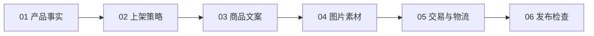
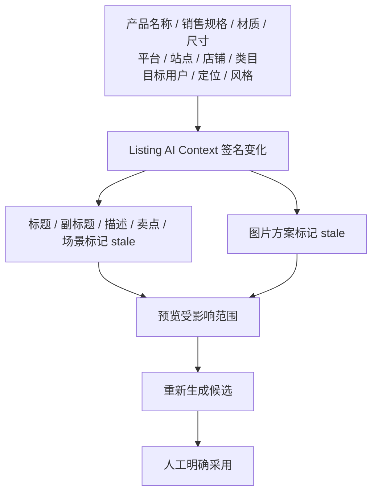

# 产品编辑工作台信息架构

## 1. 目标

本节点把原有 13 个同权重功能区重组为一条连续的商品上架操作路径，不新增业务能力、不改变产品包无损导入边界，也不改变 Listing、AI 内容、AI 图片任务和发布检查的既有 API。

原页面的主要问题是模块过多、AI 操作分散、上下游关系不清、历史记录挤占正文，以及运营人员无法快速判断当前步骤和下一步动作。

## 2. 六步工作流

| 新步骤 | 原功能模块 | 主要操作 |
|---|---|---|
| 产品事实 | 产品基础信息 | 确认产品信息 |
| 上架策略 | 上架目标、目标用户/定位/风格 | AI 建议上架策略 |
| 商品文案 | 标题、副标题、描述、卖点与使用场景 | 生成整套商品文案 |
| 图片素材 | 产品图片与视频、AI 图片生成 | 生成图片方案 |
| 交易与物流 | SKU 与价格、物流包装、平台属性 | 保存交易信息 |
| 发布检查 | 发布检查、平台预览 | 运行发布检查 |

原 13 个模块的 DOM 标识全部保留，既有事件和 API 仍可复用；导航只展示六个业务步骤。

## 3. 页面结构

桌面端由三层组成：

1. 顶部工具栏：返回、产品身份、保存草稿、平台预览、发布检查和关闭。
2. 固定摘要栏：产品、SKU、平台/站点、店铺、草稿状态、最后保存时间、AI 上下文状态和发布准备度。
3. 工作区：左侧六步流程导航，中间连续编辑区；AI 历史继续使用独立弹层。

六个步骤保持在同一滚动页面内。步骤可收起，但不会切换为隔离 Tab。点击流程导航会展开并滚动到目标步骤。

## 4. 产品事实

默认核心事实包括商品名称、SKU、主 SKU、款号、款名、类目、销售规格、材质、颜色、产品尺寸、重量、包装信息和生命周期。其他可编辑产品字段折叠在“展开全部产品信息”内。

- 中台来源值继续只读。
- 人工调整继续保存到 `product_field_overrides`。
- 销售规格使用自动增高文本域和自动换行。
- 来源标记使用轻量标签。
- 不写入或更新 `product_package_rows`。

## 5. 上架策略与商品文案

上架策略先确认平台、国家/站点、店铺、平台类目、输出语言，再维护目标用户、产品定位、内容风格、主要场景和限制条件。未选择平台或站点时，AI 策略入口会提示补齐上下文并定位字段。

“AI 建议上架策略”一次生成目标用户、产品定位、内容风格和使用场景候选。候选支持单项采用、全部采用、人工修改、重新生成和历史恢复。

“生成整套商品文案”复用当前 Listing AI Context，一次请求标题、副标题、描述、卖点和使用场景。单字段重生成与历史入口放入次级折叠菜单，历史记录继续使用 `productAiHistoryDialog`，不长期占用正文。

## 6. 图片素材

图片区域分为三层：

1. 产品原始素材：产品已有图片与人工上传图片。
2. 当前上架素材：草稿图片选择、主图、排序和视频地址。
3. AI 图片方案：1 张主图、6 张副图、任务状态、单图重试和明确采用。

图片方案只有在上架策略与商品文案完整、AI 上下文未过期时才可生成。AI 图片只有执行“采用到上架素材”后才进入 Listing 草稿；未配置图片模型时仍只展示真实的未配置状态。

## 7. 上下游依赖与 stale

过期机制不删除旧内容，也不覆盖人工值。统一入口会先列出受影响内容并请求确认，然后只生成新候选；用户明确采用后才改变草稿。

## 8. 状态与操作层级

流程状态统一为：`not_started`、`incomplete`、`ready`、`generating`、`generated`、`manually_modified`、`stale`、`completed`、`blocked`。

状态同时使用文字和符号，颜色只作辅助：灰色未开始、蓝色生成中、紫色已生成、深蓝人工修改、绿色完成、橙色过期、红色阻断。

每个步骤只有一个高优先级操作。重新生成、历史、恢复、清空、重试等操作降为次级按钮或“更多操作”折叠区。顶部不放置 AI 生成按钮。

## 9. 发布检查与定位

检查报告展示准备度百分比、阻断、提醒、信息和通过数量，并按六步流程归组。未通过项包含说明、建议和定位按钮。

定位流程：

1. 根据检查代码映射目标字段。
2. 展开目标所在折叠区。
3. 平滑滚动到字段。
4. 聚焦可输入字段。
5. 短暂高亮并在字段附近显示错误说明。

当前阶段仅生成检查报告和草稿平台预览，不展示“发布成功”，也不调用平台发布 API。

## 10. 响应式布局

桌面端使用左侧流程导航与中间编辑区。移动端使用单列内容和顶部横向步骤条；步骤条自身可以横向滚动，但工作台正文禁止页面级横向溢出。390px 视口下，保存草稿与发布检查固定在底部，次要操作隐藏或折叠。

## 11. 数据与 API 复用

- 产品事实：现有产品查询与 `product_field_overrides`。
- Listing 草稿：`product_listing_drafts` 与既有草稿 Repository/Service/API。
- AI 内容：`product_ai_contents`、Listing AI Context、生成/确认/人工修改/恢复接口。
- 图片任务：迁移 012 的任务与槽位表、图片 Provider 框架和采用接口。
- 发布检查：现有 `validateListingDraft` 结果，仅改变前端分组和定位表达。

本节点未新增数据库表、未新增迁移、未占用 013，不修改支线 A 增长雷达文件。

## 12. 测试与视觉验收

自动化覆盖六步流程、13 模块保留、导航定位、状态词汇、产品字段折叠、统一 AI 入口、整套文案生成、单字段重生成、历史弹层、stale、安全重生成、图片依赖、检查定位、主操作数量、移动端溢出、产品包只读、API 复用、无 013 和步骤折叠。

计划在 `ui-check/product-listing-workbench/` 生成以下本地验收截图：

- `desktop-full.png`
- `desktop-summary-navigation.png`
- `product-facts-collapsed.png`
- `listing-strategy.png`
- `product-copy.png`
- `ai-history-dialog.png`
- `image-assets.png`
- `commerce-logistics.png`
- `publication-checks.png`
- `stale-notice.png`
- `mobile-390.png`

`ui-check/` 为本地验收产物，不进入 Git。

本次执行时应用内浏览器运行时初始化失败，因此尚未生成上述截图，也未把静态构建通过当作人工页面验收。当前已完成的验证包括全量自动化测试、静态绑定检查、移动端 CSS 约束、服务健康检查和产品中心只读 API 冒烟；实际桌面端与 390px 移动端截图仍是提交后的已知验收缺口。
