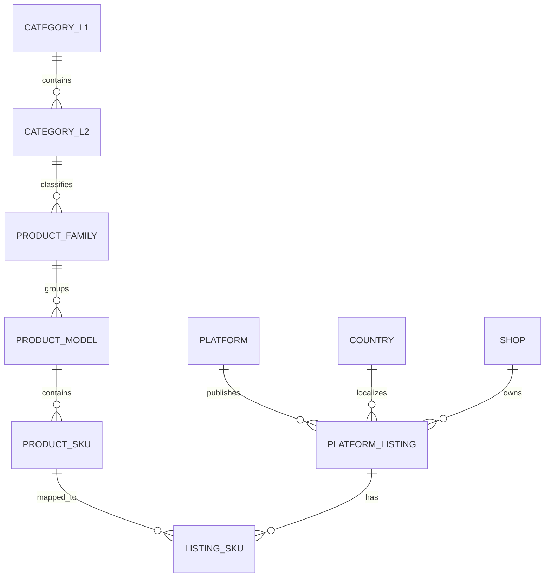
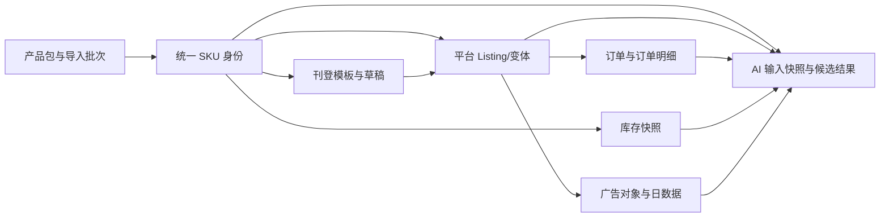

# Commerce Ops 产品包业务标准（G1A-0）

版本：1.0

日期：2026-07-20

状态：BUSINESS STANDARD FROZEN / NOT IMPLEMENTED

适用范围：Commerce Ops 公司中台产品包、产品身份、SKU 治理及未来平台 Listing 关联

生产边界：本文只冻结业务定义，不创建数据库表、不修改代码、不修改 SQLite、不开发页面、不授权进入 G1A-1

## 0. 冻结结论

本标准冻结以下核心定义：

1. 公司中台产品包是商品来源事实，不是平台 Listing，也不是一张可以承载所有业务的大表。
2. 产品包每一行代表一个来源 SKU 在指定周期、国家和仓库下的事实快照。
3. `SKU` 是当前来源行的主要唯一匹配键；内部关系未来使用稳定 UUID。
4. `主SKU` 是公司中台提供的父级归组代码，首期按 Product Model 处理，但不宣称它天然等于所有平台的 SPU。
5. `款号` 是产品系列候选代码，不是数据库主键。占位款号、跨类目款号和一款号多主 SKU 必须保留独立关系。
6. `款名` 是产品系列或款型的业务名称，可以重复和变化，不能作为身份键。
7. 平台 Listing 是“平台 × 国家 × 店铺”下的发布容器，与产品包和 SKU 分层管理。
8. 中台没有提供的图片、AI、平台属性和刊登数据保持“未接入/未评估”，不得伪造成 0、失败或处理中。
9. 对暂时无法确认的来源语义，冻结的是“系统如何保守处理”，而不是编造业务事实。
10. 公司当前 `SKU状态` 的正式映射为：`正常销售 → ACTIVE`、`清仓商品 → CLEARANCE`、`待开发 → NEW`；已确认缺少主 SKU 的灭款记录按规则保存为 `DISCONTINUED`。
11. 产品包是可信来源快照。只有无法建立唯一身份、无法保存必需成本口径或会破坏数据库约束的问题才阻断整行；资料缺失和已确认灭款属于可追溯提醒。

## 1. 标准术语与层级

### 1.1 一级类目

一级类目是公司业务分类树的第一层，例如大家具、厨卫晾、竹制品、家纺。

- 一个一级类目可以包含多个二级类目。
- 一级类目来源名称保留原文，同时映射到内部稳定 ID。
- 同名一级类目只有在来源系统和业务定义确认一致后才能合并。
- 一级类目不是产品、SKU 或 Listing 的身份键。

### 1.2 二级类目

二级类目是一级类目下更具体的商品类型，例如餐桌、浴室置物架、竹制鞋架、床品套件。

- 每个二级类目必须且只能有一个一级类目父节点。
- 一个二级类目可以包含多个产品系列。
- 同一款号跨二级类目出现时不自动合并。
- 类目决定未来属性规则、完整度规则和刊登模板，但不直接决定 SKU。

### 1.3 产品系列

产品系列对应 Product Family，表示一组共享设计语言、用途或业务规划的商品家族。

- 产品包中的 `款号` 和 `款名`是识别产品系列的主要来源证据。
- 产品系列使用内部稳定 ID，不能直接使用款号或款名作为主键。
- 一个二级类目可以有多个产品系列。
- 一个产品系列可以包含多个产品款型/主 SKU。
- `3C0000`、`3C9999` 等已知高风险款号按“占位候选”处理，不能把其所有 SKU 自动合并为一个系列。
- 产品系列本身不是可售卖单位，不直接拥有平台价格、库存或订单。

### 1.4 款名与产品款型

款名是公司中台对系列或款型的可读名称。为避免名称与身份混淆，系统逻辑上使用 Product Model 表示一个可归组款型：

- `主SKU` 存在时，首期作为 Product Model 的来源归组代码。
- `款名`作为 Product Model 和 Product Family 的显示及匹配证据，不作为主键。
- 同一款号下可以有多个主 SKU，这些主 SKU 是同系列下不同款型，不是数据错误。
- 同一款名对应多个主 SKU 时不自动合并，除非有人工确认或中台稳定 ID。
- 主 SKU 缺失时不创建虚构主 SKU，SKU 保持“待归组”状态。

### 1.5 SKU

SKU 是公司中台中最小的来源商品识别和事实承载单元，也是当前产品包每行的主要业务键。

- 来源唯一约束是“来源系统 + SKU”。
- SKU 通常承载颜色、尺寸、套装、材质组合等可售差异。
- SKU 拥有来源商品名、销售规格、包装、状态等当前事实。
- 库存、成本、汇率和价格按周期形成 SKU 快照，不作为永久不变属性。
- SKU 缺少主 SKU 或款号时仍可保留，但不能自动归组或进入依赖身份完整性的批量刊登。
- SKU 不等于平台 Variation ID；两者通过 Listing SKU 映射关联。

### 1.6 平台 Listing

平台 Listing 是某个平台、国家和店铺中的商品发布容器。

- 一个 Listing 属于一个平台、国家和店铺。
- 一个 Listing 可以包含一个或多个平台变体。
- 每个平台变体应关联一个内部 SKU；无法匹配时进入映射问题队列。
- 同一内部 SKU 可以出现在不同平台、国家、店铺和 Listing 中。
- Listing 拥有平台标题、描述、类目、属性、售价、活动状态、链接和平台商品 ID。
- Listing 不拥有也不能覆盖产品物理事实；尺寸、重量、材质等来自产品/SKU 事实层。

### 1.7 层级关系



等价业务关系：

```text
一级类目 1:N 二级类目
二级类目 1:N 产品系列
产品系列 1:N 产品款型/主 SKU
产品款型 1:N SKU
SKU N:M 平台 Listing（通过 Listing SKU/平台变体桥接）
```

### 1.8 不允许的身份推断

- 不允许把同款号的全部 SKU 自动合并为一个产品款型。
- 不允许把同款名的全部 SKU 自动合并。
- 不允许用商品名称相同建立 SKU 或 Listing 映射。
- 不允许因 SKU 前缀相似推断主 SKU、国家或汇率方向。
- 不允许用 Listing URL 作为永久身份键。
- 不允许为缺失的主 SKU、款号或平台 ID 生成看似真实的业务代码。

## 2. 产品包、SKU 与 Listing 边界

### 2.1 产品包的定义

产品包是公司中台导出的固定 34 字段 Excel 快照。它负责提供：

- 来源周期、国家、类目、款号、款名、主 SKU 和 SKU。
- 来源商品名称、销售规格、尺寸、重量、箱规和出货方式。
- 来源状态、仓库、仓存和规划仓。
- 人民币成本、汇率、当地币成本、四档建议价和连带率。

产品包不负责提供：

- 平台 Listing、平台变体、店铺和平台商品 ID。
- 平台实时库存、订单、广告、退款、差评和活动。
- 图片、视频、说明书和本地化内容。
- AI 生成内容、分析结果和运营建议。
- 最终平台售价、平台费率、物流费和净利润。

### 2.2 SKU 的定义边界

属于 SKU 的信息：

- 来源 SKU 代码和内部 SKU ID。
- 来源商品名称、销售规格和来源状态。
- 颜色、尺寸、材质、套装数量等可售差异属性；G1A 只保留来源原文，结构化属性后续处理。
- 单品尺寸、重量、箱规、装箱数和出货方式。
- SKU 与主 SKU、产品系列、类目的关系。
- SKU 的成本、库存和价格快照关联。

不属于 SKU 当前静态字段的信息：

- 某天库存、某周期成本、汇率和建议价，它们是版本化快照。
- 平台标题、平台售价和平台活动状态，它们属于 Listing。
- AI 文案和平台本地化内容，它们属于候选内容或 Listing 内容。

### 2.3 Listing 的定义边界

属于 Listing 的信息：

- 平台、国家、店铺、平台 Item ID、Variation ID 和 URL。
- 平台类目、必填属性、标题、描述、关键词和图片排序。
- 平台标价、活动价、库存发布量和链接状态。
- 广告对象、活动、联盟、达人和内容挂载关系。
- 平台回读的销量、评价、状态和违规信息。

不属于 Listing 的信息：

- SKU 的真实尺寸、重量、材质、包装和来源成本。
- 公司中台款号、主 SKU 和来源产品状态的权威值。
- 其他店铺或平台 Listing 的字段。

### 2.4 四类目示例

#### 大家具

```text
一级类目：大家具
二级类目：餐桌
产品系列：北欧实木餐桌系列
产品款型/主 SKU：岩板餐桌 A 款
SKU：1.4m 胡桃色、1.6m 原木色等可售组合
平台 Listing：Shopee 泰国店铺中的餐桌链接及其尺寸/颜色变体
```

- 桌面材质、结构和基础承重可属于产品款型事实。
- 尺寸、颜色和套装差异属于 SKU。
- 平台标题、泰语描述、活动价和平台属性属于 Listing。
- 一个大件 SKU 未来可能有多个包裹，不能永久挤在单一箱规字段；G1A 保留当前来源箱规，后续扩展多包裹子记录。

#### 厨卫晾

```text
一级类目：厨卫晾
二级类目：浴室置物架
产品系列：免打孔壁挂收纳系列
产品款型/主 SKU：折叠双层款
SKU：40cm 黑色、50cm 银色、带挂钩套装
平台 Listing：Lazada 马来店铺中的壁挂置物架链接
```

- 安装方式、防水材质和结构属于产品/SKU 事实。
- 长度、颜色、配件组合属于 SKU。
- 马来语标题、Lazada 类目属性、店铺价格和活动属于 Listing。

#### 竹制品

```text
一级类目：竹制品
二级类目：竹制置物架
产品系列：楠竹多层收纳系列
产品款型/主 SKU：X 型折叠架
SKU：三层 60cm、四层 80cm、原竹色/胡桃色
平台 Listing：TikTok Shop 菲律宾店铺中的短视频挂车商品
```

- 竹材种类、表面处理和结构属于产品事实。
- 层数、宽度和颜色属于 SKU。
- 视频、达人挂车、菲律宾本地语言和佣金属于 Listing/营销关系。

#### 家纺

```text
一级类目：家纺
二级类目：床品套件
产品系列：纯棉印花系列
产品款型/主 SKU：晨雾花型四件套
SKU：1.5m 床、1.8m 床、不同颜色或套件数量
平台 Listing：Shopee 马来店铺中的床品链接及床型变体
```

- 面料成分、工艺和花型属于产品款型事实。
- 床型、颜色和件数属于 SKU。
- 马来语标题、平台变体名、促销价和店铺库存发布量属于 Listing。

## 3. 字段标准冻结

### 3.1 通用规则

字段类型使用逻辑类型，不等同于某个数据库的 SQL 类型：

| 逻辑类型 | 标准 |
|---|---|
| `uuid` | 内部稳定 ID，禁止从名称拼接生成 |
| `string` | UTF-8 文本；来源原文和规范查询值分开保存 |
| `period` | `YYYYMM` |
| `date` | `YYYY-MM-DD`，无法解析时保留原文并产生问题 |
| `timestamp` | UTC ISO-8601，展示时转换业务时区 |
| `integer` | 十进制整数 |
| `decimal` | 高精度十进制，禁止用二进制浮点计算货币 |
| `money` | 金额值 + ISO 4217 币种 |
| `ratio` | 可空高精度比例；空值不等于 0 |
| `tri_state` | `true/false/unknown` |
| `enum` | 保存来源原文并映射内部稳定代码 |
| `json` | 只用于低频扩展或快照，不隐藏高频必填字段 |

必填标记：

- `是`：缺失会阻断标准行应用。
- `条件必填`：允许保留来源行，但会产生问题并阻断相关下游能力。
- `否`：允许为空，空值保持 unknown。
- `后续`：不是当前 34 字段，不作为 G1A 产品包上传要求。

所有来源字段同时保留：来源原文、标准化值、来源行号、来源批次和字段质量状态。

### 3.2 基础信息

| 字段名称 | 逻辑代码 | 类型 | 必填 | 所属层级 | 说明 |
|---|---|---|---|---|---|
| 来源系统 | `source_system` | enum | 是 | 导入批次 | 首期固定为公司中台，未来适配中台采集 |
| 周期 | `source_period` | period | 是 | 导入批次/快照 | 当前产品包表头；同批次必须一致 |
| 来源文件 | `source_file_id` | uuid | 是 | 导入批次 | 指向现有正式文件记录，不保存绝对路径 |
| 商品名称 | `source_product_name` | string | 是 | SKU | 中台来源名称；运营标准名另存 |
| 创建日期 | `source_created_date` | date | 是 | SKU | 来源创建日期，解析失败产生问题 |
| 新款年月 | `source_launch_date` | date | 条件必填 | SKU 生命周期快照 | 原值为完整日期；展示年月由日期派生 |
| 新款月龄 | `source_age_months` | integer | 否 | SKU 生命周期快照 | 保存来源值，并与周期派生值核对 |
| SKU 状态 | `source_sku_status` | enum | 是 | SKU 生命周期快照 | 保存原文；当前正式映射为正常销售/ACTIVE、清仓商品/CLEARANCE、待开发/NEW |
| 赠品 | `source_is_gift` | tri_state | 否 | SKU | `是=true`；空值为 unknown，不当作 false |

### 3.3 分类信息

| 字段名称 | 逻辑代码 | 类型 | 必填 | 所属层级 | 说明 |
|---|---|---|---|---|---|
| 国家 | `source_country` | enum | 是 | 来源快照 | 保留原文并映射 ISO 国家代码 |
| 一级品类 | `source_category_l1` | string | 是 | 一级类目 | 必须建立内部类目 ID |
| 二级品类 | `source_category_l2` | string | 是 | 二级类目 | 必须关联一级类目 |
| 款号 | `source_style_code` | string | 条件必填 | 产品系列 | 不是主键；空值和占位值产生身份问题 |
| 款名 | `source_style_name` | string | 条件必填 | 产品系列/款型 | 可重复、可变化，只作名称和证据 |
| 产品系列 ID | `product_family_id` | uuid | 后续内部生成 | 产品系列 | 不能直接等于款号 |
| 产品款型 ID | `product_model_id` | uuid | 条件生成 | 产品款型 | 主 SKU 缺失时保持空，不造假 |

### 3.4 SKU 信息

| 字段名称 | 逻辑代码 | 类型 | 必填 | 所属层级 | 说明 |
|---|---|---|---|---|---|
| SKU | `source_sku` | string | 是 | SKU | `source_system + SKU` 唯一；不自动改写大小写 |
| 内部 SKU ID | `sku_id` | uuid | 内部生成 | SKU | 所有关联使用的稳定内部键 |
| 主 SKU | `source_master_sku` | string | 条件必填 | 产品款型 | 缺失时 SKU 待归组；不推断 |
| 销售规格 | `source_sales_spec` | string | 条件必填 | SKU | 来源原文权威；结构化提取另存 |
| 出货方式 | `source_shipping_mode` | enum | 条件必填 | SKU 履约 | 保存走柜、中转、散货等来源原文 |
| 仓库 | `source_warehouse` | string | 条件必填 | SKU 库存快照 | 映射内部仓库 ID，名称不是永久键 |
| 仓存 | `source_on_hand_quantity` | decimal | 否 | SKU 库存快照 | 中台周期快照，不等于马帮实时可售库存 |
| 规划仓 | `source_is_planned_warehouse` | tri_state/string | 否 | SKU 仓库计划 | 保留来源语义；空值为 unknown |

### 3.5 属性与包装信息

| 字段名称 | 逻辑代码 | 类型 | 必填 | 所属层级 | 说明 |
|---|---|---|---|---|---|
| 单品尺寸原文 | `source_item_size_text` | string | 条件必填 | SKU 包装 | 保留原文，后续解析不覆盖原文 |
| 单品净重 g | `net_weight_g` | decimal | 条件必填 | SKU 包装 | 必须大于 0 |
| 单品毛重 g | `gross_weight_g` | decimal | 条件必填 | SKU 包装 | 必须大于 0 且不小于净重 |
| 外箱长 cm | `carton_length_cm` | decimal | 条件必填 | SKU 包装 | 必须大于 0 |
| 外箱宽 cm | `carton_width_cm` | decimal | 条件必填 | SKU 包装 | 必须大于 0 |
| 外箱高 cm | `carton_height_cm` | decimal | 条件必填 | SKU 包装 | 必须大于 0 |
| 每箱数量 | `units_per_carton` | integer | 条件必填 | SKU 包装 | 必须为正整数 |
| 结构化属性 | `product_attributes` | json/typed values | 后续 | 产品款型/SKU | G1B 按属性定义保存，不写回来源原文 |
| 多包裹明细 | `package_components` | child records | 后续 | SKU 包装 | 大家具等一个 SKU 多包裹时使用 |

### 3.6 图片素材

当前 34 字段没有图片。以下字段属于 G1B，不作为 G1A 产品包缺失或上传失败条件：

| 字段名称 | 逻辑代码 | 类型 | 必填 | 所属层级 | 说明 |
|---|---|---|---|---|---|
| 素材 ID | `asset_id` | uuid | 后续 | 素材 | 统一文件元数据身份 |
| 素材类型 | `asset_type` | enum | 后续 | 素材 | 主图、详情图、尺寸图、安装图、视频、说明书 |
| 文件 ID | `file_id` | uuid | 后续 | 素材 | 指向统一文件持久化层 |
| 适用范围 | `asset_scope` | json/relation | 后续 | 产品款型/SKU | 记录适用 SKU、国家、平台和语言 |
| 来源 | `asset_source` | enum | 后续 | 素材 | 公司、中台、供应商、人工、AI、平台回读 |
| 版本 | `asset_version` | integer | 后续 | 素材 | 修改不覆盖历史版本 |
| 审核状态 | `asset_review_status` | enum | 后续 | 素材 | 待审核、通过、驳回、停用 |
| 图片数量 | `image_count` | integer/null | 后续计算 | 产品查询 | G1B 未启用前为 NULL/未接入，不显示 0 |

### 3.7 成本利润

| 字段名称 | 逻辑代码 | 类型 | 必填 | 所属层级 | 说明 |
|---|---|---|---|---|---|
| 销售成本人民币 | `source_cost_cny` | money | 条件必填 | SKU 成本快照 | 中台来源口径，未确认前不宣称为到岸成本 |
| 国家汇率 | `source_fx_rate` | decimal | 条件必填 | SKU 成本快照 | 必须配合基准币、报价币和方向解释 |
| 汇率方向 | `fx_direction` | enum | 条件必填 | SKU 成本快照 | `local_per_cny` 或 `cny_per_local`；由金额核对确认，不按 SKU 前缀猜测 |
| 销售成本国家币 | `source_cost_local` | money | 条件必填 | SKU 成本快照 | 中台权威结果，币种由国家映射 |
| 1 档价 20% | `source_price_band_20` | money | 条件必填 | SKU 价格快照 | 保留来源值，规则只做复核 |
| 2 档价 25% | `source_price_band_25` | money | 条件必填 | SKU 价格快照 | 保留来源值，规则只做复核 |
| 3 档价 35% | `source_price_band_35` | money | 条件必填 | SKU 价格快照 | 保留来源值，规则只做复核 |
| 4 档价 45% | `source_price_band_45` | money | 条件必填 | SKU 价格快照 | 保留来源值，规则只做复核 |
| 连带率 | `source_attachment_rate` | ratio | 否 | SKU 指标快照 | 当前全空；空值不等于 0，不参与评分 |
| 平台费率 | `platform_fee_rate` | ratio | 后续 | 平台国家规则 | 不是产品包来源字段 |
| 物流成本 | `logistics_cost` | money | 后续 | SKU × 国家/渠道 | 需要运输方式、尺寸重量和费率版本 |
| 售后风险成本 | `after_sales_risk_cost` | money | 后续 | SKU × 国家/平台 | 基于真实售后数据计算 |
| 最低控价 | `minimum_allowed_price` | money | 后续计算 | SKU × 平台国家 | 由规则引擎计算，不由 AI 决定 |
| 贡献利润 | `contribution_profit` | money | 后续计算 | Listing/SKU | 基于成交、费用和成本快照计算 |

### 3.8 平台信息

以下字段不属于公司产品包，进入 Listing/平台回读层：

| 字段名称 | 逻辑代码 | 类型 | 必填 | 所属层级 | 说明 |
|---|---|---|---|---|---|
| 平台 | `platform_code` | enum | 后续 | Listing | Shopee、TikTok Shop、Lazada |
| 平台国家 | `country_code` | enum | 后续 | Listing | Listing 实际销售国家 |
| 店铺 ID | `shop_id` | uuid/source id | 后续 | Listing | 内部店铺 ID + 平台店铺 ID |
| Listing ID | `listing_id` | uuid | 后续 | Listing | 内部稳定 ID |
| 平台 Item ID | `platform_item_id` | string | 后续 | Listing | 与平台、国家、店铺联合唯一 |
| 平台变体 ID | `platform_variation_id` | string | 后续 | Listing SKU | 映射内部 SKU |
| Listing URL | `listing_url` | string | 后续 | Listing | 只作访问地址，不作永久键 |
| 平台类目 | `platform_category_id` | string | 后续 | Listing | 由平台/国家模板确定 |
| 平台属性 | `platform_attributes` | json/relations | 后续 | Listing/Listing SKU | 只保存平台字段，不覆盖产品事实 |
| 平台标题 | `listing_title` | string | 后续 | Listing | 国家语言和平台规则下的运营内容 |
| 平台描述 | `listing_description` | string | 后续 | Listing | 版本化内容 |
| 平台标价 | `listing_price` | money | 后续 | Listing SKU | 与来源四档价分开 |
| 活动价 | `campaign_price` | money | 后续 | Listing SKU/活动 | 带活动与有效期 |
| Listing 状态 | `listing_status` | enum | 后续 | Listing | 平台回读状态 |
| 可刊登状态 | `listing_readiness` | enum/null | 后续计算 | SKU × 平台国家 | 刊登模块未启用前为未评估 |

### 3.9 AI 字段

AI 字段不是产品事实。G1A 不生成这些字段，只冻结未来边界：

| 字段名称 | 逻辑代码 | 类型 | 必填 | 所属层级 | 说明 |
|---|---|---|---|---|---|
| AI 运行 ID | `ai_run_id` | uuid | 后续 | AI 分析 | 每次运行独立记录 |
| 分析类型 | `analysis_type` | enum | 后续 | AI 分析 | 属性提取、卖点、FAQ、广告诊断等 |
| 目标实体 | `target_entity` | relation | 后续 | AI 分析 | SKU、产品、Listing、广告对象等 |
| 输入快照 | `input_snapshot` | json | 后续 | AI 分析 | 记录引用的数据版本和证据 |
| 模型 | `model_id` | string | 后续 | AI 分析 | 模型名称和供应商 |
| Prompt 版本 | `prompt_version` | string | 后续 | AI 分析 | 可复现，不保存密钥 |
| 候选结果 | `candidate_output` | json/text | 后续 | AI 候选 | 未审核不能成为正式内容 |
| 置信度 | `confidence` | decimal/null | 后续 | AI 候选 | 仅作辅助，不替代证据 |
| 来源引用 | `evidence_refs` | json/relations | 后续 | AI 分析 | 引用产品、素材、竞品和数据批次 |
| 审核状态 | `review_status` | enum | 后续 | AI 候选 | 待审核、采纳、部分采纳、驳回 |
| 审核结果 | `review_result` | json/text | 后续 | AI 候选 | 记录人工选择和修改，不覆盖原输出 |

### 3.10 当前 34 字段合同

公司产品包首期严格要求以下 34 个表头，名称和顺序在 G1A-0 冻结：

```text
周期
SKU
商品名称
主SKU
国家
一级品类
二级品类
创建日期
新款年月
新款月龄
赠品
SKU状态
款号
款名
销售规格
单品尺寸
单品净重g
单品毛重g
外箱长cm
外箱宽cm
外箱高cm
每箱数量
出货方式
仓库
仓存
规划仓
销售成本人民币
国家汇率
销售成本国家币
1档价(20%)
2档价(25%)
3档价(35%)
4档价(45%)
连带率
```

新增、删除、改名、重复或调序都不能静默兼容。发现变化时批次进入 Schema 待确认，不按列位置猜测。

## 4. 业务异常定义

### 4.1 异常处理总原则

- 原始行和原始值始终保留。
- “允许导入来源证据”不等于“允许应用为正式事实”或“允许下游刊登”。
- 不自动选择冲突记录，不用名称或前缀猜测缺失关系。
- 异常具有稳定代码、严重程度、影响范围、系统建议和处理状态。
- 纠错通过问题流程、别名或关系确认完成，不直接改写来源原文。

### 4.2 首期异常标准

| 异常 | 稳定代码 | 严重程度 | 来源证据可保留 | 正式应用 | 下游影响 | 处理标准 |
|---|---|---|---|---|---|---|
| 主 SKU 缺失 | `MISSING_MASTER_SKU` | error | 是 | 允许应用 SKU，model_id 为空 | 阻断自动归组和批量刊登 | 创建待归组问题；不得生成主 SKU |
| SKU 重复 | `DUPLICATE_SOURCE_SKU` | blocker | 是 | 阻断受影响 SKU | 所有下游阻断 | 展示所有重复行，人工确认来源后重新导入 |
| 款号为空 | `MISSING_STYLE_CODE` | error | 是 | 允许应用为未归系列 SKU | 阻断系列级操作和批量刊登 | 创建身份问题；不得用款名代替款号 |
| 款号为占位候选 | `PLACEHOLDER_STYLE_CODE` | warning/error | 是 | 允许应用但低置信 | 禁止自动合并系列 | 按二级类目、款名、主 SKU 分开候选，等待确认 |
| 规格冲突 | `SALES_SPEC_CONFLICT` | error/blocker | 是 | 同批次同 SKU 冲突时阻断；跨批次变化需人工批准 | 阻断依赖规格的刊登 | 展示旧值、新值、行号和影响，不自动覆盖 |
| 汇率方向错误/未知 | `FX_DIRECTION_INVALID` | blocker for calculation | 是 | 可保留来源成本快照，但标记不可计算 | 阻断利润、控价和自动定价 | 用人民币/当地币成本核对乘除方向；无法唯一核对则人工确认 |
| 成本缺失 | `SOURCE_COST_MISSING` | error | 是 | 允许身份和物理事实应用 | 阻断利润、控价和价格建议 | 补充来源成本后重新导入，不用 AI 或 0 填充 |
| 图片缺失 | `IMAGE_MISSING` | G1B 启用后 warning/error | 是 | G1A 不生成该问题 | G1B/刊登阶段才影响 | G1A 显示“素材未接入”；G1B 启用后按类目规则判断 |

### 4.3 补充异常

| 异常 | 处理 |
|---|---|
| 毛重小于净重 | 保留来源行，产生 `GROSS_WEIGHT_LT_NET`，阻断物流依赖能力 |
| 箱规或重量非正数 | 保留来源行，产生包装异常，不把负数/0 修成空值 |
| 一级/二级类目缺失 | 阻断该行正式应用，保留来源证据 |
| 二级类目与一级类目关系冲突 | 阻断关系应用，不自动创建第二个同名类目 |
| 同款号对应多个主 SKU | 默认允许，视为一个系列多个款型；只有跨类目或来源矛盾时产生问题 |
| 同主 SKU 对应多个正式款号 | 进入身份关系审核，不自动迁移历史 SKU |
| 赠品为空 | 保存 unknown，不自动映射 false |
| 规划仓为空 | 保存 unknown，不自动映射 false |
| 连带率为空 | 显示暂无数据，不参与计算或完整度 |
| SKU 本批次未出现 | 标记 `not_seen`；不能因一次缺失停用或删除 |
| 新款月龄与周期不一致 | 保留来源值和派生值，产生告警，不覆盖来源值 |

### 4.4 汇率方向冻结规则

当前样本存在两类来源汇率。系统标准化时只允许以下两种明确方向：

```text
local_per_cny:
当地币成本 = 人民币成本 × 汇率

cny_per_local:
当地币成本 = 人民币成本 ÷ 汇率
```

处理顺序：

1. 使用来源人民币成本、来源汇率和来源当地币成本分别核对两种公式。
2. 在配置的金额容差内只有一种公式成立时，记录对应方向。
3. 两种都不成立、两种都成立或任一关键值缺失时，方向为 unknown 并生成问题。
4. 不根据 SKU 前缀、国家名称或汇率大小单独猜测方向。
5. 来源当地币成本和四档价保留原值；校验失败不静默重算覆盖。

## 5. 未来扩展关系

### 5.1 关系总图



### 5.2 订单

- 订单主表关联平台、国家和店铺。
- 订单明细先关联平台 Item/Variation，再映射 Listing SKU 和内部 SKU。
- 订单保存成交时的标题、规格、币种、金额和成本快照，不随当前产品事实变化。
- 无法映射的订单明细进入人工映射队列，不按名称强行关联。

### 5.3 库存

- 产品包仓存是中台周期快照。
- 马帮库存是独立来源的更高频快照。
- 平台发布库存是 Listing SKU 的平台状态。
- 三种库存按 `sku_id + warehouse/source + observed_at` 分别保存，不直接相加。
- “可售库存”由后续规则引擎计算，不把任一来源字段直接改名为可售库存。

### 5.4 广告

- 广告先关联平台店铺、Item/Variation 或推广对象，再映射 Listing 和 SKU。
- 只有映射成功的数据才能汇总到 SKU、产品系列和类目。
- 广告分析可以读取产品状态、来源成本、库存和问题，但不能修改产品事实。
- 未来广告调整仍需要动作审批和审计，不属于产品包模块。

### 5.5 AI 分析

- AI 分析通过内部 SKU、Listing 或广告对象作为目标。
- 每次分析引用明确的产品、成本、库存、素材、竞品或广告快照版本。
- AI 输出是候选内容、解释或建议，不是来源事实。
- 人工采纳后的内容进入运营扩展或 Listing 内容层，原始 AI 输出仍保留。

### 5.6 刊登系统

- 刊登系统读取产品/SKU 事实、素材、国家适配、成本利润和平台模板。
- 它生成 Listing 草稿，不直接修改产品包来源字段。
- Listing SKU 必须显式关联内部 SKU。
- 平台发布、回读、重试和下架形成独立任务与审计。
- G1A 只提供可信身份、事实、完整度和问题，不执行刊登。

## 6. 当前明确暂不设计或实现的内容

G1A-0 不设计实现细节，也不授权以下能力：

- 自动刊登、批量发布、自动修改平台商品或自动下架。
- AI 生成标题、详情、卖点、FAQ、图片或视频。
- AI 自动采纳属性或覆盖中台尺寸、重量、材质和成本。
- 广告自动调价、自动停投、自动加预算或自动创建计划。
- 自动客服、自动退款、自动赔偿、自动差评挽回。
- 活动自动报名、联盟佣金自动调整、达人自动建联。
- 产品图片、视频和说明书管理页面；这些属于 G1B。
- 平台属性模板、国家合规和可刊登规则；这些属于后续刊登阶段。
- 中台爬取、API 实时同步和定时同步；先稳定 Excel 闭环。
- PostgreSQL 正式迁移或生产 Provider 切换。
- 多用户、角色、组织、审批流和真实人员权限体系。
- Redis、MinIO、Elasticsearch 或其他新基础设施。
- G1A-1 数据库表、迁移、API、页面和代码开发。

## 7. 标准变更治理

本标准进入 G1A-1 前作为业务 Schema 的输入。以下变化必须先更新本标准并单独评审：

- 产品系列、主 SKU、SKU 或 Listing 的身份定义变化。
- 34 表头新增、删除、改名或顺序变化。
- 必填规则、汇率方向、成本口径或价格公式变化。
- 字段所有权从中台事实变为人工/AI 可编辑。
- 图片缺失、平台属性缺失等后续规则正式启用。
- 将未知值改为默认值或将告警升级为阻断。

标准版本必须记录变更原因、生效日期、影响字段、兼容方案和是否需要数据迁移。任何代码或数据库实现不得自行改变本标准。

## 8. G1A-0 验收结论

G1A-0 冻结了：

- 一级类目、二级类目、产品系列、产品款型/主 SKU、SKU 和平台 Listing 的层级与关系。
- 产品包、SKU、快照、素材、Listing、AI 和经营事实的边界。
- 当前 34 字段及未来图片、平台、AI、利润字段的逻辑标准。
- 主 SKU 缺失、重复 SKU、款号为空、规格冲突、汇率方向、成本和图片缺失的处理方式。
- 产品包与订单、库存、广告、AI 和刊登系统的关联原则。
- G1A-0 和 G1A 后续阶段明确不做的能力。

尚未从公司中台获得正式解释的来源字段，不阻止本标准冻结，因为系统处理已采用保守规则：原值保留、语义 unknown、禁止猜测、影响下游时阻断。任何未来口径确认都通过标准版本升级进入系统，不回写或抹除历史来源证据。

本文完成后停止。进入 G1A-1 必须由用户另行确认。
