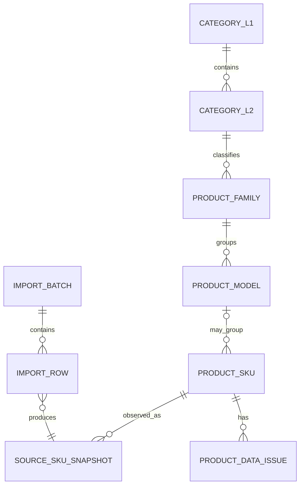

# Commerce Ops 产品包真实数据验证报告（G1A-0.5）

版本：1.0

日期：2026-07-20

状态：VALIDATION COMPLETE / READ-ONLY / NOT IMPLEMENTED

适用标准：`docs/product-package-business-standard.md` 1.0

## 0. 执行结论

本次使用真实产品包 `产品包20260610.xlsx` 对 G1A-0 业务标准进行只读验证。原文件没有被修改，分析副本与原文件 SHA-256 均为：

```text
4446FB1D1E46F9D7CEA54810D08CE796D912F00D1ED61DDE84D67BD2A0D2F45E
```

结论如下：

1. 固定 34 字段可以承载当前样本的来源事实、SKU、包装、仓库、成本和四档价格，表头覆盖率为 34/34。
2. 当前样本共 262 行，SKU 262 个且无重复，基础字段整体质量较高；排除语义上可空的“赠品”和当前全空的“连带率”后，字段单元格完整率为 99.09%。
3. `主SKU` 缺失 16 行，主要集中在螺丝、遥控器、纸箱、气泡柱等配件或包装物。G1A-0 “保留 SKU、不得虚构主 SKU、阻断自动刊登”的规则可用。
4. `款号` 不能作为产品系列唯一键。`3C0000`、`3C9999` 是高风险占位候选，`3C0041` 还存在跨二级类目复用。
5. 已填写尺寸统一使用 `cm`，重量表头统一为 `g`；真正的问题不是单位混用，而是尺寸表达维度不同、包装字段缺失以及未来需要按类目设置合理性阈值。
6. 核心成本和四档价格字段完整。汇率在同一国家、同一文件中同时出现两种报价方向，必须逐条保存 `fx_direction`，不能按国家、SKU 前缀或文件批次猜测。
7. 当前 Excel 没有图片或平台 Listing 字段。G1A 只能展示“素材未接入”和“刊登未评估”，不得把它们显示成 0、失败或缺失问题。
8. 当前真实文件只包含 `3C数码`，不能证明分类模型已经覆盖大家具、厨卫晾、大件实木、竹制品和家纺。五类目仍需各取真实产品包复验。

因此，G1A-0 标准可以作为 G1A-1 的基础，但数据库设计前必须吸收本报告第 7 节的规则调整。

## 1. 验证范围与方法

### 1.1 数据边界

| 项目 | 结果 |
|---|---:|
| 工作表 | 产品包 |
| 使用区域 | A1:AH263 |
| 表头 | 34 |
| 数据行 | 262 |
| 来源周期 | 202606 |
| 来源国家 | 泰国 |
| 来源一级类目 | 3C数码 |
| 原文件修改 | 否 |
| 数据库读写 | 无 |

### 1.2 只读方法

1. 读取原文件的文件大小与 SHA-256。
2. 通过允许共享读取的文件流生成临时分析副本，避免 Excel 正在打开时修改或锁定原文件。
3. 验证分析副本 SHA-256 与原文件一致。
4. 使用电子表格解析器读取工作表值，不保存、不导出、不回写工作簿。
5. 按固定表头、字段完整度、业务身份、包装、成本、汇率、分类和未来关联边界进行统计。

本报告中的“异常”表示需要治理、确认或下游阻断，不等于原始数据一定错误。

## 2. 数据规模

### 2.1 身份规模

| 指标 | 数量 |
|---|---:|
| 数据行 | 262 |
| 唯一 SKU | 262 |
| 非空唯一主 SKU | 203 |
| 非空唯一款号 | 151 |
| 非空唯一款名 | 158 |
| 仓库 | 1 |
| 一级类目 | 1 |
| 二级类目 | 6 |

### 2.2 商品状态

| SKU 状态 | 数量 | 占比 |
|---|---:|---:|
| 正常销售 | 148 | 56.49% |
| 清仓商品 | 67 | 25.57% |
| 待开发 | 47 | 17.94% |

### 2.3 分类分布

| 一级类目 | 二级类目 | 数量 |
|---|---|---:|
| 3C数码 | 电脑周边 | 112 |
| 3C数码 | 音响乐器 | 47 |
| 3C数码 | 电视设备 | 41 |
| 3C数码 | 影像摄影 | 35 |
| 3C数码 | 游戏娱乐 | 17 |
| 3C数码 | 数码配件 | 10 |

六个二级类目均只有一个一级类目父节点；当前样本没有无法归类行，也没有同名二级类目对应多个一级类目的情况。

## 3. 字段映射验证

### 3.1 固定 34 字段映射

| 来源字段 | 目标逻辑层 | 完整率 | G1A 处理结论 |
|---|---|---:|---|
| 周期 | 产品包批次/来源快照 | 100% | 作为批次周期并校验批次内一致 |
| SKU | SKU | 100% | `source_system + SKU` 作为来源唯一键 |
| 商品名称 | SKU 来源事实 | 100% | 保留原文，不作为身份键 |
| 主SKU | 产品款型候选关系 | 93.89% | 可空；缺失进入待归组问题 |
| 国家 | 来源快照/国家映射 | 100% | 保留原文并映射内部国家代码 |
| 一级品类 | 分类树 | 100% | 映射稳定内部类目 ID |
| 二级品类 | 分类树 | 100% | 必须关联一级类目 |
| 创建日期 | SKU 来源事实 | 100% | 解析为日期并保留原文 |
| 新款年月 | 生命周期快照 | 100% | 实际为完整日期，展示年月由日期派生 |
| 新款月龄 | 生命周期快照 | 100% | 保存来源值并做派生复核 |
| 赠品 | SKU 三态事实 | 22.52% | 空值为 unknown，不得当作 false |
| SKU状态 | 生命周期快照 | 100% | 保存原文并映射内部状态 |
| 款号 | 产品系列候选关系 | 100% | 不是唯一键；占位候选需告警 |
| 款名 | 产品系列/款型证据 | 100% | 显示与匹配证据，不作主键 |
| 销售规格 | SKU 来源事实 | 98.85% | 保留原文；3 行缺失需治理 |
| 单品尺寸 | SKU 包装 | 95.80% | 保存原文、解析状态和维度数量 |
| 单品净重g | SKU 包装 | 95.80% | 高精度十进制克值 |
| 单品毛重g | SKU 包装 | 97.33% | 高精度十进制克值 |
| 外箱长cm | 包装快照 | 97.33% | 高精度十进制厘米值 |
| 外箱宽cm | 包装快照 | 97.33% | 高精度十进制厘米值 |
| 外箱高cm | 包装快照 | 97.33% | 高精度十进制厘米值 |
| 每箱数量 | 包装快照 | 97.33% | 正整数 |
| 出货方式 | SKU 履约 | 100% | 来源枚举原文 + 内部映射 |
| 仓库 | 库存快照 | 100% | 映射内部仓库 ID |
| 仓存 | 库存快照 | 100% | 不与马帮实时库存直接相加 |
| 规划仓 | 仓库计划快照 | 100% | 保留来源语义，暂不推断布尔规则 |
| 销售成本人民币 | 成本快照 | 100% | 高精度金额，口径待业务确认 |
| 国家汇率 | 成本快照 | 100% | 必须配合汇率方向 |
| 销售成本国家币 | 成本快照 | 100% | 作为中台来源结果保留 |
| 1档价(20%) | 价格快照 | 100% | 来源价格线，公式只复核不覆盖 |
| 2档价(25%) | 价格快照 | 100% | 来源价格线，公式只复核不覆盖 |
| 3档价(35%) | 价格快照 | 100% | 来源价格线，公式只复核不覆盖 |
| 4档价(45%) | 价格快照 | 100% | 来源价格线，公式只复核不覆盖 |
| 连带率 | 指标快照 | 0% | 全空；保持 unknown，不计入完整度 |

### 3.2 逻辑层覆盖率

| 逻辑层 | 覆盖结果 | 解释 |
|---|---:|---|
| 固定表头映射 | 34/34，100% | 所有表头均有明确业务归属 |
| 产品包批次与来源事实 | 100% | 周期、国家、日期、状态均完整 |
| 产品系列证据 | 100% | 一级/二级类目、款号、款名均有值，但身份质量需治理 |
| 主 SKU 关系 | 93.89% | 缺失 16 行 |
| SKU 事实组 | 93.73% | 主要受“赠品”空值影响；空值语义尚未确认 |
| Listing 来源准备字段 | 98.79% | 指可供未来刊登使用的商品事实，不等于已有 Listing |
| 核心成本价格 | 100% | 不含全空的连带率 |
| 成本价格组（含连带率） | 87.50% | 连带率 0% 覆盖拉低结果 |
| 素材字段 | 0% | 当前 34 字段没有图片/视频，属于 G1B |
| 实际平台 Listing 字段 | 0% | 当前没有平台、店铺、Item ID、Variation ID、URL 等字段 |

全部 8,908 个字段单元格中，8,367 个非空，原始完整率 93.93%。排除“赠品”和“连带率”两个当前可空/待确认字段后，剩余字段完整率为 99.09%。这两个数只能描述来源文件完整性，不能直接当作商品可刊登完整度。

## 4. 异常数据扫描

### 4.1 汇总

| 检查项 | 数量 | 严重程度建议 | 处理结论 |
|---|---:|---|---|
| 主 SKU 缺失 | 16 行 | warning/block_downstream | 保留 SKU，禁止自动归组和自动刊登 |
| SKU 重复 | 0 组 | blocking | 当前样本通过 |
| 款号为空 | 0 行 | warning/block_downstream | 当前样本通过 |
| 款号占位候选 | 21 行 | warning | 不按款号自动合并系列 |
| 款号跨类目或多款名复用 | 3 个款号 | warning/review | 建立关系表和人工确认 |
| 分类缺失/无法归属 | 0 行 | blocking | 当前样本通过，但只验证 3C 数码 |
| 销售规格缺失 | 3 行 | warning/block_listing | 保留来源 SKU，阻断依赖规格的刊登 |
| 潜在重复来源变体 | 16 组 | warning | 不自动去重，要求额外区分证据 |
| 单品尺寸缺失 | 11 行 | warning/block_by_template | 保留行；按目标类目/平台规则决定阻断 |
| 尺寸单位混用 | 0 行 | warning | 251 个非空值均为 cm |
| 非标准三维尺寸表达 | 11 行 | info/review | 1 个一维、9 个二维、1 个带范围四数值 |
| 单品净重缺失 | 11 行 | warning | 保留行并产生包装资料问题 |
| 单品毛重缺失 | 7 行 | warning | 保留行并产生包装资料问题 |
| 毛重小于净重 | 0 行 | high | 当前样本通过 |
| 外箱长/宽/高/装箱数缺失 | 各 7 行 | warning | 多为配件、遥控器和纸箱来源行 |
| 核心成本缺失或非正数 | 0 行 | high | 当前样本通过 |
| 汇率方向风险 | 262 行需显式方向 | high | 244 行乘法口径、18 行除法口径 |
| 四档价格公式不一致 | 0 行 | high | 262 行均通过复核 |
| 图片字段缺失 | Schema 未提供 | not_evaluated | G1A 不创建图片缺失问题 |

### 4.2 主 SKU 缺失

16 行缺少主 SKU。样本包括：

- 投影仪支架螺丝、投影仪支架云台。
- 安卓电视机遥控器、机顶盒遥控器。
- 32/43 寸电视纸箱。
- 电视气泡柱、气泡柱卷材。

这些记录显示“缺少主 SKU”并不等于“无效 SKU”。它们可能是配件、售后件、包装材料、耗材或尚未归组商品。G1A-1 需要增加来源商品类型候选：

```text
sellable_product
accessory
spare_part
packaging_material
gift
unknown
```

该类型不能仅按商品名称自动定案；系统可以给出候选，最终由中台字段或人工确认。没有主 SKU 的行仍进入来源事实层，但不创建虚构 Product Model。

### 4.3 SKU 与销售规格

SKU 262 个且全部唯一。销售规格缺失 3 行：

- `T1CC0120028`，NB 电脑显示器支架。
- `T1CC0150032`，43 寸网络智能电视。
- `T1CC0490107`，30CM 补光灯套装。

另外发现 16 组“相同主 SKU + 规范化销售规格，对应多个来源 SKU”的候选，例如：

- `CC0108` 对应 `T2CC0590108`、`T3CC1880108`。
- `CC0160` 对应 `T2CC1270160`、`T4CC1120160`。
- `CC0505` 对应 3 个来源 SKU。
- `CC0506` 对应 3 个来源 SKU。

这不是可以直接删除的重复数据，可能代表批次、供应商、仓库、版本或编码体系变化。G1A-1 必须允许多个来源 SKU 指向同一 Product Model/同一规格，并保存来源别名、版本或映射证据；只能将其标记为 `POTENTIAL_DUPLICATE_VARIANT`，不能自动合并。

### 4.4 款号与产品系列

| 款号 | 行数 | 款名数 | 主 SKU 情况 | 风险 |
|---|---:|---:|---|---|
| 3C0000 | 12 | 11 | 12 个非空主 SKU | 明显为占位/公共编码候选，不能合并为一个系列 |
| 3C9999 | 9 | 5 | 仅 1 个非空主 SKU | 多为配件、遥控器、纸箱，不能作为系列身份 |
| 3C0041 | 4 | 1 | 主 SKU 全空 | 同一“气泡柱卷”跨电视设备和电脑周边 |

本次验证确认：产品系列不能用 `款号` 单列唯一约束。首期自动候选键至少需要同时参考来源系统、一级/二级类目、款号和款名；占位款号或跨类目复用必须拆成关系与问题记录，由人工确认内部 `product_family_id`。

### 4.5 尺寸与包装

单品尺寸有 251 行非空，全部使用 `cm` 表达，未发现 `mm`、`m`、无单位或同值多单位混用。表达结构如下：

| 尺寸数字数量 | 行数 | 示例 | 处理建议 |
|---|---:|---|---|
| 3 | 240 | 长 × 宽 × 高 | 可进入三维解析候选 |
| 2 | 9 | 幕布、气泡柱的宽 × 长 | 保留二维语义，不补造第三维 |
| 1 | 1 | 吉他金属挂架 `12cm` | 作为一维长度候选 |
| 4 | 1 | `90cm*66cm*165cm至200cm` | 识别为带高度范围，进入人工审核 |

因此，G1A-1 不能只设计 `length/width/height` 三列并强制写满。建议保存：

- `source_item_size_text`：原文权威值。
- `size_parse_status`：未解析、已解析、歧义、待审核。
- `dimension_count`：1/2/3/4 或未知。
- 结构化尺寸候选及每个维度的业务含义。
- 范围上下限；没有来源证据时保持空。

包装资料缺失集中在 11 行，其中 7 行同时缺少毛重、箱规和装箱数，主要是螺丝、遥控器和电视纸箱等记录。应生成可解释的包装问题，不应阻断整个导入批次。

### 4.6 重量

| 指标 | 净重 | 毛重 |
|---|---:|---:|
| 非空 | 251 | 255 |
| 缺失 | 11 | 7 |
| 非数字 | 0 | 0 |
| 非正数 | 0 | 0 |
| 最小值 | 2g | 3g |
| 最大值 | 35,000g | 43,000g |

所有同时具备净重和毛重的行均满足毛重不小于净重。2g/3g 对应游戏指套和拇指整理器，35kg/43kg 对应 85 寸电视，说明全局统一的“重量过小/过大”阈值会制造误报。合理性阈值应按二级类目或产品类型配置，并区分 warning 与 blocking。

### 4.7 成本、汇率与四档价格

人民币成本、国家汇率、当地币成本和四档价格均 262/262 非空且为正数。

按人民币成本、汇率和当地币成本反向核对：

| 汇率方向 | 行数 | 公式 |
|---|---:|---|
| `local_per_cny` | 244 | 当地币成本约等于人民币成本 × 汇率 |
| `cny_per_local` | 18 | 当地币成本约等于人民币成本 ÷ 汇率 |
| 无法解释/公式不匹配 | 0 | - |

同一文件出现汇率值 `4.75` 和 `0.210527`，两者互为近似倒数。这证明汇率方向必须是成本快照的显式字段，并通过三字段公式核对产生候选；不能按国家默认只保留一个方向，也不能重算后覆盖中台的当地币成本。

四档价格验证结果：

```text
1档价(20%) = 当地币成本 / (1 - 20%)
2档价(25%) = 当地币成本 / (1 - 25%)
3档价(35%) = 当地币成本 / (1 - 35%)
4档价(45%) = 当地币成本 / (1 - 45%)
```

262 行四档价格全部通过容差复核。该公式可以成为 G1A 的质量规则，但来源值仍需原样保存，规则结果不能覆盖来源事实。

### 4.8 图片与平台字段

当前 34 字段没有图片、视频、说明书、平台、店铺、Listing ID、Variation ID 或链接字段。因此：

- 素材字段覆盖率为 0%，状态必须是 `not_integrated` 或 `not_evaluated`。
- G1A 不生成 `IMAGE_MISSING` 问题；G1B 接入素材源并启用对应完整度规则后再判断。
- 平台 Listing 字段覆盖率为 0%，不影响产品包导入。
- G1A 可以计算“来源事实是否具备刊登准备条件”，但不能显示已经存在平台 Listing 或实际可刊登结论。

## 5. 分类体系验证

### 5.1 当前样本能证明的范围

当前样本只证明以下关系可以由“一级类目原文 + 二级类目原文”稳定映射：

```text
3C数码
├── 电脑周边
├── 音响乐器
├── 电视设备
├── 影像摄影
├── 游戏娱乐
└── 数码配件
```

262 行均可归属，没有分类空值。分类表必须使用可维护数据和稳定内部 ID，不应把当前六个值写成数据库枚举或代码常量。

### 5.2 五类目覆盖结论

| 目标类目 | 当前样本行数 | 是否已验证 | 结论 |
|---|---:|---|---|
| 大家具 | 0 | 否 | 需要真实产品包复验 |
| 厨卫晾 | 0 | 否 | 需要真实产品包复验 |
| 大件实木 | 0 | 否 | 需要真实产品包复验 |
| 竹制品 | 0 | 否 | 需要真实产品包复验 |
| 家纺 | 0 | 否 | 需要真实产品包复验 |

这五个类目不是本文件的“无法归类数据”，而是验证样本缺口。不能据此宣布现有分类模型已经覆盖未来业务。

### 5.3 待验证的分类候选

以下只作为收集下一批样本的核对清单，不在 G1A-1 中硬编码：

| 一级类目候选 | 二级类目候选 |
|---|---|
| 大家具 | 餐桌/餐椅、沙发、床、柜类、茶几/边几、户外家具 |
| 厨卫晾 | 厨房收纳、浴室收纳、晾衣架/晾晒、卫浴五金、厨卫置物 |
| 大件实木 | 实木桌椅、实木柜、实木床、实木架、户外实木 |
| 竹制品 | 竹制置物架、竹制鞋架、竹制家具、竹制厨卫、竹制收纳 |
| 家纺 | 床品套件、床单/床笠、被套、枕套、毯子/被芯、窗帘 |

“大件实木”和“竹制品”可能同时表达材质与经营类目，并与“大家具”重叠。首期应尊重中台来源分类，同时预留正交标签，例如 `material=solid_wood/bamboo`、`logistics_class=oversize`，不要擅自把来源分类合并。

## 6. 无法归类与需人工确认的数据

当前没有一级/二级类目为空的行，但以下身份数据无法安全自动归组：

1. 16 行没有主 SKU。
2. `3C0000`、`3C9999` 共 21 行不能按款号自动组成产品系列。
3. `3C0041` 跨电视设备和电脑周边，可能是分类无关的包装材料。
4. 16 组相同主 SKU/规格对应多个来源 SKU，缺少供应商、版本或来源稳定 ID 证据。
5. 11 行尺寸或包装资料不完整，其中部分是配件和包装物，规则不能与普通可售商品完全相同。

这些记录应进入数据问题中心，而不是在导入时丢弃、覆盖或猜测。

## 7. 需要调整的业务规则

### 7.1 身份与归组

1. 产品系列候选不能仅使用款号；至少结合来源系统、分类、款号和款名，并对占位款号禁用自动合并。
2. 主 SKU 必须可空。缺失主 SKU 时保留 SKU，并创建 `MISSING_MASTER_SKU` 问题。
3. 增加来源商品类型候选，区分普通可售商品、配件、售后件、包装材料、赠品和未知。
4. 增加 `POTENTIAL_DUPLICATE_VARIANT` 规则；同主 SKU/规格多来源 SKU 只告警，不自动删除或合并。
5. 产品款型、产品系列、来源 SKU 之间使用关系表，不将款号、款名或主 SKU 直接当作内部主键。

### 7.2 包装与属性

1. 单品尺寸必须同时保存原文、解析状态和维度数量；不强制所有商品都有三维长宽高。
2. 二维幕布、气泡柱和一维配件可以是合法表达；带范围值进入人工审核。
3. 重量合理性阈值按类目或产品类型配置，不使用全局上下限。
4. 包装字段缺失生成行级问题，不阻断整个批次；是否阻断刊登由目标平台模板决定。
5. 大件类目后续必须支持一个 SKU 多包裹，当前单箱字段只作为来源快照。

### 7.3 成本与价格

1. `fx_direction` 成为成本快照条件必填字段，可由三字段公式产生候选并人工确认规则版本。
2. 来源当地币成本和四档价始终保留；计算规则只做校验，不覆盖来源值。
3. 成本价格完整度拆成“核心成本价格”和“连带率”。连带率全空不能把核心成本完整度判为不合格。
4. 未确认销售成本口径、平台费率和物流成本前，四档价不能被称为净利润价或最低控价。

### 7.4 素材、Listing 与分类

1. G1A 的素材和刊登合规维度保持 `not_evaluated`，不得计 0 分。
2. 图片问题规则等 G1B 获得素材来源后再启用。
3. 分类使用动态树、别名和来源映射，不将当前 3C 类目写死。
4. 五个目标类目在 G1A-1 Schema 冻结前应至少各取得一份真实产品包做补充验证；若时间不允许，数据库也必须允许无迁移新增分类和属性规则。

## 8. G1A-1 数据库设计建议

本节只提出设计约束，不创建表或迁移。

### 8.1 导入证据层

建议保留：

- 导入批次：来源系统、文件 ID、文件哈希、34 字段指纹、周期、国家、状态和统计。
- 导入行：来源行号、原始 34 字段 JSON、行哈希、解析状态和应用结果。
- 字段差异：实体、字段、旧值、新值、变化类型、冲突原因和人工决策。
- 原始值与标准化值分开保存，任何解析或纠错都不覆盖来源证据。

### 8.2 身份层

建议实体关系：



约束建议：

- `product_sku` 对 `source_system + source_sku` 建唯一约束。
- `product_model_id` 对 SKU 可空，不因主 SKU 缺失拒绝来源行。
- `source_master_sku`、`source_style_code` 和 `source_style_name` 是来源关系证据，不是内部主键。
- 用来源别名/映射表表达同一款型的多个来源 SKU，不删除历史身份。
- 类目使用表和稳定 ID，不使用封闭枚举。

### 8.3 快照层

不要把 34 字段全部塞入一个巨型 `products` 表。至少分离：

- SKU 当前来源事实和历史快照。
- 生命周期/状态快照。
- 包装快照，包含原始尺寸、解析状态和结构化候选。
- 仓库库存快照。
- 成本、汇率方向和价格快照。

快照应关联来源批次、来源行、有效时间和字段质量状态，保证未来中台同步时可以追溯变化。

### 8.4 数据质量层

建议首批稳定问题代码：

```text
MISSING_MASTER_SKU
MISSING_STYLE_CODE
PLACEHOLDER_STYLE_CODE
STYLE_CATEGORY_CONFLICT
MISSING_SALES_SPEC
POTENTIAL_DUPLICATE_VARIANT
MISSING_ITEM_SIZE
AMBIGUOUS_ITEM_SIZE
MISSING_NET_WEIGHT
MISSING_GROSS_WEIGHT
GROSS_WEIGHT_LT_NET_WEIGHT
MISSING_CARTON_DATA
FX_DIRECTION_REVIEW
PRICE_FORMULA_MISMATCH
UNCLASSIFIED_CATEGORY
```

图片和平台属性问题代码先定义但保持禁用，不能对本批次生成问题。

### 8.5 查询与完整度

- `product_search_view` 从身份、当前快照和问题聚合读取，不把来源行直接当成最终产品。
- G1A 只启用基础资料、规格包装、成本价格三个完整度维度。
- “素材内容”和“刊登合规”返回 `not_evaluated`/`NULL`。
- 主 SKU 缺失、占位款号和汇率方向未确认应作为可解释阻塞项，而不是只降低一个总百分比。
- 列表中的库存、成本、状态必须带来源周期或更新时间，避免把 202606 快照误认为实时值。

## 9. G1A-1 前置确认清单

在创建数据库迁移前，建议业务负责人确认：

1. `3C0000`、`3C9999` 是否为正式占位款号；是否还有其他占位规则。
2. 16 条缺少主 SKU 的数据分别属于配件、售后件、包装材料还是普通商品。
3. 同主 SKU/规格多来源 SKU 的编码差异代表供应商、仓库、版本还是历史迁移。
4. “赠品”空值是“否”还是“未维护”。在确认前必须保持 unknown。
5. 汇率为何存在两种方向，未来中台是否能直接提供基准币、报价币和方向。
6. 单品尺寸的业务定义是否允许一维、二维和范围值；不同类目的标准维度名称。
7. `销售成本人民币` 的费用口径及四档价格的正式业务含义。
8. `仓存` 和 `规划仓` 的正式口径。
9. 从大家具、厨卫晾、大件实木、竹制品和家纺各取得至少一份真实固定表头产品包复验分类、包装和属性边界。

## 10. 验收结论

G1A-0.5 只读验证完成，当前业务标准能够承载真实产品包，但需要在 G1A-1 吸收以下强制调整：

- 主 SKU 可空且不造假。
- 款号不是产品系列唯一键。
- 多来源 SKU/同规格关系不得自动去重。
- 尺寸支持一维、二维、三维和范围表达，并保留原文。
- 汇率方向显式版本化。
- 成本核心完整度与连带率分开。
- 图片、平台 Listing 和五个目标类目保持未评估，不伪造覆盖结论。

当前不应进入大范围开发。下一步若批准 G1A-1，应先冻结本报告中的前置确认项，再设计 PostgreSQL 表、约束、迁移与 SQLite/PostgreSQL 双 Provider 兼容测试。
