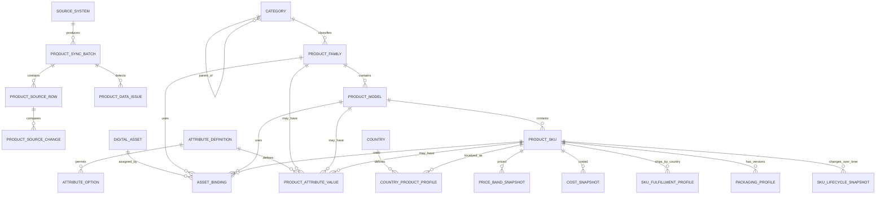
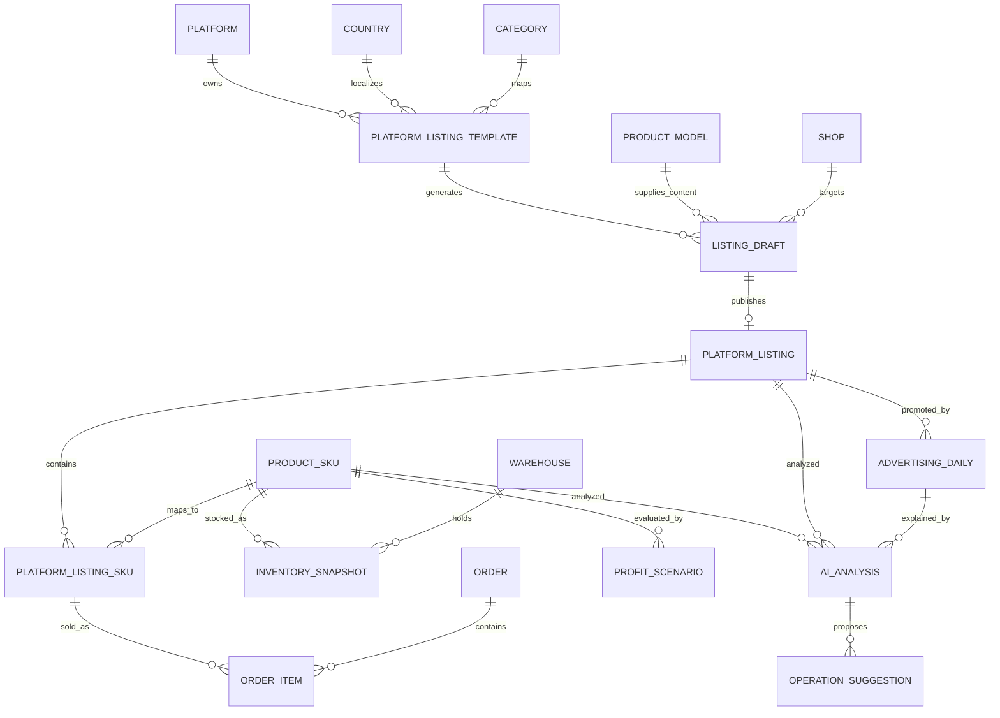
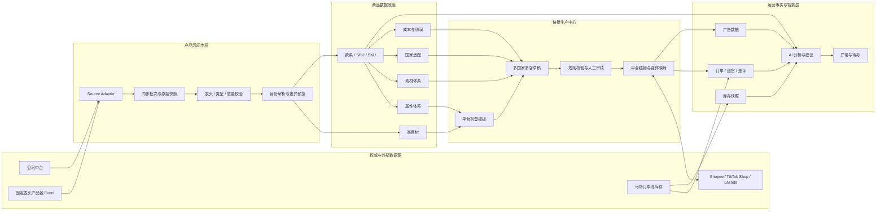

# Commerce Ops 产品包模块业务模型设计（G0）

日期：2026-07-20  
状态：DESIGN COMPLETE / NOT IMPLEMENTED  
数据源：公司中台导出的固定表头产品包  
本阶段边界：只进行业务模型与模块边界设计，不开发代码、不创建数据库表、不迁移或修改业务数据

## 0. 结论摘要

产品包应成为 Commerce Ops 的**商品事实主数据源**，但不能把一张 Excel 直接当作未来所有业务表。合理结构是：

```text
公司中台产品包（权威来源）
        ↓
原始快照与同步批次（可追溯）
        ↓
校验、标准化与身份解析（不静默修正）
        ↓
类目 → 款系 → 主商品/SPU → SKU
        ↓
属性、素材、国家适配、刊登模板、成本利润
        ↓
平台链接、订单、库存、广告、AI 分析
```

本设计作出六项关键决策：

1. **公司中台是产品事实的唯一权威来源。** Commerce Ops 可以补充运营资料，但不能反向覆盖中台字段。
2. **Excel 导入和未来中台爬取共用同一个同步入口。** 两者只是在采集方式上不同，后续校验、标准化、入库和差异处理必须一致。
3. **`款号` 不能直接等同于唯一 SPU。** 当前样本存在占位款号、一款号多款名和一款号多主 SKU，必须保留独立内部 ID 与来源映射。
4. **`SKU` 是当前产品包最可靠的行级业务键。** 当前 262 条记录的 SKU 全部唯一；未来仍以“来源系统 + SKU”作为唯一约束，内部关系使用 UUID。
5. **产品事实与运营事实分层。** 仓存、汇率、成本、建议价、平台链接、订单、广告都是会随时间变化的快照或事实，不能塞进一张静态商品表。
6. **确定性计算由规则引擎完成。** 成本、体积重、控价和利润不交给大模型；AI 只负责属性提取、内容生成、分析解释和建议。

## 1. G0 范围

### 1.1 本设计覆盖

- 产品包固定字段的盘点、归属和标准化方式。
- 一级品类、二级品类、款号/款名、主 SKU、SKU 的关系。
- 产品通用属性与类目属性体系。
- 图片、视频、说明书等素材体系。
- Shopee、TikTok Shop、Lazada 刊登模板体系。
- 国家、平台、店铺之间的差异化字段。
- 成本、建议售价、控价和利润模型。
- 与订单、库存、广告、竞品和 AI 分析的数据关联。
- Excel 全量导入到未来中台增量同步的演进路径。
- 后续开发阶段与验收边界。

### 1.2 本阶段不做

- 不开发产品包页面、导入程序或中台采集程序。
- 不创建 SQLite 或 PostgreSQL 表。
- 不迁移或切换生产数据库。
- 不修改现有竞品、广告、马帮或 DeepSeek 业务逻辑。
- 不自动刊登商品，不调用平台写接口。
- 不生成或加工商品图片、标题、详情和价格。
- 不把本设计中的逻辑实体视为已经存在的生产表。

## 2. 当前产品包审计

### 2.1 文件基线

| 项目 | 结果 |
|---|---:|
| 工作表 | `产品包` 1 张 |
| 表头 | 34 个，单行固定表头 |
| 数据行 | 262 |
| 周期 | `202606` |
| 国家 | 泰国 |
| 一级品类 | 3C 数码 |
| 二级品类 | 6 个 |
| 文件大小 | 78,619 bytes |
| SHA-256 | `4446FB1D1E46F9D7CEA54810D08CE796D912F00D1ED61DDE84D67BD2A0D2F45E` |

该文件只是一批真实样本，不代表未来所有国家和类目的完整取值范围。因此模型不能根据“当前只有泰国和 3C 数码”建立单国家或单类目特例。

### 2.2 字段完整度与唯一性

| 观察项 | 结果 | 设计影响 |
|---|---:|---|
| SKU | 262 条非空，262 个唯一值 | 可作为来源行级业务键 |
| 主 SKU | 246 条非空，203 个唯一值，16 条缺失 | 不能强制每条 SKU 都已有主 SKU；需待映射状态 |
| 款号 | 151 个唯一值 | 不是唯一 SPU，需内部款系 ID |
| 款名 | 158 个唯一值 | 名称可重复、可修改，不能作为主键 |
| 商品名称 | 219 个唯一值 | 属于来源展示事实，不作为身份键 |
| 销售规格 | 3 条缺失 | 保留原文并允许结构化提取 |
| 单品尺寸 | 11 条缺失 | 需质量提示，不阻止原始快照入库 |
| 净重 | 11 条缺失 | 影响物流与利润计算，刊登前应阻断 |
| 毛重及外箱字段 | 各 7 条缺失 | 影响体积重与大件物流判断 |
| 连带率 | 262 条全部为空 | 当前不可用于经营决策，保持空值语义 |

### 2.3 当前样本暴露的身份问题

1. `3C0000` 出现 12 行，覆盖 11 个款名、12 个主 SKU 和 4 个二级品类，明显包含历史占位或未归类数据。
2. `3C9999` 出现 9 行，覆盖 5 个款名和 2 个二级品类，也不能视为一个真实款系。
3. 同一款号通常可以对应多个主 SKU，例如一个“吉他”款系下存在多个主 SKU，这是合理的一对多关系。
4. 少量主 SKU 同时关联历史占位款号和正式款号，说明来源身份可能经历过修订。
5. 16 条缺少主 SKU 的记录主要不能安全并入现有 SPU，必须先进入“待身份确认”状态，禁止系统猜测。

因此，产品主数据不能使用 `款号`、`款名`、`主SKU` 任一单字段作为数据库主键。内部 ID 必须稳定，来源字段作为可版本化的业务标识与别名。

### 2.4 当前样本暴露的计算问题

- 四档建议价与“销售成本国家币 ÷ (1 - 目标毛利率)”一致，当前 262 行均通过 20%、25%、35%、45% 档位校验。
- `国家汇率` 存在两种报价方向：244 行使用 `4.75` 并以人民币成本乘汇率，18 行使用约 `0.210527` 并以人民币成本除汇率。
- 因此不能只存一个无语义的 `exchange_rate` 后自行重算；必须同时记录报价币种、基准币种、报价方向和来源计算结果。
- `销售成本国家币` 与四档价是中台权威快照。汇率口径未确认前，Commerce Ops 不应静默覆盖这些值。

### 2.5 产品包当前没有提供的能力

产品包没有图片、视频、说明书、平台商品 ID、平台类目、平台属性、国家合规、店铺链接、广告、订单和 AI 分析字段。这些不是源文件缺陷，而是 Commerce Ops 需要在产品主数据之外建设的运营扩展层。

## 3. 数据权威与字段所有权

### 3.1 五类字段所有权

| 所有权 | 典型字段 | 更新来源 | Commerce Ops 是否可覆盖 |
|---|---|---|---|
| `source_authoritative` | SKU、主 SKU、品类、款号、款名、规格、尺寸、重量、来源成本 | 公司中台产品包 | 否 |
| `source_snapshot` | 周期、仓存、汇率、当地币成本、四档价、月龄 | 每次中台快照 | 否，只能新增版本 |
| `commerce_enrichment` | 结构化属性、FAQ、卖点、素材标签、本地化文案 | 运营人员或 AI 辅助 | 可以，需版本与审核 |
| `platform_observed` | 平台商品 ID、平台 SKU ID、链接状态、平台售价、广告对象 | 平台 API、报表或采集 | 不覆盖来源事实 |
| `rule_computed` | 体积重、到岸成本、控价、贡献利润、异常标签 | 规则引擎 | 可重算，需保留规则版本 |

### 3.2 更新优先级

```text
产品物理与供应链事实：公司中台 > 人工修正申请 > AI 提取
平台实际状态：平台返回 > 人工备注
运营内容：已审核人工内容 > 已审核 AI 草稿 > 未审核草稿
成本利润：规则引擎 + 有效期内参数，不采用 AI 自由计算
```

如果运营发现中台字段错误，Commerce Ops 只创建“数据纠错工单”，保留临时备注；不得直接把来源字段改成另一套真相。

## 4. 产品主数据分层

### 4.1 推荐层级

```text
一级品类
  └─ 二级品类
       └─ 款系 Product Family（款号 + 款名）
            └─ 主商品 Product Model / SPU（主 SKU）
                 └─ 可销售 SKU（SKU）
                      ├─ 国家适配
                      ├─ 仓库库存快照
                      ├─ 成本与建议价快照
                      └─ 平台刊登 SKU
```

### 4.2 各层业务语义

| 层级 | 业务含义 | 来源字段 | 主键策略 |
|---|---|---|---|
| 一级品类 | 大类经营归属 | 一级品类 | 内部 UUID；来源名称做版本化映射 |
| 二级品类 | 运营与属性模板的主要边界 | 二级品类 | 内部 UUID + 父类 ID |
| 款系 | 同一产品系列或款式家族 | 款号、款名 | 内部 UUID；不直接使用款号为主键 |
| 主商品/SPU | 可以共享核心商品资料的一组 SKU | 主 SKU | 内部 UUID + 来源主 SKU 别名 |
| SKU | 可销售、可库存和可定价的最小单位 | SKU | 内部 UUID + `source_system + source_sku_code` 唯一 |

### 4.3 关系规则

1. 一个一级品类有多个二级品类；二级品类只能有一个有效父级，但允许保留历史父级版本。
2. 一个二级品类有多个款系；跨二级品类的同款号不自动合并。
3. 一个款系可以包含多个主商品/SPU，这与当前样本“一款号多主 SKU”一致。
4. 一个主商品/SPU 可以包含多个 SKU；SKU 只能有一个当前有效主商品归属。
5. 缺少主 SKU 的来源记录进入“待归组 SKU”，暂时以 SKU 自身维持稳定身份。
6. 占位款号按“二级品类 + 款号 + 款名”拆成候选款系，并标记 `identity_confidence = low`，不得把所有 `3C0000` 合并。
7. 来源关系改变时不重写历史订单、库存和广告事实；只更新当前主数据关系并记录有效期。

### 4.4 身份与别名

每个产品实体都需要内部稳定 ID，并维护来源标识：

| 标识 | 用途 |
|---|---|
| `product_id` / `sku_id` | Commerce Ops 内部 UUID，用于所有关联 |
| `source_system` | `company_middle_platform` 等来源代码 |
| `source_sku_code` | 产品包 `SKU` |
| `source_master_sku_code` | 产品包 `主SKU` |
| `source_style_code` | 产品包 `款号` |
| `source_style_name` | 产品包 `款名` |
| `mabang_sku` | 马帮库存和订单中的 SKU 映射 |
| `platform_item_id` | 平台商品/链接 ID |
| `platform_sku_id` | 平台变体 ID |

任何映射都应记录 `mapping_method`、`confidence`、`verified_by`、`verified_at` 和有效期。系统不能仅凭相似名称自动建立高置信关系。

## 5. 产品包逻辑数据模型

### 5.1 来源与同步层

| 逻辑实体 | 作用 | 关键字段 |
|---|---|---|
| `source_system` | 注册公司中台、Excel 等来源 | source_system_id、code、authority_level |
| `product_sync_batch` | 每次 Excel 导入或中台采集批次 | batch_id、source、mode、period、file_id、header_fingerprint、source_hash、started_at、status |
| `product_source_row` | 完整保留每一行来源值 | row_id、batch_id、source_sku、warehouse、raw_payload、row_hash、parse_status |
| `product_source_change` | 记录相邻批次字段差异 | entity_id、field_name、old_value、new_value、change_type |
| `product_data_issue` | 缺失、冲突、异常和人工处理状态 | issue_code、severity、entity_id、field_name、status、resolution |
| `product_source_alias` | 记录来源编码、历史编码和内部实体映射 | entity_type、entity_id、source_system、source_key、valid_from、valid_to |

### 5.2 商品主数据层

| 逻辑实体 | 作用 | 关键字段 |
|---|---|---|
| `category` | 统一保存一级与二级品类树 | category_id、parent_id、level、source_name、status、validity |
| `product_family` | 款号/款名层级的产品系列 | family_id、category_id、source_style_code、source_style_name、identity_status |
| `product_model` | 主 SKU 对应的 SPU/主商品 | product_id、family_id、source_master_sku、canonical_name、status |
| `product_sku` | 最小可销售与库存单位 | sku_id、product_id、source_sku、source_name、is_gift、status、source_created_at |
| `sku_lifecycle_snapshot` | 周期性 SKU 状态与月龄 | sku_id、period、source_status、launch_date、source_age_months |
| `packaging_profile` | 单品和外箱物流参数 | sku_id、version、dimensions、net/gross weight、carton dimensions、units_per_carton |
| `sku_fulfillment_profile` | 国家和 SKU 的出货特性 | sku_id、country_id、shipping_mode、planned_warehouse、effective_dates |

### 5.3 运营扩展层

| 逻辑实体 | 作用 |
|---|---|
| `attribute_definition` | 定义属性类型、单位、作用层级和是否参与 SKU 区分 |
| `attribute_option` | 枚举属性的标准选项与多语言标签 |
| `product_attribute_value` | 款系、SPU 或 SKU 的结构化属性值 |
| `digital_asset` | 图片、视频、说明书等素材元数据 |
| `asset_binding` | 素材与款系、SPU、SKU、国家、平台之间的用途关系 |
| `country_product_profile` | 国家准入、本地化、物流和售后差异 |
| `platform_listing_template` | 平台 × 国家 × 平台类目的字段模板 |
| `listing_draft` | 从产品事实和模板生成、待审核的刊登草稿 |
| `platform_listing` | 已发布的平台商品链接 |
| `platform_listing_sku` | 平台变体与内部 SKU 的桥接 |
| `cost_snapshot` | 来源成本和当地币成本的周期快照 |
| `price_band_snapshot` | 公司中台四档建议价快照 |
| `profit_scenario` | 平台、国家、店铺和活动场景下的利润测算 |

## 6. ER 关系图

### 6.1 产品主数据 ER



### 6.2 刊登与经营事实 ER



## 7. 当前 34 个中台字段映射

### 7.1 身份、分类与生命周期

| 中台表头 | 目标逻辑实体/字段 | 类型 | 规则与质量校验 |
|---|---|---|---|
| 周期 | `product_sync_batch.period`；各快照 `period` | `YYYYMM` | 必填；同批次一致；作为快照有效期，不覆盖历史 |
| SKU | `product_sku.source_sku` | 文本 | 必填；`source_system + SKU` 唯一；禁止自动改写大小写 |
| 商品名称 | `product_sku.source_name` | 文本 | 必填；保留原名；运营标准名另存 |
| 主SKU | `product_model.source_master_sku` | 文本/空 | 允许缺失；缺失时进入待归组，不猜测 |
| 国家 | `country.source_name` 与国家映射 | 枚举 | 必填；映射 ISO 国家代码；保留来源原文 |
| 一级品类 | `category(level=1).source_name` | 文本 | 必填；不得只按名称跨来源合并 |
| 二级品类 | `category(level=2).source_name` | 文本 | 必填；必须有一级父类 |
| 创建日期 | `product_sku.source_created_at` | 日期 | 严格解析；无法解析则记录质量问题 |
| 新款年月 | `sku_lifecycle_snapshot.launch_date` | 日期 | 当前实际值为完整日期；展示年月由日期派生 |
| 新款月龄 | `sku_lifecycle_snapshot.source_age_months` | 整数 | 保存来源值，同时按周期派生校验值 |
| 赠品 | `product_sku.is_gift_source` | 三态布尔 | `是=true`；空值是 unknown，不自动当作 false |
| SKU状态 | `sku_lifecycle_snapshot.source_status` | 来源枚举 | 保存原值；映射正常销售、清仓、待开发等内部状态 |
| 款号 | `product_family.source_style_code` | 文本 | 不是主键；占位值和跨品类冲突必须告警 |
| 款名 | `product_family.source_style_name` | 文本 | 与款号共同辅助分组；保留历史名称版本 |

### 7.2 规格与包装

| 中台表头 | 目标逻辑实体/字段 | 类型 | 规则与质量校验 |
|---|---|---|---|
| 销售规格 | `product_sku.source_sales_spec` | 原始文本 | 原文权威；AI 提取值进入独立属性层并需置信度 |
| 单品尺寸 | `packaging_profile.source_item_size_text` | 原始文本 | 保留原文；解析长宽高和单位时不覆盖原文 |
| 单品净重g | `packaging_profile.net_weight_g` | 数值 | 应大于 0；用于商品事实与物流计算 |
| 单品毛重g | `packaging_profile.gross_weight_g` | 数值 | 应不小于净重；缺失时禁止发布依赖物流计费的草稿 |
| 外箱长cm | `packaging_profile.carton_length_cm` | 数值 | 应大于 0；保留小数 |
| 外箱宽cm | `packaging_profile.carton_width_cm` | 数值 | 应大于 0；保留小数 |
| 外箱高cm | `packaging_profile.carton_height_cm` | 数值 | 应大于 0；保留小数 |
| 每箱数量 | `packaging_profile.units_per_carton` | 整数 | 应大于 0；非整数时进入人工确认 |
| 出货方式 | `sku_fulfillment_profile.shipping_mode_source` | 来源枚举 | 当前包含走柜、中转、散货；不写死为全部可能值 |

### 7.3 仓库与库存

| 中台表头 | 目标逻辑实体/字段 | 类型 | 规则与质量校验 |
|---|---|---|---|
| 仓库 | `warehouse.source_warehouse_name` | 文本 | 映射内部 warehouse_id；名称不是永久主键 |
| 仓存 | `inventory_snapshot.on_hand_quantity` | 数值 | 周期快照；不能存为 SKU 当前静态属性 |
| 规划仓 | `sku_warehouse_plan.is_planned` | 三态布尔 | 保留来源语义；与实际库存分离 |

### 7.4 成本、汇率与建议价

| 中台表头 | 目标逻辑实体/字段 | 类型 | 规则与质量校验 |
|---|---|---|---|
| 销售成本人民币 | `cost_snapshot.source_cost_cny` | 高精度金额 | 保存原始精度与周期，不使用浮点货币计算 |
| 国家汇率 | `cost_snapshot.source_fx_rate` | 高精度数值 | 同时记录基准币、报价币和乘除方向；当前数据存在双方向 |
| 销售成本国家币 | `cost_snapshot.source_cost_local` | 高精度金额 | 中台权威快照；币种由国家配置明确 |
| 1档价(20%) | `price_band_snapshot.band_20` | 高精度金额 | 保存来源值；规则校验为成本/(1-20%) |
| 2档价(25%) | `price_band_snapshot.band_25` | 高精度金额 | 保存来源值；规则校验为成本/(1-25%) |
| 3档价(35%) | `price_band_snapshot.band_35` | 高精度金额 | 保存来源值；规则校验为成本/(1-35%) |
| 4档价(45%) | `price_band_snapshot.band_45` | 高精度金额 | 保存来源值；规则校验为成本/(1-45%) |
| 连带率 | `sku_metric_snapshot.attachment_rate_source` | 可空比例 | 当前全空；空值不等于 0，不参与评分 |

### 7.5 原始值保留原则

所有字段都需要同时满足：

- 原始行 JSON 或等价结构可追溯。
- 标准化字段可查询、关联和计算。
- 标准化失败不丢弃原始值。
- 任何人工修正都不覆盖来源快照，而是新增纠错记录或运营扩展值。
- 新批次覆盖“当前视图”时，旧批次仍可按周期恢复。

## 8. 产品属性体系

### 8.1 混合模型，不采用纯大宽表或纯 EAV

产品属性采用“核心强类型字段 + 类目动态属性”混合模型：

- 经常筛选、排序、计算和关联的字段使用强类型列，例如重量、包装尺寸、是否赠品。
- 类目差异较大的规格使用动态属性定义，例如显示器刷新率、家具承重、家纺支数。
- 中台 `销售规格` 和 `单品尺寸` 原文永久保留，结构化结果只是派生数据。
- PostgreSQL 未来可以使用 `jsonb` 保存低频扩展，但必填、计算和高频检索字段不能只藏在 JSON 中。

### 8.2 属性定义字段

| 字段 | 含义 |
|---|---|
| attribute_code | 稳定代码，例如 `material`、`load_capacity_kg` |
| name_zh | 中文名称 |
| value_type | text、number、boolean、enum、multi_enum、date |
| unit_dimension | 长度、重量、容量、功率等量纲 |
| canonical_unit | 标准单位，例如 cm、g、kg |
| applies_to | 款系、SPU、SKU 中的哪一层 |
| category_scope | 哪些类目可使用 |
| variant_defining | 是否参与区分 SKU |
| required_for_listing | 哪些平台/国家刊登必填 |
| required_for_customer_service | 是否是客服关键事实 |
| source_priority | 中台、人工、AI 的取值优先级 |
| validation_rule | 范围、格式、枚举和互斥规则 |
| effective_version | 属性定义版本 |

### 8.3 属性分组

1. **身份属性**：品牌、系列、型号、款式、颜色、尺寸。
2. **物理属性**：单品尺寸、净重、毛重、材质、承重、容量。
3. **包装物流属性**：外箱尺寸、箱规、包裹数、是否拆装、易碎、超长超重。
4. **功能属性**：功率、电压、刷新率、接口、蓝牙版本、防水等级等。
5. **安装使用属性**：安装难度、所需工具、适用场景、保养方式。
6. **合规属性**：认证、插头标准、警示语、禁限售信息。
7. **客服属性**：包装清单、是否含配件、FAQ、售后风险。
8. **运营属性**：引流款、利润款、清仓款、内容难度、主推国家；这些是 Commerce Ops 扩展，不能回写中台事实。

### 8.4 AI 属性提取规则

- AI 可以从销售规格、说明书和图片 OCR 中提取候选属性。
- 每个候选值记录来源片段、模型、提示词版本、置信度和生成时间。
- 数值、尺寸、材质、配件和承诺类字段默认需要人工审核。
- 审核后值进入运营扩展层，不覆盖中台原文。
- 中台后续提供结构化字段时，中台值优先，并生成冲突提示。

## 9. 图片与素材体系

### 9.1 素材分层

| 层级 | 说明 | 示例 |
|---|---|---|
| 来源原件 | 公司中台或供应商提供，不做覆盖 | 白底图、原视频、说明书 |
| 标准母版 | 去重、校色、统一命名后的可复用素材 | 标准主图、尺寸图、安装图 |
| 本地化衍生 | 针对语言和国家生成 | 泰语尺寸图、马来语卖点图 |
| 平台衍生 | 按平台尺寸、比例和规则裁切 | Shopee 1:1、TikTok 视频封面 |
| 店铺版本 | 针对店铺定位的最终版本 | 店铺品牌角标、活动版主图 |

### 9.2 素材元数据

- `asset_id`：稳定 UUID。
- 文件类型、MIME、扩展名、字节大小、SHA-256。
- 宽高、时长、色彩空间、透明通道。
- 来源系统、来源 URL、来源文件 ID、版权状态。
- 素材用途：主图、白底图、场景图、尺寸图、细节图、安装图、视频、说明书。
- 绑定层级：款系、SPU、SKU；必要时绑定具体颜色或尺寸属性。
- 国家、语言、平台、店铺适用范围。
- 排序、封面标记、审核状态、禁用原因。
- 父素材 ID 与衍生操作，形成完整版本链。
- 创建者、AI 模型、审核者、有效期。

### 9.3 存储原则

- 文件本体进入统一文件存储或未来对象存储，数据库只存元数据和相对对象键。
- 不把图片、视频二进制直接塞入业务表。
- 使用 SHA-256 去重，但不能因为文件相同就丢失不同业务绑定关系。
- 删除采用停用和生命周期清理，不因 SKU 下架立即删除原素材。
- 任何 AI 改图都必须从可追溯原件派生，不覆盖来源原件。

### 9.4 素材完整度规则

按平台和类目定义“可刊登最低素材集”，例如：

- 至少 1 张可用主图。
- 大件商品必须有尺寸图、包装信息和安装说明。
- 多包裹商品必须展示包裹数量。
- 颜色/尺寸变体需要 SKU 级映射图。
- 有高频售后风险的商品需要对应说明素材。

## 10. 平台刊登模板体系

### 10.1 模板层级

```text
平台通用模板
  → 平台 × 国家模板
    → 平台 × 国家 × 平台类目模板
      → 店铺覆盖配置
        → 单次刊登草稿人工调整
```

模板匹配越具体优先级越高，但低层覆盖只能修改允许覆盖的运营字段，不能改产品物理事实。

### 10.2 模板组成

| 模板部分 | 内容 |
|---|---|
| 类目映射 | Commerce Ops 二级品类到平台类目 ID |
| 字段映射 | 内部属性到平台字段和属性 ID |
| 必填规则 | 平台、国家、类目下的必填字段 |
| 值转换 | 单位转换、枚举映射、长度限制、字符规范 |
| 标题模板 | 关键词槽位、品牌、核心规格和禁用词规则 |
| 描述模板 | 卖点、规格、包装、安装、售后和合规模块 |
| SKU 规则 | 变体轴、变体名、平台 SKU 编码规则 |
| 图片规则 | 数量、顺序、比例、分辨率、背景和语言 |
| 价格规则 | 日常价、活动价、最低控价和利润门槛 |
| 库存规则 | 可售库存、安全库存和同步策略 |
| 审核规则 | 哪些变化必须人工确认 |
| 发布策略 | 草稿、审核、发布、校验和回滚 |

### 10.3 刊登数据流程

```text
选择产品/SPU
→ 选择平台、国家和店铺
→ 检查产品事实完整度
→ 载入国家适配与平台类目模板
→ 生成本地化标题、描述、属性、图片和价格草稿
→ 规则校验
→ 人工审核
→ 创建平台草稿或发布
→ 回读平台 Item/Variation ID
→ 建立内部 SKU 映射
→ 跟踪上架结果与后续表现
```

### 10.4 平台链接身份

`platform_listing` 以 `platform + country + shop_id + platform_item_id` 唯一；`platform_listing_sku` 以平台变体 ID 唯一并关联内部 `sku_id`。URL 只是展示与访问字段，不作为永久身份键。

## 11. 国家差异字段

### 11.1 国家主数据

- ISO 国家代码、名称和默认语言。
- 币种、时区、日期格式和度量单位。
- 默认汇率报价方式和汇率来源。
- 税费口径、消费者保护和售后基础规则。
- 插头、电压、认证和标签规范。

### 11.2 商品国家适配

| 分组 | 字段示例 |
|---|---|
| 准入 | 是否可售、禁限售原因、所需认证、适用区域 |
| 本地化 | 当地产品名、卖点、FAQ、语言和禁用词 |
| 规格 | 插头、电压、本地尺寸表达、包装清单差异 |
| 物流 | 出货方式、包裹数、偏远区域、尺寸重量限制、时效 |
| 售后 | 保修期、退换条件、补件策略、安装支持 |
| 定价 | 当地币、成本版本、税费、控价和价格尾数规则 |
| 素材 | 本地化图片、视频、说明书和警示语 |

### 11.3 平台国家差异

国家规则与平台规则需要分开：

- 国家层回答“这个产品在当地能否卖、如何履约与售后”。
- 平台国家层回答“在 Shopee TH、TikTok Shop TH 或 Lazada TH 如何填写与发布”。
- 店铺层只处理店铺品牌、价格策略、安全库存和活动配置。

最终取值优先级：

```text
中台产品事实
→ 国家商品适配
→ 平台 × 国家模板
→ 店铺允许覆盖项
→ 单次刊登草稿
```

## 12. 成本与利润字段

### 12.1 成本分层

| 层级 | 字段 |
|---|---|
| 来源 SKU 成本 | 销售成本人民币、来源当地币成本、来源汇率、周期 |
| 采购与包装 | 采购价、包装、配件、质检、国内操作费 |
| 跨境物流 | 头程、报关、走柜/中转/散货、体积重、超尺寸附加费 |
| 当地履约 | 仓储、拣配、尾程、偏远、二次派送 |
| 平台费用 | 佣金、支付费、服务费、活动费、税费 |
| 获客费用 | 广告费、联盟佣金、达人佣金、样品成本 |
| 风险准备 | 退款、退货、破损、缺件、补发、汇率波动 |
| 店铺覆盖 | 店铺补贴、优惠券分摊、特殊仓储或运营成本 |

### 12.2 版本与适用范围

所有成本参数至少包含：

- `sku_id`、国家、平台、店铺和物流线路适用范围。
- 币种、含税口径、单位成本或比例费率。
- 生效开始和结束时间。
- 来源、维护人、审核状态和规则版本。
- 原始值与标准币换算值。

### 12.3 核心计算

```text
外箱体积 = 长 × 宽 × 高
体积重 = 外箱体积 ÷ 物流渠道体积系数
计费重 = max(实际毛重, 体积重)

到岸成本 = 来源成本 + 包装 + 头程 + 清关税费 + 仓储入库
履约后收入 = 商品实收 + 运费收入 - 平台费用 - 优惠分摊 - 税费
贡献利润 = 履约后收入 - 到岸成本 - 尾程 - 广告/联盟 - 售后风险准备
贡献利润率 = 贡献利润 ÷ 商品实收
```

具体公式由规则引擎和平台费率版本管理，金额使用高精度十进制。AI 可以解释利润变化，不负责最终金额计算。

### 12.4 中台四档价的定位

- 四档价是公司中台提供的建议售价基线，不是最终平台售价。
- 最终刊登价还需叠加平台费率、活动、广告、达人、税费和物流风险。
- 任何最终价格必须同时展示：中台建议档位、规则计算价格、最低控价、当前平台价和预计贡献利润。
- 价格低于控价或关键成本缺失时，禁止自动发布，只能进入人工审核。

## 13. 与现有及未来业务数据关联

### 13.1 统一身份桥

产品包模块提供 `sku_id` 和 `product_id`，其他模块通过桥接表关联：

```text
中台 SKU
↔ 内部 sku_id
↔ 马帮 SKU
↔ 平台 SKU ID
↔ 平台商品 Item ID / listing_id
↔ 广告推广对象
```

桥接应优先使用稳定 ID，名称和 URL 只作为辅助证据。映射失败时保留未匹配记录，不伪造关系。

### 13.2 订单

- `order_item` 关联 `platform_listing_sku` 和 `sku_id`。
- 订单必须保留成交时的标题、规格、价格、币种和成本快照，后续商品修改不能改写历史订单。
- 马帮 SKU 与产品包 SKU 完全匹配时可自动建立高置信映射；不匹配时进入映射队列。
- 退货、退款和差评最终都沿 `order_item → sku_id → product_id` 汇总到商品问题。

### 13.3 库存

- 产品包 `仓存` 是中台周期快照；马帮库存是更高频的业务库存来源，两者分别保存来源和时间。
- `inventory_snapshot` 以 `sku_id + warehouse_id + observed_at + source` 唯一。
- 不同来源的库存不直接相加；先定义可售、在途、锁定、未发货等口径。
- 广告和刊登模块只读取经过规则计算的“可推广库存”，不直接使用任一原始库存字段。

### 13.4 广告

- 广告记录先关联平台 Item/Variation ID，再映射 `listing_id` 和 `sku_id`。
- 只有完成映射的广告数据才能做 SKU、款系和品类利润分析。
- 广告异常输出证据、阈值和建议，不修改产品包来源字段。
- SKU 缺货、清仓或待开发状态应成为广告异常规则的输入。

### 13.5 竞品与机会分析

- 竞品链接不是内部商品，不进入产品主数据。
- 竞品分析结果可以关联内部 `product_id` 或“候选机会商品”，用于比较价格带、卖点和素材。
- 关键词 TOP5、链接抓取和 DeepSeek 输出都保留来源时间与置信度。
- 当机会产品转为公司货盘商品时，通过明确的人工确认建立 `opportunity_id → product_id` 关系。

### 13.6 AI 分析

每次 AI 分析至少记录：

- `analysis_id`、分析类型、实体类型和实体 ID。
- 输入所引用的产品快照、库存快照、广告批次和竞品抓取批次。
- 模型、提示词版本、参数、开始结束时间和状态。
- 输出、证据引用、置信度、人工审核结果。
- 后续动作及动作效果，用于判断建议是否有效。

AI 不能直接修改中台事实；只能生成候选属性、文案、诊断、建议或任务。

## 14. 同步与实时更新设计

### 14.1 统一同步管道

```text
当前：中台导出 Excel
未来：中台登录采集 / API / 定时下载
          ↓
统一 Source Adapter
          ↓
批次登记与原始快照
          ↓
固定表头校验、类型校验、行级哈希
          ↓
身份解析与数据质量报告
          ↓
差异预览
          ↓
确认应用到当前主数据视图
```

### 14.2 固定表头治理

- 为 34 个表头生成有顺序的 `header_fingerprint`。
- 表头完全一致才进入标准解析；新增、删除、改名或重复表头均停止自动应用。
- 表头变化只进入“Schema 变更待审核”，不能靠位置猜测。
- 允许列顺序是否变化需要业务确认；首版建议顺序也纳入指纹。
- 原始文件和文件 SHA-256 进入现有文件管理体系，避免重复导入同一文件。

### 14.3 幂等与差异

| 场景 | 处理 |
|---|---|
| 同一文件重复导入 | 根据文件哈希识别，返回已有批次，不重复写入 |
| 同周期同 SKU 同仓库重复行 | 标记冲突，拒绝自动选择其中一行 |
| 新 SKU | 创建内部 SKU 和来源映射 |
| 已有 SKU 字段变化 | 新增快照与字段差异，更新当前视图 |
| SKU 本批次未出现 | 标记 `not_seen`；经连续多个完整批次确认后再停用 |
| 款号或主 SKU 变化 | 保留历史映射，进入身份关系审核 |
| 运营扩展已存在 | 更新中台字段，不覆盖本地素材、文案和审核结果 |

### 14.4 全量与增量同步

- Excel 产品包按“完整快照”处理。
- 未来中台采集如果能提供更新时间和稳定来源 ID，可按增量处理。
- 增量同步仍需定期全量对账，避免采集漏页或中台删除未被发现。
- 采集任务必须记录游标、页码、来源更新时间、重试和失败行。
- 实时更新不等于实时发布；中台变化先经过质量校验，再影响刊登和运营建议。

### 14.5 冲突处理

```text
来源事实变化
→ 自动更新当前来源视图
→ 判断是否影响已发布链接
→ 生成影响清单
→ 低风险字段自动刷新草稿
→ 尺寸、重量、成本、状态等高风险字段要求人工确认
→ 确认后再创建平台修改任务
```

## 15. 数据质量与状态机

### 15.1 批次状态

`received → validating → preview_ready → approved → applying → completed`

异常状态：`rejected_header`、`validation_failed`、`partially_applied`、`failed`、`cancelled`。

### 15.2 商品资料状态

| 状态 | 含义 |
|---|---|
| `source_only` | 已有中台事实，尚未运营补充 |
| `identity_review` | 款系、主 SKU 或 SKU 关系需要人工确认 |
| `incomplete` | 缺少刊登所需事实或素材 |
| `ready_for_listing` | 事实、属性和素材达到模板要求 |
| `listing_draft` | 已生成平台草稿，待审核 |
| `active` | 至少存在一个有效平台链接 |
| `clearance` | 中台清仓状态，限制新增推广 |
| `inactive` | 来源停用或运营停用，但保留历史 |

### 15.3 首批质量规则

- SKU 空值或同来源重复：阻断批次应用。
- 一级或二级品类缺失：阻断该行标准化。
- 款号为已知占位值：告警并要求身份确认，不阻断原始快照。
- 主 SKU 缺失：创建待归组 SKU，不允许自动批量刊登。
- 毛重小于净重、箱规非正数：高风险告警。
- 当地币成本与汇率口径不明确：保留来源结果，禁止重算覆盖。
- 四档价公式不一致：成本质量告警。
- 清仓或待开发 SKU：默认不可自动新建广告或批量刊登。
- 连带率为空：显示“暂无数据”，不能显示 0%。

## 16. 模块架构图



## 17. 模块边界与概念接口

本节只定义业务能力，不定义当前代码或具体 HTTP 路由。

### 17.1 产品包同步

- 上传/登记来源文件。
- 校验固定表头并创建预览批次。
- 展示新增、更新、未出现、冲突和无变化数量。
- 查看行级错误和字段级差异。
- 人工确认后应用批次。
- 查询批次历史、来源文件和回滚视图。

### 17.2 产品主数据

- 按国家、品类、款系、主 SKU、SKU、状态和仓库查询。
- 查看来源原文、当前标准值、历史版本和质量问题。
- 处理待归组 SKU、款号占位和来源别名。
- 查看某个 SKU 的属性、素材、成本、库存、链接和经营表现。

### 17.3 刊登准备

- 评估某产品在目标平台/国家/店铺的资料完整度。
- 返回缺少字段、缺少素材、合规风险和价格风险。
- 生成刊登草稿并保留模板与输入快照版本。
- 人工审核后创建发布任务。

### 17.4 下游查询契约

产品包模块对其他模块提供稳定的：

- `product_id`、`sku_id`、`category_id`。
- 来源 SKU、主 SKU、款号和别名查询。
- 当前来源事实与指定周期快照。
- 产品到平台链接、马帮 SKU 和仓库的映射。
- 数据完整度、来源更新时间和质量状态。

## 18. 未来开发拆分路线

每个阶段都应保持 SQLite 为当前生产数据源，直到另行批准 PostgreSQL 正式切换。新模块应遵循已有 Provider/Repository 合同，并在 SQLite 与 PostgreSQL 演练库上做兼容验证。

### G1：产品包只读导入与质量预览

目标：证明固定表头产品包能够安全、幂等地进入系统，不直接影响其他业务。

交付：

- 产品包文件登记与 SHA-256 去重。
- 34 列严格表头验证。
- 批次、原始行、行级哈希和质量问题模型。
- 导入预览：新增、变化、冲突、缺失、无变化。
- 当前样本的 262 行可重复导入且不产生重复记录。
- 不提供自动应用中台变化到平台链接的能力。

验收重点：原文件不变、重复导入幂等、占位款号和缺失主 SKU 被识别、来源值可完整回放。

### G2：类目、款系、SPU 与 SKU 主数据

目标：建立可查询、可追溯的统一商品身份。

交付：

- 类目树、款系、主商品/SPU、SKU 和来源别名。
- 身份冲突处理页面与人工确认。
- 产品列表、产品详情和历史差异。
- SKU 到马帮库存 SKU 的映射入口。
- 中台权威字段与运营扩展字段的权限边界。

验收重点：`款号` 不被误当唯一 SPU，缺失关系不被猜测，历史关系可追溯。

### G3：属性与素材中心

目标：把产品包原文转化为客服和刊登可用的结构化知识。

交付：

- 核心强类型属性与类目动态属性定义。
- 销售规格和尺寸原文的 AI 候选提取与人工审核。
- 图片、视频、说明书元数据和绑定关系。
- 素材版本、语言、国家、平台和 SKU 适用范围。
- 产品资料完整度评分。

验收重点：AI 不覆盖来源事实，物理参数需要证据与审核，文件本体仍由统一文件系统管理。

### G4：国家适配、刊登模板与成本利润

目标：让一套产品事实能够安全地产生多平台、多国家、多店铺草稿。

交付：

- 国家商品适配与平台国家模板。
- 平台类目、属性和变体映射。
- 中台成本与四档价快照。
- 平台费率、物流、广告和售后风险参数。
- 利润场景、最低控价和刊登阻断规则。
- 多店刊登草稿与人工审核，不直接全自动发布。

验收重点：同一 SKU 在不同平台国家可以有不同内容和价格，但物理事实保持一致。

### G5：订单、库存、广告与 AI 关联

目标：形成“商品 → 链接 → 流量 → 订单 → 利润 → 售后”的经营闭环。

交付：

- 马帮 SKU、平台 Item/Variation 与内部 SKU 桥接。
- 订单明细、库存快照、广告记录的产品归因。
- 商品维度经营摘要和异常规则。
- AI 分析输入快照、输出、建议和动作结果追踪。
- 无法映射记录的人工处理队列。

验收重点：映射有证据与置信度，历史订单不随商品主数据变化，广告和利润可以追到 SKU。

### G6：中台增量同步

目标：在 Excel 全量导入稳定后，将数据获取方式升级为定时同步。

交付：

- 中台采集适配器或官方接口适配器。
- 游标、分页、重试、限速、登录失效和执行记录。
- 增量同步与定期全量对账。
- 高风险变化影响分析与通知。
- 中台字段变化后生成平台更新任务，而非直接改链接。

验收重点：采集方式更换不改变下游模型，断点续传不重复，登录失败不污染当前主数据。

### G7：批量刊登与运营闭环

目标：在模板、利润、库存和审核规则稳定后提高一人多店产能。

交付：

- 多平台、多国家、多店铺批量草稿。
- 平台发布、回读、校验、失败重试和回滚。
- 商品上架后 7/14/30 天表现跟踪。
- 异常待办、动作确认和效果复盘。
- 活动、联盟、达人和内容模块接入统一商品身份。

验收重点：先人工审批、再受控自动化；任何发布动作可追溯、可停止、可复查。

## 19. G1 开发前的业务确认项

以下问题不影响 G0 设计完成，但必须在 G1 Schema 和导入规则冻结前确认：

1. `主SKU` 在公司中台中的正式定义，是否等同于 SPU/母 SKU。
2. `款号` 的业务定义，以及 `3C0000`、`3C9999` 是否是明确占位值。
3. 缺少主 SKU 的 16 条数据是配件、耗材、赠品还是历史脏数据。
4. `国家汇率` 两种方向的正式口径，以及是否可以由 SKU 前缀识别。
5. `新款年月` 为什么导出为完整日期，月龄应以哪个日期和周期计算。
6. `赠品` 空值是否表示“否”还是“未维护”。
7. `规划仓` 的正式业务语义，以及是否可能出现“否”或多个规划仓。
8. `仓存` 是实物库存、可用库存还是中台定义的其他库存口径。
9. `销售成本人民币` 已包含哪些费用，是否是到岸成本。
10. 四档价是建议零售价、活动价还是内部价格线，是否包含平台费率。
11. `连带率` 的计算口径与未来数据来源。
12. 未来中台采集能否获得稳定产品 ID、SKU 更新时间和删除/停用标识。

## 20. G0 验收结论

G0 的业务模型已经覆盖：

- 产品包数据模型。
- 一级品类、二级品类、款系、主 SKU/SPU 与 SKU 关系。
- 产品属性与素材体系。
- 平台刊登模板与国家差异。
- 成本利润字段和规则边界。
- 与订单、库存、广告、竞品和 AI 分析的关联。
- Excel 导入到未来中台实时更新的同步路径。
- ER 图、模块架构图和 G1-G7 开发拆分。

最终定位是：

> 产品包不是一个“上传 Excel 后展示表格”的页面，而是 Commerce Ops 的商品身份、事实、素材、刊登和经营归因底座。公司中台负责告诉系统“商品是什么”，Commerce Ops 负责在不篡改事实的前提下回答“这个商品在哪里卖、如何卖、赚不赚钱、出了什么问题以及下一步做什么”。
