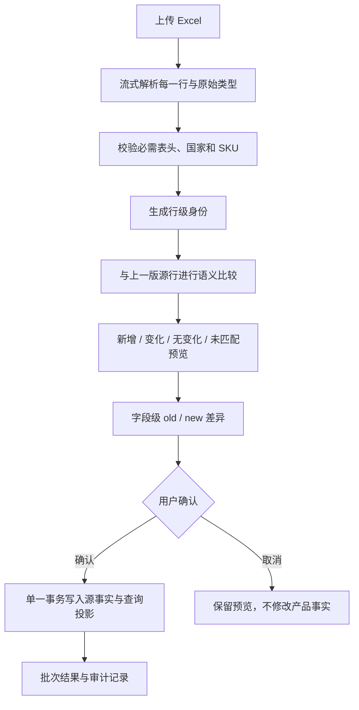

# 产品包一比一无损导入改造与核验报告

## 1. 结论

原导入器先按“国家 + SKU”聚合 Excel 行，再要求同组内商品名称、类目、规格、状态等产品事实一致。这与真实产品包口径冲突：同一个国家和 SKU 可以有多个仓库，仓库行之间也允许保留不同的业务事实。因此 `COUNTRY_SKU_FACT_CONFLICT` 会把合法源数据误判为阻断，并在预览层丢失源行身份。

本次已将导入模型调整为：

```text
Excel 每一行
  -> 独立导入证据 product_import_rows
  -> 确认后独立源事实 product_package_rows
  -> 可选查询投影 product_skus / product_inventory_snapshots
```

真实文件和 103,533 行完整产品包均已在隔离数据库验证一比一落库；正式数据库仅应用迁移并重新生成预览，没有执行全量正式导入。

## 2. 行级身份

每条源行使用以下技术身份匹配上一版源数据：

```text
标准化国家 + 标准化 SKU + 标准化仓库 + row_occurrence
```

- `row_occurrence` 按同一文件中的出现顺序从 1 开始。
- 相同国家、SKU、仓库重复出现时，每一行仍独立保存。
- 技术身份不改写国家、SKU、仓库或任何原始字段。
- 不同国家的相同 SKU 是不同产品投影。
- 本次文件未出现、但历史已存在的源行默认保留，不自动删除。

## 3. 数据模型

### 3.1 `product_package_rows`

这是当前版本的产品包源事实表，一条 Excel 行对应一条记录。

主要字段：

- 身份：`id`、`source_row_key`、`product_key`、`country_normalized`、`sku_normalized`、`warehouse_normalized`、`row_occurrence`
- 来源：`import_batch_id`、`source_row_number`、`first_seen_batch_id`、`latest_batch_id`、`latest_import_row_id`
- 完整证据：`raw_payload_json`、`raw_types_json`、`normalized_payload_json`
- 逐字段原值：34 个冻结字段与 1 个可选字段对应的 `raw_*_json` 列
- 校验：`source_row_sha256`、`semantic_row_sha256`
- 审计：`revision`、`created_at`、`updated_at`

原始值与标准化值分开保存。`raw_payload_json` 保留未知字段；`raw_types_json` 区分 `null`、文本、整数、数字、布尔、日期、时间和公式。数字 `0` 不会被当作空值。

### 3.2 `product_import_field_changes`

一项字段变化对应一条记录：

- 批次与源行：`import_batch_id`、`import_row_id`、`product_package_row_id`、`source_row_number`
- 产品定位：`country_raw`、`sku_code`、`warehouse_raw`、`chinese_name`
- 字段：`source_header`、`field_name`
- 差异：`old_value_json`、`new_value_json`、`old_type`、`new_type`
- 人工覆盖提示：`has_manual_override`
- 时间：`changed_at`、`created_at`、`updated_at`

### 3.3 现有派生表

`product_skus`、`product_inventory_snapshots`、成本、包装和生命周期表继续用于查询展示。它们不是源事实表：

- 同一国家 + SKU 仍投影为一个产品主体。
- 仓库投影按仓库展示；同仓库重复源行采用最后一行形成当前查询投影。
- 无论派生投影如何取值，所有 Excel 源行都已先保存到 `product_package_rows`。
- 类目、名称或生命周期不完整时，源行仍保存；只有满足产品查询条件的行才进入产品投影。

## 4. 导入流程



本次取消了自动入库默认行为。上传后先生成预览，确认按钮只在真正阻断为 0 时可用。

## 5. 阻断与信息提示

真正阻断仅包括：

- 文件损坏或无法读取
- 缺少冻结合同中的必需表头
- SKU 为空
- 国家为空
- 数据无法保存或数据库事务失败

以下均为非阻断信息：

- 同一 SKU 多国家
- 同一国家 + SKU 多仓库
- 同一国家 + SKU + 仓库重复出现
- 名称、类目、款名、规格、状态、成本、库存、重量或尺寸不同
- 生命周期状态暂未映射
- 成本或汇率暂不能自动核对
- 图片或规格资料缺失
- 未知字段和公式单元格

生产代码不再生成 `COUNTRY_SKU_FACT_CONFLICT`。

## 6. 变化判断

差异比较只比较“上一版产品包源值”和“本次产品包源值”，不使用人工覆盖值。

语义等价规则：

- `null` 与空字符串等价
- 数字 `1` 与 `1.0` 等价
- 日期按可解析时间值比较
- 忽略首尾空格，连续空白归一
- 全角字符使用 NFKC 比较
- 文本比较忽略大小写
- 数字 `0` 与空值不等价

即使语义上无变化，确认导入后仍用本次 Excel 的原始值和原始类型刷新当前源事实。

## 7. 人工覆盖与权限

展示优先级保持：

```text
product_field_overrides 人工值
  > 最新 product_package_rows 源值
```

- 产品包重新导入不会删除人工覆盖。
- 差异表通过 `has_manual_override` 标识当前字段存在人工覆盖。
- 人工图片继续由 `product_images` 独立管理。
- 导入器没有国家、类目、SKU 或运营人员权限过滤；权限只在导入完成后的查询和编辑阶段生效。

## 8. 前端差异预览

批次详情现在展示：

- 源文件总行数
- 计划写入行数
- 新增、变化、无变化、未匹配数量
- 真正阻断和信息提示数量
- 国家、SKU、仓库、字段、原值和新值
- 当前字段是否存在人工覆盖

新值使用红色 `#d93025`，背景使用浅红色 `#fdecea`。差异列表支持按国家、完整 SKU 和字段名筛选，并提供服务端分页。

## 9. 真实文件核验

### 9.1 刚上传的 `产品包20260720.xlsx`

- SHA-256：`b3e8c26799aed63be56a4ccb5685c7f7c7c38bc6093ee2a78c4e0f7daa543136`
- 有效源行：21,714
- 隔离预览行：21,714
- 隔离 `product_import_rows`：21,714
- 隔离 `product_package_rows`：21,714
- 产品查询投影：18,339
- 仓库查询投影：21,714
- 新增：21,714
- 变化：0
- 无变化：0
- 非阻断信息：2,115
- 真正阻断：0
- `COUNTRY_SKU_FACT_CONFLICT`：0
- 文件核验前后哈希一致
- 隔离库 `PRAGMA integrity_check`：`ok`
- 隔离库外键异常：0

指定 SKU 均在马来保留两个独立仓库源行：

| SKU | 源行 | 仓库 |
|---|---:|---|
| M5DD1271841 | 2 | 马来科捷-C仓-1308；马来科捷-C新仓-1308 |
| M5DD1271843 | 2 | 马来科捷-C仓-1308；马来科捷-C新仓-1308 |
| M5DD1271844 | 2 | 马来科捷-C仓-1308；马来科捷-C新仓-1308 |
| M5DD1271853 | 2 | 马来科捷-C仓-1308；马来科捷-C新仓-1308 |
| M5DD1272198 | 2 | 马来科捷-C仓-1308；马来科捷-C新仓-1308 |

所有指定 SKU 的阻断数均为 0，没有合并、去重、选择多数值或改写源字段。

### 9.2 `家具家纺产品包大全.xlsx`

- SHA-256：`31603433eeb99fa11fdcae653bc1e525aa9e15124ce5332e4382d2ee7b13616a`
- 有效源行：103,533
- 隔离预览行：103,533
- 隔离 `product_import_rows`：103,533
- 隔离 `product_package_rows`：103,533
- 产品查询投影：73,138
- 仓库查询投影：103,533
- 非阻断信息：13,455
- 真正阻断：0
- 隔离完整流程耗时：约 137.1 秒
- 文件核验前后哈希一致
- 隔离库 `PRAGMA integrity_check`：`ok`
- 隔离库外键异常：0

## 10. 正式数据库状态

本次只应用迁移并重新生成已有预览，未执行正式全量导入。

| 项目 | 修改前 | 修改后 |
|---|---:|---:|
| 已入库产品 `product_skus` | 262 | 262 |
| 导入批次 | 2 | 2 |
| 导入证据行 | 18,601 | 21,976 |
| 当前源事实 `product_package_rows` | 不存在 | 0 |
| 有效人工覆盖 | 20 | 20 |
| 文件记录 | 4 | 4 |

未入库批次 `48d7775f-0581-4279-b2b5-7922aec9281b` 已按新规则重算为：

- 预览状态：`preview_ready`
- 源行 / 计划写入：21,714 / 21,714
- 新增 / 变化 / 无变化：21,714 / 0 / 0
- 未匹配：0
- 信息：2,115
- 阻断：0

正式 SQLite `integrity_check=ok`，外键异常为 0。源文件哈希未变化。

## 11. 备份与回滚

修改前一致性备份：

`storage/backups/lossless-import-20260721-140636/commerce-ops.consistent.sqlite`

SHA-256：`74ec230398bf7ba1dae2259a6acd18da01cda9ff538d52d6d0b765095d025603`

如需回滚：

1. 停止主服务和调度器。
2. 回滚本次 Git 提交。
3. 用一致性备份恢复 `storage/commerce-ops.sqlite`。
4. 启动服务并检查 `PRAGMA integrity_check`、外键和 262 条产品。

## 12. 正式全量导入结论

从代码、迁移、自动化测试、21,714 行真实文件和 103,533 行完整产品包的隔离验证看，已经具备正式全量导入条件。

本次没有执行正式全量导入。下一步应由用户确认后，在停写、再次备份和确认预览统计的前提下执行现有 21,714 行批次，或重新上传目标全量文件生成新预览后执行。
