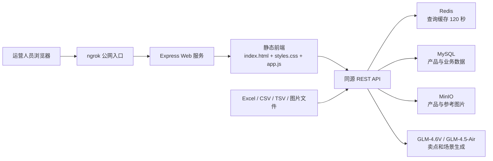

# 产品查询中台：制作逻辑、架构与复刻方法

## 1. 结论先行

这个网站本质上是一个面向内部运营的“产品资料查询与维护中台”，不是营销官网。它把以下能力集中在一页：

- 产品检索、国家/爆款筛选、服务端分页
- 产品图片预览、详情抽屉、基础资料编辑
- 爆款标签维护
- AI 生成卖点与使用场景
- 产品包、爆款表、图片 URL 表的批量导入
- 图片上传、MinIO 对象存储与同名产品同步
- MySQL、Redis、MinIO 连接状态展示

制作方式非常轻：线上前端是原生 HTML + CSS + JavaScript ES Module，没有发现 React、Vue、Tailwind 或前端打包产物；服务端响应头表明使用 Express，数据与基础设施由 MySQL、Redis、MinIO 和 GLM 模型组成。公网入口由 ngrok 暴露。

这种方案适合内部工具：依赖少、部署快、页面逻辑直接。若继续扩大到多角色、多工作流和复杂权限，再迁移到 React/Vue + TypeScript 会更稳妥。

## 2. 取证范围

- 线上地址：<https://impurity-doorway-elm.ngrok-free.dev/>
- 分析日期：2026-07-20
- API 文档：`C:\Users\PC\Desktop\product_query_center_api.md`
- 证据：真实页面截图、移动端截图、HTML、CSS、JavaScript、只读 API 响应、详情抽屉实际走查
- 未执行：编辑、标签修改、AI 重跑、上传、导入、删除等会改变数据的操作

### 桌面端参考


### 移动端参考


## 3. 系统架构



前端与 API 同域，因此浏览器直接请求 `/api/...`，不需要单独处理 CORS。页面本身不保存业务数据，只维护分页、加载状态、当前预览图片和当前选中产品等短期状态。

## 4. 页面制作逻辑

### 4.1 启动流程

页面加载后按以下顺序初始化：

1. 并行请求 `GET /api/countries` 与 `GET /api/health`。
2. 国家列表写入下拉框；健康状态显示“已连接 · 缓存开启 · 对象桶开启”。
3. 请求 `GET /api/products?page=1&limit=30`。
4. 将结果渲染到表格，并根据 `total`、`page`、`limit` 计算“当前显示 1-30”。
5. 初始化上一页/下一页禁用状态。

前端状态对象只保存：页码、每页数量、总数、总页数、加载状态、图片浏览器状态，以及详情/编辑/图片操作当前选中的产品。

### 4.2 查询与分页

查询参数由 `URLSearchParams` 生成：

- `sku`：完整 SKU，文档说明为精确匹配
- `name`：商品名称关键词，文档说明为 `product_name LIKE '%关键词%'`
- `country`：精确匹配
- `tag`：`hot` 或 `normal`；这是线上新增、原文档未记录的参数
- `page`：当前页
- `limit`：20、30、50、100；后端文档允许 10-100

多条件按 AND 组合。点击查询、切换标签、切换每页数量都会把页码重置为 1；SKU 和商品名称输入框支持 Enter 查询。分页完全由服务端完成，适合当前 8100 条数据规模。

现场只读验证结果：

- 全量产品：8100 条
- 爆款：1283 条
- SKU `M1LL0040028`：精确命中 1 条
- `name=露营灯&country=马来`：命中 43 条
- 国家：泰国、菲律宾、马来

### 4.3 列表渲染

列表固定为六列：图片、SKU/商品、标签/AI、国家/品类、卖点与使用场景、操作。

- 图片优先取 `imageGallery[0]`，没有画廊时回退到 `imgurl`。
- 商品信息展示 SKU、名称和最多两行销售规格。
- 标签使用“爆款/非爆款”胶囊；AI 状态分为已生成、人工编辑、已跳过、生成失败、资源不足、超时失败、待生成。
- 卖点与使用场景在表格中各截取前两行，详情抽屉最多展示八行。
- 每行操作为预览、详情、编辑、重试 AI、爆款切换。

渲染策略以 `textContent` 为主，可避免大部分业务文本被当作 HTML 执行。图片加载失败时降低透明度，不阻塞整行。

### 4.4 详情、编辑和图片预览

“详情”采用右侧抽屉：先用列表行数据立即打开，再请求 `GET /api/products/:id` 刷新完整信息，因此主观响应很快。抽屉宽度最大 520px，背景列表保留，遮罩渐入，面板从右侧滑入。

详情包括：

- SKU、商品名称、国家/一级品类/二级品类
- 爆款与 AI 状态
- 图片数量、销售规格
- 完整卖点、完整使用场景
- 编辑、重试生成、爆款切换

“编辑”使用原生 `<dialog>`，先读取完整详情，再允许修改基础字段、重量/箱规、主图 URL、标签、卖点、使用场景与参考图片。保存后重新加载列表，并同步刷新已打开的详情抽屉。

图片预览也是 `<dialog>`，使用暗色沉浸式画布，支持上一张/下一张、左右方向键和循环切换。

### 4.5 三类批量导入

1. 同步导入

   - 输入：产品包 Excel + 图片 CSV
   - 逻辑：合并图片、按产品原始字段查重、跳过完全重复、为已有产品补图、用历史图片兜底
   - 输出：批次号、读取/新增/重复/缺图/冲突等统计与样例

2. 爆款导入

   - 输入：一个或多个 Excel、CSV、TSV
   - 逻辑：读取“中文名称”，按商品中文名匹配产品并标记爆款
   - 输出：唯一名称数、命中名称数、标记行数、未命中和无效行样例

3. 图片导入

   - 输入：含 SKU 与图片 URL 的 Excel、CSV、TSV
   - 逻辑：下载远程图片到 MinIO，再同步到同中文名产品
   - 输出：下载成功、产品同步、图片记录、未匹配、失败和无效行统计

## 5. API 映射

| 方法 | 路径 | 页面用途 | 主要输入 |
|---|---|---|---|
| GET | `/api/health` | 检查 MySQL、Redis、MinIO | 无 |
| GET | `/api/countries` | 国家筛选下拉框 | 无 |
| GET | `/api/products` | 列表、筛选、分页 | `sku,name,country,tag,page,limit` |
| GET | `/api/products/:id` | 详情与编辑前刷新 | 产品 ID |
| PATCH | `/api/products/:id` | 保存产品字段 | JSON 产品字段 |
| PATCH | `/api/products/:id/tag` | 标记/取消爆款 | `{ productTag }` |
| POST | `/api/products/:id/ai-enrichment` | 生成卖点与场景 | `{ useWebSearch:false, models:[...] }` |
| POST | `/api/products/:id/reference-images` | 上传文件/文件夹/URL | `multipart/form-data` |
| DELETE | `/api/reference-images/:id` | 删除或隐藏同组参考图 | 图片记录 ID |
| POST | `/api/import/sync-products` | 产品包与图片 CSV 同步 | Excel + CSV |
| POST | `/api/import/hot-products` | 爆款批量标记 | 多个表格文件 |
| POST | `/api/import/reference-images` | 图片 URL 表导入 | 表格文件 |
| GET | `/api/templates/reference-images.xlsx` | 下载图片导入模板 | 无 |

原 API 文档只覆盖前三个只读接口。线上实现已明显扩展：`health` 新增 `minio`，产品新增标签、AI、参考图和图片画廊字段，并提供完整的写操作与导入接口。应尽快同步接口文档，尤其要记录鉴权、请求大小、幂等性、缓存失效和错误码。

## 6. 数据与缓存逻辑

### 6.1 建议的数据模型

忠实复刻时至少需要以下实体：

```text
products
  id, cycle, sku, product_name, country
  category_l1, category_l2, sales_spec, item_size
  item_net_weight_g, item_gross_weight_g
  carton_length_cm, carton_width_cm, carton_height_cm, carton_quantity
  imgurl, product_tag, tag_source, tag_updated_at
  selling_points, usage_scenarios
  ai_analysis_status, ai_analysis_reason, ai_analysis_model
  ai_analysis_sources, ai_generated_at

product_reference_images
  id, product_id 或 product_name_group
  sku, object_key, image_url
  source_site, source_title, source_url, remark
  deleted_at, created_at

import_batches
  id, type, source_filename, status
  counters_json, samples_json, created_at, finished_at
```

若 AI 生成历史需要审计或回滚，应把 AI 字段拆成 `product_ai_runs`，保存模型、提示词版本、输入快照、输出、状态、置信度、错误原因与耗时。

### 6.2 查询实现

后端典型流程应是：

1. 校验并规范化查询参数，限制 `limit` 为 10-100。
2. 将 SKU、名称、国家、标签、页码、每页数量组成稳定缓存 key。
3. 读取 Redis；命中则直接返回。
4. 未命中时拼接参数化 SQL 条件，先 `COUNT(*)`，再按稳定排序执行 `LIMIT/OFFSET`。
5. 组装 AI、参考图和 `imageGallery`。
6. 写入 Redis，TTL 120 秒后返回。

文档给出的缓存前缀为 `product-query:v2`。所有编辑、标签、AI、图片和导入写操作完成后，都应主动删除相关列表/详情缓存，不能只依赖 120 秒自然过期。

## 7. AI 富化逻辑

前端调用时按顺序传入 `glm-4.6v`、`glm-4.5-air`，并设置 `useWebSearch: false`。线上样例的 `aiAnalysisModel` 为 `glm-4.6v`。

合理的后端实现是：

1. 读取商品名称、销售规格、品类、国家与可用图片。
2. 识别配件、售后件、旧品等不适合生成的项目，标记 `skipped` 并保存原因。
3. 调用首选模型，超时或资源不足时记录失败原因；可按策略降级到备用模型。
4. 要求结构化输出：多行卖点、多行使用场景、置信度。
5. 写回数据库并清理缓存。

大量产品的 AI 处理不应在一个 HTTP 请求里串行完成。建议使用 BullMQ/Redis Queue、RabbitMQ 或同类任务队列，提供重试、限流、断点续跑、批次进度和失败样本下载。

## 8. 视觉与组件系统

### 8.1 设计令牌

| 角色 | 值 |
|---|---|
| 页面背景 | `#f6f7f9` |
| 面板 | `#ffffff` |
| 主文字 | `#1f2933` |
| 次文字 | `#667085` |
| 弱文字 | `#8a94a3` |
| 主色 | `#176b5b` |
| 主色深色 | `#0f4f43` |
| 主色浅底 | `#e8f4f1` |
| 边框 | `#e1e5ea` / `#c9d1da` |
| 危险 | `#b42318` |
| 警告 | `#b54708` |
| 面板阴影 | `0 14px 34px rgba(15,23,42,.07)` |

字体栈为 `Inter, SF Pro Display, Segoe UI, Microsoft YaHei, PingFang SC, Arial, sans-serif`。正文 14px，页面标题 30px，区块标题 15-22px，说明/标签 12px。圆角以 6px 和 8px 为主，状态标签使用 999px 胶囊。

### 8.2 布局规则

- 页面容器：最大 1480px，桌面左右各 20px，顶部 34px
- 搜索栏：六列 CSS Grid；名称输入框占弹性主空间
- 表格：最小宽度 1080px，表头吸顶，容器内部横向滚动
- 详情抽屉：最大 520px，右侧滑入，200ms 过渡
- 编辑弹窗：最大 1120px；基础字段四列，卖点/场景两列
- 统一输入与主按钮高度：42px；行内操作按钮：32px
- 断点：900px；搜索与编辑表单改为单列，表格仍保留 980px 最小宽度

移动端属于“可用但非移动优先”：筛选表单堆叠清晰，但顶部第三个导入按钮会被裁切，表格依赖横向滚动。若需要经常在手机上使用，应把表格改为卡片列表或冻结关键列。

## 9. 最快复刻方案与工具

### 9.1 忠实复刻技术栈

| 层 | 推荐工具 | 说明 |
|---|---|---|
| 前端 | HTML5 + CSS Grid/Flex + Vanilla JS | 与当前站一致，无构建步骤 |
| 服务端 | Node.js + Express | 与线上响应特征一致 |
| 数据库 | MySQL 8 | 产品、标签、AI、图片元数据 |
| 缓存/队列 | Redis + BullMQ | 查询缓存与 AI/导入后台任务 |
| 对象存储 | MinIO + AWS S3 SDK | 原图、参考图、导入中间文件 |
| 表格解析 | SheetJS `xlsx` 或 ExcelJS + CSV parser | 处理 Excel/CSV/TSV |
| AI | 智谱 GLM SDK/HTTP API | 结构化卖点与场景生成 |
| 校验 | Zod/Joi | 查询、编辑和模型输出校验 |
| 测试 | Vitest/Jest + Supertest + Playwright | API、缓存失效、导入与 UI 流程 |
| 部署 | Docker Compose + Nginx/Caddy | 正式环境；ngrok 仅用于临时访问 |

### 9.2 推荐目录

```text
product-query-center/
  public/
    index.html
    styles.css
    app.js
  src/
    server.js
    routes/
      health.js
      products.js
      imports.js
      images.js
      ai.js
    services/
      product-query.js
      cache.js
      import-products.js
      image-storage.js
      ai-enrichment.js
    repositories/
      products.js
      reference-images.js
      import-batches.js
    middleware/
      auth.js
      upload-policy.js
      error-handler.js
  migrations/
  tests/
  docker-compose.yml
  .env.example
```

### 9.3 实施顺序

1. 先建产品表、索引和 3 个只读接口，完成 SQL 参数化、分页与 Redis 120 秒缓存。
2. 复刻页面骨架、筛选器、表格、分页和健康状态。
3. 加详情抽屉、图片画廊和完整详情接口。
4. 加编辑、爆款标签与缓存失效。
5. 接入 MinIO，完成上传、远程下载、图片去重和同名产品同步。
6. 接入 AI 队列，设计状态机、重试、降级和批次进度。
7. 实现三类导入，先“解析与预览”，确认后再写库；保存批次统计和错误文件。
8. 补齐鉴权、权限、审计、限流、上传安全、监控和正式域名部署。

## 10. 上线前必须补的事项

1. 鉴权与权限

   当前页面无可见登录流程，前端写接口也没有 CSRF token 或显式授权头；公网 ngrok 地址可直接读取产品数据。必须确认后端是否有独立访问控制。正式环境建议 SSO/OIDC，并按查看、编辑、导入、AI、管理员拆分权限。

2. 上传与远程图片安全

   浏览器的 `accept` 只是一种提示，服务端必须校验文件签名、MIME、扩展名、大小、行数和解压后体积。远程图片下载必须防 SSRF：只允许 HTTP(S)，阻断回环、内网、云元数据地址、重定向绕过，并限制响应大小和下载时间。

3. 前端 XSS

   主列表使用 `textContent` 较安全，但编辑图片列表通过 `innerHTML` 插入 `imgurl` 和图片元数据。若这些值可由导入或用户编辑控制，存在 DOM XSS 风险；应全部改用 `createElement`、属性赋值和 `textContent`。

4. 初始化与请求竞态

   `loadCountries()` 没有错误兜底，并与健康检查放在 `Promise.all` 中；国家接口失败会阻止产品列表首次加载。应改为 `Promise.allSettled` 或分别捕获。查询也没有 `AbortController`，快速连续操作可能让旧响应覆盖新结果。

5. 后台任务化

   导入、远程图片下载和 AI 生成都可能耗时。应返回 `202 + jobId`，由前端轮询/SSE 查看进度，而不是让一个请求长时间占用连接。

6. 可维护性与文档

   线上代码存在未接入当前按钮的“添加产品图片”对话框/函数，属于疑似遗留代码。API 文档也未覆盖大部分线上能力。建议用 OpenAPI 3.1 生成接口文档和客户端类型，并清理不可达代码。

## 11. 最终判断

这个网站的核心成功点不是技术复杂，而是业务闭环完整：导入产品 → 查询筛选 → 查看图片与 AI 结果 → 编辑/标爆款/补图 → 重新生成 → 再回到列表验证。复刻时应优先保留这条闭环、服务端分页、缓存和批次结果统计；视觉可以原样复刻，技术栈也可以继续保持原生前端。真正需要升级的是公网访问控制、上传/远程下载安全、后台任务化和接口文档。
