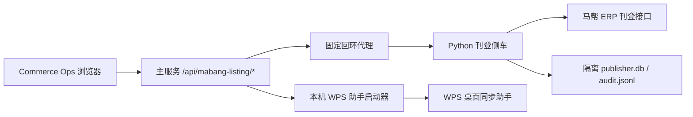

# Mabang-getdata 主项目整合报告

日期：2026-07-27

## 目标

将 `Mabang-getdata` 的业务能力接入 Commerce Ops，同时保持主项目对账号、订单、库存、产品、图片和 Growth Radar 数据的所有权。

本次整合不创建 migration，不修改正式 SQLite，不把来源项目的真实商品快照发布到浏览器，也不替换现有 COM-015 图片采集或 A2/Growth Radar 数据基础。

## 保留能力

- WPS 桌面同步助手及其订单、库存导出流程。
- 马帮 Lazada、Shopee、TikTok Shop 在线商品查询。
- 批量修改的预览、明确确认、过期检查、串行执行和结果回读。
- DeepSeek 结构化命令解析及确定性回退。
- 刊登草稿、复制在线商品、校验、确认发布和发布状态轮询。
- 原 Python 单元测试和原刊登看板独立构建能力。

## 集成结构

关键边界：

- 浏览器只访问 Commerce Ops 当前源，不直接访问侧车端口。
- 主服务以内部令牌访问固定回环地址，浏览器令牌不会转发给侧车。
- 侧车不会继承主项目的 `DATABASE_PATH`、`STORAGE_ROOT` 或正式库路径。
- 侧车运行数据位于 `storage/integrations/mabang-listing`。
- WPS 助手只能从本机回环请求启动，并保持单实例。

## 主要改动

### 来源保留

- `integrations/mabang-getdata/`
- `integrations/mabang-getdata/mabang-listing-dashboard/`

来源项目的部署专属 Sites 配置没有带入；vendored 看板改为本地可构建模式。真实店铺商品 JSON 快照没有进入集成版发布资产，离线回退保留为空的安全快照。

### 主服务

- `lib/mabang-listing-service-manager.mjs`
- `lib/mabang-listing-proxy.mjs`
- `lib/mabang-listing-token.mjs`
- `lib/mabang-wps-assistant-manager.mjs`
- `server.mjs`
- `lib/runtime-config.mjs`

### 主工作台

- `frontend/mabang-listing/`
- `public/mabang-listing-loader.mjs`
- `public/index.html`
- `public/app.js`
- `public/styles.css`

刊登看板以 Shadow DOM React Island 接入统一导航，不使用 iframe，不重复主工作台登录。

### 构建与测试

- `scripts/start-mabang-listing.mjs`
- `scripts/start-mabang-wps.mjs`
- `scripts/test-mabang-getdata.mjs`
- `tests/mabang-listing-integration.test.mjs`

## 数据与安全结果

- 没有新增或修改 migration。
- 没有向正式 Commerce Ops SQLite 写入刊登草稿或侧车审计数据。
- 来源项目的绝对 `C:` 路径已改为操作系统目录发现。
- 构建产物不包含本机 source map 路径。
- 真实商品快照不随主工作台静态资源发布。
- 在线商品修改仍要求预览和明确确认，不会因页面接入而自动执行。

## 验证

- 原 Python 测试：58/58。
- 主项目刊登集成测试：9/9，其中包含真实 Python 子进程、内部令牌和隔离存储冒烟。
- 原刊登看板：Build 通过，渲染测试 3/3。
- 主项目 Build：通过，470 个唯一元素 ID，219 个静态绑定。
- 隔离 migration：001-021 当前迁移集可在临时 SQLite 应用。
- 隔离 Doctor：全部 OK，`integrity_check=ok`。
- API：主服务成功启动侧车并读取 Lazada、Shopee、TikTok Shop 平台目录。
- 浏览器：桌面和 430px 移动端通过，无横向溢出、无控制台错误、无失败请求。
- 主项目全量测试：718/718 通过，0 失败、0 跳过。
- 正式 SQLite、WAL、SHM 的大小、时间和 SHA-256 与整合前一致。
- 验收使用的主服务与侧车端口已停止，无测试进程残留。

## 运行入口

- 主工作台导航：`马帮在线商品`
- 主工作台马帮数据页：`打开 WPS 同步助手`
- 独立侧车：`npm run start:mabang-listing`
- 独立 WPS：`npm run start:mabang-wps`

当前没有提交、暂存、推送或修改用户并行开发内容。
