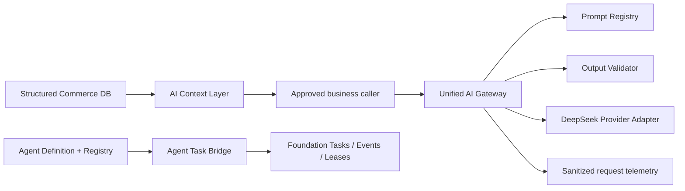

# Commerce Ops AI Foundation V1 Final Report

Status: completed and validated
Date: 2026-08-05
Branch: `codex/vue-mainline-integration`

## 1. Completed Scope

AI Foundation V1 establishes the shared infrastructure required by future
Commerce Ops Agents without adding a new business Agent:

1. A read-only AI Context Layer for shops, products, and SKUs.
2. A unified AI Gateway contract for provider isolation, prompt versions,
   token usage, safe request telemetry, retry policy, and output validation.
3. An immutable Agent definition and versioned registry.
4. An Agent-to-Foundation task bridge that reuses the existing task lifecycle,
   events, retries, leases, and idempotency.
5. Migration of the Mabang Python AI adapter away from direct provider access.

Product Center, Sales and Assortment, Growth Radar, Mabang collection,
fulfillment, Listing, and audit behavior remain in place.

## 2. Architecture

The only production adapter that knows the DeepSeek HTTP endpoint is
`lib/ai/providers/deepseek-provider.mjs`. Business services receive an
`AiGateway`, not an API credential or provider endpoint.

## 3. Files

### AI Context Layer

- `lib/ai/context/ai-context-contracts.mjs`
- `lib/ai/context/ai-context-repository.mjs`
- `lib/ai/context/ai-context-service.mjs`
- `lib/ai/context/ai-context-api.mjs`
- `tests/ai-context-layer.test.mjs`

### AI Gateway

- `lib/ai/ai-gateway.mjs`
- `lib/ai/ai-audit-logger.mjs`
- `lib/ai/ai-output-validation.mjs`
- `lib/ai/prompt-registry.mjs`
- `lib/ai/providers/deepseek-provider.mjs`
- `lib/ai/mabang-listing-ai-api.mjs`
- `tests/ai-gateway.test.mjs`
- `tests/mabang-listing-ai-api.test.mjs`

Existing server, scheduler, Product Center, Sales and Assortment, fulfillment,
and Mabang integration files were adjusted incrementally to use the shared
contracts. The Python Mabang adapter now calls the loopback, token-protected
Commerce Ops Gateway endpoint and receives no DeepSeek credential.

### Agent Framework

- `lib/ai/agent/agent-contracts.mjs`
- `lib/ai/agent/agent-registry.mjs`
- `lib/ai/agent/agent-task-bridge.mjs`
- `lib/ai/agent/agent-framework.mjs`
- `tests/agent-framework.test.mjs`
- `docs/design/COMMERCE-OPS-AGENT-FRAMEWORK-V1.md`

## 4. Database Changes

No migration and no new table were introduced.

- Contexts are read-only projections over structured database facts.
- Agent requests reuse `foundation_tasks`.
- Lifecycle evidence reuses `foundation_task_events`.
- Worker ownership reuses `foundation_task_leases`.
- Main-process AI telemetry reuses the canonical operation audit service.
- Existing fulfillment Agent run auditing remains isolated in the fulfillment
  service and was not replaced.

Read-only verification of the formal SQLite database:

- highest migration: `022_commerce_ops_foundation_v1.sql`
- `integrity_check`: `ok`
- foreign-key violations: `0`

## 5. API Changes

New authenticated, read-only context endpoints:

- `GET /api/ai/context/shop/:id`
- `GET /api/ai/context/product/:id`
- `GET /api/ai/context/sku/:id`

New internal-only Mabang AI endpoint:

- `POST /api/internal/ai/mabang-listing/complete`

The internal endpoint accepts only loopback callers with the generated service
token, registered profile/version, and expected prompt digest. No public Agent
execution API was added.

## 6. Agent Contract

Every future Agent must define:

- `name`
- `description`
- `input_context`
- `tools`
- `output_schema`
- `permission`

Write tools require `execute` authority and human approval. Task envelopes
store only context subject references and sanitized metadata; they do not store
raw contexts, prompts, model outputs, PII, or credentials. No Daily Report,
Shop, Inventory, or other production Agent is registered in V1.

## 7. Validation

- AI and affected-domain focused tests: `136/136` passed.
- Full repository tests: `849/849` passed.
- Mabang Python AI tests: `14/14` passed.
- Build: passed, including portable-path, frontend-policy, Vue TypeScript, Vite,
  and post-build checks.
- Doctor: no errors; SQLite integrity and storage checks passed.
- Memory audit: `9` files, `30` facts, `11` pointers; healthy.
- Direct-provider audit: no business module contains the DeepSeek completion
  endpoint; only the provider adapter does.

Doctor reported the main and advertising ports as already in use because the
project was running during validation. This is an operational warning, not an
AI Foundation failure.

## 8. Incremental Commits

1. `0eaf367` define AI Foundation architecture.
2. `3507056` add structured AI Context Layer.
3. `8302853` harden unified AI Gateway.
4. `49422b0` version existing AI request contracts.
5. `c058fab` validate Sales and Assortment AI output.
6. `22f877d` audit scheduled AI requests.
7. `175aab1` add internal Mabang AI Gateway endpoint.
8. `911493c` route Mabang Python AI through the Gateway.
9. `9e7fd13` establish Agent framework contracts.

## 9. Remaining Boundaries

- Agent execution runtime is intentionally not implemented. Agent tasks remain
  `PENDING` with `execution_runtime=not_implemented`.
- Context quality depends on available structured facts and reports explicit
  limitations when published analysis is absent.
- Existing running Node/Python processes must be restarted through the normal
  controlled project startup before they load this new code.
- The Vue build reports two chunks above 500 kB. This is an existing frontend
  performance opportunity and does not block AI Foundation correctness.
