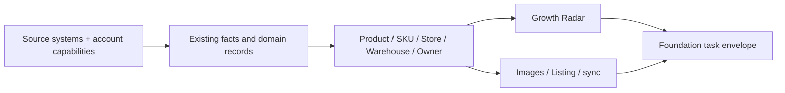

# COMMERCE-OPS-FOUNDATION-V1 FINAL REPORT

Date: 2026-07-28

Status: implementation and isolated validation complete; formal activation gated

## 1. Completed

Foundation V1 now provides:

1. A unified source-system and integration-account registry.
2. Explicit account capabilities for orders, inventory, images, and Listing.
3. A secure Mabang-to-Listing account bridge with memory-only secret handling.
4. Canonical Product, SKU, Store, Warehouse, and Owner access.
5. Source-to-master identity links with evidence and review state.
6. A unified task envelope with states, priorities, idempotency, retries, events, and
   leases.
7. Compatibility projections for Mabang data runs, COM-015 images, Growth Radar tasks,
   and Listing publish jobs.
8. An isolated candidate migration and formal-copy rehearsal.

## 2. Architecture Change

Foundation is an additive kernel. It does not become a second business truth.

## 3. Data Model Change

### New candidate tables

- `foundation_source_systems`
- `foundation_integration_accounts`
- `foundation_account_capabilities`
- `foundation_owners`
- `foundation_warehouses`
- `foundation_identity_links`
- `foundation_source_runs`
- `foundation_tasks`
- `foundation_task_events`
- `foundation_task_leases`

### Canonical tables retained

- Product: `product_models`
- SKU: `product_skus`
- Store: `growth_shops`
- Orders and inventory: existing Growth fact tables
- Images: existing COM-015 tables
- Growth work: `growth_focus_items`
- Listing publication: existing isolated publisher tables

## 4. Module Relationship Change

- Mabang orders, inventory, and images resolve through one account registration model.
- Listing can connect using the same Mabang credential owner without copying the secret.
- Product Center and Growth Radar share SKU identity through Foundation links.
- Warehouse identities are centralized and explicitly wait for country confirmation.
- Existing domain tasks are visible through one normalized queue while retaining their
  original state and owner.

## 5. Migration

Candidate:

`migrations/candidates/022_commerce_ops_foundation_v1.sql`

The candidate is intentionally not auto-discoverable by the application migration
runner. No existing migration was edited and the formal database was not migrated.

The isolated formal-copy rehearsal applied 019-022 in order, changed none of 14
protected existing tables, passed integrity checks, and produced no foreign-key
violation.

## 6. Test Results

- Foundation: 6/6.
- Full suite: 724/724.
- Build: passed.
- Doctor: passed.
- Formal SQLite files: byte and SHA-256 evidence unchanged after rehearsal.

## 7. Performance

- Task projections are idempotent and do not increment state versions when source data
  is unchanged.
- Master synchronization is incremental and index-backed.
- Foundation stores references and JSON evidence, not duplicated order, inventory, image,
  or Listing payloads.
- The existing Growth Radar frontend large-chunk warning remains and should be addressed
  with code splitting.

## 8. Technical Debt Reduced

- Removed the need for separate account identities per Mabang capability.
- Replaced implicit cross-module identity assumptions with explicit links.
- Added one normalized task contract without deleting mature domain workflows.
- Removed future pressure to create duplicate Product, SKU, or Store masters.
- Added a migration path that is provably isolated from the formal database.
- Restored portable-path Build compliance for project documentation artifacts.

## 9. Remaining Risks and Recommendations

### P0 - Before activation

1. Approve a joint backup and formal migration window.
2. Decide the deployment gate for existing top-level candidates 019-021.
3. Confirm all 29 warehouse-to-country mappings.
4. Assign the 107 current stores to owner identities or explicitly accept the
   unassigned owner.
5. Activate the Foundation runtime/API only after migration evidence is archived.

### P1 - After activation

1. Run the first Foundation projection and reconcile task counts by domain.
2. Wire the Listing account bridge to the authenticated server route and remove browser
   password entry.
3. Add a small admin surface for account capabilities, owner assignment, and warehouse
   mapping.
4. Add a background projection cadence with lag and failure metrics.

### P2 - Later simplification

1. Move long-lived Listing drafts and readback identities toward the main data layer.
2. Extract the common Python sidecar lifecycle and health-check kit.
3. Split `server.mjs` by module API composition.
4. Code-split Growth Radar and share frontend runtime dependencies.
5. Introduce MinIO/S3 only when media volume or multi-node deployment requires it.

## Approval Gate

Foundation V1 has reached the mandatory stop point. The next action would modify the
formal database and therefore requires explicit approval. No formal migration, data
deletion, A2 core change, or COM-015 core change has been performed.
