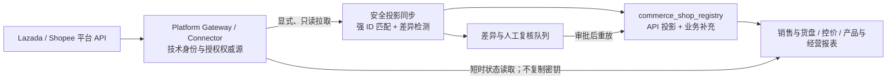

# Commerce Ops 平台 API 店铺缺口解决方案

检查日期：2026-08-08  
依据：生产 PostgreSQL、Platform Gateway / Connector 的只读审计结果  
执行状态：方案与代码侧准备；`productionWrites = 0`，未执行生产迁移、回填、绑定或授权写入

> 02:08 CST 复核更新：生产审计记录显示订单域已于 02:06 CST 成功执行 `sales_assortment.orders.full_reset`，原因为 `responsibility_category_scope_changed`。当前 `growth_order_headers`、`growth_order_lines`、`growth_order_raw_rows` 均为 0；下文 80,500 / 116,700 是重置前 01:40 基线，不是当前行数。重置前备份 `commerce_ops_before_order_reset_20260808014229.dump` 已存在且 SHA-256 与审计记录一致；本任务没有执行该重置，也没有自动恢复。

## 1. 结论

店铺配置应直接采用平台 API 接入模块的数据，统一边界如下：

- **平台 API / Connector 是店铺技术身份与授权状态的权威源**：负责平台、Connector 店铺 ID、平台卖家 ID、店名、国家、平台侧状态、授权状态和可调用性。
- **`commerce_shop_registry` 是受治理的本地投影与业务补充层**：保存平台 API 身份投影，并补充业务字段；它不再反向覆盖平台 API 身份或授权。
- Token、Secret 和刷新凭据继续只留在 Connector / Token Broker，不复制到 PostgreSQL。
- 店名只用于展示和人工检索，不能作为自动授权绑定键。同步必须优先使用 Connector 店铺 ID，次选经过平台与国家约束的平台卖家 ID；冲突时关闭自动调用并进入差异队列。

## 2. 当前店铺覆盖与主要差异

| 项目 | 数量 | 结论 |
|---|---:|---|
| Platform API / Connector 可见店铺 | 134 | 应成为店铺配置页面的直接数据集 |
| 现有 `commerce_shop_registry` 店铺 | 139 | 保留为投影与业务补充，不再作为技术身份权威源 |
| 已存且经外部强 ID 复核有效的连接 | 130 | 可安全沿用并由 API 刷新状态 |
| 注册表有、API 无的店铺 | 9 | 不可执行平台 API 动作；1 家仅有名称候选，8 家无候选，均不得自动绑定 |
| API 有、注册表无的店铺 | 4 | 应由安全同步创建投影，不能因本地登记缺失而从配置页消失 |
| 身份冲突待核对 | 2 | 必须 fail-closed；解除前不可调用 |
| 已授权且可调用 | 116 | 可进入只读业务调用范围 |
| 未授权 | 21 | 保留可见，但不得发起需要授权的业务调用 |
| 待核对 | 2 | 不得调用，进入身份差异队列 |

另有 3 家店的平台 ID 表达不一致，应作为规范化差异核查，不能通过覆盖任一来源来“修正”。上述 116 + 21 + 2 是当前 139 家业务投影的状态口径；134 是 API / Connector 的可见店铺库存，两组数字描述的对象不同，不应相互替代或相加。

## 3. 缺口会影响什么

### 3.1 授权与 API 执行

- 9 家注册表店铺未接入 API，无法可靠读取平台订单、商品、库存或执行后续获批的写操作。
- 21 家当前不可授权调用，2 家身份冲突必须阻断；只有 116 家可以标记为可调用。
- 生产库尚无正式的 API Profile、外部店铺身份和平台 API 账号绑定关系；现有 139 条账号绑定仍是马帮绑定。因此“页面显示已授权”不能替代数据库中的正式执行链路。
- 解决方式：配置页直接读取 Gateway 店铺库存和实时/短缓存授权状态；业务执行仍必须经过“API Profile → Foundation 账号 → 外部店铺身份 → 店铺投影”的受约束链路。链路不完整时明确返回不可执行，不能降级为店名匹配。

### 3.2 控价范围与执行

- 617,667 个价格点中，只有 124,257 行能按平台、国家和店型投影到店铺；493,410 行没有对应店铺范围。
- 展开后共有 828,612 个价格—店铺组合，其中 25,323 个没有旧 Connector 引用。
- 满足正式平台 API Profile、外部身份和 binding 的可执行组合当前为 0；因此当前结果只能用于预览或候选，不能宣称已经能够通过平台 API 正式执行控价。
- 主要根因不只是授权，还包括 `control_shop_type` 缺失。Mall / C 店型没有平台权威证据时不得从店名、价格列或历史代码猜测，否则会把价格投给错误店铺范围。

### 3.3 订单、销售与货盘

- 重置前有 80,500 个订单头尚未写入统一店铺 ID；205 个来源店铺键中，131 个无候选，影响 79,768 个订单头。
- 重置前 116,700 个当前订单行中，115,862 行仍因店铺国家未确认而无法解析到统一产品，直接阻断国家销售、产品销量、店铺货盘缺口和 Growth 归因。
- API 权威店铺投影能补齐强身份候选和国家，但不能把历史订单店名静默认作授权身份。74 个唯一候选键仍应保留证据等级；仅名称候选必须人工确认。
- 当前订单三张核心表已经清空，因此 Sales / Growth 的订单销量、销售额、店铺归因和日报订单指标会直接变为空数据。恢复备份会重新带回旧责任人/品类口径的数据，不能在未确认新口径迁移方案前自动恢复到生产。

## 4. 可自动补齐与不可推断字段

### 4.1 币种

店铺展示和默认控价币种可以使用一条**版本化、可审计的国家映射规则**，例如 `shop-country-currency-v1`：

| 国家 | 默认店铺币种 |
|---|---|
| SG | SGD |
| MY | MYR |
| TH | THB |
| VN | VND |
| PH | PHP |
| ID | IDR |
| TW | TWD |

该值必须标记为 `DERIVED_COUNTRY_DEFAULT` 并记录规则版本。它只是店铺默认运营币种，**不是订单结算币种、财务入账币种或汇率换算证据**；订单金额仍以订单/财务来源中的明确币种为准。国家未知或超出规则表时保持空值并进入差异队列。

### 4.2 不可自动推断

以下字段不属于技术身份，平台 API 没有明确、可审计字段时必须保留空值或 `UNKNOWN`：

- Mall / C 店型（`control_shop_type`）；
- 店铺负责人、上级负责人；
- 经营品类；
- 历史店铺与 API 店铺之间只有名称相似、没有强 ID 的绑定。

这些字段应作为 `commerce_shop_registry` 的业务补充：由平台明确字段同步，或由责任人审核录入，并记录来源、审核人、时间和版本。系统不得根据店名关键词、销量、价格列或国家默认值推断。

## 5. 安全同步流程

1. **读取快照**：显式触发 Gateway 店铺同步，拉取 134 家非敏感店铺信息及授权摘要；GET 列表本身不产生数据库写入。
2. **规范化但不改语义**：统一平台代码、国家代码和空白格式；保留原始值、抓取时间和来源版本。
3. **强身份匹配**：优先 Connector 店铺 ID；其次使用平台 + 国家 + 平台卖家 ID。店名不得单独触发合并。
4. **生成差异计划**：将 130 个有效连接列为更新，4 个 API-only 店铺列为新增投影，9 个本地-only 店铺列为失联复核，2 个冲突列为阻断；输出计数、行级原因和预览指纹。
5. **业务补充合并**：API 身份字段以 API 为准；负责人、品类、店型等本地补充只在其独立字段中保留，不反向写入 API 身份。
6. **事务应用**：在完成备份和单独审批后，以一个受约束事务应用；使用 compare-and-swap 防止预览后数据漂移，并写入审计账本。
7. **发布门禁**：只有身份无冲突、授权可用且正式 binding 完整的店铺可标记 `callable=true`；控价还必须额外具备店型和产品范围。
8. **对账与回滚**：同步后复核 134/139、116/21/2 等基线以及下游影响量；异常时按账本回滚投影，不修改 Connector 凭据。

## 6. 差异队列设计

| 队列类型 | 当前规模/触发条件 | 自动动作 | 人工动作 |
|---|---|---|---|
| `API_ONLY` | 4 家 | 创建非敏感本地投影 | 补负责人、品类、店型等业务字段 |
| `REGISTRY_ONLY` | 9 家 | 标记 API 不可执行，保留历史引用 | 判断停用、补授权或提供强 ID；禁止仅按名称绑定 |
| `IDENTITY_CONFLICT` | 2 家 | `callable=false`，阻断同步覆盖 | 核对平台、国家、卖家 ID 后审批 resolution |
| `PLATFORM_ID_VARIANCE` | 3 家 ID 表达不一致 | 保留双侧原值，不静默覆盖 | 确认是否只是格式差异并登记规范化规则 |
| `NOT_AUTHORIZED` | 21 家 | 保持可见，不发起受保护调用 | 完成平台授权或明确停用 |
| `MISSING_SHOP_TYPE` | API 无明确 Mall / C 证据 | 保持 `UNKNOWN`，控价 fail-closed | 由平台证据或责任人审核补录 |
| `MISSING_BUSINESS_OWNER_CATEGORY` | API 无负责人/品类字段 | 不推断 | 业务补录并留审计记录 |

每条差异至少记录：来源快照 ID、平台、Connector 店铺 ID、平台卖家 ID、国家、差异类型、证据、候选动作、状态、审核人、决议版本和时间。被拒绝或暂缓的项仍应保留历史，不可直接删除。

## 7. 分阶段解决方案与验收标准

### 阶段 A：立即生效的只读口径

- 店铺配置页的主列表直接展示 134 家 Platform Gateway 店铺库存与授权状态；9 家本地-only 店铺只进入差异队列，不伪装成 API 店铺。
- `commerce_shop_registry` 只作为补充展示与下游投影，不允许覆盖 API 技术身份。
- 现有 139 家业务投影的 116 家可调用、21 家未授权、2 家待核对作为切换前对账基线；新页面不得把它与 134 家 API 库存混成同一总数。
- 国家默认币种按版本化规则展示，明确标注为派生值。

### 阶段 B：受控投影同步

- 预览必须稳定得到 130 个有效连接、4 个 API-only、9 个 registry-only 和 2 个冲突；任何计数漂移都中止应用并重新预览。
- 4 家 API-only 创建投影后可被下游统一引用；9 家 registry-only 不得伪造 API 绑定。
- 同步幂等：同一快照重复执行不新增重复店铺、不改变人工补充字段。

### 阶段 C：下游解锁

- 先决定订单重置后的处理方式：按新责任人/品类口径重新导入，或在隔离库恢复已验证备份并转换后再回灌；禁止直接覆盖当前生产状态。
- 对重建后的历史订单建立强证据候选与人工 resolution，逐步降低重置前 80,500 个未统一店铺订单头及 115,862 个因国家未确认而阻断的订单行。
- 补齐正式 API Profile、外部身份和 binding 后，控价可执行组合才能从 0 开始释放。
- Mall / C 店型未确认的店铺继续阻断相应控价范围；不得用风险承认替代身份和范围证据。

## 8. 生产执行边界

本报告没有对生产数据库、Connector、Token Broker 或平台执行任何写入，也没有改变店铺授权。生产动作仍需单独审批，至少包括：

1. 确认目标数据库、备份与恢复点；
2. 审核同步预览指纹及 130/4/9/2 行级差异清单；
3. 指定身份冲突、店型、负责人和品类的审核责任人；
4. 批准数据库迁移、投影写入、正式 API binding 和回滚窗口；
5. 执行后只读对账并确认下游订单、控价和授权门禁没有被绕过。

在取得该单独审批前，可以完成代码、测试、隔离数据库演练和生产只读预览；不得写回生产，也不得把名称候选升级为可调用身份。

## 9. 本次已实现的代码门禁

- `/api/platform/shops` 的配置列表以 Platform Gateway 店铺集合为基准；API-only 可见，registry-only 不混入配置列表，GET 不写库。
- 本地业务字段只通过 Connector 店铺 ID 或唯一“平台 + 国家 + Seller ID”叠加；店名、店编和短码只生成复核证据，不能触发自动合并或授权。
- 人工创建平台技术店铺的 API 与页面入口已关闭；显式“同步 API 店铺投影”只接收 Gateway 集合，不接收上传店铺行，并要求操作人二次确认。
- 投影同步只复制非敏感白名单字段，默认币种写入 `SHOP_SITE_DEFAULT_CURRENCY_V1` 证据；Token、Secret 和任意非白名单 metadata 不复制。
- 控价店铺选择、预览和确认执行均要求 `identityStatus = CONFIRMED`；身份进入 `REVIEW_REQUIRED` 后，即使已有预览也会在执行前再次阻断。
- 相关店铺、Connector、统一底座、前端和控价专项测试已通过；Vue 生产构建成功。生产店铺投影、API binding、授权刷新和订单恢复仍未执行。
