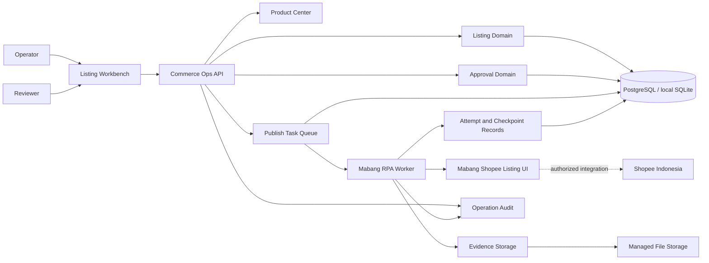
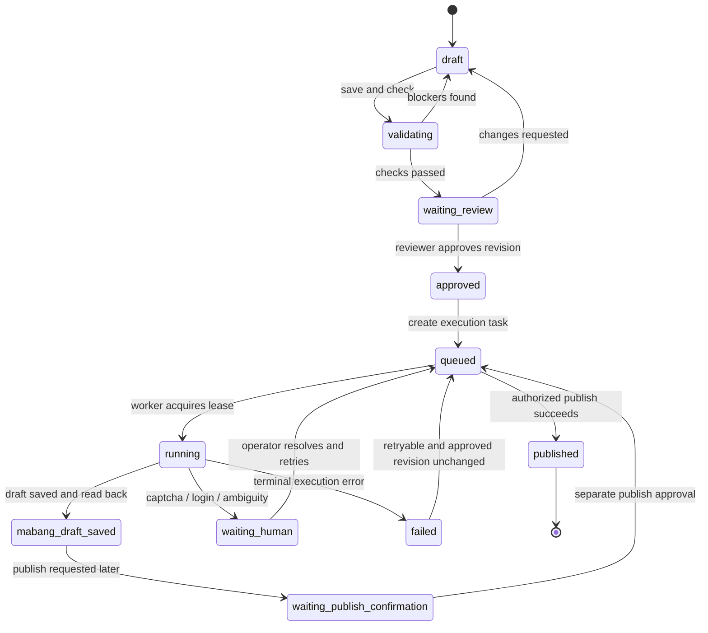

# Shopee Indonesia Assisted Listing Architecture

Date: 2026-07-24
Status: Proposed / Ready for phased implementation

## 1. Objective

Build a controlled Shopee Indonesia listing workflow on top of the existing Commerce Ops product center. The system prepares compliant listing data, requires explicit review, delegates browser interaction to an isolated Mabang RPA worker, and records every execution result without turning the product center into an unattended mass-listing bot.

The first production milestone is deliberately limited:

> Select one confirmed style group and one authorized Indonesian shop, create and approve a listing draft, save it into the Mabang Shopee draft box through RPA, then persist the external reference, screenshots, field snapshot, and execution result.

Direct publication remains disabled until draft-only execution is stable and the business owner explicitly enables the additional permission.

## 2. Architecture decisions

1. Product facts, listing content, approval, and execution are separate ownership boundaries.
2. `Product SKU`, `Style Group`, `Listing Draft`, and `Listing Draft Item` follow the existing multi-SKU architecture and are not collapsed into one record.
3. A listing draft targets exactly one platform, country, marketplace, and shop, but can contain multiple selected SKUs from one confirmed style group.
4. Mabang RPA is an execution adapter. It does not own business rules, product data, approval state, retries, or audit history.
5. The default execution intent is `save_mabang_draft`. `publish_shopee` requires a separate permission, approval, and runtime feature flag.
6. Duplicate prevention is enforced before approval and again before task execution.
7. CAPTCHA, login verification, unexpected page versions, and ambiguous selectors stop execution and require a human.
8. The system does not implement fingerprint spoofing, CAPTCHA bypass, randomized evasion behavior, or policy-avoidance logic.
9. Existing SQLite support remains suitable for local development. Production execution should move to PostgreSQL before concurrent RPA workers are enabled.
10. The current Node.js application is migrated incrementally. New listing execution modules use TypeScript-compatible boundaries without requiring an immediate rewrite of the existing server.

## 3. Existing capabilities to retain

| Capability | Existing implementation | Decision |
|---|---|---|
| Product facts and country SKU identity | Product center repositories and package imports | Retain as source facts |
| Product images | `product_images`, file storage, Mabang image collector | Retain and expose adopted listing images |
| Listing draft fields | `product_listing_drafts` | Migrate to multi-SKU ownership |
| Generic readiness checks | `validateListingDraft()` | Retain, then add Shopee Indonesia rules |
| Publish history reservation | `product_listing_publish_records` | Extend into immutable execution history |
| Account encryption | `mabang_account_profiles` | Retain; never copy credentials into task payloads |
| Scheduler leases and run events | Mabang scheduler | Reuse concepts, not export-task tables |
| Operation audit | Audit service and repository | Extend with listing and RPA actions |
| Chrome/CDP runtime resolution | Runtime config and Mabang browser modules | Reuse in an isolated worker process |
| Runtime path isolation | Runtime profile checks | Extend to RPA profile and storage |

## 4. Target system context



## 5. Domain boundaries

### 5.1 Product Center

Owns immutable imported facts and explicit operator corrections:

- Country and SKU identity.
- Style name and category evidence.
- Product dimensions, weight, material, color, and packaging facts.
- Product images and source provenance.
- Cost, inventory snapshots, and source timestamps.

It does not own shop-specific titles, Shopee category attributes, prices, logistics selections, approval, or publication state.

### 5.2 Style Group

Owns the stable business identity for a product family. A style group can include multiple SKUs and countries, while a listing draft selects only eligible SKUs for its target country.

Only `confirmed` style groups may enter automatic draft preparation. `candidate` and `review_required` groups require product-data review first.

### 5.3 Listing Domain

Owns the intended Shopee output:

- Target country, marketplace, shop, and language.
- Shopee category and versioned category attributes.
- Indonesian title, description, brand, condition, and compliance decisions.
- Selected listing images and media order.
- Variants, prices, available quantities, and SKU ordering.
- Weight, dimensions, dispatch days, pre-order choice, and logistics selections.
- Validation result, content revision, and duplicate fingerprint.

### 5.4 Approval Domain

Owns the decision to execute a specific immutable revision. Approval always references:

- Listing draft ID and revision.
- Canonical payload hash.
- Validation result hash.
- Requested execution intent.
- Reviewer identity and decision.
- Optional rejection or change-request note.

Editing an approved draft increments its revision and invalidates the approval.

### 5.5 Execution Domain

Owns durable work, retries, checkpoints, and external results. It never reconstructs business payloads from mutable draft rows after a task is created; each task stores an immutable execution snapshot.

### 5.6 Mabang RPA Adapter

Owns only browser interaction:

- Acquire an authorized browser profile lease.
- Verify login and enterprise identity.
- Open the Shopee listing page.
- Select the approved Indonesian shop.
- Fill category, basic information, category attributes, media, transaction, and logistics sections.
- Run a read-back comparison before saving.
- Save a Mabang draft, or publish only when explicitly authorized.
- Capture external references, visible result messages, and evidence screenshots.

## 6. Listing workflow



Allowed draft statuses become:

```text
draft
validating
waiting_review
approved
queued
running
mabang_draft_saved
waiting_publish_confirmation
published
failed
manual_action_required
archived
```

Execution task state is separate from listing draft state:

```text
pending -> leased -> running -> succeeded
                           -> retry_wait
                           -> manual_action_required
                           -> failed
                           -> cancelled
```

## 7. RPA stage model

Every attempt writes a checkpoint before and after each stage:

| Stage | Success evidence | Stop conditions |
|---|---|---|
| `session_acquire` | Browser profile lease | Profile already leased |
| `mabang_login` | Expected enterprise and user visible | Login expired, verification requested |
| `listing_page_open` | Shopee listing page identity | Unknown URL or page version |
| `shop_select` | Approved shop selected | Shop missing or ambiguous |
| `category_select` | Category path and ID read back | Category unavailable |
| `basic_info_fill` | Title and description read back | Length or language mismatch |
| `attributes_fill` | Required attributes complete | Unknown mandatory attribute |
| `media_fill` | Image count, order, primary image verified | Upload failure or image rule violation |
| `transaction_fill` | Variant, price, and stock read back | Duplicate SKU or invalid price |
| `logistics_fill` | Weight, dispatch days, and channel verified | No valid logistics option |
| `preflight_compare` | Canonical field comparison passes | Any approved field differs |
| `save_mabang_draft` | Success message and external reference | Validation or platform error |
| `publish_shopee` | Published result and platform identifier | Not authorized or platform rejection |
| `result_reconcile` | Result persisted and audit emitted | External state cannot be confirmed |

Worker retries resume only from a safe checkpoint. A task never repeats a save or publish action unless idempotency reconciliation proves the previous action did not complete.

## 8. Data model

### 8.1 Multi-SKU foundation

Implement the existing multi-SKU design before enabling RPA:

- `style_groups`
- `style_group_products`
- `style_group_source_mappings`
- `product_listing_drafts` migrated from mandatory `product_sku_id` ownership to `style_group_id` plus optional `seed_product_sku_id`
- `product_listing_draft_items`
- `product_listing_draft_images`

Relational draft items own variant price, quantity, image choice, order, enabled state, and default selection. These values must not remain authoritative only inside `variants_json`.

### 8.2 Approval tables

#### `listing_approvals`

| Column | Purpose |
|---|---|
| `id` | Stable approval ID |
| `listing_draft_id` | Reviewed draft |
| `draft_revision` | Exact reviewed revision |
| `payload_hash` | Canonical approved payload |
| `validation_hash` | Exact validation result |
| `execution_intent` | `save_mabang_draft` or `publish_shopee` |
| `status` | `pending/approved/rejected/invalidated` |
| `requested_by` / `reviewed_by` | Separation of duties |
| `review_note` | Decision explanation |
| timestamps | Audit timeline |

Only one active approval may exist for a draft revision and execution intent.

### 8.3 Execution tables

#### `listing_publish_tasks`

| Column | Purpose |
|---|---|
| `id` | Task ID |
| `listing_draft_id` / `draft_revision` | Source revision |
| `approval_id` | Mandatory approval reference |
| `executor_type` | Initially `mabang_rpa` |
| `execution_intent` | Draft save or controlled publish |
| `idempotency_key` | Unique stable operation key |
| `payload_json` / `payload_hash` | Immutable execution snapshot |
| `status` | Durable task state |
| `priority` | Controlled scheduling |
| `available_at` | Retry scheduling |
| `lease_owner` / `lease_until` | Worker ownership |
| `attempt_count` / `max_attempts` | Bounded retry |
| `manual_reason` | Human intervention reason |
| timestamps | Lifecycle |

#### `listing_publish_attempts`

Stores one worker lease execution with start/end time, browser profile ID, page version fingerprint, final stage, result, error classification, retryability, and external references.

#### `listing_publish_checkpoints`

Stores stage-level status, attempt number, input hash, read-back result, duration, error code, and evidence file ID.

The existing `product_listing_publish_records` remains the immutable external-operation summary. It is written only after an attempt reaches a confirmed external result.

### 8.4 Rule and duplicate tables

#### `platform_rule_snapshots`

Stores platform, country, category, rule type, rule payload, source, observed time, and expiry. RPA-discovered rules are treated as observations and require review before becoming enforced defaults.

#### `listing_duplicate_fingerprints`

Stores normalized SKU set, title fingerprint, image hashes, target shop, active external IDs, and match reason. A blocking match prevents approval; a fuzzy match requires human review.

### 8.5 Evidence files

RPA screenshots and structured read-back files use the existing managed file lifecycle. They must not contain passwords, cookies, authorization headers, or raw browser profile data.

## 9. Validation layers

Validation runs in four layers:

1. Product facts: SKU identity, dimensions, weight, images, and style membership.
2. Listing semantics: Indonesian language, title/description limits, selected variants, price, stock, and media.
3. Shopee Indonesia rules: category attributes, brand, condition, logistics, pre-order, dispatch days, and media constraints.
4. Operational safety: approval revision, duplicate detection, target shop authorization, idempotency, task limits, and feature flags.

Validation result entries use stable codes, severity, field path, message, rule version, and remediation guidance. RPA never silently fixes a blocker that changes approved business content.

## 10. Duplicate prevention

The system checks:

- Exact active listing for the same shop and selected SKU set.
- Parent SKU and variant SKU reuse.
- Existing Mabang draft and published external identifiers.
- Normalized Indonesian title similarity.
- Primary image and image-set perceptual hashes.
- Same style group with overlapping active variants.

Exact duplicates block execution. Similar candidates display an evidence comparison and require reviewer confirmation. Retries use the same idempotency key and never create a second listing task for the same approved revision and intent.

## 11. API surface

The first API boundary should be independent from the current single-product route:

```text
POST   /api/listing-drafts
GET    /api/listing-drafts/:id
PATCH  /api/listing-drafts/:id
POST   /api/listing-drafts/:id/validate
POST   /api/listing-drafts/:id/request-review
POST   /api/listing-drafts/:id/approvals
POST   /api/listing-drafts/:id/executions
GET    /api/listing-executions/:id
GET    /api/listing-executions/:id/attempts
POST   /api/listing-executions/:id/retry
POST   /api/listing-executions/:id/cancel
GET    /api/listing-executions/:id/evidence
```

Creating an execution requires an approved, unchanged revision. The API generates the idempotency key and immutable payload; clients cannot provide trusted hashes or worker status.

## 12. User experience

### 12.1 Product list

Add `发起 Shopee 印尼刊登` for eligible products. The action selects or creates a style group, filters Indonesian SKUs, and opens a listing-specific workbench.

### 12.2 Listing workbench

Use separate sections matching the Mabang form while retaining internal ownership:

1. Target shop and Shopee category.
2. Basic information.
3. Category attributes.
4. Product media.
5. Variants, price, and stock.
6. Logistics and dispatch.
7. Duplicate and compliance checks.
8. Review summary.

Primary actions:

- `保存草稿`
- `保存并检查`
- `提交审核`
- `批准保存到马帮草稿箱`
- `批准正式刊登` only when enabled

### 12.3 Execution detail

Display task status, checkpoint timeline, visible external errors, screenshots, read-back differences, retryability, and the operator action required. CAPTCHA and login verification are shown as human handoff states, never as generic failures.

## 13. Security and permissions

Recommended permissions:

```text
listing.view
listing.edit
listing.validate
listing.request_review
listing.approve_draft_save
listing.approve_publish
listing.execute_draft_save
listing.execute_publish
listing.retry
listing.cancel
listing.view_evidence
```

Controls:

- Requester and reviewer should be different users for production publish.
- Mabang credentials remain encrypted in account profiles and are resolved only by workers.
- Browser profiles are isolated per account and protected by a database lease.
- Logs redact credentials, cookies, tokens, and form secrets.
- `RPA_PUBLISH_ENABLED=false` by default.
- Shop allowlists are explicit and country-scoped.
- Per-shop daily task and concurrency limits are configuration, not bypass mechanisms.
- All approval, retry, cancel, login, save, and publish actions emit operation audit events.

## 14. Runtime topology

### Local development

```text
Commerce Ops API + scheduler
SQLite
one foreground RPA worker
isolated Chrome profile
local managed storage
```

### Production target

```text
TypeScript/Fastify API instances
PostgreSQL
one or more RPA workers with concurrency = 1 per browser profile
managed file storage
central audit and metrics
```

The first production queue can use PostgreSQL row leases with `FOR UPDATE SKIP LOCKED`. Redis/BullMQ is optional later and should not be introduced before execution volume requires it.

## 15. Module layout

Incremental target layout:

```text
lib/
  listing/
    api
    service
    repository
    validation
    duplicate-detection
    approval
    execution
    serializers
  mabang-listing-rpa/
    worker
    browser-session
    page-contract
    stages
    readback
    evidence
    errors
  platform-rules/
    repository
    shopee-indonesia
```

The existing `server.mjs` initially composes these modules. Route and worker code must not be added directly to the monolithic server beyond dependency wiring. A later TypeScript/Fastify migration can preserve the same service and repository contracts.

## 16. Observability

Required metrics:

- Queue depth and oldest pending age.
- Success, retry, manual-intervention, and failure rates by stage.
- Average duration by checkpoint.
- Duplicate blocks and review overrides.
- Login-expired, CAPTCHA, page-contract mismatch, and platform-validation counts.
- Draft-save to confirmed-publication conversion.

Every attempt has a correlation ID shared by API audit, worker logs, checkpoints, publish record, and evidence files.

## 17. Delivery phases

### Phase 0: Foundation

- Implement the existing multi-SKU migration.
- Separate SKU editing from listing workbench ownership.
- Add approval, execution task, attempt, checkpoint, rule, and duplicate tables.
- Add permissions and audit action names.
- Introduce the draft-save feature flag.

Exit: a validated multi-SKU draft can be approved and queued without running a browser.

### Phase 1: Mabang draft-save vertical slice

- Implement isolated worker and browser-profile lease.
- Verify Mabang login and enterprise identity.
- Support one allowlisted Indonesian shop.
- Fill one simple, single-variant product.
- Run read-back comparison and save to Mabang draft box.
- Persist external reference, screenshots, checkpoints, and errors.

Exit: one approved product reliably appears in the expected Mabang draft box without duplicate creation.

### Phase 2: Multi-variant and rule coverage

- Add category attribute discovery and versioning.
- Support variants, image mapping, logistics, and pre-order rules.
- Add exact and fuzzy duplicate review.
- Add safe retry and checkpoint reconciliation.

Exit: representative Indonesian categories and multi-SKU styles pass draft-save acceptance tests.

### Phase 3: Controlled publication

- Add a distinct publication approval.
- Enable `publish_shopee` only for allowlisted shops and reviewers.
- Reconcile Mabang success with visible Shopee/platform identifiers.
- Add emergency stop, per-shop limits, and incident runbook.

Exit: explicitly approved drafts can be published with complete traceability and bounded operational risk.

### Phase 4: TypeScript and PostgreSQL production hardening

- Move new API boundaries to TypeScript/Fastify.
- Switch execution leasing to PostgreSQL.
- Add worker health supervision and dashboards.
- Retire legacy single-SKU listing routes after confirmed data conversion.

## 18. Acceptance criteria for the first milestone

1. Only an authorized user can request review.
2. Only an approved, unchanged revision can create a task.
3. Duplicate detection blocks a second active task for the same shop and SKU set.
4. The worker uses the approved shop and never guesses among similarly named shops.
5. All required Mabang form sections are read back before save.
6. The task saves a Mabang draft but cannot publish.
7. The result includes an external reference or a clearly classified failure.
8. Every stage has a checkpoint and audit correlation ID.
9. CAPTCHA, login verification, and page mismatch stop for human action.
10. Retrying a completed or uncertain save cannot create an uncontrolled duplicate.

## 19. Non-goals

- Unattended high-volume mass listing.
- Cross-account duplicate publication.
- CAPTCHA solving or browser fingerprint evasion.
- Scraping Shopee content to copy competitor listings.
- Automatically changing approved titles, images, prices, or attributes during RPA execution.
- Direct Shopee publication through undocumented Mabang endpoints.
- Replacing Mabang product, inventory, or order management in this milestone.

## 20. Immediate implementation order

1. Approve this architecture and the draft-only milestone.
2. Confirm one test Mabang account and one Indonesian shop allowlist entry.
3. Confirm one non-sensitive test style group and expected Mabang draft result.
4. Implement the multi-SKU migration and listing workbench separation.
5. Implement approval and execution persistence.
6. Implement the RPA worker through `save_mabang_draft` only.
7. Run controlled acceptance tests and review evidence before any publication capability is designed.
