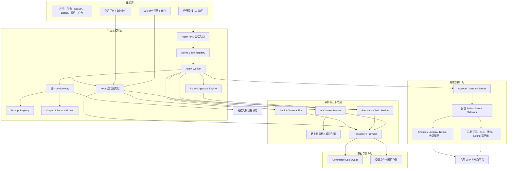
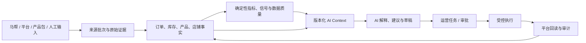
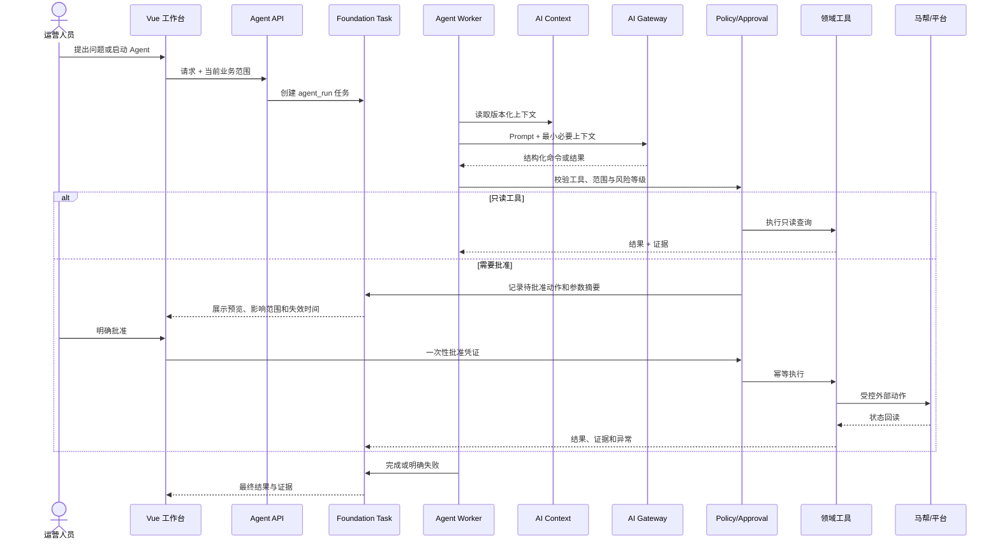
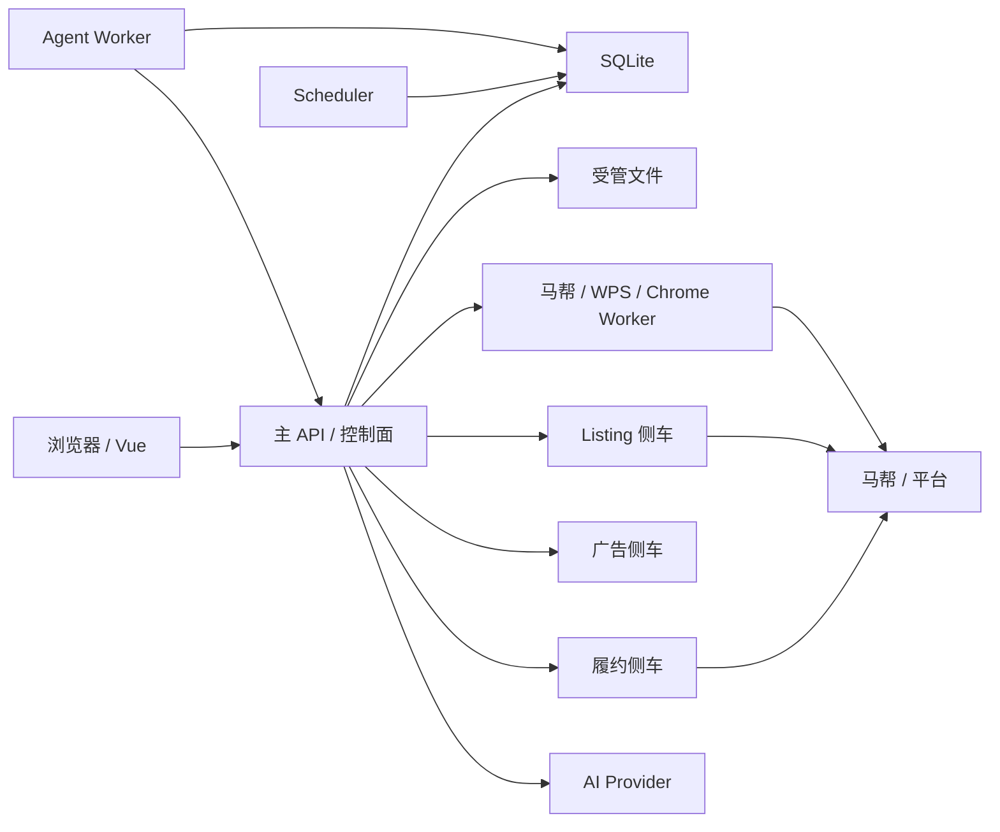

# 建议 AI 运营系统架构说明

- 文档状态：建设建议 / 目标架构
- 适用项目：Commerce Ops
- 基线日期：2026-08-05
- 建议版本：AI-OPS-ARCH-1.0.0

## 1. 结论

建议将 Commerce Ops 建设为一个“确定性业务系统为主、AI 为辅、所有执行均受策略和审批约束”的 AI 运营控制台：

> Vue 统一工作台 + Node.js 模块化单体控制面 + Foundation 任务编排 + 版本化 AI Context + 统一 AI Gateway + 受控工具执行器 + 马帮/平台适配器 + 单一业务事实源。

AI 的职责是理解、解释、归纳、生成候选内容和提出下一步建议；订单、库存、销售额、机会指标、风险信号、任务优先级和执行资格仍由确定性代码与业务合同计算。任何由 AI 发起且会改变正式数据或外部平台状态的动作，都必须经过权限校验、预览、人工批准、幂等执行、结果回读和审计。已经单独批准的确定性自动化任务继续受其专用开关、白名单和业务状态机约束，不等同于 AI 自治执行。

当前不建议为了“AI 化”拆分微服务、引入消息队列或建设第二套数据仓库。现有模块化单体、SQLite、Foundation 任务和受管侧车足以支撑第一阶段。应先收敛 Agent 运行时、工具权限、审批流程和证据链，再根据真实并发与数据规模决定是否迁移 PostgreSQL、对象存储或分布式调度。

## 2. 文档范围

本文说明：

- 当前 Commerce Ops 已具备的 AI 与运营基础；
- 建议的 AI 运营系统目标架构和模块边界；
- 数据、Context、Prompt、Agent、Tool、Task、Approval 和 Audit 合同；
- AI 的权限边界、失败降级、安全与可观测性要求；
- 分阶段实施路线和上线验收标准。

本文不替代现有业务指标合同、数据源合同、数据库迁移方案或具体模块设计。发生冲突时，以已批准的业务合同和正式迁移状态为准。

## 3. 建设目标与非目标

### 3.1 建设目标

1. 让运营人员从“自己找数据、拼结论、再切换模块执行”转变为“系统主动提供有证据的建议和待办”。
2. 让所有 AI 结论都能追溯到来源、时间窗口、规则版本、上下文版本和任务记录。
3. 复用一个 Agent 运行时和一套任务生命周期，避免每个业务模块各建一套 AI 循环、权限和日志。
4. 将高风险动作统一纳入预览、批准、幂等、回读和审计闭环。
5. 保持本地优先、低运维成本，并为后续多用户、多实例和 PostgreSQL 演进保留接口。

### 3.2 非目标

- 不让大模型成为销售、库存、成本或机会评分的事实来源。
- 不允许 Agent 直接执行任意 SQL、Shell、HTTP 或浏览器操作。
- 不用向量库替代结构化业务数据库和确定性查询。
- 不为每个 Agent 新建队列、任务表和重试机制。
- 不在业务真源尚未收敛时全面微服务化。
- 不自动迁移正式数据库、修改规则阈值或打开真实业务开关。

## 4. 当前架构基线

截至基线日期，项目已经具备以下能力：

| 能力 | 当前状态 | 说明 |
| --- | --- | --- |
| 统一前端 | 已实现 | 主工作台使用 Vue 3、TypeScript、Vue Router、Pinia、Element Plus 和 ECharts |
| 主控制面 | 已实现 | `server.mjs` 组合 Node.js 业务服务和 API，整体仍是模块化单体 |
| 后台调度 | 已实现 | `scheduler.mjs` 负责马帮订单、库存和经营日报等定时任务 |
| 正式数据库 | 已实现 | SQLite 正式库最高迁移为 `022_commerce_ops_foundation_v1.sql`，完整性检查通过 |
| 数据访问边界 | 已实现 | Repository/Provider 结构已经存在，并具备 PostgreSQL 兼容性准备 |
| 单一事实层 | 已实现基础 | 马帮来源批次、订单事实、库存快照、产品与 SKU 主数据已结构化持久化 |
| Foundation 任务 | 已实现 | 已有通用任务、事件、租约、重试、幂等和领域映射能力 |
| AI Gateway | 已实现 | 统一提供模型隔离、超时、重试、Prompt 版本、Token 统计、输出校验和脱敏审计 |
| AI Context | 已实现 | 提供 `shop`、`product`、`sku` 三类只读版本化上下文，并包含新鲜度和数据限制 |
| Agent 合同与注册表 | 已实现基础 | 已有定义、注册和 Foundation 任务桥接，但共享执行 worker 尚未实现 |
| 销售与货盘 AI | 已实现 | 基于结构化看板事实生成解释和建议，不替代确定性指标 |
| 产品/Listing AI | 已实现部分 | 已有内容生成、Listing AI 和图片生成相关能力，均应继续经统一 Gateway 管理 |
| 履约只读 Agent | 已实现但隔离 | 已有独立只读 Agent、工具白名单和运行记录，尚未并入共享 Agent 框架与 Foundation 任务 |
| 统一审批中心 | 未完成 | 各领域已有局部确认机制，但还没有统一的 Agent 审批合同和“我的任务”闭环 |
| 共享 Agent 运行时 | 未完成 | 尚缺统一的 Tool Registry、Policy Engine、Agent Worker、暂停/恢复与批准后继续执行 |

当前主要架构差距不是“没有模型调用”，而是已有 AI 能力尚未完全收敛为一套可治理的运营运行时。

## 5. 架构原则

### 5.1 事实优先于生成

- 来源事实必须先进入标准化数据层，AI 只消费结构化上下文。
- 缺失数据保持未知或明确标记为不足，不得转换为零或猜测。
- 关键指标、机会、风险和优先级由可重复的确定性规则产生。
- AI 可以解释规则结果，但不得篡改输入事实、规则版本和证据。

### 5.2 单一真源

| 业务对象 | 唯一真源或权威所有者 |
| --- | --- |
| 马帮账号 | `mabang_account_profiles`；Foundation 只引用凭证所有者 |
| 产品与 SKU | `product_models`、`product_skus`、产品包事实 |
| 店铺 | `growth_shops` / Foundation Store 投影 |
| 订单事实 | `growth_source_batches`、`growth_order_headers`、`growth_order_lines` |
| 库存事实 | `growth_inventory_snapshots` |
| Growth 指标与信号 | 已发布的分析运行、指标和信号表 |
| 通用任务外壳 | `foundation_tasks`、事件和租约 |
| 正式产品图片 | `product_images` |
| 参考图片 | `product_media_assets`、`product_media_links` |
| Listing 草稿目标真源 | 主库 `product_listing_drafts`；侧车存储只作迁移期兼容 |
| 外部平台最终状态 | 马帮及对应电商平台回读结果 |

### 5.3 最小权限与默认拒绝

- 每个 Agent 只能调用其定义中明确声明的工具。
- 每个工具必须声明读写级别、资源范围、输入/输出 Schema、超时和审批等级。
- 未识别工具、越权参数、过期 Context、过期批准和缺少幂等键时一律拒绝执行。
- 模型不得接触账号密码、Cookie、内部令牌、确认令牌或不必要的客户信息。

### 5.4 人在回路

- 只读分析可以自动运行。
- AI 生成的建议、文案、图片和 Listing 只能先成为候选或草稿。
- AI 发起的正式数据写入、批量修改、发布、发货、通知和配置变更必须按风险等级批准。
- 批准只授权明确对象、明确动作、明确参数摘要和明确有效期，不授权模糊的后续动作。

### 5.5 可降级、可恢复、可审计

- 模型不可用时，确定性看板、规则信号、任务和人工流程必须继续可用。
- Agent 运行失败不能阻塞主 API、定时采集或履约调度。
- 所有动作使用 Foundation 任务、租约、重试和事件恢复，不把关键状态只放在进程内存。
- 每次建议和动作保留 request ID、correlation ID、合同版本、工具轨迹和结果摘要。

## 6. 目标总体架构



### 6.1 核心定位

- **Vue 工作台**负责信息呈现、上下文选择、建议确认、审批和任务跟踪。
- **Node 控制面**负责身份、权限、合同、服务组合、Agent 编排和审计。
- **确定性领域服务**负责事实计算、指标、信号、资格检查和业务状态机。
- **Agent Worker**负责受限的“模型—工具—验证”循环，不直接拥有业务真源。
- **Foundation Task Service**负责所有长任务的生命周期、幂等、重试、租约和事件。
- **AI Gateway**是唯一模型出口；侧车和领域模块不再各自管理模型密钥与重试策略。
- **适配器/侧车**只负责外部协议和桌面自动化，不成为长期业务数据或 Agent 权限的所有者。

## 7. 分层与模块边界

| 层级 | 主要组件 | 负责 | 不负责 |
| --- | --- | --- | --- |
| 体验层 | Vue Shell、经营简报、任务中心、领域页面 | 展示、筛选、审批、导航、证据查看 | 指标计算、密钥管理、直接平台写入 |
| API 与应用层 | Node API、领域应用服务 | 认证、参数校验、服务组合、DTO | 模型自由推理、外部脚本细节 |
| Agent 控制层 | Registry、Worker、Policy、Approval | Agent 定义、工具循环、权限与暂停恢复 | 持有业务真源、绕过领域服务 |
| AI 平台层 | Gateway、Prompt Registry、Output Validator | 模型调用、版本、超时、Token、输出校验、脱敏日志 | 业务指标和任务优先级计算 |
| Context 与规则层 | AI Context、Growth/Sales 规则、数据质量 | 结构化证据、时效、限制、确定性信号 | 直接外部写操作 |
| 任务与审计层 | Foundation Tasks、Operation Audit | 状态、租约、重试、事件、关联 ID、审计证据 | 复制领域详情和敏感载荷 |
| 数据层 | Repository、SQLite、文件 Provider | 事务、查询、主数据、事实、元数据 | 在 UI 或 Agent 内散落 SQL |
| 集成层 | Mabang Worker、WPS、Chrome、Listing/广告/履约侧车 | 外部协议、采集、预览、执行与回读 | 自建第二套账号、草稿或任务真源 |

## 8. 数据与知识架构

### 8.1 数据分层



数据职责必须保持为：

1. 来源适配器记录采集范围、时间和来源批次；
2. 标准化服务事务性生成事实；
3. 规则引擎基于合同版本生成指标、信号和任务候选；
4. AI Context 选择必要字段并声明新鲜度、证据来源和限制；
5. AI 只基于 Context 生成结构化解释或行动候选；
6. 领域服务重新校验候选动作，不信任模型直接给出的业务参数；
7. 执行结果必须从外部系统回读，不能仅凭请求成功认定业务成功。

### 8.2 AI Context 合同

现有 `AI-CONTEXT-1.0.0` 应作为第一版公共合同，至少包含：

```json
{
  "contextVersion": "AI-CONTEXT-1.0.0",
  "contextType": "shop|product|sku",
  "subject": { "type": "shop", "id": "..." },
  "generatedAt": "ISO-8601",
  "freshness": {
    "order": "来源批次摘要",
    "inventory": "来源批次摘要",
    "publishedAnalysis": "已发布分析摘要"
  },
  "quality": {
    "status": "available|degraded|insufficient",
    "evidenceSource": "published_analysis|structured_facts",
    "limitations": []
  },
  "data": {}
}
```

建议后续增加但不破坏 V1 的字段：

- `contractVersions`：指标、数据源、规则和有效订单合同版本；
- `evidenceRefs`：批次、分析运行、任务或文件证据引用；
- `accessScope`：账号、国家、店铺、负责人和数据脱敏范围；
- `expiresAt`：对高风险建议强制使用的 Context 失效时间；
- `digest`：用于任务、审批和执行前复核的上下文摘要。

### 8.3 不建议当前建设独立 RAG 平台

当前核心数据高度结构化，AI Context + Repository 查询比向量检索更可靠。只有在需要检索大量非结构化 SOP、平台规则、历史复盘或客服知识时，才增加文档知识库。即使增加 RAG，也必须返回文档版本、段落引用、更新时间和权限范围，且不得覆盖结构化事实层。

## 9. Agent 运行模型

### 9.1 Agent 定义

每个 Agent 必须是不可变、可版本化的声明，至少包含：

- `name`、`version`、`description`；
- 允许的 `input_context` 类型、数量和必填规则；
- 允许调用的 `tools` 及读写级别；
- `output_schema` 标识、版本和校验器；
- `permission`：领域、作用域、权限模式和是否需要人工批准；
- `prompt_id`、`prompt_version`；
- 最大步骤、单步超时、总超时和预算；
- 降级策略和可重试错误码。

定义不得在运行时由用户 Prompt 临时扩权。同一 `name@version` 不允许冲突注册。

### 9.2 Tool 合同

模型不能直接访问内部服务，必须通过受控工具注册表。每个工具至少声明：

| 字段 | 要求 |
| --- | --- |
| `name@version` | 稳定且不可歧义 |
| `access` | `read`、`draft_write`、`internal_write` 或 `external_execute` |
| `scope` | 允许的模块、店铺、国家、账号、资源类型 |
| `input_schema` | 严格对象 Schema，拒绝额外字段 |
| `output_schema` | 标准成功、失败和证据结构 |
| `timeout/retry` | 超时与只对安全错误重试的规则 |
| `idempotency` | 所有写工具必填 |
| `approval_class` | 是否需要批准及批准有效期 |
| `redaction` | 进入模型和日志前的脱敏规则 |
| `audit` | 操作名、request ID、关联任务和结果摘要 |

禁止提供通用 SQL、任意 URL 请求、任意文件路径、Shell 或浏览器脚本工具。需要的新动作必须封装为领域工具，由领域服务再次校验资格。

### 9.3 执行生命周期



### 9.4 任务复用

所有共享 Agent 请求继续复用 Foundation V1：

- `task_kind=agent_run`；
- `domain_ref_type=agent_request`；
- `domain_ref_id=<agent>:<version>:<request-id>`；
- `idempotency_key` 使用 Agent、主体、动作和调用方命名空间；
- 原始 Prompt、完整 Context、模型原文、客户信息和凭证不得写入任务外壳；
- 任务只保存定义引用、Context digest、工具名、输出 Schema、权限模式、correlation ID 和脱敏结果摘要。

共享 Agent Worker 应通过 Foundation 租约领取任务。进程重启后，任务必须可恢复、重新领取或进入明确失败状态。

## 10. 权限与审批模型

| 等级 | 能力 | 默认策略 | 示例 |
| --- | --- | --- | --- |
| A0 观察 | 读取和解释 | 可自动 | 查看昨日销售、解释库存风险、汇总异常 |
| A1 候选 | 生成不生效的草稿 | 可自动生成，必须清晰标记 | 文案候选、图片候选、Listing 草稿、行动建议 |
| A2 内部写入 | 创建/更新内部任务或草稿状态 | 需权限策略；涉及负责人或优先级时需人工确认 | 创建待办、分派负责人、保存已选草稿 |
| A3 外部执行 | 由 AI 建议并改变马帮或平台状态 | 必须预览、人工批准、一次性凭证和幂等键 | Listing 发布、批量修改、发货、发送正式通知 |
| A4 系统治理 | 改配置、规则、凭证、迁移和删除 | 不向 Agent 开放 | 修改阈值、打开真实开关、迁移数据库、删除业务数据 |

无论 Prompt 如何描述，Agent 永远不能：

- 修改来源事实、有效订单规则、标准价合同或确定性优先级；
- 自动把参考图升级为正式主图；
- 自动开启真实发货、批量修改或发布开关；
- 读取或输出密码、Cookie、API Key、内部令牌和确认令牌；
- 执行数据库迁移、批量删除、历史重写或未经批准的外部通知；
- 把不确定结果标记为成功。

## 11. 建议的业务 Agent 组合

先建设少量边界清晰的 Agent，不建设一个拥有全部工具的“超级 Agent”。

| Agent | 输入 | 首期工具 | 输出 | 权限 | 建议阶段 |
| --- | --- | --- | --- | --- | --- |
| Daily Operations Brief | 全局经营快照、昨日与近 7 日趋势、数据质量 | 只读看板、任务、来源状态 | 每日简报、证据和待核查项 | A0 | 第一批 |
| Shop Diagnostic | `shop` Context | 店铺趋势、SKU、库存、开放任务 | 店铺问题树和建议 | A0 | 第一批 |
| Inventory Risk | `sku/product/shop` Context | 库存快照、销量趋势、仓库映射 | 补货/调拨/清理候选任务 | A0→A2 | 第一批 |
| Assortment Opportunity | 产品包、我方销售、货盘表现 | 确定性机会结果、产品主数据 | 机会解释和选品候选 | A0→A1 | 第一批 |
| Listing Copilot | 产品、SKU、正式图片、店铺与平台规则 | 草稿读取、内容生成、预检 | Listing 草稿和发布预览 | A1；发布为 A3 | 第二批 |
| Media Copilot | 产品与参考素材 | 图片搜索、候选生成、质量检查 | 图片候选和选择理由 | A1；升级正式图需批准 | 第二批 |
| Fulfillment Exception | 发货看板、预览、批次、深度预检 | 现有只读工具 | 异常诊断和人工处理建议 | A0 | 先迁入共享运行时 |
| Advertising Analyst | 广告报表和确定性指标 | 只读广告数据 | 预算、素材和异常建议 | A0→A1 | 后续 |

推荐第一个共享生产 Agent 为 **Daily Operations Brief**：它只读、跨模块价值高、风险低，并能验证 Context、新鲜度、证据、Prompt、输出 Schema、任务和审计的完整链路。

## 12. AI Gateway 与 Prompt 治理

### 12.1 唯一模型出口

所有 Node 模块、Scheduler、履约服务和 Python 侧车必须通过统一 AI Gateway 或其内部受控 API 调用模型。Gateway 负责：

- 提供方和模型隔离；
- Prompt ID 与版本；
- 超时、有限重试和稳定错误码；
- 输入、输出和总 Token 归一化；
- 输出 Schema 验证；
- request ID 与脱敏审计；
- 模型不可用时的统一降级。

Python 侧车不保存第二套模型密钥和 Prompt；它只接受已验证的结构化命令或调用主控制面的内部 AI 接口。

### 12.2 Prompt 合同

- 生产 Agent 必须使用受管 `prompt_id@prompt_version`，禁止 `legacy-unversioned`。
- Prompt 版本变更必须有测试样例、输出 Schema 兼容性说明和回滚版本。
- Prompt 只说明角色、边界、输出格式和证据规则，不承载会频繁变化的业务阈值。
- 业务阈值和合同版本由确定性服务提供，Prompt 只引用结果。
- 不在普通审计日志保存完整 Prompt、模型原文和敏感业务载荷。

### 12.3 输出验证

模型输出必须通过三层检查：

1. **语法层**：有效 JSON、对象类型、长度和必填字段；
2. **Schema 层**：版本化输出 Schema，不接受额外危险字段；
3. **业务层**：对象存在、证据可访问、范围未越权、动作仍可执行、Context 未过期。

任何一层失败都返回稳定错误码，不把未验证文本交给写工具。

## 13. 安全、隐私与审计

### 13.1 信任边界

1. 浏览器只持有用户会话和审批交互，不接触马帮密码或侧车内部令牌。
2. 主控制面持有权限和凭证引用，按需向适配器签发短期、最小范围请求。
3. AI 提供方只接收完成当前任务所需的最小结构化上下文。
4. 侧车不能直接读取完整主库，只能通过固定内部接口或一次性命令工作。
5. 外部平台返回内容按不可信输入处理，进入 Context 或模型前必须标准化和清洗。

### 13.2 审计最小集

每次 Agent 运行至少记录：

- Agent 名称与版本；
- Prompt、Context、输出 Schema 和工具版本；
- request ID、correlation ID、Foundation task ID；
- 调用者、作用域和权限模式；
- 工具名、参数字段名、开始/结束时间、耗时和结果码；
- Token 使用量、尝试次数、模型和提供方；
- 批准人、批准摘要、批准时间与有效期；
- 外部动作的幂等键、回读结果和人工接管状态。

不得记录完整密码、Cookie、Token、客户 PII、完整订单内容、完整 Prompt 或模型原始输出。需要长期保存的业务结果应先通过 Schema 校验和领域脱敏，再进入对应领域表，而不是通用 AI 日志。

## 14. 失败与降级设计

| 失败场景 | 系统行为 |
| --- | --- |
| 模型未配置或不可用 | 返回确定性看板和规则结果，标记“AI 未参与”，不阻断日报和任务 |
| Context 数据过期 | 显示来源时间和限制；高风险动作直接拒绝，要求刷新 |
| 输出 Schema 不合格 | 返回 `AI_OUTPUT_INVALID`，不调用任何写工具 |
| 工具超时 | 记录可重试状态；只有只读或具备明确幂等语义的动作可以重试 |
| 批准过期或参数改变 | 原批准失效，重新生成预览和摘要 |
| 外部请求结果不确定 | 停止自动流程，进入人工处理；先回读，禁止盲目重发 |
| Agent Worker 崩溃 | Foundation 租约到期后恢复或重新领取，不丢失任务状态 |
| SQLite 写锁竞争 | 有界 busy retry、短事务、任务排队；持续达到阈值后才迁移高频模块 |
| 侧车不可用 | 主控制面熔断该工具并保留只读页面，不影响其他模块 |
| 数据质量不足 | 结论中明确限制，不补零、不猜测、不生成高风险动作 |

## 15. 部署建议

第一阶段继续采用本地优先的单机多进程形态：



建议新增独立 `agent-worker.mjs`，但仍与主项目共享代码、Repository、Foundation Task 和 AI Gateway。这样可以隔离模型延迟，又不引入微服务网络和第二套部署体系。

只有出现以下真实触发条件时再升级：

- SQLite 持续发生不可接受的写锁等待或多实例需求；
- 单机文件容量、备份时间或并发访问超过本地文件系统能力；
- Agent/任务吞吐需要多个 worker；
- 跨机器部署、集中身份或高可用成为正式要求。

升级顺序建议为：模块级 PostgreSQL Provider → 文件 Provider 接 MinIO/S3 → 多 worker 租约调度 → 集中日志与指标。消息队列放在最后评估，而不是作为第一阶段前提。

## 16. 可观测性与运营指标

技术指标：

- Agent 请求量、成功率、P50/P95 时延；
- Context 生成时延、新鲜度和 `degraded/insufficient` 比例；
- 模型错误、超时、限流、重试和输出校验失败率；
- 各 Agent 输入/输出 Token、估算成本和缓存命中；
- 工具调用成功率、审批等待时间和外部回读失败率；
- Foundation 任务排队、租约超时、重试和人工接管数量；
- SQLite busy retry、侧车健康和外部平台错误码。

业务效果指标：

- 建议被查看、接受、驳回和转为任务的比例；
- 从信号产生到运营处理的平均时长；
- 重复任务、重复执行和越权执行数量，目标为零；
- AI 建议中具备完整证据引用的比例，目标为 100%；
- 人工修改 AI 草稿的幅度，用于改进 Prompt，不作为员工绩效指标；
- AI 不可用时，确定性流程仍成功完成的比例。

不得以“模型自评分”作为效果指标。

## 17. 分阶段实施路线

### G0：合同与基线门禁

交付：

- 冻结本文、Agent 定义、Tool、Approval、Context 和 Output Schema V1 合同；
- 盘点所有现有 AI 调用，消除生产 Agent 的 `legacy-unversioned` Prompt；
- 明确履约独立 Agent、销售货盘 AI、产品 AI 和 Listing AI 的迁入范围；
- 增加敏感字段、真实快照和 Prompt 日志泄漏检查。

退出条件：所有当前 AI 入口、模型、Prompt、数据范围、权限和日志位置可列清单说明。

### G1：共享只读 Agent 运行时

交付：

- `agent-worker.mjs`、Agent Registry、Tool Registry 和 Policy Engine；
- Foundation 租约领取、步骤限制、暂停/恢复、超时和稳定错误码；
- Daily Operations Brief 和 Shop Diagnostic；
- 将履约只读 Agent 迁入共享框架，停止新增独立运行表和内存会话依赖；
- Vue AI 助手入口和只读运行详情。

退出条件：所有工具只读；模型不可用时确定性页面可用；重启后任务状态不丢失；证据和审计可追溯。

### G2：内部任务与草稿闭环

交付：

- Inventory Risk、Assortment Opportunity、Listing/Media 草稿 Agent；
- 统一“我的任务”与审批中心；
- A1/A2 权限、草稿版本、驳回原因和责任人；
- Context digest 与任务证据关联。

退出条件：AI 只能创建候选和待办，不能直接触发外部写入；确定性优先级不可被 AI 改写。

### G3：受控外部执行

交付：

- 通用批准合同、一次性批准凭证、参数摘要和有效期；
- Listing 发布等第一项 A3 动作；
- 执行前二次校验、幂等键、结果回读和不确定状态人工接管；
- 演练重复请求、超时、进程崩溃、平台已成功但响应丢失等场景。

退出条件：没有批准无法执行；批准范围变化自动失效；重复请求不产生重复业务动作；外部结果必须回读确认。

### G4：规模化

仅在指标达到触发阈值后实施 PostgreSQL、对象存储、多 worker 和集中监控。每项升级按模块迁移并保留回滚路径，不一次性替换全部基础设施。

## 18. 上线验收标准

### 18.1 功能

- Agent、Prompt、Context、Tool 和 Output Schema 都有稳定版本。
- 每个结论展示数据窗口、来源新鲜度、限制和可核对证据。
- 每个 Agent 只能调用白名单工具，步骤数和总时长有上限。
- 写动作均通过领域服务，不直接使用通用数据库或网络工具。
- 任务、批准、执行和回读可在 UI 中形成完整时间线。

### 18.2 安全

- 自动化测试证明密码、Cookie、Token、确认令牌和客户 PII 不进入模型和通用审计。
- 未批准、过期批准、参数变化、作用域越权和重复请求全部 fail-closed。
- 参考图片不能由 Agent 自动变成正式主图。
- Agent 不能开启真实业务开关、修改业务合同或运行迁移。

### 18.3 可靠性

- 模型、Agent Worker 或任一侧车故障不阻断主工作台与确定性任务。
- Worker 重启后任务可恢复或进入明确失败状态。
- 外部执行具备幂等与回读，未知结果不自动重试。
- 全量测试、构建、Doctor、数据库完整性和内存/敏感数据检查通过。

### 18.4 运营可解释性

- 关键指标 100% 来自确定性合同。
- AI 建议 100% 带证据或明确标记“证据不足”。
- 每次 Agent 运行可以回答：使用了什么数据、哪个版本、调用了什么工具、谁批准、最终外部状态是什么。

## 19. 关键架构决策

1. **采用模块化单体控制面，不立即微服务化。** 当前团队和部署形态更需要边界收敛，而不是网络复杂度。
2. **复用 Foundation 任务，不建设 Agent 专用队列。** Agent 是任务类型，不是第二个操作系统。
3. **AI Context 是模型的唯一业务数据入口。** 禁止直接读取 Excel、执行任意 SQL 或获取完整数据库快照。
4. **AI Gateway 是唯一模型出口。** Prompt、超时、Token、Schema 和审计统一治理。
5. **确定性规则拥有指标和优先级。** AI 负责解释与候选，不负责重写事实。
6. **写动作属于领域服务。** Agent 只能请求受控工具，领域服务负责资格、事务、幂等和回读。
7. **AI 驱动的外部执行必须人在回路。** 已批准的确定性调度仍按专用合同运行；AI 不得借用其开关或接口绕过审批。
8. **侧车是适配器，不是业务真源。** 账号、任务、草稿和审计逐步向主控制面收敛。
9. **先验证价值，再升级基础设施。** PostgreSQL、对象存储、多 worker 和消息队列由指标触发。

## 20. 相关项目文档

- [Commerce Ops 系统架构地图](docs/design/COMMERCE-OPS-SYSTEM-MAP.md)
- [Commerce Ops AI Foundation V1](docs/design/COMMERCE-OPS-AI-FOUNDATION-V1.md)
- [Commerce Ops Agent Framework V1](docs/design/COMMERCE-OPS-AGENT-FRAMEWORK-V1.md)
- [Commerce Ops Foundation V1 实施计划](docs/design/COMMERCE-OPS-FOUNDATION-V1-IMPLEMENTATION-PLAN.md)
- [Commerce Ops 架构复审与优化建议](docs/design/COMMERCE-OPS-ARCHITECTURE-OPTIMIZATION-20260727.md)
- [Growth Radar V2.2 指标合同](docs/design/COM-GROWTH-RADAR-V2.2-METRICS-1.2.0.md)
- [马帮来源数据合同](docs/design/COM-GROWTH-RADAR-V2.2-MABANG-SOURCE-DATA-CONTRACT.md)

---

建议将本文作为 AI 运营系统的总架构入口；具体 Agent、Tool、Approval 和 Output Schema 应分别形成可测试、可版本化的子合同，并在正式启用前通过对应阶段门禁。
